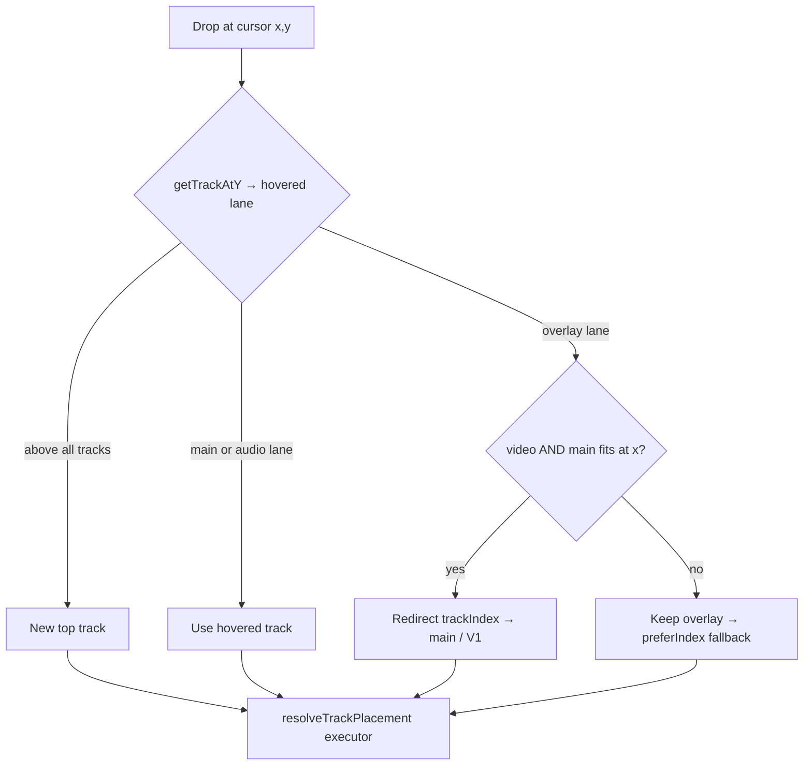
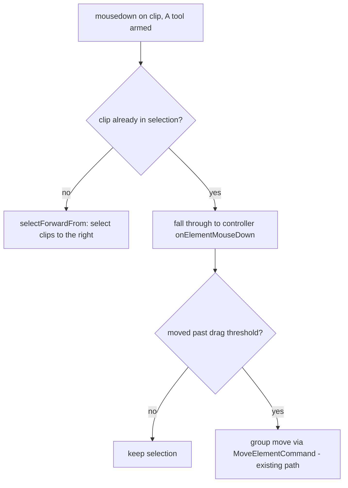

# feat: Premiere-Pro timeline parity — V1 drop default, track-tool group move, snapping coverage

## Summary

Close the most-felt gaps between our timeline and Adobe Premiere Pro. Three reported issues plus the one cheap, clearly-needed parity gap the research surfaced:

- **#4** — a video drop should prefer the main track (V1), not an overlay (V2). *(confirmed: Option B)*
- **#2** — clips selected with the Track Select Forward (`A`) tool can't be dragged. *(confirmed: the armed tool swallows the drag; the move engine already supports group moves)*
- **Hotkey** — `A`/`V` stay Premiere-standard (no remap); fixing #2 the Premiere-faithful way removes the friction that prompted the remap request.
- **Snapping** — clip move/trim should snap to clip edges across all tracks, the playhead, **markers**, and the **sequence start (0:00)**. Marker + start snapping are currently missing during move/trim even though the snap source exists.

Everything larger (razor-at-click, Insert/Overwrite edit modes, rolling/slip/slide trims, source patching, JKL) is researched and lands as a **ranked backlog** in the parity audit, not built this round.

---

## Problem Frame

Round 25/26 shipped a Premiere-style tool model, ripple trims (`Q`/`W`), gap selection, markers, and zoom hotkeys. Live testing surfaced four "feels wrong vs Premiere" complaints. Research against Premiere's documented behavior (see Sources) confirms three are genuine divergences and one (the `A` hotkey) is a workaround for issue #2:

- **#4:** Track order is `[...overlay, main, ...audio]`, so V2 renders *above* V1. `computeDropTarget` targets whatever lane the cursor is vertically over ([drop-target.ts](apps/web/src/timeline/components/drop-target.ts) `getTrackAtY`), so a casual top-drop lands on V2 even when V1 is free. Premiere doesn't hit this because V1 sits at the bottom and its layout is unambiguous; our inverted layout makes "prefer V1" the right default.
- **#2:** While the `A` tool is armed, [timeline-track.tsx:184-187](apps/web/src/timeline/components/timeline-track.tsx) early-returns on every clip mousedown, so no drag session ever starts. The interaction controller itself is **selection-driven, not tool-gated** — it already drags multi-clip selections via `buildMoveGroup` → `MoveElementCommand`. The bug is purely the armed-tool gate in the view layer.
- **Hotkey:** Current bindings already match Premiere — `A` = Track Select Forward, `V` = Selection ([definitions.ts:237-238](apps/web/src/actions/definitions.ts)), and `V` already returns to Selection on `feat/round26`. The "make `A` go to Selection" request was a way to escape the stuck track-select state and move clips. Fixing #2 removes that need, so we keep the standard mapping.
- **Snapping:** Edge + playhead + keyframe snapping exist during move ([group-move/snap.ts](apps/web/src/timeline/group-move/snap.ts)) and trim ([resize-controller.ts](apps/web/src/timeline/controllers/resize-controller.ts)). Marker/bookmark snapping is wired only for playhead and bookmark-drag; an explicit sequence-start (0:00) snap point doesn't exist for move/trim. Premiere snaps to all of these, cross-track — research ranks this "essential."

---

## Requirements

- **R1** — A video/visual drop prefers the main track (V1) when the clip fits there at the drop time; deliberate higher-track placement remains possible. *(issue #4, Option B)*
- **R2** — A selection made with the Track Select Forward (`A`) tool can be dragged as a group, preserving each clip's relative offset, committed as a single undoable move. *(issue #2)*
- **R3** — Tool keybindings stay Premiere-standard: `A` = Track Select Forward, `V` = Selection. No remap. *(hotkey decision)*
- **R4** — Clip move and trim snap to clip edges across all tracks, the playhead, markers, and the sequence start (0:00), honoring the existing enable/Shift-suppress behavior. *(snapping parity)*
- **R5** — `docs/premiere-parity-audit.md` reflects the resolved #2/#4 decisions and a reranked backlog of remaining Premiere gaps, grounded in the research. *(research deliverable)*

---

## High-Level Technical Design

*Directional — shows the decision shape, not implementation specification.*

**#4 drop-target decision** (all paths still flow through `resolveTrackPlacement` as a pure executor):

**#2 armed-tool mousedown routing** (Premiere: tool stays armed; click selects forward, drag moves the group):

---

## Key Technical Decisions

- **KTD1 — #4 policy and location.** Implement "video prefers V1" in `computeDropTarget` ([drop-target.ts](apps/web/src/timeline/components/drop-target.ts)), the single place that already owns the cursor→track mapping; `resolve.ts` stays a pure executor. "Deliberate higher placement" is expressed through behavior that already exists: dropping where **V1 is occupied** auto-bumps to an overlay/new track, and dropping **above all tracks** creates a new top track. **Accepted tradeoff:** hovering a *free* V2 now lands on V1. Honoring an explicit, squarely-over-an-existing-overlay hover is a flagged refinement (Open Questions), deliberately deferred so we can feel the simple rule live first.
- **KTD2 — #2 fix mechanism.** Let an armed-tool grab on an **already-selected** clip fall through to the existing drag controller (Premiere-faithful Option B: the `A` tool stays armed, click on empty/unselected selects forward, grab-and-drag on the selection moves it). Reuse `buildMoveGroup` / `MoveElementCommand` — both already multi-clip capable — so the controller needs no change. **Documented fallback:** if armed-drag routing proves fiddly in the timing-sensitive controller, disarm the tool inside `selectForwardFrom` (`setTool(null)`) so selecting hands back to the Selection tool (Option A — lower fidelity, minimal blast radius).
- **KTD3 — snapping is additive.** Wire the existing `getBookmarkSnapPoints` source plus an explicit sequence-start (time 0) snap point into the `sources[]` arrays already passed to `buildTimelineSnapPoints` in both the move and trim paths, and confirm edge snapping spans all tracks. No new toggle, no keybinding — both paths already honor `snap.isEnabled()` + Shift-suppress.
- **KTD4 — keybindings unchanged this round.** Keep `A`/`V` as-is (R3). The Premiere snap-toggle on `S` is *not* added now because `s` is currently bound to `split`; resolving that conflict is a keymap decision tracked in the backlog.
- **KTD5 — upstream discipline.** Every opencut-upstream file touched (`drop-target.ts`, `timeline-track.tsx`, `group-move/snap.ts`, `resize-controller.ts`, and any snap-source file widened) gets a `PATCHES.md` entry in the same commit. Never fork opencut-wasm or hyperframes.

---

## Implementation Units

### U1. Video drop prefers V1 (main) over a free overlay

**Goal:** A video/visual drop lands on the main track when it fits there, instead of whatever overlay lane the cursor happens to be over. *(R1)*

**Dependencies:** none.

**Files:**
- Modify: `apps/web/src/timeline/components/drop-target.ts` (`computeDropTarget` — redirect the preferred index for video drops)
- Verify-only (no change expected): `apps/web/src/timeline/placement/resolve.ts` (`preferIndex` branch remains the executor)
- Modify (tests): `apps/web/src/timeline/placement/__tests__/resolve.test.ts`
- Modify: `PATCHES.md` (drop-target.ts is upstream)

**Approach:** After `getTrackAtY` yields the hovered `{trackIndex}`, resolve the element's track type via `getTrackTypeForElementType`. If it is **video** AND the hovered lane is an overlay (`trackIndex < tracks.overlay.length`) AND `canPlaceTimeSpansOnTrack` reports the **main** track can hold the span at `xPosition`, redirect `trackIndex` to the main index (`tracks.overlay.length`). Audio hovers and main-lane hovers are untouched. The existing `preferIndex` fallback in `resolve.ts` already handles "preferred track can't fit → bump up," so V1-occupied and drop-above-all-tracks still route to a higher/new track. **Do not alter the drop commit path** — preserve the `separateSourceAudio` / `insertAtTarget`-returns-ids contract (a video drop may still fan out into a separated audio clip).

**Patterns to follow:** the existing edge-case main-preference logic already in `drop-target.ts` (empty-timeline and below-all-tracks reuse main); mirror its use of `canPlaceTimeSpansOnTrack`.

**Test scenarios:**
- Covers R1. Project has V1 + a free V2; video dropped with cursor over the V2 lane, V1 free at the drop time → targets **main/V1**.
- Video dropped over V2 while **V1 is occupied** at the drop time → falls back to overlay/new track (deliberate higher placement preserved).
- Video dropped **above all tracks** → still creates a new top track (unchanged).
- **Audio** dropped over an audio lane → lands on the hovered audio track (unchanged).
- Video dropped over the **main** lane → V1 (unchanged).
- External-file drop (`isExternalDrop`) → lands at playhead with the new drop-to-start snap intact; audio separation not regressed.
- Existing `resolve.test.ts` cases stay green: "keeps audio below main," "uses vertical drag direction when hovered track is incompatible," "main-only timelines."

**Verification:** `bun test` on `resolve.test.ts` green incl. new cases; live on a V1+V2 project — top-drop a video → V1; occupy V1, re-drop → V2; tsc/lint clean; `PATCHES.md` updated.

### U2. Drag a Track-Select (`A`) selection as a group

**Goal:** With the `A` tool armed, after selecting clips to the right, grabbing one and dragging moves the whole selection as a group (relative offsets preserved), as one undoable command. *(R2, R3)*

**Dependencies:** none. (Sequenced **before** any future razor-at-click work, which also edits `timeline-track.tsx` routing — avoid concurrent edits.)

**Files:**
- Modify: `apps/web/src/timeline/components/timeline-track.tsx` (armed-tool mousedown routing at the `isForwardTool` early-returns ~:128, :145, :184-193, and `selectForwardFrom` ~:71-82)
- Reference (no change): `apps/web/src/timeline/controllers/element-interaction-controller.ts`, `apps/web/src/timeline/group-move/build-group.ts`, `apps/web/src/core/managers/timeline-manager.ts` (`moveElements` → `MoveElementCommand`), `apps/web/src/preview/place-tool-store.ts`
- Modify: `PATCHES.md` (timeline-track.tsx is upstream)

**Approach:** When a clip mousedown fires while `isForwardTool` is armed and the clicked clip is **already part of the current selection**, do not early-return — pass it to `onElementMouseDown` so the controller opens a `pending` session that promotes to a group move past `TIMELINE_DRAG_THRESHOLD_PX` (the existing multi-clip `buildMoveGroup` / `MoveElementCommand` path; honors linked A/V via `linkId`). Clicks on **unselected** clips or empty track keep the `selectForwardFrom` gesture. A click on a selected clip that does **not** cross the drag threshold must preserve the existing multi-selection (don't collapse to a single clip). No controller change — it's already selection-driven, not tool-gated.

**Execution note:** The interaction controller is held in `useState` and does **not** hot-reload (QUALITY-PLAYBOOK "Getting unstuck"). Hard-reload / restart the dev server before iterating and inspect live state via `window.__vibeEditor`. If a change appears to do nothing after 2-3 tries, suspect a stale controller instance, not wrong logic. If armed-drag routing fights the lifecycle, fall back to KTD2 Option A (disarm in `selectForwardFrom`).

**Patterns to follow:** the existing Selection-tool drag path through `onElementMouseDown` → `beginDragFromPending`; the linked-selection (`linkId`) group-move model already used by multi-select move/trim/delete.

**Test scenarios:**
- Covers R2. `A` armed, click empty track → all clips to the right selected across tracks (unchanged).
- `A` armed, grab a selected clip and drag past threshold → entire group moves, relative offsets exact, commits as **one** `MoveElementCommand` (single undo).
- `A` armed, click a selected clip without dragging → selection preserved (not reset to one).
- `A` armed, click an **unselected** clip → re-selects forward from there (gesture preserved).
- Linked A/V pairs move together during the group drag.
- Undo restores all clips to pre-move positions in one step.

**Verification:** Live (localhost:3000) — press `A`, select forward, drag the group → moves; undo → restores; confirm via `window.__vibeEditor`. tsc/lint clean; `PATCHES.md` updated. *DOM/interaction tests can't run under `bun` (pre-existing `opencut-wasm __wbindgen_start` init failure) — this unit is verified live; do not claim a green unit test that the runtime can't execute.*

### U3. Complete snapping coverage for move and trim

**Goal:** Clip move and trim snap to markers and the sequence start (0:00) in addition to the existing clip-edge/playhead/keyframe snapping, cross-track. *(R4)*

**Dependencies:** none.

**Files:**
- Modify: `apps/web/src/timeline/group-move/snap.ts` (add bookmark/marker source + sequence-start point to the `sources[]` into `buildTimelineSnapPoints`)
- Modify: `apps/web/src/timeline/controllers/resize-controller.ts` (same source additions for trim, ~:284-295)
- Verify/possibly widen: `apps/web/src/timeline/element-snap-source.ts` (edges must come from **all** tracks, not same-track); reference `apps/web/src/timeline/bookmarks/snap-source.ts` (`getBookmarkSnapPoints`), `apps/web/src/timeline/snapping/build.ts`, `apps/web/src/timeline/snapping/types.ts`
- Modify (tests): the WASM-free snapping/group-move test suites (add cases below where the runtime allows)
- Modify: `PATCHES.md` (upstream files touched)

**Approach:** The snap infrastructure and the `bookmark` snap type already exist; markers are simply not registered as a source for clip move/trim, and there's no explicit time-0 point. Add `getBookmarkSnapPoints` and a sequence-start (time 0) snap point to the `sources[]` arrays in both builders. Confirm `element-snap-source` emits edges across all tracks (Premiere snaps cross-track, essential for locking V2 titles to V1 cuts); widen it if it's same-track only. Pure-additive: both paths already gate on `snap.isEnabled()` and Shift-to-suppress, so no toggle or keybinding change.

**Patterns to follow:** how the playhead-drag and bookmark-drag paths already consume `getBookmarkSnapPoints`; the existing `sources[]` array shape passed to `buildTimelineSnapPoints`.

**Test scenarios:**
- Covers R4. Move a clip near a marker → start snaps to the marker time within threshold.
- Move a clip near 0:00 → snaps to the sequence start.
- Move a clip near another **track's** clip edge → snaps (cross-track).
- Trim an edge near a marker → snaps.
- Snapping disabled, or Shift held during the drag → no snap (regression guard).
- Existing edge/playhead/keyframe snap cases stay green.

**Verification:** `bun test` green on the WASM-free snapping/group-move cases; live — drag a clip toward a marker, the playhead, and 0:00 and confirm it sticks with the snap indicator, and trim toward a marker; tsc/lint clean; `PATCHES.md` updated. Note honestly which snapping cases are WASM-gated and verified live only.

### U4. Refresh the parity audit + log patches

**Goal:** The audit reflects the resolved decisions and a research-grounded, reranked backlog. *(R5)*

**Dependencies:** U1, U2, U3 (records their outcomes).

**Files:**
- Modify: `docs/premiere-parity-audit.md`
- Modify: `PATCHES.md` (confirm every upstream edit from U1-U3 is logged)

**Approach:** Mark #2 and #4 as ✅ fixed (note Option B for #4 and the armed-drag mechanism for #2), add snapping coverage as ✅, and rewrite the backlog ranked by value × bounded-risk using the research (see Scope Boundaries below). Cite the Premiere references in Sources.

**Test expectation:** none — documentation only.

**Verification:** doc shows resolved #2/#4/snapping and the reranked backlog; `PATCHES.md` has an entry per upstream file touched.

---

## Scope Boundaries

**In scope:** U1-U4 above — the three reported fixes, snapping completion, and the audit refresh.

### Deferred to Follow-Up Work (ranked — next rounds)

1. **Razor at click-point (`C` as an armed cut tool).** Today the Razor button splits at the playhead, not where you click. Sequenced after U2 because both edit `timeline-track.tsx` click routing — avoid concurrent edits.
2. **Insert vs Overwrite edit modes** (`,` Insert / `.` Overwrite; Ctrl-drag = Insert). Large: needs ripple-on-insert wiring (the `ripple/` module exists but is wired only to deletes today).
3. **Rolling / Slip / Slide trim tools** (`N` / `Y` / `U`). New paired-neighbor and source-window trim logic.
4. **Snapping toggle on `S`.** Requires moving `split` off `s` to match Premiere — a keymap decision (Open Questions).
5. **Remaining tool hotkeys:** Track Select Backward (`Shift+A`), Hand (`H`), Zoom-as-tool (`Z`), Rate-stretch-as-tool (`R`).
6. **Source patching vs track targeting vs sync lock** — Premiere's three-layer track-header model governing where inserts land and what ripples.
7. **J-K-L shuttle** with repeat-press speed ramps.

### Outside this product's identity (revisit only if demanded)

- Full broadcast **three-/four-point editing + Source Monitor** workflow — largest scope, lowest daily-use urgency for a simplified-Premiere web editor.

---

## Risks & Dependencies

- **Timing-sensitive controller (U2).** The `useState`-held interaction controller doesn't HMR; the documented #1 false-stuck trap for this exact area. Mitigated by U2's Execution note (hard-reload + `window.__vibeEditor`) and the Option A fallback.
- **Tested placement policy (U1).** `resolve.test.ts` encodes current behavior; tests update in lockstep. The free-V2-hover-→-V1 tradeoff is accepted and flagged.
- **Upstream files.** All of U1-U3 touch opencut-upstream files → `PATCHES.md` entry required in the same commit (KTD5).
- **bun WASM limitation.** Timeline tests that initialize `opencut-wasm` fail under `bun` (`__wbindgen_start`, pre-existing). Interaction (U2) and some snapping (U3) cases are verified **live**, not by unit test — stated honestly per unit, never claimed as green.
- **Drop audio-separation contract (U1).** A video drop can fan out into a separated audio clip; `insertAtTarget` returns the created ids. Don't regress this when redirecting the track index.

---

## Open Questions

- **#4 refinement (deferred):** should an explicit hover squarely over an existing, *populated* overlay track honor that track even when V1 is free? Decide after feeling the simple "prefer V1" rule live.
- **`S` snap-toggle (backlog #4):** remap `split` off `s` to free `S` for snapping, matching Premiere? Keymap change with muscle-memory impact — the user's call.

---

## Verification (global)

1. `tsc --noEmit` (`node ./node_modules/typescript/lib/tsc.js --noEmit` in `apps/web`) — clean bar the known `globals.css` false positive.
2. eslint on changed files — no new errors vs HEAD baseline.
3. `bun test` — `resolve.test.ts` (new #4 cases) and WASM-free snapping/group-move cases green; existing suite green except the pre-existing WASM-init failures.
4. Live (localhost:3000): U1 (top-drop video → V1; V1 occupied → V2), U2 (`A` select-forward then drag the group; undo), U3 (snap to marker / playhead / 0:00 on move and trim).
5. Each upstream-file edit logged in `PATCHES.md` in the same commit.

---

## Sources & Research

- Premiere timeline interaction model (tools/hotkeys, Insert vs Overwrite, snapping, the four trim types, drag-to-move, track targeting/sync lock, 3/4-point) — synthesized from Adobe Help and practitioner deep-dives; informs R4 and the ranked backlog. Key citations: Adobe Help (Trim Mode; Source Patching & Track Targeting), Noble Desktop (Ripple/Roll/Slip/Slide; Track Select Forward), Fstoppers (source patching vs targeting), Filmora (snapping).
- Repo map: fix sites confirmed at [drop-target.ts](apps/web/src/timeline/components/drop-target.ts) (#4), [timeline-track.tsx:184-187](apps/web/src/timeline/components/timeline-track.tsx) (#2), [group-move/snap.ts](apps/web/src/timeline/group-move/snap.ts) + [resize-controller.ts](apps/web/src/timeline/controllers/resize-controller.ts) (snapping).
- Prior learnings: `docs/premiere-parity-audit.md` (origin), QUALITY-PLAYBOOK ("controller doesn't HMR"; "match a real Premiere reference, don't guess"), `PATCHES.md` (drop audio-separation contract).
