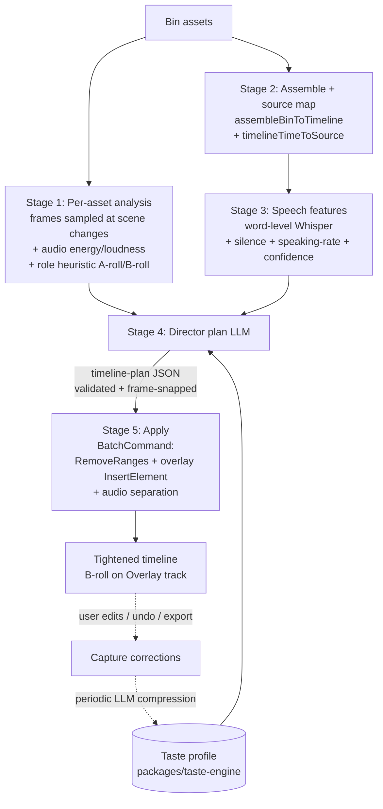

# feat: Multimodal AI Director

## Summary

Re-architect VibeCut's transcript-only "AI CUT" into an autonomous **Director**: drop raw footage in the bin, and it assembles, removes mistakes/retakes/silences/tangents, selects the best take, structures for retention, classifies which of *your* assets are B-roll vs talking-head and overlays B-roll over the matching narration, then **learns from your corrections** so each round cuts more like you would.

The Director keeps the existing assemble → silence → transcribe spine but adds three senses the current cutter lacks — **sampled keyframes (vision)**, **audio energy/loudness**, and **source-aware word-level transcript** — fused into one structured "timeline plan" the LLM emits and the editor applies as a single undoable batch. Analysis stays client-side (offline-first); only the vision/planning LLM call is server-side. Learning is a device-local taste profile injected into the prompt (ADR-6), never model training.

**In scope:** multimodal cut/take/structure planning; B-roll classification + overlay of the user's own assets; richer self-learning. **Out of scope:** sourcing external/stock B-roll, an eval-optimization loop, a new editor core, hosted infra, the template marketplace.

---

## Problem Frame

Today's AI CUT (`apps/web/src/features/editing/remove-repeats.ts`, planner `packages/hf-bridge/src/author.ts`) sends **only transcript text** (`[start–end] text` lines) to Claude and applies the returned ranges via `RemoveRangesCommand`. This caps what it can do:

- **It's blind.** It can't see fumbles, looking off-camera, bad framing, or what a clip depicts — so it cannot truly pick the best take or recognize B-roll.
- **B-roll isn't in the flow.** The `/api/broll` routes exist but are wired only to the assistant and return stills into the bin; nothing classifies asset roles or places overlays aligned to narration. (These routes are noted only to explain the current gap — this plan does not modify or wire them in; the Director uses only user-provided bin assets for B-roll, per Scope.)
- **Assembly is naïve.** `assembleBinToTimeline` concatenates bin assets in sort order — no take selection, no narrative structure.
- **Learning is shallow.** `preference-store.ts` derives one global "cut more/less aggressively" note from undo-within-3-min and export-duration-diff. It doesn't learn *what* you keep, your B-roll taste, or use your manual corrections as ground truth.

A "director that makes the cuts for the best possible video" needs eyes, ears, source awareness, and a memory of the editor's taste. This plan adds all four, reusing the timeline/overlay/AV-linking primitives that already exist.

---

## Requirements

Traceability is to this request (no upstream brainstorm doc exists).

- **R1 — Footage → finished cut.** From bin assets alone, the Director produces an assembled, tightened timeline with no mistakes/retakes/silences/long tangents.
- **R2 — Best-take selection.** When the same content is recorded more than once, keep the strongest take and cut the rest.
- **R3 — Retention structure.** Strong hook near the front; dead-weight intros/outros trimmed; pacing favored over completeness without cutting load-bearing content.
- **R4 — Out-of-context removal.** Off-topic tangents and asides removed, judged from fused signals (not text alone).
- **R5 — B-roll classification.** Each provided asset is labelled talking-head (A-roll) vs B-roll.
- **R6 — B-roll overlay.** B-roll is placed on the Overlay track over the matching narration span, with narration audio preserved underneath; the 4-track cap is never exceeded.
- **R7 — Multimodal judgment.** Cut/take/B-roll decisions use sampled keyframes + audio energy + word-level transcript, not transcript text alone — when a vision-capable backend is configured.
- **R8 — Self-learning.** The Director captures the user's accept/reject/correction signals and improves subsequent runs via a device-local, editable taste profile (prompt context only; no model training; telemetry never leaves the device).
- **R9 — Reviewable & reversible.** Every Director run applies as one undoable batch; the user can undo, then re-run; nothing corrupts manual edits.
- **R10 — Offline-first & cost-aware.** All heavy analysis runs locally; only the LLM call is remote; estimated cost/token usage is surfaced; long videos are chunked to fit context.

**Success criteria:** on Dan's own raw footage, one "AI Director" click yields a watchable first cut (correct take kept, silences/retakes/tangents gone, B-roll overlaid on relevant moments) in a single undoable step, and the accept-rate of its decisions visibly rises across rounds.

---

## High-Level Technical Design

The Director is a five-stage pipeline. Cheap local signals gate the expensive vision pass; the LLM emits a pure plan; the editor applies it as one batch; corrections feed the taste profile.



**Vision is selective, not per-frame** (KTD3): Stage 1 samples one representative frame per detected scene plus frames for spans the audio/transcript flag as ambiguous; only those reach the model (256–768px for bulk classification, higher only for hard calls).

**The self-learning loop** (CIPHER-style, KTD6):

```mermaid
flowchart LR
    P[Director proposes plan] --> U{User reaction}
    U -->|accept as-is| K[Reinforce]
    U -->|restore a cut| FP[False-positive signal]
    U -->|add a cut AI missed| MISS[Missed signal]
    U -->|keep/remove a B-roll overlay| BR[B-roll taste signal]
    K --> PAIR[(proposed op, corrected op) pairs]
    FP --> PAIR
    MISS --> PAIR
    BR --> PAIR
    PAIR -->|every N edits or on export| INFER[LLM infers preference rules]
    INFER --> CARD[Structured taste profile<br/>compact editor style card]
    CARD -->|injected into prompt| P
```

These diagrams are authoritative for the data flow; per-unit fields below give the integration specifics.

---

## Output Structure

New code lands in sanctioned locations (BRIEF §3 isolation rule). Greenfield directories:

```
apps/web/src/features/ai-generate/director/
  run-director.ts            # orchestrator (analyze→plan→apply), progress + cancel + cache
  analyze-assets.ts          # per-asset frame sampling + role heuristic (U4)
  audio-features.ts          # energy/loudness/speaking-rate from decoded audio (U2)
  source-map.ts              # timelineTimeToSource() + per-asset transcript (U3)
  apply-plan.ts              # timeline-plan JSON → BatchCommand (U7)
  director-cache.ts          # content-hash stage cache (U10)
  types.ts                   # DirectorPlan, AssetRole, SpeechFeatures, etc.
  __tests__/...

apps/web/src/media/
  frame-extract.ts           # extractFrames(asset, timesSec[]) reusable sampler (U1)

apps/web/src/app/api/director/
  plan/route.ts              # server vision/planning call (U6)

packages/taste-engine/        # NEW package (reserved by BRIEF §3, not yet created)
  src/index.ts
  src/taste-store.ts         # capture signals + persisted profile (migrates cut bits of preference-store)
  src/compress-profile.ts    # CIPHER-style preference inference call
  src/__tests__/...

packages/hf-bridge/src/
  author.ts                  # + planMultimodal(), buildDirectorPrompt(), DIRECTOR_SCHEMA (U5, U6)
```

The tree is a scope declaration, not a constraint — the implementer may adjust. Per-unit `Files:` sections are authoritative.

---

## Key Technical Decisions

**KTD1 — Client-side analysis, server-side LLM only.** Frame sampling (mediabunny `VideoSampleSink.getSample`), audio features (extend the existing `decodeAudioToFloat32` path used by Remove Silences), and transcription (in-browser `@huggingface/transformers` Whisper) all run in the browser; only the vision/planning call goes to `/api/director/plan`, and ffmpeg burn-in already runs server-side at export. *Rationale:* preserves offline-first + "telemetry never leaves the device" (BRIEF §3 hard rule 4), matches the existing architecture, adds no heavy server deps. *Note:* this favors mediabunny over the spawn-ffmpeg frame-grab the research described — the in-browser primitive already exists and keeps footage local. *Consent caveat:* sending sampled keyframes to the LLM is the first time **footage** (not just transcript) leaves the device — a qualitative escalation past BRIEF rule 4. The visual Director is therefore gated behind a one-time consent disclosure (U8), the `custom`-endpoint path is SSRF-guarded (U5), and the `claude-code` degraded path sends no frames at all.

**KTD2 — Vision needs `api-key`/`custom`; `claude-code` degrades to a transcript+audio director.** All three current dispatch modes send plain-string content; the Claude Code CLI can't take inline images via stdin. The multimodal pass therefore requires the `api-key` mode (Anthropic Messages, `claude-opus-4-8` for hard calls / `claude-sonnet-4-6` for bulk) or a vision-capable `custom` endpoint. When only `claude-code` is configured, the Director runs every stage *except* vision (still a large upgrade: source-aware word transcript + audio energy + take selection + structure) and surfaces a one-time note that adding an API key in Settings → AI unlocks the visual director. *Alternatives considered:* temp-file frames + agentic Claude Code reading files (deferred — slower, more complex); local VLM (Qwen2-VL-7B) for classification (future — adds a model dependency). See Alternatives.

**KTD3 — Tiered perception (cheap signals gate vision).** Scene boundaries (luma/histogram delta on sampled frames), silence gaps, loudness envelope, word confidence, and speaking rate are computed locally for the whole video; the vision model sees only one representative frame per scene plus frames for ambiguous/high-value spans, at 256–768px. *Rationale:* keeps vision cost <$0.05–0.10 per 10-min video and latency bounded; per research, transcript+audio already carry most cut signal, vision adds shot-type/B-roll/eye-contact.

**KTD4 — Plan-as-layer: a pure timeline-plan JSON applied via one `BatchCommand`.** The LLM emits a list of typed ops (`cut`/`keep`/`reorder`/`overlay_broll`) with stable hash ids; the editor validates, frame-snaps, and applies them in a single undoable `BatchCommand`. The `reorder` op (added so R3's "hook to the front" is actually achievable — cut-only ops can't move a strong line earlier) maps to the existing `MoveElementCommand`. The plan never mutates in place. *Rationale:* re-runnable without corrupting manual edits (R9), and the proposed-vs-applied diff is exactly the ground truth the taste engine learns from.

**KTD5 — Word-level Whisper for the Director.** Switch the Director's transcription to `return_timestamps: "word"` for tighter cut boundaries, speaking-rate, and per-word confidence (filler detection); keep the existing segment-level path for the legacy fast cuts. *Rationale:* segment granularity is too coarse for clean retake/B-roll-in points. *Trade-off:* an estimated (not yet measured) increase in transcription time. *Verification required (U2):* transformers.js word timestamps are heuristic (cross-attention DTW) with no calibrated per-word confidence, and the chunked long-form path can drop/misalign words at chunk boundaries — exactly the cut-in points the Director depends on. U2 must spike-verify word timing + confidence on the default model before filler-detection is built on it.

**KTD6 — Self-learning = preference inference into a structured taste profile (ADR-6).** Capture `(proposed op, user correction)` pairs from accept/restore/added-cut/B-roll-kept signals; every N edits or on export, an LLM compresses them into a compact, versioned "editor style card" injected into the Director prompt. Device-local in `packages/taste-engine`, editable in Settings → AI, clearable. No fine-tuning. *Rationale:* matches the BRIEF's settled ADR-6 and the proven PRELUDE/CIPHER result (31–73% edit-distance reduction).

**KTD7 — B-roll overlay reuses existing overlay + AV-linking plumbing; opaque assets render natively.** Place B-roll on the Overlay track using lane-packing modeled on `buildAiLanes`/`claimLane`; opaque B-roll (the common case) renders through the normal compositor and skips the `framecutAi`/alpha DOM-preview path. *Two corrections from review:* (a) **the track model has no cap** — `apps/web/src/timeline/types.ts` is `{ main, overlay[], audio[] }` (unbounded arrays) and `claimLane` *creates a new track* when lanes are full, so the Director must enforce its own overlay ceiling and define explicit flatten/skip behavior — the cap is not free. (b) `buildAiLanes` only recognizes a lane as reusable when every element on it is `framecutAi`-tagged, so opaque (untagged) B-roll would not be re-used and would proliferate tracks on re-run; the Director must therefore either tag its B-roll with a Director-owned marker its own lane-tracker recognizes, or maintain its own lane bookkeeping rather than relying on the `framecutAi` predicate. Narration audio is **already** separated onto an audio track by assembly (`insertMediaAsset` → `toggleSourceAudioSeparation`), so the Director must *not* re-toggle it (a toggle would re-merge) — it verifies the separated audio exists and leaves it intact. *Rationale:* no new track model; the primitives exist and are undoable, but their real behavior (track-adding, `framecutAi`-keyed) must be accounted for.

---

## Implementation Units

Grouped into phases; dependency-ordered. U-IDs are stable.

### Phase A — Senses & seams (foundations)

### U1. Reusable frame sampler

**Goal:** A `extractFrames(asset, timesSec[]) → Promise<FrameSample[]>` helper (data URL + timestamp) plus a `pickSceneCandidates(asset)` that proposes sample times by fixed cadence refined with a cheap luma/histogram delta.
**Requirements:** R7 (enables vision input).
**Dependencies:** none.
**Files:** `apps/web/src/media/frame-extract.ts`, `apps/web/src/media/__tests__/frame-extract.test.ts`. Reuses `VideoSampleSink.getSample` already proven in `apps/web/src/media/mediabunny.ts`.
**Approach:** wrap the existing single-frame decode into a batched, cancellable sampler; downscale to a target long edge (default 768px) on a canvas before `toDataURL`. Scene candidates: sample at coarse cadence, compute luma histogram delta between adjacent samples, keep local maxima above a threshold as scene starts.
**Patterns to follow:** the cover-thumbnail path in `media/mediabunny.ts`; `AbortSignal` plumbing as in `remove-repeats.ts`.
**Test scenarios:**
- Happy path: requesting 5 timestamps on a known clip returns 5 frames at (approximately) those times, each a non-empty JPEG data URL at ≤768px long edge.
- Edge: timestamps beyond `asset.duration` clamp to the last frame, don't throw.
- Edge: image asset (no video track) returns one frame (the image) regardless of times.
- Cancellation: aborting mid-batch rejects with `Cancelled` and decodes no further frames.
- Scene candidates: a clip with one hard cut yields a candidate near the cut; a static clip yields only cadence samples.

### U2. Audio & speech features

**Goal:** Per-segment `SpeechFeatures` — energy/loudness envelope (relative), speaking rate (wpm), and per-word confidence — plus a word-level transcription path for the Director.
**Requirements:** R3, R4, R7.
**Dependencies:** none (parallel with U1).
**Files:** `apps/web/src/features/ai-generate/director/audio-features.ts` (+ test); a word-level option in `apps/web/src/features/transcription/` and `apps/web/src/services/transcription/worker.ts` (upstream-adjacent — **log in `PATCHES.md`** if `worker.ts` is upstream-originated). `apps/web/src/features/ai-generate/director/types.ts` for `SpeechFeatures`.
**Approach:** extend the decoded-Float32 path that `remove-silences.ts` already uses to compute a windowed RMS/energy envelope and a relative loudness band per transcript segment (compare within file only — KTD note: absolute RMS isn't portable). Speaking rate and filler density derive from word timestamps (`return_timestamps: "word"`); per-word confidence flags low-confidence runs as filler candidates. **Spike first:** verify that the in-browser model actually yields clean word timing + usable confidence across the *chunked* long-form path (transformers.js word timing is heuristic and can misalign at chunk boundaries) before building filler-detection on it; if confidence is unreliable, fall back to silence-gap + low-energy heuristics. Document the chunk-boundary merge behavior.
**Execution note:** characterization-first — capture current `detectSilentRangesSec` output on a fixture before refactoring shared audio-decode code.
**Patterns to follow:** `remove-silences.ts` RMS windowing; `ensureTimelineTranscript` cache keying.
**Test scenarios:**
- Happy path: a segment with loud, fast speech scores higher energy + higher wpm than a quiet, slow one.
- Edge: a segment that is pure silence returns zero energy and zero wpm (no divide-by-zero).
- Word-level: transcription returns per-word `{word,start,end,confidence}`; speaking rate = words / segment-duration matches a hand-counted fixture within tolerance.
- Filler: an "um, uh, like" run produces low-confidence words flagged as filler candidates.
- Regression: segment-level transcription path for legacy cuts is unchanged (existing tests still pass).

### U3. Source-aware transcript mapping

**Goal:** `timelineTimeToSource(time) → { assetId, sourceSec } | null` and a per-asset transcript view, so the Director knows which narration covers each moment and can compare takes across source clips.
**Requirements:** R2 (take selection), R6 (B-roll alignment).
**Dependencies:** none.
**Files:** `apps/web/src/features/ai-generate/director/source-map.ts` (+ test).
**Approach:** for a timeline time, find the element under the playhead on the main track, then compute source time. *Review correction:* the real `getElementLocalTime` in `apps/web/src/animation/resolve.ts` takes an **object** (`{ timelineTime, elementStartTime, elementDuration }`), clamps to `[0, elementDuration]`, and is unaware of `trimStart`/`retime` — so it cannot reconstruct source time alone. Full mapping: `sourceSec = getElementLocalTime({...}) + trimStart`, then divided by `retime.rate` when a retime is present. Mirror the established source-time math in `apps/web/src/core/managers/audio-manager.ts` (`sourceTime = timestamp - clip.trimStart`), not the clamped local-time call. Group transcript segments by their mapped `assetId` to build per-asset transcripts for take comparison.
**Patterns to follow:** `getElementLocalTime` in `animation/resolve.ts`; element iteration in `commands/timeline/track/remove-ranges.ts`.
**Test scenarios:**
- Happy path: on a 2-asset assembled timeline, a time inside the second clip maps to `{assetId: second, sourceSec}` with correct offset.
- Edge: trimmed clip — a time maps to source accounting for `trimStart`.
- Edge: a time in a gap (no element) returns `null`.
- Retime: a clip with a `retime` (speed) maps proportionally (or is documented as deferred if retime+director is out of scope for v1).
- Grouping: two source clips covering the same scripted line produce two per-asset transcripts the take-selector can align.

### U5. Multimodal dispatch in hf-bridge

**Goal:** `planMultimodal({ blocks, auth, schema }) → { raw, usage }` accepting Anthropic image+text content blocks, with graceful text-only degrade for `claude-code`.
**Requirements:** R7, R10.
**Dependencies:** none (independent of U1–U3; sequenced here as it's a foundation for U6).
**Files:** `packages/hf-bridge/src/author.ts`, `packages/hf-bridge/src/index.ts`, `packages/hf-bridge/src/__tests__/plan-multimodal.test.ts`.
**Approach:** add a dispatch variant alongside `planJson`/`planDispatch` that, for `api-key`, builds `messages:[{role:"user", content:[ {type:"image",source:{type:"base64",...}}, ..., {type:"text",...} ]}]` with native Structured Outputs (`output_config.format` json_schema), images-before-text; for `custom`, the equivalent vision-capable shape; for `claude-code`, strip images and dispatch text-only with a `degraded: true` flag in the result. Accumulate `TokenUsage`. **Security:** the `custom` path forwards footage frames to a user-supplied `baseUrl` — before any such fetch, validate the host server-side with the same scheme / IP-literal / private-range / `.internal` guard already implemented in `apps/web/src/app/api/broll/fetch/route.ts` (reject loopback, private ranges, and non-HTTPS).
**Patterns to follow:** `planDispatch` mode branching and `CUTS_SCHEMA`/`sanitizePlan` in `author.ts`; auth reconstruction in `apps/web/src/features/ai-generate/resolve-ai-auth.ts`.
**Test scenarios:**
- Happy path (api-key): a request with 2 image blocks + text yields schema-valid JSON and non-null usage (mock the transport).
- Degrade (claude-code): image blocks are dropped, a text-only prompt is dispatched, result carries `degraded: true`.
- Validation: malformed model output is rejected/sanitized, not thrown raw.
- Limits: more than the per-request image cap is chunked or truncated with a logged warning (no silent drop).
- Error path: transport failure surfaces a typed error consumed by the route's 500 handler.
- SSRF: a `custom` baseUrl pointing at a private/loopback host (e.g. `http://169.254.169.254`) is rejected before any frame is sent.

### Phase B — Perception

### U4. Asset role classification (A-roll vs B-roll)

**Goal:** Label each bin asset `role: "a-roll" | "b-roll" | "unknown"` with a confidence, using cheap heuristics escalating to a vision pass.
**Requirements:** R5.
**Dependencies:** U1 (frames), U5 (vision dispatch).
**Files:** `apps/web/src/features/ai-generate/director/analyze-assets.ts` (+ test); role metadata persisted as a sidecar in the Director cache (preferred) or as an optional field on `MediaAssetData` in `apps/web/src/services/storage/types.ts` (**upstream-originated — log in `PATCHES.md`**, precedent: `canDecode`/`hasAlpha`).
**Approach:** heuristic gate first — talking-head ≈ steady center framing + low scene-change score + speech present; B-roll candidate ≈ no consistent face / high motion / little or no speech. For ambiguous assets, send representative frames to `planMultimodal` for semantic classification (shot type, person vs scene vs screen). Store role + per-asset reasoning.
**Patterns to follow:** the alpha-probe single-frame heuristic in `media/processing.ts`; U1 sampler; U5 dispatch.
**Test scenarios:**
- Happy path: a steady talking-head clip with speech classifies `a-roll`; a silent scenery pan classifies `b-roll`.
- Heuristic-only (no API key): classification still returns using heuristics with lower confidence and no vision call.
- Ambiguous: a clip the heuristic scores mid-range triggers exactly one vision classification call.
- Edge: an audio-only asset is never `b-roll` video (role `unknown`/`a-roll-audio`).
- Idempotency: re-running on unchanged assets reads cached roles (no new vision calls).

### Phase C — The Director brain

### U6. Director planner + plan schema

**Goal:** `planDirector(...)` builds the fused-signal prompt and `/api/director/plan` returns a validated `DirectorPlan` (cut/keep ranges, take selection, B-roll overlay ops, ordering), with the taste profile injected.
**Requirements:** R1, R2, R3, R4, R6, R7, R8 (consumes profile), R10.
**Dependencies:** U2, U3, U4, U5.
**Files:** `packages/hf-bridge/src/author.ts` (`buildDirectorPrompt`, `DIRECTOR_SCHEMA`, `sanitizeDirectorPlan`), `apps/web/src/app/api/director/plan/route.ts`, tests in both packages.
**Approach:** assemble a per-segment table (source-mapped transcript text + word confidence + silence/energy/wpm + scene boundary + asset role) plus selected thumbnails for ambiguous spans, plus the taste-profile string. Emit `{ operations:[{op,start,end,assetId?,toStart?,reason,confidence}] }` where `op ∈ {cut, keep, reorder, overlay_broll}` (the `reorder` op carries a target position so R3's hook-to-front is achievable) via native Structured Outputs (`additionalProperties:false`, flat schema). `sanitizeDirectorPlan` re-validates in code: `start<end`, within `[0,duration]`, sort, drop overlapping cuts, verify `assetId` exists, validate reorder targets, snap to frame boundaries, assign stable op ids (hash of `op|start|end|assetId`). **Route guards:** the `/api/director/plan` route must hard-guard auth (401 when no `x-framecut-auth-mode`, mirroring `cuts/route.ts`) and cap frame count + total base64 size to bound the 300s compute window. Chunk videos >~12 min into overlapping windows and merge boundary ops — but note this cannot carry *global* decisions (cross-window take selection, hook-to-front) across non-adjacent windows; see Review Feedback for the unresolved global-structure question.
**Technical design (directional, not spec):** the prompt mixes a Markdown reasoning table (LLM reasons well over it) with a strict JSON output block (executor parses it) — per the L-Storyboard finding.
**Patterns to follow:** `buildCutsPrompt` + `CUTS_SCHEMA` + `sanitizePlan` in `author.ts`; route shape of `apps/web/src/app/api/hyperframes/cuts/route.ts` (auth resolve, 300s maxDuration, typed errors).
**Test scenarios:**
- Happy path: a fixture signal-table yields a plan with at least one `cut` and one `overlay_broll`, all schema-valid.
- Take selection: two source clips of the same line → plan keeps one, cuts the other, with a `reason`.
- Sanitization: overlapping/reversed/out-of-bounds ranges from a mocked model are dropped or clamped, not applied.
- B-roll: an `overlay_broll` referencing a non-existent `assetId` is rejected.
- Frame-snap: op boundaries round to the nearest frame at project fps.
- Degrade: with `claude-code` auth, planning runs text+audio-only (no thumbnails) and still returns a valid plan (`degraded` surfaced).
- Chunking: a >12-min transcript is split into overlapping windows and boundary cuts merge without duplication.
- Auth guard: a POST with no `x-framecut-auth-mode` header returns 401 and makes no upstream LLM call.
- Input bound: a request exceeding the frame-count / base64-size cap is rejected before dispatch.
- Covers R10: the route returns token usage for cost surfacing.

### U7. Plan application

**Goal:** `applyDirectorPlan(editor, plan)` translates a `DirectorPlan` into one undoable `BatchCommand`.
**Requirements:** R1, R6, R9.
**Dependencies:** U3, U6.
**Files:** `apps/web/src/features/ai-generate/director/apply-plan.ts` (+ test).
**Approach:** map `cut` ops → `RemoveRangesCommand` tick ranges; `reorder` ops → `MoveElementCommand`; `overlay_broll` ops → `InsertElement` on an Overlay lane using **Director-owned lane bookkeeping** (per KTD7: `claimLane` adds a track when lanes are full and `buildAiLanes` only recognizes `framecutAi` lanes, so the Director enforces its own overlay ceiling and tracks its own lanes rather than relying on those predicates). Narration audio is **already** separated onto an audio track by assembly (`insertMediaAsset`), so do **not** re-toggle `toggleSourceAudioSeparation` (a toggle would re-merge it) — verify the separated audio exists and leave it intact. Opaque B-roll inserted as a normal element (no `framecutAi`/alpha path); transparent B-roll tagged for the DOM-preview/ffmpeg-burn path. Wrap everything in one `BatchCommand`. Enforce the 4-track cap in Director code; if the overlay ceiling is reached, flatten/skip with a warning (never create a 5th track).
**Patterns to follow:** `placeHyperframesRenders` `BatchCommand` usage and `place-hyperframes-render.ts`; `buildAiLanes`/`claimLane` in `apps/web/src/features/ai-generate/placement.ts`; `RemoveRangesCommand` ordering (descending).
**Test scenarios:**
- Happy path: a plan with 3 cuts + 1 overlay applies as one undo step; a single Ctrl+Z restores the pre-Director timeline exactly.
- B-roll audio: after an overlay over a talking-head span, the narration audio still plays under the B-roll (separated audio retained).
- Track cap: a plan needing a 5th track flattens/skips overlays with a warning rather than creating one.
- Ordering: multiple cut ranges apply descending so earlier ranges stay valid (no shifted-range corruption).
- Reorder: a `reorder` op moves a later segment toward the front via `MoveElementCommand` without dropping or duplicating it.
- Idempotency: re-applying the same plan to the same source yields the same result (stable op ids).

### U8. Director orchestrator + UI entry

**Goal:** `runDirector({ editor, onProgress, signal })` wiring analyze → assemble → transcribe → plan → apply with staged progress, cancellation, and caching; an "AI Director" item in the AI CUT menu.
**Requirements:** R1, R9, R10.
**Dependencies:** U1, U2, U3, U4, U6, U7.
**Files:** `apps/web/src/features/ai-generate/director/run-director.ts` (+ test), `apps/web/src/features/editing/components/ai-cut-menu.tsx` (add the entry; our feature file).
**Approach:** orchestrate the stages reusing `assembleBinToTimeline`, `runRemoveSilences`, `ensureTimelineTranscript`; pause the background transcriber via `useAiActivityStore` (as AI CUT does today); report per-stage progress ("Analyzing footage…", "Watching takes…", "Directing…", "Placing B-roll…"); thread one `AbortSignal`. **Consent + cost gates (pulled forward from U10 so the headline round ships cost-safe):** before the *first* vision call, show a one-time consent disclosure naming what is sent (N frames + transcript, to which provider) with an option to run the text+audio Director instead; before each `api-key` run, show an estimated-cost confirm step and enforce a per-run budget cap. The new menu item sits above the existing modes, which remain (see Review Feedback on whether the Director should supersede the overlapping YouTube/Autocut modes).
**Patterns to follow:** the `run()` wrapper, progress/abort, and `noteCutRun` call in `ai-cut-menu.tsx`; the assemble→silence→transcribe spine in `runYouTubeCut`.
**Test scenarios:**
- Happy path: on a fixture project, `runDirector` returns `{cuts, removedSec, overlays}` and the timeline reflects the applied plan.
- Cancellation: aborting during the plan stage stops cleanly, applies nothing, restores the busy flag.
- Cache hit: a second run on an unchanged timeline reuses cached analysis/transcript (no re-decode, no re-classify).
- Degrade: with `claude-code` auth, the run completes without vision and shows the "add an API key to unlock the visual director" note once.
- Consent: the first vision run shows a one-time consent disclosure; declining runs the text+audio Director and sends no frames.
- Budget: a run whose estimate exceeds the per-run cap is blocked before the LLM call with a clear message.
- Failure attribution: a stage failure surfaces *which* stage died (mirrors the existing `lastStage` toast).

### Phase D — Learning

### U9. taste-engine package + richer self-learning

**Goal:** Create `packages/taste-engine`; capture per-decision corrections as `(proposed, corrected)` pairs; compress to a structured, editable taste profile injected into the Director prompt.
**Requirements:** R8.
**Dependencies:** U6 (injection point), U7/U8 (apply + run produce the diff), and the export-diff baseline already in `preference-store.ts`.
**Files:** `packages/taste-engine/src/{index,taste-store,compress-profile}.ts` (+ tests); wiring from `apps/web/src/actions/use-editor-actions.ts` (delete/undo), `apps/web/src/components/editor/export-button.tsx` (export diff), and the Director menu. Migrate the `"cut"` scope of `apps/web/src/features/ai-generate/preference-store.ts` into the package (keep graphics scope where it is, or move together — implementer's call).
**Approach:** on apply, snapshot the proposed plan; on subsequent user edits (restore a cut, add a cut, keep/remove a B-roll overlay) and on export, diff against the proposal to label each op accept/false-positive/missed/b-roll-taste. Every N edits or on export, send the pairs + current profile to the LLM (`planJson`) to infer preference rules → a compact versioned "editor style card". Inject via the Director's `preferences`/profile slot. Device-local persistence; viewable/clearable in Settings → AI. **Consent:** the compression call is the only network I/O in this package — gate it behind the same consent as the vision call and a self-learning toggle that, when off, disables the compression call itself (not just prompt injection). Label the toggle plainly: it periodically sends a *summary of editing decisions* (not footage) to the AI provider.
**Execution note:** test-first for the diff-labelling logic — it's the ground-truth source and must be correct.
**Patterns to follow:** `preference-store.ts` (zustand + persist, `buildPreferenceNotes`, `noteExport` diff); BRIEF §6 taste-engine spec (event capture, periodic compression, injection); ADR-6.
**Test scenarios:**
- Accept: a plan exported at ~its proposed duration with no restores labels all ops `accepted`.
- False positive: restoring a removed range labels that op `false-positive`.
- Missed: a user-added cut not in the proposal is labelled `missed`.
- B-roll taste: removing an overlay the Director placed records a `b-roll-rejected` signal with the asset role/context.
- Compression: given a batch of pairs, the profile-compression call produces a non-empty style card under a token budget; an empty batch is a no-op.
- Privacy: nothing in the package performs network I/O except the explicit profile-compression LLM call; raw telemetry is never uploaded (BRIEF hard rule 4).
- Injection: the Director prompt includes the current style card when self-learning is enabled, omits it when disabled.
- Toggle off: disabling self-learning prevents the compression network call entirely, not just prompt injection.

### Phase E — Hardening

### U10. Caching, resumability & cost controls

**Goal:** Content-hash stage cache (with a retention/eviction policy), resumable stages, and concurrency caps. The per-run cost/budget guardrail is pulled **forward to U8/Phase C** so the headline round ships cost-safe; U10 keeps only correctness/perf hardening.
**Requirements:** R9, R10.
**Dependencies:** U8.
**Files:** `apps/web/src/features/ai-generate/director/director-cache.ts` (+ test); small touches in `run-director.ts`.
**Approach:** key each stage's output (frame manifest, audio features, asset roles, transcript, plan) on a content hash that **includes model id + prompt version** so model/prompt changes invalidate correctly; persist stage outputs so a cancel/crash resumes from the last completed stage; cap concurrency (1 transcription, a few frame samples, a few LLM calls). Scope cache entries to project id + content hash, evict them when the project is deleted, cap total size with LRU, and make them clearable in Settings → AI; document the storage backend (IndexedDB preferred). (Cost surfacing + per-run budget cap live in U8.)
**Patterns to follow:** `computeTimelineAudioHash` in `transcript-cache.ts`; abort plumbing in `remove-repeats.ts`; `tokensUsedTotal`/`addTokensUsed` in `apps/web/src/features/ai-generate/store.ts`.
**Test scenarios:**
- Cache key: changing the model id or prompt version invalidates the plan cache; unchanged inputs hit cache.
- Resumability: a run cancelled after the transcript stage resumes without re-transcribing.
- Concurrency: no more than one transcription runs at once under parallel triggers.
- Eviction: deleting a project clears its cached frames/features/plan; the cache respects its max size via LRU.

---

## Alternative Approaches Considered

- **Server-side FFmpeg analysis (spawn) instead of in-browser mediabunny.** The research's default. Rejected for v1 (KTD1): the browser already decodes frames and audio, server spawn would push footage off the client and add a Node-host dependency to analysis. FFmpeg stays only where it already is (export burn-in).
- **Agentic Claude Code with frames as temp files** (so the default backend gets vision). Deferred: viable but slower and more complex than the API path; revisit if many users stay on `claude-code`-only.
- **Local VLM (Qwen2-VL-7B) for classification.** Future: removes API cost for bulk classification but adds a multi-GB model dependency and GPU management — out of scope now.
- **Fine-tuning on the user's edits.** Rejected: violates ADR-6 (taste = prompt context, not training). The CIPHER taste-profile path gets most of the benefit with none of the infra.
- **One giant LLM pass over raw transcript + all frames.** Rejected on cost/latency/context: the tiered gate (KTD3) is dramatically cheaper and scales to long videos.

---

## Risks & Mitigations

- **LLM nondeterminism / bad cuts.** → Strict schema + code sanitization + frame-snap (U6); plan-as-layer is fully undoable (KTD4/U7); conservative defaults; the taste loop corrects systematic errors.
- **`claude-code`-only users get no vision.** → Graceful text+audio degrade with clear, one-time messaging (KTD2/U6/U8); still a major upgrade over today.
- **Source-time mapping bugs (trims, retimes, linked audio).** → Characterization tests on known timelines (U3); document retime handling explicitly.
- **Best-take false merges.** → Require high transcript-alignment confidence; surface near-ties rather than auto-picking (U6).
- **Long videos exceed context.** → Chunk ~12-min windows with overlap, merge boundary ops (U6/U10).
- **Cost surprise for a novice user.** → Surface estimated/actual cost + per-run budget cap; cache aggressively (U8/U10).
- **Touching upstream files** (storage types, Whisper worker option). → Prefer sidecar metadata in the Director cache; when an upstream edit is unavoidable, log it in `PATCHES.md` in the same commit (BRIEF §3).
- **Footage leaves the device for vision.** → One-time consent gate (U8); SSRF guard on the `custom` endpoint reusing the `broll/fetch` pattern (U5); the `claude-code` path sends no frames (KTD1/KTD2).
- **Director judgment limits** (best-take on single-take/paraphrase footage; global structure across chunk windows; the cheap gate skipping cases vision is for; metric self-reference). → Tracked as open decisions in Review Feedback below.

---

## Phased Delivery

- **Phase A (U1, U2, U3, U5)** — senses & seams. Shippable as internal plumbing + tests; no user-visible change yet.
- **Phase B (U4)** — asset role classification; surface roles as badges in the bin (small visible win).
- **Phase C (U6, U7, U8)** — the Director ships: "AI Director" menu item produces a real multimodal first cut with B-roll overlays, with the consent gate, cost-confirm + per-run budget cap, and (pending the Review Feedback decision) a pre-apply review surface. **This is the headline round.**
- **Phase D (U9)** — self-learning; accept-rate should climb across subsequent runs.
- **Phase E (U10)** — hardening: caching, resumability, concurrency, cache eviction.

Each phase maps to a VibeCut "round"/PR, matching the repo's shipping cadence.

---

## Success Metrics

- **Decision accept-rate** (ops kept-through-export ÷ ops proposed) rises round over round once Phase D lands.
- **Edit-distance reduction** between the Director's plan and the user's final export, tracked over sessions (the CIPHER signal).
- **B-roll precision**: fraction of placed overlays the user keeps to export.
- **Time-to-first-cut**: one click → watchable first cut, target < ~2 min for a 10-min source on Dan's machine.
- **Vision cost** per 10-min video stays within the research's $0.05–0.10 envelope.

---

## Dependencies / Prerequisites

- An **Anthropic API key** (Settings → AI, `api-key` mode) for the *visual* Director; `claude-code` mode runs the degraded transcript+audio Director.
- FFmpeg on the host for export burn-in (already required).
- `packages/taste-engine` to be created (reserved in BRIEF §3, doesn't exist yet).
- Whisper word-level timestamps available from the in-browser `@huggingface/transformers` model.

---

## Open Questions (execution-time)

- Exact luma/histogram-delta threshold for scene candidates (U1) — tune against real footage.
- Whether to persist asset roles as `MediaAssetData` fields (touches upstream storage types) or purely in the Director sidecar cache (U4) — prefer sidecar unless the role needs to survive across projects.
- Retime/speed clips in source mapping (U3) — support in v1 or defer.
- Frequency `N` for taste-profile compression (U9) — start at the BRIEF §6 default (25 events) and tune.
- Whether to move the whole `preference-store` into `packages/taste-engine` or only the cut/director scope (U9).

---

## Review Feedback (2026-06-15 doc review)

Decisions surfaced by the multi-persona review that need Dan's call before/early in implementation. Concrete corrections from the same review have already been folded into the sections above; what remains here are genuine judgment calls.

**RF1 — [P0] Add a pre-apply review surface (keystone).** The plan applies the Director's edit as one batch with no UI to preview/approve it first. That means the only feedback signal is "undo everything," which collapses the per-op accept/reject data the self-learning loop (U9) depends on into a binary — and makes the "accept-rate rises across rounds" success metric unmeasurable. *Recommendation:* add a Director Review panel (after planning, before apply) listing proposed ops with type badge + reason + per-op accept/reject, and apply only accepted ops; this doubles as U9's clean signal source. **Decide:** ship the review panel in Phase C, or accept undo-only feedback for v1.

**RF2 — [P1] The headline (vision) is OFF by default.** `claude-code` is the default auth mode and cannot send images, so the default user gets the degraded text+audio Director — yet the whole framing is "a director needs eyes." **Decide:** (a) reframe vision as an opt-in enhancement and make the text+audio Director the headline; (b) keep vision as headline but message the API-key requirement prominently; or (c) invest in the deferred agentic-Claude-Code frames-as-files path so the default mode gets vision too.

**RF3 — [P1] Sequencing: ship value before the full build; pull learning forward.** No user-visible value lands until Phase C (after 4 plumbing units), and the compounding differentiator (self-learning) is Phase D of 5 — so its success metric can't be observed until then, and early rounds compete head-on where the tool is weakest. **Decide:** ship a thinner user-facing v0 (take-selection + structure on the existing transcript+audio spine) first to validate cut quality, and pull a minimal taste-capture/inject slice into Phase C.

**RF4 — [P1] Best-take selection has real holes.** It assumes repeated takes are detectable via transcript alignment — but single-take footage has nothing to select (yet R1/R2 promise it unconditionally), and paraphrased retakes won't align (so both survive or the weaker is kept). Chunking long videos can't carry this cross-window. **Decide:** scope take-selection to detected high-confidence repeats only, clearly communicate "single-take — nothing to select," and treat paraphrase/global-structure as explicit non-goals for v1 (or design a cross-window structure pass).

**RF5 — [P1] The cheap gate may be blind to exactly what vision is for.** Routing frames to vision by scene-change/motion/speech means a locked-off bad take (no scene change) or a steady B-roll establishing shot with incidental narration get mis-gated. **Decide:** add a sampling floor (always send ≥1 frame per assembled segment regardless of scene score) and validate the gate's false-negative rate on real footage.

**RF6 — [P1/P2] Unspecified UI states.** Degraded-mode states, B-roll badge states + a correction path, cost-estimate presentation, the Settings→AI taste-profile view (empty/populated/clear-confirm), per-stage error recovery, and budget-exceeded UX all need design before Phase C build. Several pair naturally with RF1's review panel.

**RF7 — [P2] Scope/structure calls.** (a) Make `taste-engine` a *module* under `features/ai-generate/` for now rather than a new package with one consumer; promote to a package when a second consumer appears. (b) U4's bin-badge UI may be premature in Phase B — fold heuristic classification into Phase C and treat badges as a side-effect. (c) Decide whether the Director *supersedes/absorbs* the overlapping YouTube/Autocut AI-CUT modes rather than adding a sixth coexisting entry. (d) Validate "watchable first cut" on footage from a speaker other than Dan to avoid over-fitting to n=1.

**RF8 — [FYI] Advisory (no action needed):** the "best video = take-selection + B-roll" premise vs. the already-built graphics/caption layer being the higher-leverage watchability lever; cost-bearing headline vs. novice-first identity; gating Phase D on a Phase-C data point; the accept-rate metric being self-referential to a noisy label (consider an independent watchability check).

---

## Sources & Research

- Repo seam analysis (this session): timeline/track model, media/asset model, transcription pipeline, overlay + AV-linking, AI dispatch, self-learning hooks, B-roll routes, export pipeline.
- **PRELUDE/CIPHER** — *Aligning LLM Agents by Learning Latent Preference from User Edits*, NeurIPS 2024 (arxiv 2404.15269): the self-learning loop (KTD6/U9), 31–73% edit-distance reduction.
- **AKS / FOCUS** (arxiv 2502.21271, 2510.27280): adaptive keyframe sampling → the tiered perception model (KTD3/U1).
- **L-Storyboard** (arxiv 2505.12237): Markdown-reasoning + structured-output edit representation (U6).
- Anthropic docs: Vision (image content blocks, token formula, resize rules), Structured Outputs (`output_config.format`), Files API, Agent SDK — image+JSON dispatch (U5/U6); current vision model ids `claude-opus-4-8` / `claude-sonnet-4-6` / `claude-haiku-4-5`.
- FFmpeg/Whisper building blocks (`ebur128`, `astats`, `silencedetect`, scene `select`, WhisperX/CrisperWhisper word timestamps): audio/speech features (U2) — applied client-side per KTD1.
- Tool landscape (Descript/Gling/Timebolt/Opus Clip): confirms transcript+audio outperforms either alone and that multimodal B-roll classification is genuinely novel — the differentiator this plan targets.
