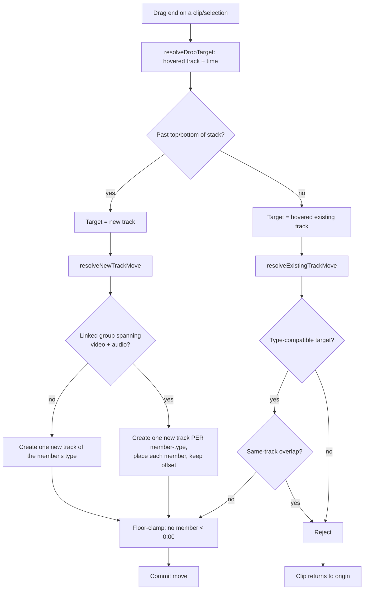
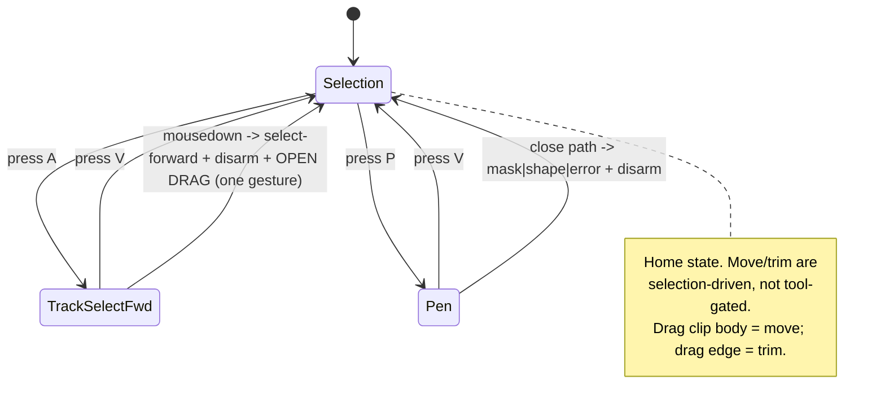

# feat: Timeline that just works

## Summary

Make VibeCut's timeline/editor predictable enough that someone fluent in CapCut or Premiere can drive it without friction — because the product's real goal (hyperframes + AI edit) only lands if the AI writes onto a *trustworthy* editing surface. The plan adopts **Premiere-style free placement as the spine** (gaps allowed, multi-track, an armed-tool model) with CapCut-style conveniences (magnetic snap, simple defaults) as **optional, toggleable assists** — never the substrate. It is phased: **Phase 1** fixes the four confirmed "I did an obvious thing and nothing happened" bugs and surfaces the snap toggle ("just works" core, specified to implementation depth); **Phase 2** makes masking deterministic; **Phase 3** is a prioritized feature roadmap (linked-A/V affordances, Razor, the trim-tool suite, cleanup). It subsumes the still-relevant parts of the prior narrower plan rather than duplicating them.

This plan is grounded in two sources that **agree on the model but disagree on some line numbers**: a research pass (whose `file:line` references may have drifted) and this session's first-hand code reads. **Every unit must re-read its cited `file:line` before editing** (Open Question OQ1).

---

## Problem Frame

The timeline has accumulated Premiere-parity *conveniences implemented as hard constraints* that fight the NLE model, plus genuinely-unbuilt interactions. The user's verdict after live testing: "overall it's a mess." Concretely, four obvious actions silently fail, and the interaction model has never been written down, so each fix has been a spot-patch that the next session re-litigates:

- **Add track** via the track header menu lands in the wrong place (appears to do nothing).
- **Moving a clip — especially a linked A/V pair — onto a new track** (drag past the track stack) is refused.
- **Track Select Forward** selects clips but the selection can't be dragged in one motion.
- **Dragging multiple selected bin assets** into the timeline inserts only one.

Prior sessions already fixed adjacent issues (the V1 zero-anchor clamp removed; prefer-V1 gated to new-drops; unlink shipped; the bin `+`/add action made multi-aware), but with no written model the work has been whack-a-mole. This plan writes the model down, fixes the remaining P0s against it, and sequences the rest.

**North star:** a CapCut/Premiere user edits without friction → the hyperframes + AI-edit loop lands on a surface they trust. Prioritize "just works" over exhaustive parity.

---

## Requirements

- **R1 — Free-placement move.** A clip drags to any position on its track, leaving leading/trailing gaps that are never auto-closed. Same-track overlaps are rejected; cross-track time-overlaps are allowed (layering). No ripple/auto-compaction on move.
- **R2 — Move to a new track.** A clip — including a **linked A/V group** — can move onto a new track created by dragging past the top or bottom of the track stack, preserving the timecode offset.
- **R3 — Add track.** The track-header menu adds a video/audio track **adjacent to the clicked track** in the expected direction, scrolled into view, and persisted (not pruned).
- **R4 — Track Select Forward.** Selects the clicked clip and everything to its right (all tracks; **Shift** = this track only); the selection is **draggable in one continuous press-drag gesture**.
- **R5 — Multi-drag from bin.** Dragging multiple selected bin assets into the timeline inserts **all** of them, placed sequentially.
- **R6 — Soft snapping.** Snapping is an always-visible toggle (**S**) using pixel-proximity attraction (overridable) to clip edges, playhead, 0:00, and markers, on both moves and trims — never a hard clamp.
- **R7 — Deterministic Pen/Mask.** Drawing a closed pen path masks the **selected/under-cursor clip** (vs. creating a new shape), with the target **latched at tool-arm time** so a mid-draw canvas click can't silently flip mask→shape.
- **R8 — Per-clip mask controls.** The Masks tab exposes feather, invert, expand/contract, position/rotation/scale, point editing, and (if feasible) mask-path keyframing.
- **R9 — Linked-A/V affordances.** Alt-drag temporarily unlinks for one interaction; an out-of-sync badge surfaces drift with a "move into sync" action.
- **R10 — Armed-tool model.** Tools follow one lifecycle (arm → act → disarm → hand off to Selection); Phase 1 ships Selection / Track-Select-Forward / Pen; Razor and the trim suite follow.
- **R11 — Seamless acceptance gate.** A scripted edit scenario (import → place → move → cross-track → new-track → mask → multi-drag) passes as the Phase 1 exit gate, since unit tests can't catch gesture-level feel.

---

## North Star & Scope Decision

**Confirmed with the user:** Premiere-style **free placement** is the interaction spine — it's where the current code (main/overlay/audio tracks, the V1 model, the armed tools, the hyperframes/AI-edit overlays) already points. CapCut's *magnetic* model (clips auto-snap together, gaps closed, ripple-by-default) is **not** the substrate; CapCut's *conveniences* (a prominent snap toggle, sensible first-drop defaults, "mask what I'm pointing at") are layered on top. A single timeline cannot be both magnetic and free-placement at the substrate level — this plan commits to free-placement and treats magnetism as an opt-in assist only.

---

## High-Level Technical Design

### Placement / overlap rules (the model in one table)

| Situation | Rule |
|---|---|
| Same track, gap | **Allowed**; never auto-closed by a move |
| Same track, time-overlap | **Rejected** (snap back / nearest legal slot) |
| Cross track, time-overlap | **Allowed** (compositing — higher track over lower) |
| Type mismatch on target track | **Rejected** (video→audio etc.) |
| Any member start < 0:00 | **Rejected** (floor clamp — the one legitimate clamp) |
| Drop past first/last track | **Create** a new compatible track (per-type for linked groups) |

### Clip-move resolution flow

*Note: today the `linked group → new track` branch returns `null` (Bug B), which the commit path reads as "cancel," so the move silently fails. U2 makes that branch produce a non-null per-type result.*

### Armed-tool lifecycle (Phase 1 tools)

### Masking disambiguation (decided at Pen-arm time, latched)

| State latched when Pen arms / at first vertex | Result on path close |
|---|---|
| Exactly one maskable clip (video/image/graphic) selected, visible at playhead | **Mask** cut into that clip |
| One maskable clip selected, not visible at playhead | **Error toast** — park the playhead over it (no shape) |
| Nothing maskable selected (optional: nothing under cursor/playhead) | **New custom shape** |

The current routing already branches `masked`/`failed`/`no-target` correctly — the defect is that the target is re-read *at close* and can be cleared mid-draw. The fix is to **latch** it.

---

## Key Technical Decisions

- **KTD1 — Free-placement spine, magnetism as assist.** (R1, R6) The substrate allows gaps and rejects same-track overlap; snapping is a soft, toggleable, pixel-proximity assist, never a clamp. Do not reintroduce auto-compaction/ripple into *move*.
- **KTD2 — Move-to-new-track is per-type for linked groups.** (R2) `resolveNewTrackMove` must create one new track per member-type (video + audio) for a linked group and place each member on its compatible new track, preserving offset — instead of rejecting mixed groups. This is the single place the spine is currently violated.
- **KTD3 — Add-track is position-aware.** (R3) Pass the clicked track's index + direction into `AddTrackCommand` instead of a hardcoded `index: 0`; rely on the existing `keepWhenEmpty` + prune-reactor for persistence; scroll the new track into view.
- **KTD4 — Tools are selection-driven, not gated.** (R4, R10) The move controller already moves whatever is selected. Track-Select-Forward must, on a single armed mousedown, perform the forward selection, disarm to Selection, **and open a drag session on that same pointer-down** — converting today's click-only handoff into a press-drag gesture. Avoid Premiere's directional-drag rough edge.
- **KTD5 — Multi-drag carries the selection.** (R5) Add `selectedIds?` to the media drag payload, populate from the bin selection (mirroring the just-shipped add-path), and loop in `executeMediaDrop` — create the new track once, advance start time per clip, separate audio per clip. Reuse the sequential pattern in `apps/web/src/features/editing/assemble.ts`.
- **KTD6 — Mask target is latched at arm time.** (R7) Capture the maskable target when Pen arms / at first vertex; forbid mid-draw selection mutation (the pen overlay owns canvas clicks while armed). Optional convenience: auto-target the clip under cursor/playhead before falling back to shape.
- **KTD7 — Masking renders correctly; the work is UX, not the renderer.** (R8) The freeform-mask compositor path is confirmed end-to-end; Phase 2 is disambiguation + a controls audit, not a rendering rebuild.
- **KTD8 — All geometry/time/audio math stays in our JS/TS layer.** `opencut-wasm` is a downstream rasterizer fed a resolved descriptor; nothing here needs an engine fork.
- **KTD9 — Verification reality.** Interaction controllers are `useState`-held and do **not** HMR (hard-reload to test; inspect `window.__vibeEditor`); `@/wasm`-importing tests can't run under bun (extract pure helpers); the user verifies gesture-level behavior live on localhost:3000; the R11 acceptance scenario is the Phase 1 exit gate.

---

## Implementation Units

> **Phasing:** Phase 1 (U1–U6) is the immediate "just works" focus, specified to implementation depth. Phase 2 (U7–U10) and Phase 3 (U11–U15) are sequenced at lighter grain and carry open questions that must be resolved first. **One unit per focused session.** Every unit: re-read cited `file:line` before editing (OQ1).

### Phase 1 — "Just works" core (P0)

### U1. Add-track lands adjacent to the clicked track
**Goal:** Right-click a track header → Add Video/Audio Track creates the track **next to the clicked one** (expected direction), scrolled into view, and it persists. *(R3)*
**Dependencies:** none.
**Files:** `apps/web/src/timeline/components/index.tsx` (track context-menu Add items — currently calls `AddTrackCommand` with a hardcoded `index: 0`), `apps/web/src/commands/timeline/track/add-track.ts` (confirm `index`/`keepWhenEmpty` handling), a wasm-free test for the index-resolution helper if extractable.
**Approach:** Compute the insert index from the clicked track's display position + the menu item's direction (video-above / audio-below convention to confirm against Premiere); pass it to `AddTrackCommand`. Confirm `keepWhenEmpty: true` is set so the empty-track prune reactor (`apps/web/src/core/index.ts`) preserves it. After insert, scroll the new track into view. **Re-verify** the hardcoded-`index:0` site before editing — the research cited `index.tsx` around the Add items but line numbers may have drifted.
**Execution note:** Reproduce live first (add a track, observe where it lands / whether it's off-screen) to confirm the index is the cause before changing it.
**Test scenarios:** add a video track from a mid-stack header → new empty video track appears adjacent (not at index 0); add an audio track → appears in the audio group adjacent to the clicked audio track; the new empty track survives the prune reactor (still there after a no-op re-render); index-resolution helper (if extracted) maps clicked-index + direction → correct insert index.
**Verification:** live — add a track from various headers; it appears where expected and stays; `window.__vibeEditor` shows the new track in `scenes.getActiveScene().tracks`.

### U2. Linked A/V can move onto a new track
**Goal:** Dragging a clip — including a linked video+audio pair — past the top/bottom of the track stack creates the needed new track(s) and lands the clip(s) there, preserving offset. *(R1, R2)*
**Dependencies:** none (independent of U1).
**Files:** `apps/web/src/timeline/group-move/resolve-move.ts` (`resolveNewTrackMove` — currently returns `null` for groups spanning audio + non-audio), `apps/web/src/timeline/controllers/element-interaction-controller.ts` (the drop-target → commit path that reads `groupMoveResult`), `apps/web/src/timeline/placement/__tests__/` (placement tests for new-track moves).
**Approach:** Make `resolveNewTrackMove` handle a linked group by creating **one new track per member-type** (a new video track for the video member, a new audio track for the audio member), placing each member on its compatible new track at the preserved offset, and returning a non-null result so the existing commit path fires (it currently cancels on `null`). Decide insertion order + partial-placement failure semantics (OQ2) — default: create both, place both, or reject the whole move if either can't be placed legally. **Re-verify** the `resolveNewTrackMove` mixed-A/V rejection and the commit's `groupMoveResult` check before editing.
**Execution note:** Characterize live first — drag a single video to new-track space (should already work post-RC2) vs. a linked pair (fails today) — to confirm the linked-group branch is the gap.
**Test scenarios:** drag a single video clip below all tracks → new video track, clip lands; drag a linked A/V pair below all tracks → new video + new audio track, both members land at preserved offset; drag a pair above all tracks → same, correct order; a move that can't legally place one member → whole move rejected (clip returns), not a half-applied split; existing single-clip new-track move stays green.
**Verification:** live — drop a linked pair into new-track space; both halves land on fresh tracks, still linked, offset intact; undo restores.

### U3. Track Select Forward — select and drag in one gesture
**Goal:** With Track Select Forward armed, pressing on a clip selects it + everything to its right (all tracks; Shift = this track) and **immediately drags** that selection in the same motion. *(R4, R10)*
**Dependencies:** none.
**Files:** `apps/web/src/timeline/components/timeline-track.tsx` (`selectForwardFrom`; the armed-tool mousedown early-return), `apps/web/src/timeline/controllers/element-interaction-controller.ts` (open a drag session from the armed mousedown), `apps/web/src/preview/place-tool-store.ts` (the `track-select-forward` tool kind), `apps/web/src/timeline/hooks/element/use-element-interaction.ts`.
**Approach:** The click-select path already disarms to Selection (`setTool(null)`) so a *separate* drag works — the gap is that an armed mousedown early-returns, so press-and-drag-in-one-motion yields no drag session. On armed mousedown: (a) run the forward selection, (b) disarm to Selection, (c) **open a drag session bound to the same pointer-down** so the gesture is continuous. Guard against double-firing with the existing click-select path; preserve Shift (this-track-only) and box-select behavior (OQ3). **Re-verify** the early-return and disarm sites — the research flagged these as already-partially-fixed, so the *narrowed* defect (press-drag) is the target, not a full re-fix.
**Execution note:** Controllers are `useState`-held (no HMR) — hard-reload between iterations; verify via `window.__vibeEditor`.
**Test scenarios:** arm A, press+drag a clip in one motion → its forward selection moves with the cursor; arm A, Shift+press+drag → only this track's forward selection moves; arm A, click (no drag) → selects + disarms, then a separate drag still moves the group (no regression); the tool returns to Selection after the gesture; box-select (marquee) still works under Selection.
**Verification:** live — arm A, press on a clip and drag without releasing → the forward group moves; releasing leaves Selection armed.

### U4. Multi-drag selected bin assets into the timeline
**Goal:** Selecting several bin assets and dragging them into the timeline inserts **all** of them sequentially (not just one). *(R5)*
**Dependencies:** none.
**Files:** `apps/web/src/timeline/drag.ts` (the `MediaDragData` payload type — add `selectedIds?`), `apps/web/src/components/editor/panels/assets/views/assets.tsx` (`MediaAssetDraggable` `dragData` — populate `selectedIds` from `useSelection` when the dragged item is selected), `apps/web/src/components/editor/panels/assets/draggable-item.tsx` (drag source), `apps/web/src/timeline/controllers/drag-drop-controller.ts` (`executeMediaDrop` — loop), placement/insert tests if extractable.
**Approach:** Mirror the just-shipped add-path: when the dragged item is in the bin selection, carry all `selectedIds` (else just the one). In `executeMediaDrop`, resolve assets from the payload and insert sequentially — **create the new track once** (if the drop target is a new track), advance the start time per clip by its duration, and run `maybeSeparateAudio` per clip. Reuse the cursor-advance loop in `apps/web/src/features/editing/assemble.ts`. Carry the v1 limitation (sequential placement may overlap downstream content) as a known boundary. **Re-verify** the payload type location and `executeMediaDrop` before editing.
**Test scenarios:** drag 1 unselected asset → inserts that one (unchanged); select 3 + drag one of them → 3 clips land back-to-back from the drop time; drop a multi-selection onto a new-track target → one new track created, all clips on it sequentially; each video's audio is separated per clip (linked pairs created); dragging a *non*-selected asset while others are selected → inserts only the dragged one (no accidental multi-insert).
**Verification:** live — multi-select bin videos, drag into the timeline → all land sequentially; the `+`/add path still works (no regression).

### U5. Surface the snapping toggle (S)
**Goal:** A prominent, always-visible snap toggle bound to **S**, using soft pixel-proximity attraction on moves and trims. *(R6)*
**Dependencies:** none.
**Files:** `apps/web/src/timeline/components/timeline-toolbar.tsx` (the visible toggle), `apps/web/src/actions/definitions.ts` (the `S` hotkey), the snap engine (`apps/web/src/timeline/group-move/snap.ts` and the trim snap path / `snapping/*`), `apps/web/src/timeline/timeline-store.ts` (a persisted `snappingEnabled` flag if not present).
**Approach:** Wire `S` + a toolbar button to a persisted snapping flag the move/trim snap builders already honor (confirm the flag + the suppress-on-Shift behavior). **Confirm the radius model is pixel-proximity** (so it widens at low zoom) and that trims snap too (OQ4) — the research asserted "snap exists" from inventory without re-reading it. If the engine is time-radius rather than pixel, adjust to pixel-proximity. No hard clamp.
**Execution note:** This is mostly wiring + verification of an existing engine — re-read the snap builders first to confirm what's already there before adding.
**Test scenarios:** S toggles the visible control and the flag; with snap on, dragging a clip edge near another clip's edge attracts within a pixel zone and releases when dragged past; snap targets include clip edges/playhead/0:00/markers; with snap off, no attraction; trims snap when on; Shift temporarily suppresses snap (if that's the existing convention).
**Verification:** live — toggle S; move/trim near edges and the playhead snap softly; toggling off removes attraction.

### U6. Encode the placement model as tests
**Goal:** Lock the §Placement rules into tests so future parity conveniences can't silently reintroduce constraints. *(R1, R2)*
**Dependencies:** U2 (new-track-for-linked-group behavior must exist to test it).
**Files:** `apps/web/src/timeline/placement/__tests__/resolve.test.ts` and/or new `apps/web/src/timeline/group-move/__tests__/` for any pure, wasm-free helpers extracted from `resolve-move.ts`.
**Approach:** Encode the rules table: same-track gap allowed; same-track overlap rejected; cross-track overlap allowed; type-mismatch rejected; floor-clamp at 0:00; move-to-new-track for a linked group creates per-type tracks. Where `resolve-move.ts` logic is entangled with `@/wasm` time math (not bun-runnable), **extract the pure decision helpers** (the rules, not the arithmetic) into a wasm-free module and test those; leave the `@/wasm`-bound arithmetic to live verification.
**Execution note:** Test-first where a pure helper can be extracted; otherwise document the rule as a live-verification step in the R11 acceptance scenario.
**Test scenarios:** as above, one per rule row; the linked-group new-track case from U2; a regression test asserting a lone main-track clip is NOT clamped to 0:00 (guards RC1 from returning).
**Verification:** `bun test` green on the extracted helpers; `tsc` clean.

### Phase 2 — Masking (P1, lighter grain)

### U7. Latch the mask target at Pen-arm time
**Goal:** The Pen tool's mask-vs-shape decision is fixed when the tool arms (or at first vertex) and cannot flip mid-draw. *(R7)*
**Dependencies:** none (independent of Phase 1).
**Files:** `apps/web/src/preview/components/place-tool-overlay.tsx` (`finishPen`/`finishPenAsMask` — read the latched target instead of re-reading selection at close), `apps/web/src/preview/place-tool-store.ts` (store the latched target on arm).
**Approach:** On Pen arm (or first vertex), capture the maskable target (the single selected video/image/graphic, or — convenience — the clip under cursor/playhead) and hold it until close. The existing `masked`/`failed`/`no-target` branching stays; it just consults the latched target. **Re-verify** that the routing is already correct (the research found the "unconditional shape fallthrough" claim stale) so this unit targets the *latch*, not a re-route.
**Execution note:** Characterize live first — select a clip, arm Pen, click in empty canvas mid-draw, then close — to confirm selection is being cleared mid-draw.
**Test scenarios:** select a clip → arm Pen → draw a closed path (including a vertex in empty canvas) → masks the selected clip (not a shape); arm Pen with nothing selected → draws a shape; latched target survives a mid-draw deselect; pure target-resolution helper (if extracted) returns the latched target deterministically.
**Verification:** live — the "I had a clip selected, I drew → I got a mask" path is deterministic regardless of where vertices land.

### U8. Pen overlay owns canvas clicks while armed
**Goal:** While Pen is armed, the preview overlay fully captures canvas clicks so they add vertices and never mutate selection. *(R7)*
**Dependencies:** U7 (latching makes this robust; ownership makes it clean).
**Files:** `apps/web/src/preview/components/place-tool-overlay.tsx` (z-order / pointer handling), the preview interaction controller that owns canvas selection.
**Approach:** Ensure the armed pen overlay sits above the selection-handling layer (or suppress deselect while armed) so a canvas click is unambiguously a vertex. Pairs with U7's latch as defense-in-depth.
**Test scenarios:** arm Pen → click empty canvas → adds a vertex, selection unchanged; disarm → canvas clicks select again as normal.
**Verification:** live — drawing never deselects the target clip.

### U9. "Mask what I'm pointing at" fallback
**Goal:** When Pen arms with nothing selected, auto-target the maskable clip under the cursor/playhead before falling back to shape creation. *(R7)*
**Dependencies:** U7.
**Files:** `apps/web/src/preview/components/place-tool-overlay.tsx`, the bounds/hit-test helper used for canvas→clip resolution.
**Approach:** Extend the latch to resolve an under-cursor/under-playhead maskable clip when selection is empty; only create a shape when there's genuinely no maskable clip beneath. CapCut-convenience layer over the AE selection model.
**Test scenarios:** arm Pen with nothing selected, draw over a video → masks that video; draw over empty canvas → shape; ambiguity (two stacked clips) resolves to the topmost.
**Verification:** live — pointing the pen at a clip and drawing masks it without a prior explicit selection.

### U10. Masks-tab controls audit
**Goal:** Confirm and expose the per-clip mask controls a Premiere/CapCut user expects. *(R8)*
**Dependencies:** none.
**Files:** `apps/web/src/masks/components/masks-tab.tsx`, `apps/web/src/masks/freeform/definition.ts`, the mask renderer (`apps/web/src/services/renderer/compositor/frame-descriptor.ts`).
**Approach:** **Discovery + gap-fill.** Audit which controls exist (feather ✓, invert ✓, freeform point-edit ✓, position/rotation/scale partial) vs. missing (expand/contract, mask-path keyframing — both unconfirmed, OQ6). Expose the missing ones in the Masks tab; if mask-path keyframing is a large lift, split it into its own follow-up unit.
**Execution note:** This unit's first task is the audit; its scope (which controls to build) is resolved by what the audit finds — do not assume.
**Test scenarios:** each exposed control reads + writes + persists on a freeform mask; invert toggles revealed/hidden; feather softens; expand/contract grows/shrinks the masked region.
**Verification:** live — the Masks tab edits a freeform mask's feather/invert/expand/transform and the preview updates.

### Phase 3 — Prioritized feature roadmap (P1 tail → P2, lighter grain)

### U11. Linked-A/V Alt-drag temporary unlink
**Goal:** Holding Alt while dragging a linked clip moves only that member for the one interaction (without permanently unlinking). *(R9)*
**Dependencies:** none. **Open:** verify Alt-drag isn't already present (OQ5).
**Files:** `apps/web/src/timeline/controllers/element-interaction-controller.ts` (selection expansion honors an Alt modifier), `apps/web/src/timeline/link-elements.ts`.
**Approach:** When Alt is held at drag start, skip `expandSelectionWithLinks` for that gesture so only the grabbed member moves; the `linkId` is untouched (no permanent unlink — that's the existing Unlink command).
**Test scenarios:** Alt-drag the video of a pair → audio stays; release + drag without Alt → both move again; Alt-drag does not clear `linkId`.
**Verification:** live — Alt-drag separates a pair for one move; normal drag re-couples.

### U12. A/V out-of-sync badge
**Goal:** Surface existing A/V sync-offset detection as a per-clip badge with a "move into sync" action. *(R9)*
**Dependencies:** none. **Open:** verify the badge isn't already present (OQ5); the prior PATCHES note mentions an "⚠ Nf" sync badge — confirm state.
**Files:** `apps/web/src/timeline/components/timeline-element.tsx` (badge UI — a sync badge may already exist), the sync-offset detection module, a "move into sync" command.
**Approach:** If detection exists but the affordance doesn't, add a click action that re-aligns the member to its partner's source-sync offset. Audit current state first.
**Test scenarios:** move a linked member out of sync → badge shows the frame offset; click "move into sync" → re-aligns; in-sync pair shows no badge.
**Verification:** live — drifting a pair shows the badge; the action re-syncs.

### U13. Razor tool (sticky-toggle blade)
**Goal:** A Razor tool (C) that arms as a sticky blade — click cuts the clip at the cursor; Shift cuts all tracks; V exits. *(R10)*
**Dependencies:** none (uses the existing split command).
**Files:** `apps/web/src/preview/place-tool-store.ts` (a `razor` tool kind), `apps/web/src/actions/definitions.ts` (C hotkey), `apps/web/src/timeline/components/{tool-rail.tsx,timeline-element.tsx}` (rail button + click-to-cut), the existing split command.
**Approach:** Arm razor → clicking a clip splits it at the click time via the existing split command; Shift splits all tracks at that time; stays armed until V. Pure reuse of split on the armed-tool lifecycle.
**Test scenarios:** arm C, click a clip → splits at the cursor; Shift+click → splits all tracks at that time; tool stays armed for repeated cuts; V returns to Selection; undo restores the un-split clip.
**Verification:** live — arm C, cut clips repeatedly; V exits.

### U14. Trim-tool suite (Ripple / Roll / Slip / Slide / Rate-Stretch)
**Goal:** The Premiere trim/retime tools on the armed-tool lifecycle. *(R10)*
**Dependencies:** **OQ7 must be resolved first** (overwrite-vs-insert / ripple semantics) — these tools assume a decided edit model. Subsumes U6 (rate-stretch) from the prior plan.
**Files:** the resize/interaction controllers, `apps/web/src/retime/*`, `apps/web/src/preview/place-tool-store.ts`, the tool rail. *(Each tool is its own unit at execution time — this is a grouped placeholder.)*
**Approach:** Specify per-tool once OQ7 is decided. Rate-Stretch (R) is the cheapest and matches the prior plan's U6; Ripple/Roll/Slip/Slide depend on ripple semantics. Extract pure rate↔duration / trim math as wasm-free helpers and unit-test them.
**Test scenarios:** deferred to per-tool units (each: arm, edge-drag changes the right quantity, math helper unit-tested, V exits).
**Verification:** per-tool live checks.

### U15. Empty-tabs cleanup
**Goal:** Make the Transitions / Adjustment-layer panels either functional or hidden, removing discoverability debt. *(R11-adjacent)*
**Dependencies:** none.
**Files:** the properties/effects panel registry and the relevant tab components.
**Approach:** Decide per tab: hide until built, or ship a minimal functional version. Low-risk polish; not on the critical path.
**Test scenarios:** `Test expectation: none — visual/discoverability cleanup`; verify no empty placeholder tabs remain visible.
**Verification:** live — no dead tabs.

---

## Acceptance Examples (Phase 1 exit gate)

A scripted "can a CapCut/Premiere user edit without friction" run. Phase 1 is done when all pass live (no unit test catches gesture feel). *(R11)*

- **AE1 — Import & place:** import a video with audio → it lands on V1 as a linked pair; a second multi-selected import drag lands all assets sequentially (U4).
- **AE2 — Move with gaps:** drag a clip from 0:00 to 0:20 → it stays at 0:20 (gap allowed), no snap-back.
- **AE3 — Cross-track:** drag a clip onto another existing track → it lands there (not pulled to V1).
- **AE4 — New track:** drag a linked pair below all tracks → new video + audio tracks created, both land, still linked (U2).
- **AE5 — Add track:** right-click a header → Add Video Track → it appears adjacent and persists (U1).
- **AE6 — Track-select move:** arm A, press+drag a clip → its forward selection moves in one gesture (U3).
- **AE7 — Snap:** toggle S; move/trim snaps softly to edges/playhead; toggle off removes attraction (U5).
- **AE8 — Mask (Phase 2):** select a clip, arm Pen, draw → mask cuts into that clip deterministically (U7–U9).

---

## Scope Boundaries

- **In scope:** the interaction model + tool model (Phase 1), masking determinism + controls audit (Phase 2), and the prioritized Phase 3 roadmap units.
- **Relationship to the prior plan (`docs/plans/2026-06-16-001-...`):** that plan's drop-snap (U1) and unlink (U3) **shipped**; move-to-existing-track (its U5) **shipped this session** (RC2). This plan **subsumes** its still-relevant parts: pen-mask (its U2 → refined here as U7–U9), rate-stretch (its U6 → folded into U14), and supersedes its framing with the written model. Duplicate-track (its U4) and the panel restyle (its U7) remain valid follow-ups, tracked there.
- **Deferred to Follow-Up Work:** blending modes, variable-speed envelope, transitions, adjustment layers, color/effect definitions beyond blur/EQ, custom-template save/management UI. Mask-path keyframing may split into its own unit if U10's audit shows it's a large lift.
- **Out of scope:** any `opencut-wasm`/render-engine change; CapCut-style magnetic timeline as the *substrate* (it's an opt-in assist only); export-pipeline changes (the cardinal rule "don't break export" still holds).

---

## Open Questions

1. **OQ1 — Re-verify cited line numbers.** The research pass and this session's reads agree on the model but disagree on some `file:line`s (two dossier root causes were already partially fixed in live code). **Every unit must re-read its cited sites before editing** — do not trust line numbers blindly.
2. **OQ2 — Linked-A/V new-track insertion semantics (U2).** Where do the new V and A tracks land relative to existing tracks, and what happens if only one member can be placed legally? Default: create both / place both / reject the whole move on partial failure — confirm.
3. **OQ3 — Press-drag double-fire (U3).** The new armed-mousedown drag session must not double-fire with the existing click-select path, and must coexist with box-select and Shift (this-track-only). Resolve during U3 implementation.
4. **OQ4 — Snap radius model (U5).** Is the existing engine pixel-proximity or time-radius, and do trims snap? Confirm by reading the snap builders before claiming parity.
5. **OQ5 — Linked-A/V primitives already present? (U11/U12).** Alt-drag temporary-unlink and the out-of-sync badge UI were not confirmed present; a prior PATCHES entry mentions a sync badge. Audit before building.
6. **OQ6 — Mask controls coverage (U10).** Mask-path keyframability, expand/contract, and per-mask transform handles were not verified. U10's audit resolves scope.
7. **OQ7 — Overwrite-vs-insert on drop (blocks U14).** The repo currently **rejects** same-track overlaps; Premiere defaults to **overwrite** (Ctrl=insert). Reject-overlap is simpler/CapCut-safe and is this plan's default — but the trim/ripple tools assume a decided model. **Product decision needed before Phase 3's trim suite.**
8. **OQ8 — First-drop-prefers-V1 fork.** Drops prefer V1; moves don't (the RC2 split). Confirm this is desired and not surprising when a user's *first* drop jumps to V1.

---

## Risks & Dependencies

- **Stale line numbers (OQ1)** are the top execution risk — mitigated by the re-read mandate in every unit's execution note.
- **U2 and U3 touch the timing-sensitive move/interaction controllers** (no HMR) — hard-reload + `window.__vibeEditor`; characterize live before changing.
- **U14 is blocked on a product decision (OQ7)** — do not start the trim suite until overwrite/insert/ripple semantics are decided.
- **Test coverage is uneven by design:** pure placement/rate helpers get wasm-free bun tests; gesture/controller behavior is live-verified; the AE scenario set is the Phase 1 exit gate. `@/wasm`-importing timeline tests still can't run under bun.
- **Upstream discipline:** opencut-upstream files edited here (`timeline/components/index.tsx`, `timeline-track.tsx`, `drop-target.ts`, `element-interaction-controller.ts`, `place-tool-store.ts`, `actions/definitions.ts`, `timeline-toolbar.tsx`, the assets panel, masks-tab, etc.) each need a `PATCHES.md` entry in the same commit. New files (ours) don't.
- **Verification reality:** live on localhost:3000 by the user this round; no Odysseus/Hermes; keep changes default-safe/additive; one unit per session; auto-push OK.

---

## System-Wide Impact

- **Affected users:** anyone editing in VibeCut — these are core gestures, so the blast radius is "the whole editor." Default-safe/additive changes only.
- **AI-edit / hyperframes coupling:** the AI-edit pipeline and hyperframes overlays write onto the timeline; a predictable placement/mask surface directly raises the trust and correctness of those features (the north star). Masks specifically feed hyperframes overlays.
- **Export:** none of these change the resolved descriptor the renderer consumes; "don't break export" is preserved.

---

## Verification

1. `tsc --noEmit` clean (bar the known `globals.css` false positive); eslint clean on changed code.
2. Wasm-free bun tests for extractable pure helpers (placement rules U6, mask target resolution U7, rate/trim math U14).
3. Live on localhost:3000 — per-unit checks above, gated by the **AE1–AE8 acceptance scenario** for Phase 1.
4. Each upstream-file edit logged in `PATCHES.md`.

---

## Sources & Research

- **11-agent research workflow** (this session): external Premiere Pro / CapCut / After Effects UX (timeline interaction, masking, tool models) + a repo map and root-cause pass over the current interaction layer, synthesized into the model, the root-cause rollup, and the gap assessment above. The synthesis self-corrected two stale dossier claims against live code (track-select-forward already disarms on click; pen routing already branches correctly) — reflected in U3 and U7 targeting the *narrowed* defects.
- **This session's first-hand debugging:** RC1 (V1 zero-anchor clamp removed, `group-move/resolve-move.ts`), RC2 (prefer-V1 gated to new-drops, `components/drop-target.ts`), RC3 (bin add multi-aware, `panels/assets/views/assets.tsx`); unlink shipped (`commands/timeline/element/unlink-elements.ts`).
- **Prior plan:** `docs/plans/2026-06-16-001-feat-timeline-fixes-and-tools-plan.md` (subsumed/superseded as noted in Scope Boundaries).
- **Architecture finding:** `opencut-wasm` is a downstream texture-quad rasterizer fed a fully-resolved descriptor — all geometry/time/audio math is in our JS/TS layer (KTD8); the freeform-mask compositor path is confirmed end-to-end (KTD7).
