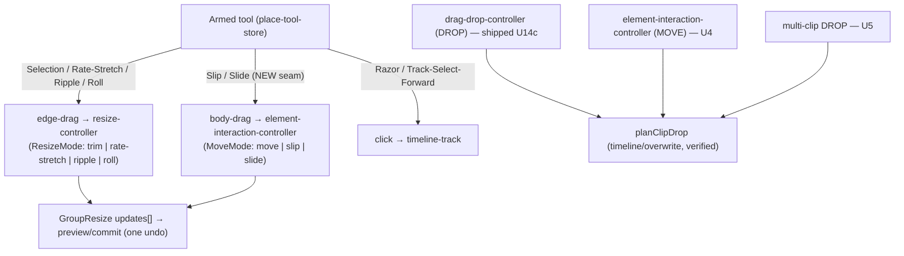

<!--
status: ready
type: feat
created: 2026-06-16
depth: deep
owns: trim-suite-completion, move-overwrite, multi-clip-overwrite, duplicate-track, markers-edit, mask-expand, mask-keyframing, panel-restyle
references: docs/plans/2026-06-16-002-feat-timeline-just-works-plan.md, docs/plans/2026-06-15-003-feat-advanced-clip-audio-features-plan.md
-->

# feat: Timeline edit backlog — finish the trim suite, overwrite-on-move, and the remaining parity polish

## Summary

This plan consolidates the remaining timeline/editing backlog after the "timeline just works" work (plan 002) shipped the interaction core, masking determinism, the overwrite/insert **drop** model, and the Rate-Stretch + Ripple trim tools. It owns four tracks of work: **(1)** finishing the Premiere trim suite (Roll, Slip, Slide) and extending the overwrite/insert edit model from drops to **moves** and **multi-clip** drops; **(2)** timeline editing extras (duplicate-track, marker editing/export); **(3)** masking depth (expand/contract, keyframable mask properties); **(4)** a panel restyle to the Effect-Controls fx-group look.

It deliberately does **not** re-plan the advanced clip-audio features (reverse speed, time-remap, LUFS, slow-mo, source monitor) — those are already specified in [plan 003](docs/plans/2026-06-15-003-feat-advanced-clip-audio-features-plan.md) and are executed from there. The two plans share a dependency: the source monitor's insert/overwrite wiring (003 U8) builds on the overwrite model this plan completes.

Everything here lives in the JS/TS layer except two clearly-flagged renderer-adjacent decisions in the masking track (expand/contract morphology, mask-animation resolution), both of which have a JS-only path.

---

## Problem Frame

The editor now has a trustworthy interaction spine, but the Premiere parity surface is incomplete in ways a CapCut/Premiere user notices immediately:

- The tool rail shows Rate-Stretch and Ripple but **Roll/Slip/Slide are missing** — half the trim suite.
- Overwrite/insert works when **dropping from the bin** but not when **moving an existing clip** onto another, and not for **multi-clip** drops — so the edit model feels inconsistent depending on how the clip got there.
- Common editing affordances are absent (**duplicate a track**) or read-only (**markers** can't be renamed/colored/exported).
- **Masks** can be drawn and feathered but not **expanded/contracted** or **animated**, so they're static cut-outs rather than a motion tool.
- The **Audio/Speed/Blending** panels use an older vertical `Section` layout that visually clashes with the polished Effect-Controls fx-group panel.

The real product goal remains hyperframes + AI edit on a surface that "just functions"; this backlog removes the remaining friction a manual editor hits, so the AI-driven flows land on a complete timeline.

---

## Requirements

- **R1 — Complete the trim suite.** Roll, Slip, and Slide ship as armed tools alongside Rate-Stretch (R) and Ripple (B), each on the sticky armed-tool lifecycle (V/Escape exit), with verified wasm-free math.
- **R2 — Consistent overwrite/insert edit model.** The OQ7 decision (overwrite default, Ctrl=insert) applies to **moving** an existing clip onto an occupied region and to **multi-clip** drops, not only single-clip bin drops.
- **R3 — Duplicate track.** A track (with all its clips, trims, animations, effects) can be duplicated in one action from the track context menu.
- **R4 — Editable markers.** Markers support per-marker comment + color editing and CSV export, beyond the current read-only list.
- **R5 — Mask depth.** Masks support expand/contract (grow/shrink the masked region, distinct from feather) and keyframable scalar properties (feather, position, rotation, scale).
- **R6 — Panel visual parity.** The Audio, Speed, and Blending property panels adopt the Effect-Controls fx-group visual style (grouped rows, fixed label column, blue scrub values, keyframe stopwatch where applicable).
- **R7 — (reference, not owned here)** Advanced clip-audio features (reverse speed, time remapping, LUFS, slow-mo frame-blending, source monitor) ship from [plan 003](docs/plans/2026-06-15-003-feat-advanced-clip-audio-features-plan.md).

---

## High-Level Technical Design

**Gesture → controller routing.** The armed-tool model already routes click/edge gestures. This plan adds the two **body-drag** tools (Slip/Slide), which route through the move controller rather than the resize controller — the key new seam.

**Overwrite model reuse.** The verified `planClipDrop` planner (24 tests) is the single source of carve geometry. The shipped drop path consumes it; U4 (move) and U5 (multi-clip) extend consumption to the other entry points. No new geometry is invented.

**Masking boundary.** Expand/contract and scalar-property keyframing both have a JS-only path (per-renderer path morphology; the existing scalar animation engine resolved in `frame-descriptor` before the mask texture is drawn). Freeform-point-level keyframing (animating individual bezier points) needs custom array interpolation and is deferred.

---

## Key Technical Decisions

- **KTD1 — Slip/Slide route through the move controller, not the resize controller.** Slip/Slide are body-drags (the clip's interior, not an edge), matching Premiere. The resize-controller's `mode` pattern (proven by Rate-Stretch/Ripple) is mirrored as a `MoveMode` on `element-interaction-controller.ts`. This is the largest new seam in the plan and is built once in U2, reused in U3.
- **KTD2 — Reuse `planClipDrop` for move + multi-clip overwrite; do not fork geometry.** The planner is pure, exhaustively tested, and entry-point agnostic. U4/U5 supply it the right `existingClips`/span/mode and apply the resulting plan via the same `OverwriteDropCommand` pattern (or a move-aware sibling). *(see `docs/plans/2026-06-16-002-feat-timeline-just-works-plan.md` U14)*
- **KTD3 — Mask expand/contract is a JS-layer `expand` param applied per-renderer.** Add `expand` to `BaseMaskParams` (parallel to the existing `feather`); each mask renderer grows/shrinks its path before drawing. A renderer-level (wasm dilate/erode) path is the fallback only if JS morphology proves too slow — not the default.
- **KTD4 — Scalar mask keyframing reuses the existing animation engine.** Add `mask.feather`/`mask.centerX`/`mask.centerY`/`mask.rotation`/`mask.scale` to `ANIMATION_PROPERTY_PATHS` and resolve them in `frame-descriptor` before the mask texture is built. Freeform path-point animation (arrays) is out of scope (KTD-deferred).
- **KTD5 — Extract the fx-group primitives into a shared module before restyling.** `FxGroup`/`Row`/`ValueField`/`Stopwatch`/`KfNav` are currently private to `effect-controls-tab.tsx`. Extract them to a shared `properties/components/fx-group/` module, then refactor Speed/Audio/Blending to consume them — one extraction, three adopters.
- **KTD6 — Unlink is already shipped; it is not in scope.** Research confirmed `UnlinkElementsCommand` + the clip context-menu "Unlink" item + tests already exist (`apps/web/src/timeline/unlink-elements.ts`, `apps/web/src/commands/timeline/element/unlink-elements.ts`). No work needed.

---

## Implementation Units

Phased by track. U-IDs are stable. Trim-tool math helpers follow the established wasm-free + bun-tested pattern (`apps/web/src/timeline/trim-tools/ripple.ts`, `roll.ts`); the armed-tool wiring follows the 6-file pattern proven by Rate-Stretch and Ripple.

### Phase 1 — Finish the trim/edit suite

### U1. Wire the Roll tool
**Goal:** Surface Roll as an armed tool; dragging the cut between two adjacent clips rolls the edit. *(R1)*
**Dependencies:** none — the math helper (`computeRollTarget`) is already committed + verified (23 tests, commit `de0b0939`).
**Files:** `apps/web/src/timeline/group-resize/compute-roll.ts` (new — glue: find the adjacent clip, assemble `GroupResizeUpdate[]`), `apps/web/src/timeline/group-resize/index.ts` (export), `apps/web/src/timeline/controllers/resize-controller.ts` (add `"roll"` to `ResizeMode` + branch), `apps/web/src/preview/place-tool-store.ts` (union), `apps/web/src/actions/definitions.ts` (action; **no default key** — Premiere's `N` is taken by snapping), `apps/web/src/actions/use-editor-actions.ts` (handler + Escape disarm), `apps/web/src/timeline/components/tool-rail.tsx` (button), `apps/web/src/preview/components/place-tool-overlay.tsx` (timeline-only early-return guard).
**Approach:** Mirror the Ripple wiring exactly. In `compute-roll.ts`, resolve the cut: RIGHT edge of the dragged clip → A = dragged, B = clip whose `startTime == dragged.end`; LEFT edge → B = dragged, A = clip whose `end == dragged.start`; `+delta` = cut moves right. Call `computeRollTarget` (skip — return no updates — when there is no adjacent clip or either side lacks `sourceDuration`). Emit two updates (A, B); the controller's multi-element commit applies them as one undo.
**Patterns to follow:** `apps/web/src/timeline/group-resize/compute-ripple.ts` (glue shape), the Ripple PATCHES row's 6-file wiring.
**Test scenarios:** `compute-roll.ts` glue — RIGHT edge picks the clip starting at dragged.end; LEFT edge picks the clip ending at dragged.start; no adjacent clip → empty updates; non-media clip (no sourceDuration) → empty updates. (Helper math already covered by `roll.test.ts`.)
**Verification:** live — arm Roll, drag the cut between two adjacent clips; A grows, B shrinks, total span unchanged, downstream clips don't move; V/Escape exit.

### U2. Slip tool (Y) — fix math + build the body-drag gesture path
**Goal:** Arm Slip; dragging a clip's interior slides the source window under the fixed timeline position. Establishes the reusable body-drag seam. *(R1)*
**Dependencies:** none (but builds the `MoveMode` seam that U3 reuses).
**Execution note:** Rebuild the slip math helper test-first — the prior workflow-generated helper was removed for a missing upper-clamp. The pure helper is wasm-free and bun-testable; write the failing clamp test before the fix.
**Files:** `apps/web/src/timeline/trim-tools/slip.ts` + `__tests__/slip.test.ts` (rebuild, wasm-free), `apps/web/src/timeline/controllers/element-interaction-controller.ts` (add a `MoveMode` latch read from the armed tool at mousedown + a `"slip"` branch that, instead of moving the clip, applies the slip trim delta), `apps/web/src/preview/place-tool-store.ts` (union), `apps/web/src/actions/definitions.ts` (action + `["y"]`), `apps/web/src/actions/use-editor-actions.ts` (handler + Escape), `apps/web/src/timeline/components/tool-rail.tsx` (button), `apps/web/src/preview/components/place-tool-overlay.tsx` (guard).
**Approach:** Math: `trimStart += delta*rate`, `trimEnd -= delta*rate`, `startTime`/`duration` fixed; **clamp** `trimStart`/`trimEnd` into `[0, sourceDuration - duration*rate]` so an out-of-range drag can't produce a negative visible span (the missing-clamp bug). Gesture: the move controller currently begins a clip move on interior mousedown; gate that on `MoveMode === "move"`. For `"slip"`, capture the horizontal drag delta and emit an `updateElements` trim patch (preview on drag, commit on mouseup) — the clip does not change timeline position.
**Patterns to follow:** the resize-controller `mode` latch (read armed tool once at gesture start), `apps/web/src/timeline/trim-tools/ripple.ts` (helper house style), `SplitElementsCommand` source-window math for the trim/retime relationship.
**Test scenarios:** Covers source-window invariant. `slip.test.ts` — forward/backward slip moves trim by `delta*rate`; saturates at `trimStart=0` and `trimEnd=0`; clamps at the upper bound (`trimStart` never exceeds `sourceDuration - duration*rate`); retimed clip (rate 0.5/2) maps timeline delta to source correctly; zero delta is a no-op; round-trip recovers the original trim. Controller branch: armed Slip + interior drag changes trim, not startTime.
**Verification:** live — arm Y, drag inside a clip; the visible content shifts while the clip stays put; clamps at source ends; V/Escape exit.

### U3. Slide tool (U) — fix math + wire on the body-drag seam
**Goal:** Arm Slide; dragging a clip's interior moves it between its neighbors, which absorb the move. *(R1)*
**Dependencies:** U2 (reuses the `MoveMode` body-drag seam).
**Execution note:** Rebuild the slide math helper test-first — the prior version had the left-neighbour signs inverted. Encode the **correct** behavior in the tests before implementing.
**Files:** `apps/web/src/timeline/trim-tools/slide.ts` + `__tests__/slide.test.ts` (rebuild), `apps/web/src/timeline/controllers/element-interaction-controller.ts` (`"slide"` branch on the U2 seam), the same armed-tool 5 files (union/action `["u"]`/handler/button/guard).
**Approach:** Math (slide right, `+delta`): clip `startTime += delta`; **LEFT neighbor GROWS** (`left.duration += delta`, `left.trimEnd -= delta*rateLeft`) — the prior bug shrank it; **RIGHT neighbor shrinks from head** (`right.startTime += delta`, `right.duration -= delta`, `right.trimStart += delta*rateRight`). Clamp by the tightest of: each present neighbor's available source and one-frame floor; add upper-overshoot clamps so a neighbor's trim can't exceed its source window (the adversarial finding). Clip content/duration unchanged. Missing neighbor (clip at track edge) → clamp by the present side only. Controller: the `"slide"` branch finds the immediate left/right neighbors, calls `computeSlideTarget`, emits up to three updates (clip + present neighbors) as one commit.
**Patterns to follow:** U2's body-drag branch, `computeRollTarget` clamping discipline (single global clamped delta → derive all clips).
**Test scenarios:** Covers source-window invariant. `slide.test.ts` — slide-right grows left/shrinks right with correct trim signs; slide-left mirrors; clamps at each neighbor's source + min duration; upper-overshoot clamp holds the invariant for a pre-trimmed neighbor; retimed neighbor (rate≠1); missing left or right neighbor; combined span constant. Controller: interior drag with Slide armed moves the clip + adjusts both neighbors.
**Verification:** live — arm U, drag a clip between two neighbors; it moves, neighbors absorb it, nothing else shifts; V/Escape exit.

### U4. Overwrite/insert on MOVE
**Goal:** Moving an existing clip onto an occupied same-track region carves it (overwrite default / Ctrl=insert), matching the shipped drop behavior. *(R2)*
**Dependencies:** none on this plan; consumes the shipped `planClipDrop` + `OverwriteDropCommand` (plan 002 U14b/U14c).
**Files:** `apps/web/src/timeline/group-move/resolve-move.ts` (when a move lands on an overlap and edit-mode is active, resolve to a carve outcome instead of the current reject/clamp), `apps/web/src/timeline/controllers/element-interaction-controller.ts` (read `event.ctrlKey` at drop; route a single-clip carve-move through a move-aware carve), `apps/web/src/commands/timeline/track/overwrite-drop.ts` (generalize or add a sibling that carves around a MOVED element — it must exclude the moved clip itself from the carve and from any ripple).
**Approach:** Reuse `planClipDrop` with `existingClips` = the target track's clips **minus the moved clip**, span = the moved clip's `[A,B)`, mode from Ctrl. Apply via the same split/delete-or-ripple/place transform, then move the dragged clip into the carved hole. The conservative gate matches U14c: only carve on an actual overlap of a type-compatible target track; non-overlapping moves keep today's behavior. **This rewrites the group-move overlap path (RC1/U2 work) — the highest-risk unit; build it isolated and verify before U5.**
**Patterns to follow:** `apps/web/src/commands/timeline/track/overwrite-drop.ts` (carve+place), `computeDropTarget` editMode gating (only-on-overlap).
**Test scenarios:** Reuse the planner's geometry tests (no new geometry). New coverage for the move-exclusion: the moved clip is excluded from `existingClips` so it never carves itself; a move with no overlap produces an ordinary move (regression); linked A/V move still moves together (the carve applies per resolved track). Live-verify the gesture.
**Verification:** live — drag a clip onto another clip on the same track → overwrites; Ctrl+drag → inserts/ripples; drag to empty space → unchanged; undo restores in one step.

### U5. Multi-clip overwrite drop
**Goal:** Dropping a multi-selection onto an occupied region carves correctly for the set, not just a single clip. *(R2)*
**Dependencies:** U4 not required, but shares the carve-with-exclusion reasoning; sequence after U4 so the carve command is already move-aware.
**Files:** `apps/web/src/timeline/controllers/drag-drop-controller.ts` (`executeMediaDrop` — extend the single-clip carve branch to the multi-clip queue), `apps/web/src/commands/timeline/track/overwrite-drop.ts` (accept an ordered set of incoming clips, or batch per-clip carves into one command for atomic undo).
**Approach:** For a multi-selection drop with `carveMode`, compute the combined incoming span (back-to-back placement of the queue) and carve once for the whole span, then place the clips in order; or carve incrementally as each lands, feeding each `planClipDrop` the post-previous-carve track state. Prefer the single-combined-span carve for predictable undo. Keep multi-track-type drops (video+audio) routing per type as today.
**Patterns to follow:** the existing `executeMediaDrop` multi-drop loop + `landingByType`, the U14c single-clip carve branch.
**Test scenarios:** combined-span planner cases (two clips covering an existing clip → existing removed, both placed); mixed video+audio multi-drop carves the video track and routes audio per type; non-overlapping multi-drop unchanged (regression). Live-verify.
**Verification:** live — select 2+ bin clips, drop onto an occupied region → they overwrite back-to-back; Ctrl → insert; one undo reverts the whole drop.

---

### Phase 2 — Timeline editing extras

### U6. Duplicate Track command
**Goal:** Duplicate a whole track (clips, trims, animations, effects, mute/hidden state) via the track context menu. *(R3)*
**Dependencies:** none.
**Files:** `apps/web/src/commands/timeline/track/duplicate-track.ts` (new `DuplicateTrackCommand`), `apps/web/src/commands/timeline/track/index.ts` (export), `apps/web/src/core/managers/timeline-manager.ts` (`duplicateTrack({ trackId })` wrapper), `apps/web/src/timeline/components/index.tsx` (track context menu item, near "Add audio track" ~line 940).
**Approach:** Snapshot `SceneTracks`; build a new track of the same type via `buildEmptyTrack` (`apps/web/src/timeline/placement/track-factory.ts`) with a fresh id; deep-copy every element with a **new** `generateUUID()` id (preserve `animations`, `params`, `masks`, `retime`, trims); regenerate `linkId` groups consistently within the copy (a linked A/V pair in the source keeps a *new* shared linkId in the copy, not the original's). Insert adjacent to the source (index + 1). Single-command atomic undo via `updateTracks` (mirror `RemoveRangesCommand`/`OverwriteDropCommand`).
**Patterns to follow:** `apps/web/src/commands/timeline/track/add-track.ts` (id + insert-index), `apps/web/src/commands/timeline/track/overwrite-drop.ts` (snapshot + `updateTracks` + undo).
**Test scenarios:** Covers duplicate-preserves-content. Pure transform: duplicated track has a new id; every element has a new id; animations/trims/masks preserved; a source linked A/V pair maps to a new shared linkId in the copy (not the source's, not unlinked); insertion index is source+1; undo restores exactly.
**Verification:** live — right-click a track → Duplicate; the copy appears adjacent with identical clips; editing the copy doesn't touch the original; undo removes the copy.

### U7. Marker editing + CSV export
**Goal:** Markers gain per-marker comment + color editing and a CSV export, beyond the read-only list. *(R4)*
**Dependencies:** none.
**Files:** `apps/web/src/components/editor/panels/assets/views/markers.tsx` (inline comment/color edit + an Export button), the scene bookmark model + its manager (`apps/web/src/core/managers/scenes` / `editor.scenes` bookmark methods — add `updateBookmark({ id, comment?, color? })` if absent), a small wasm-free `markers-csv.ts` helper + test.
**Approach:** Extend the bookmark record with optional `comment` + `color` (default uncolored). Inline-edit in the markers list (text field for comment, swatch picker for color). Export builds CSV rows `timecode,comment,color` from the active scene's bookmarks via a pure helper (download via a Blob). Keep click-to-seek + delete as today.
**Patterns to follow:** `apps/web/src/components/editor/panels/assets/views/markers.tsx` (existing list + seek + delete), existing settings/background swatch picker for the color control.
**Test scenarios:** Covers CSV shape. `markers-csv.ts` — rows render `timecode,comment,color`; commas/quotes in a comment are escaped; empty list → header only; timecode formatting matches the list. UI: edit a comment persists; color swatch persists; export downloads the expected rows.
**Verification:** live — add markers, edit comment + color, reload (persists), export CSV and open it.

---

### Phase 3 — Masking depth

### U8. Mask expand/contract
**Goal:** Add an `expand` control that grows/shrinks the masked region (distinct from feather's soft edge). *(R5)*
**Dependencies:** none.
**Files:** `apps/web/src/masks/types.ts` (`BaseMaskParams` — add `expand: number`, default 0), `apps/web/src/masks/registry.ts` (param definition), `apps/web/src/masks/builtin/definitions/*` (each renderer grows/shrinks its path by `expand` before drawing), `apps/web/src/masks/components/masks-tab.tsx` (an Expand slider next to Feather, ~line 582), `apps/web/src/services/renderer/compositor/frame-descriptor.ts` (`buildMaskArtifacts` ~426-467 — pass `expand` into the draw path).
**Approach:** `expand` is a JS-layer param (parallel to the existing `feather`). For path-based masks, offset the path outward/inward by `expand` (positive grows, negative contracts) before rasterizing the mask texture; for shape masks, inflate/deflate the shape bounds. No wasm change in the default path — the mask texture is drawn with the adjusted geometry. Flag the renderer-level fallback (push `expand` into `LayerMaskDescriptor` for GPU dilate/erode) only if JS path-offset proves too slow on complex freeform paths.
**Patterns to follow:** the existing `feather` param end-to-end (model → registry → masks-tab control → `buildMaskArtifacts`), `apps/web/src/masks/freeform/path.ts` for path geometry.
**Test scenarios:** Covers expand geometry. Pure path-offset helper — `expand=0` is identity (regression); positive expand grows a known rectangle's effective bounds by the expected amount; negative contracts; contract past the shape's inradius clamps to empty rather than inverting. Live: visual grow/shrink on a freeform + a shape mask.
**Verification:** live — draw a mask, drag Expand; the cut-out grows/shrinks; combined with Feather behaves sensibly; export matches preview.

### U9. Keyframable scalar mask properties
**Goal:** Animate the scalar mask properties (feather, centerX, centerY, rotation, scale; plus `expand` from U8) on the existing keyframe engine. *(R5)*
**Dependencies:** U8 (so `expand` is animatable too); reuses the animation engine.
**Files:** `apps/web/src/animation/types.ts` (`ANIMATION_PROPERTY_PATHS` — add `mask.feather`, `mask.centerX`, `mask.centerY`, `mask.rotation`, `mask.scale`, `mask.expand`), `apps/web/src/animation/` (a `mask-param-channel.ts` resolver, mirroring `graphic-param-channel.ts`), `apps/web/src/services/renderer/compositor/frame-descriptor.ts` (resolve mask animations at the current local time **before** `buildMaskArtifacts`), `apps/web/src/masks/components/masks-tab.tsx` (keyframe stopwatches on the scalar mask controls).
**Approach:** Treat the scalar mask params exactly like graphic params: store keyframes on `ElementAnimations` under `mask.*` paths, resolve via `resolveAnimationPathValueAtTime` into the mask's effective params for the frame, then render. The renderer is unchanged (it already receives resolved params). **Freeform path-point animation is explicitly out of scope** (arrays need custom interpolation — see Scope Boundaries).
**Patterns to follow:** `apps/web/src/animation/graphic-param-channel.ts` (`resolveGraphicParamsAtTime`), the Effect-Controls stopwatch/keyframe UI, `apps/web/src/animation/resolve.ts`.
**Test scenarios:** Covers scalar mask keyframing. Static mask (no animations) renders exactly as today (regression); a 2-keyframe feather animation resolves to the interpolated value at a mid time; centerX/rotation/scale animate; clamping to clip duration honored. UI: stopwatch toggles a keyframe; scrubbing shows the animated mask move.
**Verification:** live — keyframe a mask's position + feather, scrub, confirm the mask animates; export matches preview.

---

### Phase 4 — Panel polish

### U10. Restyle Audio/Speed/Blending to the fx-group look
**Goal:** The Audio, Speed, and Blending property panels adopt the Effect-Controls fx-group visual style. *(R6)*
**Dependencies:** none (pure presentation; no behavioral change).
**Execution note:** No behavioral change — visual parity work. Verify via screenshots, not unit tests.
**Files:** `apps/web/src/components/editor/panels/properties/components/fx-group/` (new — extract `FxGroup`, `Row`, `ValueField`, `Stopwatch`, `KfNav` from `effect-controls-tab.tsx` ~476-526 as shared exported components), `apps/web/src/components/editor/panels/properties/components/effect-controls-tab.tsx` (consume the extracted module — no visual change), `apps/web/src/speed/components/speed-tab.tsx` (adopt fx-group rows), the Audio + Blending tabs (`apps/web/src/components/editor/panels/properties/registry.tsx` `buildAudioTab`/`buildBlendingTab` + `element-params-tab.tsx`/`property-param-field.tsx` row rendering).
**Approach:** Extract first (KTD5), re-point Effect-Controls at the shared module and confirm it's visually identical, then refactor the three panels' rows from the vertical `SectionField` layout to the horizontal fx-group `Row` (fixed label column, right-aligned controls, blue scrub value, keyframe stopwatch where the param is keyframable). Preserve every existing control's behavior (volume/muted, speed/duration/maintain-pitch, opacity/blendMode) — only the layout changes.
**Patterns to follow:** `apps/web/src/components/editor/panels/properties/components/effect-controls-tab.tsx` (the target look), the existing `NumberField`/`Switch` controls (keep their logic, reskin the row).
**Test scenarios:** Test expectation: none — pure presentation, no behavioral change. Guard: Effect-Controls renders identically after the extraction (visual diff); the three panels keep all controls functional.
**Verification:** screenshots — Effect-Controls unchanged after extraction; Speed/Audio/Blending match the fx-group look; every control still edits its value + keyframes.

---

## Scope Boundaries

**In scope:** U1–U10 above, all in the JS/TS layer (U8/U9 are renderer-adjacent but take the JS path).

**Already shipped (no work):**
- **Unlink assets** — `UnlinkElementsCommand` + clip context-menu "Unlink" + tests already exist. *(KTD6)*
- **Rate-Stretch (R), Ripple (B)** trim tools, the overwrite/insert **drop** model, and the timeline interaction core — shipped under [plan 002](docs/plans/2026-06-16-002-feat-timeline-just-works-plan.md).

**Owned by another plan (execute there, not here):**
- **Reverse speed, time remapping, LUFS, slow-mo frame-blending, source monitor** — [plan 003](docs/plans/2026-06-15-003-feat-advanced-clip-audio-features-plan.md) U3–U8. Source-monitor insert/overwrite wiring (003 U8) depends on the overwrite model this plan extends (U4/U5).

**Deferred to Follow-Up Work:**
- **Freeform mask path-point keyframing** — animating individual bezier points needs custom array interpolation outside the scalar animation engine; revisit after U9 ships scalar mask keyframing.
- **Renderer-level (wasm) mask expand/contract** — only if the U8 JS path-offset is too slow on complex paths.
- **Overwrite/insert across all tracks on insert** — U4/U5 ripple the target track only; full-timeline sync-preserving insert (all tracks shift) is a larger model change.

---

## Risks & Dependencies

- **U4 (overwrite-on-move) is the highest-risk unit** — it rewrites the group-move overlap path built in plan 002 (RC1/U2). Build it isolated, keep the conservative only-on-overlap gate, and live-verify before U5. A regression here breaks ordinary clip moves, the most-used gesture.
- **The body-drag seam (U2) is new** — the move controller currently only does clip moves; adding `MoveMode` branches must not regress normal moves or the press-drag/track-select handoff. Latch the mode once at gesture start (mirror the resize-controller fix).
- **Live verification is mandatory and is the user's loop** — the interaction controllers are `useState`-held and do not hot-reload; gesture behavior can't be bun-tested. Every Phase 1 unit and U8/U9 need a hard-reload live check. Pure helpers (trim math, carve geometry, duplicate transform, CSV, path-offset) carry the automated coverage.
- **Mask keyframing touches the render hot path** — resolving animations per frame in `frame-descriptor` must stay cheap; resolve only when the element has `mask.*` channels (skip the work for static masks).
- **Panel restyle is a wide visual diff** — the extraction (U10 step 1) must leave Effect-Controls pixel-identical before the three panels change, or regressions are hard to attribute.

---

## Open Questions

- **OQ1 — Roll default key.** Premiere's Roll is `N`, which is bound to snapping here. Ship Roll button-only (no default key), rebind snapping, or pick a free letter? Default: button-only.
- **OQ2 — Multi-clip overwrite undo granularity (U5).** One combined-span carve (single undo, simplest) vs. incremental per-clip carves (closer to drop-order semantics). Default: combined-span.
- **OQ3 — fx-group "fx" badge on the restyled panels (U10).** Adopt the literal "fx" badge for visual consistency, or keep plain titles on non-effect panels? Default: plain titles (the badge means "effect" specifically).

---

## Verification (global)

- Pure helpers (Roll glue, Slip/Slide math, duplicate-track transform, markers CSV, mask path-offset, scalar mask resolution) ship with bun tests — green before wiring.
- `tsc --noEmit` and `eslint` clean on changed files per unit; incremental commit per unit so the tree is never broken.
- Each interaction unit (U1–U5, U8, U9) gets a live hard-reload check on `localhost` per its Verification line — the user's loop; the agent cannot self-verify gestures.
- Every edit to an upstream-originated file is logged in `PATCHES.md` in the same commit; new (ours) files are not logged.

---

## Sources & Research

- **Plan 002** (`docs/plans/2026-06-16-002-feat-timeline-just-works-plan.md`) — shipped interaction core, masking, overwrite/insert drop, Rate-Stretch, Ripple; the trim-tool + armed-tool patterns this plan mirrors.
- **Plan 003** (`docs/plans/2026-06-15-003-feat-advanced-clip-audio-features-plan.md`) — owns reverse/time-remap/LUFS/slow-mo/source-monitor.
- **Repo research (this plan):** unlink already shipped (`apps/web/src/timeline/unlink-elements.ts`, `commands/timeline/element/unlink-elements.ts`, clip context menu in `timeline-element.tsx:479`); no DuplicateTrackCommand exists (`commands/timeline/track/` has add/remove/move/mute/visibility only); mask `feather` exists in `masks/types.ts` `BaseMaskParams`, mask render via `frame-descriptor.ts buildMaskArtifacts` (~426-467), animation engine `ANIMATION_PROPERTY_PATHS` in `animation/types.ts` (masks absent); fx-group primitives private to `properties/components/effect-controls-tab.tsx` (~476-526), the three target panels use the vertical `Section`/`SectionField` layout.
