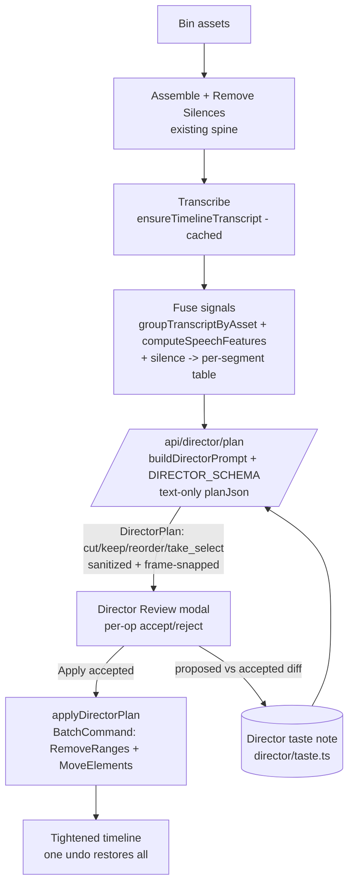

# feat: v0 AI Director (text+audio, review-gated)

## Summary

The first **shippable** AI Director: drop raw footage in the bin, click **AI Director**, and it assembles, removes silences/retakes/tangents, **selects the best take**, and **structures for retention** — then shows a **pre-apply Review modal** (every proposed op with its reason + accept/reject) so you apply only what you approve, as one undoable batch. Each review decision **seeds a device-local taste signal** that nudges the next run.

This is **Round 1** of the [Multimodal AI Director](docs/plans/2026-06-15-002-feat-ai-director-multimodal-plan.md), re-scoped by that plan's resolved Phase-C decisions: **text+audio is the headline** (works on every auth mode, including the default `claude-code`), the **review panel is the keystone** (RF1), value ships **before** the full multimodal build (RF3), and the Director **absorbs** the overlapping AI-CUT modes (RF7c). It builds directly on the already-shipped Phase-A foundations — source-time mapping and audio/speech features (origin U2/U3, merged via [vibecut#49](https://github.com/fullvaluedan/vibecut/pull/49)).

**In scope:** text+audio planning (cut / keep / reorder / take-select), the Review modal, undoable plan application, and a minimal taste capture→inject seed. **Out of scope (next round):** sampled-frame vision, B-roll classification + overlay, and the full LLM taste-compression loop.

---

## Problem Frame

Today's smartest cut, `runYouTubeCut` (`apps/web/src/features/editing/remove-repeats.ts`), already assembles the bin, strips silences, transcribes, and asks Claude for cut ranges — but it has two gaps the Director must close:

- **It applies blind.** `runRemoveRepeats` sends transcript text to `/api/hyperframes/cuts` and immediately executes a `RemoveRangesCommand`. The only feedback is a wholesale Ctrl+Z. That collapses the per-op signal the self-learning loop needs into a binary and makes "did the Director pick well?" unanswerable.
- **It only cuts.** It can't *keep the best of two takes* or *move a strong line earlier* — cut-only ops can't reorder, and it ignores the audio energy/speaking-rate signals that distinguish a confident take from a mumbled one.

The Phase-A foundations already provide the missing senses for a **text+audio** director — `groupTranscriptByAsset` / `timelineTimeToSource` (which source clip said each line) and `computeSpeechFeatures` (energy / loudness / wpm / filler). What's missing is the **brain** (a planner that fuses them into a typed-op plan), the **gate** (review-before-apply), and the **memory seed** (capture the review decisions). This plan adds exactly those three, reusing the existing assemble→silence→transcribe spine.

---

## Requirements

Traceability is to the origin plan's requirements (`see origin`). This round advances the text+audio subset and the new review requirement; the vision requirements are explicitly deferred.

- **R1 — Footage → finished cut.** From bin assets alone, produce an assembled, tightened timeline (no mistakes/retakes/silences/long tangents). *(origin R1)*
- **R2 — Best-take selection.** When the same content is recorded more than once, keep the strongest take and cut the rest — scoped to **high-confidence repeats** (origin RF4). *(origin R2)*
- **R3 — Retention structure.** Strong hook near the front (via a `reorder` op); dead-weight intros/outros trimmed; pacing over completeness. *(origin R3)*
- **R4 — Out-of-context removal.** Off-topic tangents removed from fused transcript + audio signals. *(origin R4)*
- **R8seed — Self-learning seed.** Capture the user's per-op accept/reject from the Review modal and inject a compact note into the next run. Device-local, prompt-context only. *(origin R8, minimal slice)*
- **R9 — Reviewable & reversible.** **NEW (origin RF1):** every run is previewed in a Review modal and applied as one undoable batch; nothing applies without approval; nothing corrupts manual edits. *(origin R9 + RF1)*
- **R10 — Offline-first & cost-aware.** All analysis runs locally; only the planning LLM call is remote; token usage is surfaced. Text-only keeps cost low. *(origin R10)*

**Deferred to the vision round (NOT this plan):** R5 (B-roll classification), R6 (B-roll overlay), R7 (multimodal/vision) — `see origin`.

**Success criteria:** on real footage (validated on a **non-Dan** speaker, origin RF7d), one "AI Director" click yields a reviewable plan whose accepted ops produce a watchable first cut (correct take kept, silences/retakes/tangents gone) in a single undoable step, and the per-op accept-rate is captured for round-over-round learning.

---

## High-Level Technical Design

The Director is a plan → **review** → apply pipeline. Cheap local analysis feeds one text+audio LLM plan; the user approves ops in a modal; accepted ops apply as one batch; the decisions feed the taste seed.



The **proposed-vs-accepted diff** (G→F) is both the apply filter and the taste signal — RF1's review panel doubles as the R8 learning source. No frames anywhere in this round; the planner runs through the text-only `planJson` path so `claude-code` works unmodified.

---

## Output Structure

New code lands under the sanctioned `features/ai-generate/director/` dir (CLAUDE.md isolation rule; the Phase-A modules already live here):

```
apps/web/src/features/ai-generate/director/
  run-director.ts            # orchestrator: assemble->silence->transcribe->fuse->plan->review->apply (U5)
  build-signal-table.ts      # fuse U2/U3 + silence into the planner's per-segment table (U1 consumer)
  apply-plan.ts              # accepted DirectorPlan -> one BatchCommand (U3)
  taste.ts                   # capture (proposed, decided) pairs + buildDirectorTasteNote (U6)
  director-plan-store.ts     # zustand: current plan + per-op decisions (U4)
  components/
    director-review-dialog.tsx   # the Review modal (U4)
  __tests__/...
  # (existing from Phase A: source-map.ts, audio-features.ts, types.ts, frame-*.ts)

apps/web/src/app/api/director/
  plan/route.ts              # server text+audio planning call (U2)

packages/hf-bridge/src/
  author.ts                  # + buildDirectorPrompt, DIRECTOR_SCHEMA, sanitizeDirectorPlan, DirectorPlan types (U1)
```

The tree is a scope declaration, not a constraint — per-unit `Files:` are authoritative.

---

## Key Technical Decisions

**KTD1 — Text+audio only; runs on every auth mode.** The v0 planner fuses transcript + `computeSpeechFeatures` + silence + source-map; it sends **no frames**, so it dispatches through the existing text path (`planJson` / `/api/hyperframes/cuts`-style route) and works on the default `claude-code` CLI. *Rationale:* origin RF2 — text+audio is the headline; the visual director is a later opt-in that layers the already-built `planMultimodal` (origin U5) onto this same planner. *Tradeoff:* no shot-type/eye-contact signal in v0 (acceptable — transcript+audio carries most cut signal).

**KTD2 — Plan-as-layer: a pure typed-op plan applied via one `BatchCommand`.** The LLM emits a list of typed ops (`cut` / `keep` / `reorder` / `take_select`) with stable hash ids; the editor validates, frame-snaps, and applies **only accepted** ops in a single undoable `BatchCommand`. `reorder` maps to `MoveElementsCommand` (so R3's hook-to-front is achievable — cut-only can't move a line earlier); `cut` maps to `RemoveRangesCommand`. *Rationale:* re-runnable without corrupting manual edits (R9); the proposed-vs-accepted diff is exactly the taste signal.

**KTD3 — The Review modal is the keystone (origin RF1).** Apply nothing until the user approves per-op in a modal. This is the gate **and** the clean R8 signal source. Modal (not a panel tab or inline overlays) per the resolved UI fork — focused, doesn't compete with the timeline, mirrors the existing Export / Sequence-Settings dialogs.

**KTD4 — The Director absorbs the AI-CUT modes (origin RF7c).** One **AI Director** entry becomes the primary cut; the existing `runYouTubeCut` / `runFullCleanup` / `runRemoveRepeats` / `runAutocut` prompts become the Director planner's internal framing, not separate menu items. The low-level **Remove silences** stays as a quick utility. *Rationale:* a 6th overlapping entry confuses; the Director is the superset.

**KTD5 — taste = a module under `director/`, capture+inject only (origin RF7a + RF3).** Build taste capture/injection as `director/taste.ts` (its only consumer is the Director) rather than a `packages/taste-engine` package — promote later when a second consumer appears. v0 captures `(proposed op, accept/reject)` pairs and injects a compact note; the **LLM compression loop is deferred** to the full-learning round. The existing `preference-store.ts` (cut-run/undo/export-diff notes) stays and continues to feed the prompt alongside the Director note.

**KTD6 — Take-selection scoped to detected high-confidence repeats (origin RF4).** `take_select` only fires when `groupTranscriptByAsset` surfaces two source clips of the same line with high transcript-alignment confidence. **Single-take footage → "nothing to select"** (communicated, not a silent no-op); paraphrased retakes are an explicit non-goal for v0.

---

## Implementation Units

Three phases, dependency-ordered. U-IDs are stable and local to this plan.

### Phase 1 — The brain (planner + apply, no UI)

### U1. Director planner: prompt, schema, sanitizer (hf-bridge)

**Goal:** `buildDirectorPrompt`, `DIRECTOR_SCHEMA`, `sanitizeDirectorPlan`, and the `DirectorPlan` / `DirectorOp` types in hf-bridge — a text+audio planner that emits a typed-op plan from a fused per-segment table + the taste note.
**Requirements:** R1, R2, R3, R4, R10.
**Dependencies:** none.
**Files:** `packages/hf-bridge/src/author.ts` (add the builder/schema/sanitizer + types), `packages/hf-bridge/src/index.ts` (export `planDirector`-style entry + types), `packages/hf-bridge/src/__tests__/director-plan.test.ts`.
**Approach:** mirror `buildCutsPrompt` + `CUTS_SCHEMA` + `sanitizePlan` (same file). The prompt mixes a Markdown reasoning table (per segment: source-mapped transcript text + energy/loudness/wpm/filler + silence + segment timing) with a strict JSON output block. Emit `{ operations: [{ op, startSec, endSec, reason, confidence, targetStartSec? }] }` where `op ∈ {cut, keep, reorder, take_select}` (`targetStartSec` carries the reorder destination; `take_select` carries the kept span and cuts the rest). `sanitizeDirectorPlan` re-validates in code: `startSec < endSec`, within `[0, totalSec]`, sort, drop overlapping cuts, validate reorder targets in-bounds, round to 2 decimals, assign stable op ids (hash of `op|start|end`). Dispatch text-only via the existing `planJson` (no `planMultimodal`).
**Patterns to follow:** `buildCutsPrompt` / `CUTS_SCHEMA` / `sanitizePlan` and `planRepeatCuts` in `packages/hf-bridge/src/author.ts`; the L-Storyboard Markdown-reasoning + JSON-output split noted in the origin.
**Test scenarios:**
- Happy path: a fixture signal-table yields a plan with at least one `cut` and one `reorder`, all schema-valid.
- Take selection: two segments of the same line (high alignment) → exactly one `take_select` keeping one, cutting the other, with a `reason`.
- Sanitization: overlapping / reversed / out-of-bounds ranges from a mocked model are dropped or clamped, not emitted.
- Reorder: a `reorder` with an out-of-bounds `targetStartSec` is dropped.
- Frame-snap / ids: op boundaries round consistently; re-sanitizing the same model output yields identical stable ids (idempotent).
- Empty input: an empty segment table → empty `operations`.

### U2. `/api/director/plan` route

**Goal:** a server route: `{ segments, features, taste, totalSec } → buildDirectorPrompt → planJson(DIRECTOR_SCHEMA) → sanitizeDirectorPlan → { plan, usage }`.
**Requirements:** R1, R10.
**Dependencies:** U1.
**Files:** `apps/web/src/app/api/director/plan/route.ts`, `apps/web/src/app/api/director/plan/__tests__/route.test.ts` (or co-located per repo convention).
**Approach:** mirror `apps/web/src/app/api/hyperframes/cuts/route.ts` exactly — `resolveAiAuth` from `x-framecut-auth-mode`, **hard 401 when the header is absent**, `maxDuration` 300s, typed errors, and return `{ plan, usage }` (token usage for R10 cost surfacing). Text-only; no frame-count/base64 caps needed this round.
**Patterns to follow:** `apps/web/src/app/api/hyperframes/cuts/route.ts` (auth resolve, 300s, typed 500); `resolve-ai-auth.ts`.
**Test scenarios:**
- Auth guard: POST with no `x-framecut-auth-mode` → 401, no upstream LLM call.
- Happy path: a stubbed planner returns a sanitized plan + non-null usage.
- Error path: a planner/transport failure surfaces as a typed 500, not a raw throw.
- Covers R10: the response carries token usage.

### U3. Director plan application

**Goal:** `applyDirectorPlan({ editor, ops })` translates a list of **accepted** ops into one undoable `BatchCommand` (cut → `RemoveRangesCommand`; reorder → `MoveElementsCommand`).
**Requirements:** R1, R9.
**Dependencies:** U1 (op shape).
**Files:** `apps/web/src/features/ai-generate/director/apply-plan.ts`, `apps/web/src/features/ai-generate/director/__tests__/apply-plan.test.ts`.
**Approach:** map accepted `cut`/`take_select`-cut ops → tick `TimeRange`s and apply via `RemoveRangesCommand`; `reorder` → `MoveElementsCommand`. Apply cut ranges **descending** so earlier ranges stay valid (no shifted-range corruption — the existing `remove-repeats` precedent). Wrap everything in one `BatchCommand` so a single Ctrl+Z restores the pre-Director timeline. `keep` ops are no-ops (informational). No B-roll/overlay.
**Patterns to follow:** `RemoveRangesCommand` (`commands/timeline/track/remove-ranges.ts`, descending application); `MoveElementsCommand` (`commands/timeline/element/move-elements.ts`); `BatchCommand` usage in `features/ai-generate/place-hyperframes-render.ts`.
**Test scenarios:**
- Happy path: a plan with 3 cuts + 1 reorder applies as one undo step; a single Ctrl+Z restores the exact pre-Director timeline.
- Ordering: multiple cut ranges apply descending so earlier ranges stay valid.
- Accepted-only: rejected ops in the input are not applied.
- Reorder: a `reorder` moves a later segment toward the front without dropping or duplicating it.
- Idempotency: re-applying the same accepted set to the same source yields the same result (stable op ids).

### Phase 2 — The gate (review + orchestrator)

### U4. Director Review modal

**Goal:** a modal that lists every proposed op (type badge + reason + source time + confidence) with per-op accept/reject, an "Apply accepted" / "Cancel" action; the RF1 keystone and the taste signal source.
**Requirements:** R9, R8seed.
**Dependencies:** U1 (plan shape), U3 (apply on accept), U6 (record decisions on apply).
**Files:** `apps/web/src/features/ai-generate/director/components/director-review-dialog.tsx`, `apps/web/src/features/ai-generate/director/director-plan-store.ts` (zustand: plan + decisions + open state), `apps/web/src/features/ai-generate/director/__tests__/director-plan-store.test.ts`.
**Approach:** Radix Dialog, mirroring `components/editor/panels/assets/media-preview-dialog.tsx`. Rows grouped by op type with a badge (cut / take / reorder), the planner `reason`, the source/timeline time, the confidence, and an accept/reject toggle (default **accept**). The plan + decisions live in `director-plan-store.ts`; "Apply accepted" calls `applyDirectorPlan({ editor, ops: accepted })` then records the `(proposed, decided)` pairs to the taste module (U6); "Cancel" applies nothing. Keep the decision logic (toggle, filter-to-accepted, counts) in a **pure reducer** in the store so it's unit-testable; the dialog is the thin view.
**Execution note:** keep the accept/reject/filter logic as a pure store reducer (testable); defer the visual dialog to live verification.
**Patterns to follow:** `media-preview-dialog.tsx` (Radix Dialog + zustand store); existing badge/row styling in the properties panels.
**Test scenarios (pure reducer):**
- Default: a freshly loaded plan has all ops accepted.
- Toggle: rejecting an op removes it from the accepted set; re-accepting restores it.
- Apply-accepted: the accepted selector returns only accepted ops in plan order.
- Empty plan: an empty plan yields "nothing to apply" state (the modal shows a "nothing to cut" message; verified live).
- UI states (origin RF6, verified live): empty / all-accepted / partial / cancel-applies-nothing.

### U5. Director orchestrator + AI-CUT menu absorption

**Goal:** `runDirector({ editor, onProgress, signal })` wiring assemble → silences → transcribe → fuse signals → `/api/director/plan` → **open the Review modal**; and the AI-CUT menu where **AI Director** replaces the primary cut (RF7c), old modes fold in, **Remove silences** stays.
**Requirements:** R1, R9, R10.
**Dependencies:** U2, U3, U4, U6.
**Files:** `apps/web/src/features/ai-generate/director/run-director.ts`, `apps/web/src/features/ai-generate/director/build-signal-table.ts` (+ test for the pure fusion), `apps/web/src/features/editing/components/ai-cut-menu.tsx` (modify).
**Approach:** reuse `assembleBinToTimeline`, `runRemoveSilences`, `ensureTimelineTranscript`, and the menu's existing `run()` wrapper (busy/abort/`useAiActivityStore` pause/progress/toast). `build-signal-table.ts` is a **pure** fusion of `groupTranscriptByAsset` + `computeSpeechFeatures` + silence ranges into the planner's per-segment table (testable). The flow **pauses at the Review modal**: `runDirector` plans, then loads `director-plan-store` and opens the dialog; apply happens on user accept (the `run()` busy state clears when the modal opens — handing off to the modal's own apply). Take-selection scoped to high-confidence repeats (KTD6); single-take → an info toast "single take — nothing to select." In `ai-cut-menu.tsx`: the primary item becomes **AI Director** (→ `runDirector`), keep **Remove silences**, and remove the `runYouTubeCut` / `runRemoveRepeats` / `runFullCleanup` / `runAutocut` menu items (their functions stay in the codebase as the Director's internal framing / fallbacks, not deleted).
**Execution note:** `build-signal-table.ts` is pure — unit-test the fusion; the orchestrator wiring is verified live (it crosses the planner/modal/editor seam).
**Patterns to follow:** the assemble→silence→transcribe spine in `runYouTubeCut` (`features/editing/remove-repeats.ts`); the `run()` wrapper, abort, and `noteCutRun` in `features/editing/components/ai-cut-menu.tsx`; `ai-activity-store.ts` pause.
**Test scenarios:**
- Signal table (pure): given segments + features + silences, the fused table has one row per segment with the right transcript/energy/wpm/silence fields and the mapped source asset.
- Single-take guard: a timeline with no detected repeats yields no `take_select` and surfaces the "nothing to select" message (not a crash).
- Cache hit: a second run on an unchanged timeline reuses the cached transcript (no re-transcribe).
- Degrade: with `claude-code` auth, the run completes (text-only) and opens the Review modal.
- Cancellation: aborting during planning stops cleanly, opens no modal, restores the busy flag.
- Menu: the dropdown shows **AI Director** (primary) + **Remove silences**; the old four cut items are gone.

### Phase 3 — The learning seed

### U6. Director taste module (capture + inject)

**Goal:** capture the Review modal's `(proposed op, accept/reject)` pairs as a device-local taste signal and inject a compact note into the next Director prompt. A **module** under `director/` (RF7a); capture+inject only (compression deferred).
**Requirements:** R8seed.
**Dependencies:** U1 (injection point in the prompt), U4 (capture point on apply).
**Files:** `apps/web/src/features/ai-generate/director/taste.ts` (zustand + persist), `apps/web/src/features/ai-generate/director/__tests__/taste.test.ts`; wired into `director-review-dialog.tsx` (capture on apply) and `run-director.ts` / the route body (inject `buildDirectorTasteNote()`).
**Approach:** mirror `preference-store.ts` (zustand + `persist`, `buildPreferenceNotes`). On apply, record each op's `{ type, accepted, reason }`. `buildDirectorTasteNote()` summarizes recurring signals (e.g., "this editor frequently REJECTS tangent-cuts — be conservative there"; "frequently ACCEPTS take-selection") once a per-type sample threshold is met (start at ≥2 negatives / ≥50% rate, tune later), and returns a compact string injected into the planner prompt's preferences slot alongside the existing `buildPreferenceNotes()`. Device-local; **no network I/O in this module**; viewable/clearable in Settings → AI (small surface; the settings control may be a thin follow-up). The LLM compression loop and the per-op `(proposed, corrected)` diff learning are **deferred** to the full-learning round.
**Execution note:** test-first for the capture + note-derivation logic — it is the ground-truth signal source (origin U9 posture).
**Patterns to follow:** `features/ai-generate/preference-store.ts` (`buildPreferenceNotes`, zustand+persist); the prompt-injection precedent in `runRemoveRepeats` (`preferences:` body field).
**Test scenarios:**
- Capture: applying a reviewed plan appends one `(type, accepted, reason)` pair per op.
- Note derivation: after ≥2 rejected tangent-cuts, `buildDirectorTasteNote()` includes a "be conservative with tangent-cuts" line; below threshold it does not.
- Accept signal: a run where all ops were accepted contributes a positive signal, not a no-op.
- Empty: no history → `buildDirectorTasteNote()` returns an empty string (no note injected).
- Privacy: the module performs no network I/O; only timeline-derived op metadata is stored (no transcript text beyond the short reason).
- Clear: clearing the taste history empties the note.

---

## Alternative Approaches Considered

- **Undo-only feedback (no review modal).** Rejected (origin RF1): collapses the per-op signal U6 needs and makes the accept-rate metric unmeasurable. The modal is the keystone.
- **Ship the full multimodal Director in one round** (the origin's Phase C as written). Rejected for sequencing (origin RF3): no user-visible value until 4 plumbing units land, and the tool competes head-on where it's weakest first. The v0 validates cut quality on the cheap text+audio spine; vision layers on after.
- **`packages/taste-engine` now.** Rejected (origin RF7a): one consumer doesn't justify a package boundary. A `director/taste.ts` module promotes later.
- **Keep the existing AI-CUT modes alongside a new Director entry.** Rejected (origin RF7c): six overlapping entries confuse; the Director is the superset.
- **Inline timeline ghost-overlays for review** instead of a modal. Deferred: the biggest renderer build; a modal ships the keystone faster (resolved UI fork).

---

## Risks & Mitigations

- **LLM nondeterminism / bad ops.** → Strict `DIRECTOR_SCHEMA` + code sanitization + frame-snap (U1); plan-as-layer is fully undoable (KTD2); **the review modal means nothing applies unapproved** (U4).
- **Reorder corruption** (dropped/duplicated elements). → `MoveElementsCommand` only, wrapped in the atomic `BatchCommand`; explicit reorder test (U3).
- **Run→modal handoff** (the `run()` wrapper clears busy while the modal is open). → The orchestrator hands off to `director-plan-store`; apply + taste-capture happen in the modal, not the wrapper. Verify the busy/abort lifecycle live (U5).
- **Best-take false merges / single-take footage.** → `take_select` gated on high alignment confidence; single-take surfaces "nothing to select" (KTD6).
- **Cost surprise.** → Text-only is cheap; surface token usage from the route (R10). (A per-run budget cap belongs with the vision round, where frames dominate cost.)
- **Over-fitting to one speaker.** → Validate the first cut on non-Dan footage before calling v0 done (origin RF7d).

---

## Phased Delivery

- **Phase 1 (U1, U2, U3)** — the brain: planner + route + undoable apply. Internally testable; no UI yet.
- **Phase 2 (U4, U5)** — the gate ships: **AI Director** menu entry → plan → Review modal → apply accepted. **This is the user-visible v0.**
- **Phase 3 (U6)** — the taste seed: capture review decisions, inject the note; accept-rate starts climbing across runs.

Each phase maps to a VibeCut round/PR. **Next rounds (not this plan):** the **vision upgrade** (frames via origin U1 sampler + role classification + B-roll overlay, layering origin U5 `planMultimodal` onto this planner), then the **full self-learning compression loop + hardening**.

---

## Dependencies / Prerequisites

- **Phase-A foundations merged** — `director/source-map.ts` (`groupTranscriptByAsset`, `timelineTimeToSource`) and `director/audio-features.ts` (`computeSpeechFeatures`) from [vibecut#49](https://github.com/fullvaluedan/vibecut/pull/49). v0 builds on these; land/merge #49 first (or stack on `feat/ai-director-foundations`).
- The existing assemble→silence→transcribe spine (`assemble.ts`, `remove-silences.ts`, `transcript-cache.ts`) and `RemoveRangesCommand` / `MoveElementsCommand` — all present.
- Claude auth (Settings → AI). `claude-code` is sufficient (text-only); no API key required for v0.

---

## Open Questions (execution-time)

- Exact taste-note thresholds (sample count, accept/reject ratio) in U6 — start at ≥2 samples / ≥50% and tune against real runs.
- Whether `keep` ops appear in the Review modal as informational rows or are hidden (default: hide; show only actionable cut/take/reorder) — decide when building U4.
- Whether the Settings → AI "view/clear Director taste" control ships in U6 or as a thin follow-up — decide during U6.
- Final reorder granularity (segment vs clip) once `MoveElementsCommand` semantics are exercised on real assembled timelines (U3).

---

## Sources & Research

- Origin plan: `docs/plans/2026-06-15-002-feat-ai-director-multimodal-plan.md` — Requirements R1–R10, the five-stage architecture, and the Review Feedback decisions (RF1/RF2/RF3/RF4/RF7) resolved 2026-06-17.
- Repo spine (read this session): `features/editing/remove-repeats.ts` (`runYouTubeCut`/`runRemoveRepeats`), `features/editing/components/ai-cut-menu.tsx` (the `run()` wrapper + menu), `features/editing/remove-silences.ts`, `features/transcription/transcript-cache.ts`, `commands/timeline/track/remove-ranges.ts`, `commands/timeline/element/move-elements.ts`, `features/ai-generate/preference-store.ts`, `packages/hf-bridge/src/author.ts` (`buildCutsPrompt`/`CUTS_SCHEMA`/`sanitizePlan`/`planJson`), `components/editor/panels/assets/media-preview-dialog.tsx` (Radix Dialog pattern).
- Phase-A foundations consumed: `features/ai-generate/director/source-map.ts`, `audio-features.ts`, `types.ts`.
- PRELUDE/CIPHER (origin) — the capture→inject self-learning seed (U6).
