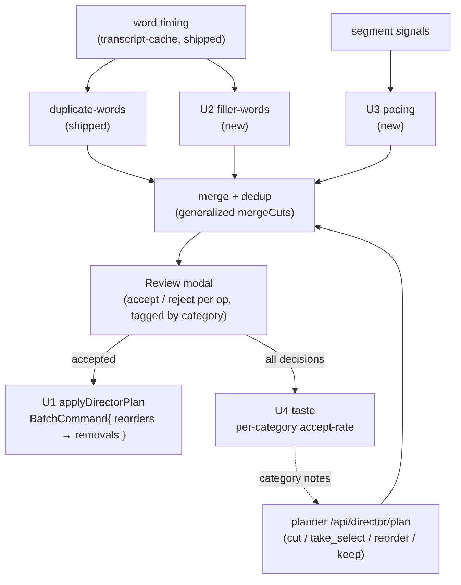

# feat: AI Director Round 2 — complete the text+audio cut

## Summary

The v0 AI Director ships a text+audio cut: a planner proposes typed ops, the user reviews them in a modal, accepted removals apply as one undoable `RemoveRangesCommand`, and every decision seeds a device-local taste signal. This round **finishes and extends that text+audio cut before the vision leap** — it does not add vision.

Four things: (U1) apply the `reorder` ops the planner already proposes but currently **drops** (`unappliedReorders`); (U2) **filler / false-start removal** (um, uh, restarts) reusing the word-timing pipeline shipped with duplicate-word detection; (U3) **pacing** — tighten over-long pauses the silence pass left — plus sharper take-selection; (U4) make the **taste** signal learn accept-rates **per cut category** (duplicate / filler / pacing / reorder / take), not just per op kind.

Everything routes through the existing Review modal (flagged, never auto-applied) and applies atomically (one Ctrl+Z).

---

## Problem Frame

The Director's cut is currently **removal-only and undifferentiated**:

- **Reorder is half-built.** The planner emits `reorder` ops and shows them in the modal, but `applyDirectorPlan` counts them as `unappliedReorders` and never moves anything (`apps/web/src/features/ai-generate/director/apply-plan.ts:52-73`). Accepting a reorder does nothing — a visible dead end.
- **Fillers survive.** Duplicate words now get caught (`duplicate-words.ts`), but standalone "um/uh/er", hedges ("you know", "i mean"), and false-starts are left to the LLM, which misses most of them at segment granularity. The word-timing pipeline that would catch them deterministically already exists and is only used for duplicates.
- **Pacing is coarse.** `runRemoveSilences` removes silence above a fixed threshold, but the remaining inter-sentence pauses are untightened, so a "cleaned" cut still drags.
- **Taste is undifferentiated.** The taste store aggregates by op *kind* (`cut` / `take_select` / `reorder` / `keep`), so a rejected filler cut and a rejected tangent cut both just lower "cut" accept-rate. It can't learn "this editor keeps fillers but accepts reorders."

This round closes those four gaps on the spine that already exists.

---

## Requirements

- **R1** — Accepted `reorder` ops move the timeline content from `[startSec, endSec)` to `targetStartSec`, applied **atomically with the removals as one undoable step** (single Ctrl+Z restores the pre-Director timeline).
- **R2** — Standalone filler words and short false-starts are detected from word-level timing and offered as **reviewable** `cut` ops, merged into the plan (deduped against existing removals).
- **R3** — Inter-sentence pauses beyond a target are offered as **reviewable** pacing cuts; the planner's take-selection guidance is sharpened to reduce false merges.
- **R4** — Every new cut type flows through the existing Review modal (accept/reject per op), is **flagged not auto-applied**, and applies through the same atomic command path as R1.
- **R5** — The taste signal learns accept/reject rates **per cut category** (duplicate, filler, pacing, reorder, take) and injects category-specific guidance into the next plan.
- **R6** — No regression to the shipped v0 flow: a plan with only LLM removals and no reorders behaves exactly as today.

---

## High-Level Technical Design

The pipeline is unchanged in shape; this round adds two deterministic detectors, an apply path for reorders, and a category dimension on taste.

**Apply ordering (U1, load-bearing).** Reorders and removals are both expressed in **original timeline coordinates** (the planner reasons over the pre-cut timeline). Applying them naively in sequence corrupts coordinates. Decision: build all moves and the removal command against the original timeline, then compose so the net effect equals "reorder, then remove" — see KTD-1.

---

## Key Technical Decisions

- **KTD-1: Atomic via `BatchCommand`, reorders before removals.** Wrap the per-reorder move command(s) and the single all-track `RemoveRangesCommand` in one `BatchCommand` (`apps/web/src/commands/batch-command.ts` — executes in order, undoes in reverse). Compose reorders first so removal ranges (original coordinates) still line up. One `BatchCommand` = one undo entry, preserving the v0 "single Ctrl+Z" guarantee.
- **KTD-2: Reorder at clip/element granularity.** A `reorder` op's `[startSec, endSec)` resolves to the timeline **elements** whose span falls within it; the move retargets those elements to `targetStartSec` via `editor.timeline.moveElements`. Sub-clip reordering (splitting a clip to move part of it) is **out of scope** (Open Question) — the planner is prompted to propose reorders on segment boundaries.
- **KTD-3: Deterministic detectors, LLM for the ambiguous.** Fillers (U2) and pacing (U3) are **curated/deterministic**, mirroring `duplicate-words.ts`: high-precision tokens only (`um, uh, er, ah, mm, hmm` + bounded hedges `you know`, `i mean`). Context-dependent words (`like`, `so`, `well`, `actually`) are **left to the LLM planner**, not the detector — avoids false positives the user has to reject.
- **KTD-4: Category tag on ops.** Add an optional `category?: "duplicate" | "filler" | "pacing" | "reorder" | "take" | "llm"` to `DirectorOp` (`packages/hf-bridge/src/author.ts`). Deterministic detectors tag their ops; LLM/sanitizer ops default by `op` kind. Taste (U4) aggregates on `category`. Absent category degrades to op-kind aggregation (back-compat).
- **KTD-5: Generalize the merge.** `mergeDuplicateCuts` (`duplicate-words.ts`) becomes a shared `mergeDetectedCuts({ planOps, extraOps })` reused by filler + pacing, dropping any detected op that overlaps an existing removal, sorted by time.

---

## Implementation Units

### U1. Apply reorder ops (finish the deferred piece)

**Goal:** accepted `reorder` ops actually move timeline content, applied atomically with removals as one undoable step.
**Requirements:** R1, R4, R6.
**Dependencies:** none (builds on shipped apply-plan).
**Files:** `apps/web/src/features/ai-generate/director/apply-plan.ts` (modify), `apps/web/src/features/ai-generate/director/__tests__/apply-plan.test.ts` (extend). Uses `@/commands/batch-command` (`BatchCommand`), `@/commands/timeline/track/remove-ranges` (`RemoveRangesCommand`), `editor.timeline.moveElements`.
**Approach:** keep the pure `planRemovalRanges` split. Add a pure `planReorderMoves({ ops, ticksPerSecond, tracks })` that resolves each `reorder` op to the affected element refs + target start (KTD-2). `applyDirectorPlan` builds the move command(s) + the `RemoveRangesCommand`, wraps them in a `BatchCommand` (reorders first, KTD-1), and executes once. Replace the `unappliedReorders` field with `reorders` (now applied). `keep` stays a no-op. When there are no reorders, behavior is byte-identical to today (R6).
**Execution note:** characterization-first — capture the current removals-only behavior, then add reorder application so R6 is provably preserved. The reorder→removal coordinate composition crosses the timeline seam — verify live.
**Patterns to follow:** the existing `applyDirectorPlan` / `RemoveRangesCommand` usage; `BatchCommand` composition; `editor.timeline.moveElements` call sites in `element-interaction-controller.ts`.
**Test scenarios:**
- Pure `planReorderMoves`: a reorder op over a span resolves to the elements within it and their new start times; an op whose target equals its start yields no move.
- Removals-only plan (no reorders) produces exactly the v0 `RemoveRangesCommand` result and `reorders: 0` (Covers R6).
- A plan with reorder + cut applies as ONE `BatchCommand` — a single undo restores the original timeline (elements back, ranges restored).
- Reorder with no removals still applies the move and is undoable in one step.
- Empty / all-`keep` plan applies nothing.
**Verification:** accepting a reorder in the modal moves the content to the target; one Ctrl+Z fully restores; a removals-only plan is unchanged from v0.

### U2. Filler / false-start removal

**Goal:** detect standalone fillers and short false-starts from word timing and offer them as reviewable cuts, merged into the plan.
**Requirements:** R2, R4.
**Dependencies:** U1 (so accepted filler cuts apply through the same atomic path — though filler cuts are plain removals and work with the v0 path too).
**Files:** `apps/web/src/features/ai-generate/director/filler-words.ts` (new, pure), `apps/web/src/features/ai-generate/director/__tests__/filler-words.test.ts` (new), `apps/web/src/features/ai-generate/director/duplicate-words.ts` (extract shared `mergeDetectedCuts`, KTD-5), `apps/web/src/features/ai-generate/director/run-director.ts` (wire in).
**Approach:** mirror `duplicate-words.ts`. `detectFillerCuts({ words })` → `DirectorOp[]` (op `cut`, `category: "filler"`): cut single-token fillers from a curated high-precision set and bounded multi-word hedges matched on a sliding window; cut a false-start when a token is a prefix-fragment of the immediately following token within a short gap (e.g. "th- the"). Confidence scales with certainty (a bare "um" higher than a hedge). Tag every op `category: "filler"` (KTD-4). `run-director` calls it alongside `detectDuplicateWordCuts` and folds results in via the generalized `mergeDetectedCuts` (KTD-5).
**Execution note:** test-first — this is pure detection logic; write the table of accept/skip cases before the detector (mirror `duplicate-words.test.ts`).
**Patterns to follow:** `duplicate-words.ts` (normalize, allow/curated sets, `dupOpId` stable id, op shape) and its test file; `run-director.ts` merge-and-`openWith`.
**Test scenarios:**
- Cuts a standalone "um" / "uh" / "er"; the op carries `category: "filler"`.
- Matches a bounded multi-word hedge ("you know") across two word tokens.
- A prefix-fragment false-start ("th- the") cuts the fragment, keeps the completed word.
- Does NOT cut context-dependent words ("like", "so", "well") — left to the LLM (KTD-3).
- A filler cut overlapping an existing LLM removal is dropped by `mergeDetectedCuts`.
- `mergeDetectedCuts` keeps non-overlapping detected ops and returns them in time order (Covers R4).
**Verification:** running the Director on talking-head footage surfaces filler cuts in the modal, labeled and rejectable; accepting them removes the fillers in one undoable step.

### U3. Pacing tightening + take-selection polish

**Goal:** offer reviewable cuts that tighten over-long inter-sentence pauses, and sharpen the planner's take-selection so it merges fewer wrong takes.
**Requirements:** R3, R4.
**Dependencies:** U2 (shares `mergeDetectedCuts`).
**Files:** `apps/web/src/features/ai-generate/director/pacing.ts` (new, pure), `apps/web/src/features/ai-generate/director/__tests__/pacing.test.ts` (new), `apps/web/src/features/ai-generate/director/run-director.ts` (wire in), `packages/hf-bridge/src/author.ts` (take-selection prompt sharpening).
**Approach:** `detectPacingCuts({ segments, targetGapSeconds, minGapSeconds })` → `DirectorOp[]` (`category: "pacing"`): for each inter-segment gap larger than `minGapSeconds` (beyond what silence-removal already trimmed), propose a cut that shortens the gap down to `targetGapSeconds` (cut the *excess* dead air, not the whole gap). Uses the segment timing already in the signal table. Take-selection: tighten the `author.ts` planner prompt so `take_select` only fires on high-alignment duplicate takes of the *same line* (origin KTD6), reducing false merges — prompt + confidence-threshold change, not new control flow.
**Execution note:** test-first for the pure `detectPacingCuts`; the prompt change is verified live (LLM output isn't unit-testable).
**Patterns to follow:** `duplicate-words.ts` op construction; the signal-table segment shape in `build-signal-table.ts`; the planner prompt block in `author.ts` (`buildDirectorPrompt`).
**Test scenarios:**
- A 1.2s inter-segment gap with `target 0.4 / min 0.8` yields a cut of the ~0.8s excess (not the whole gap).
- A gap under `minGapSeconds` yields no cut.
- Pacing cuts carry `category: "pacing"` and merge/dedup against removals like the others.
- Take-selection prompt change: `Test expectation: none` for the prompt text (LLM behavior, verified live); the sanitizer's existing take_select validation is unchanged.
**Verification:** the modal offers pacing cuts on a draggy cut; take_select no longer merges unrelated lines on the ROUGH_CUT repro.

### U4. Taste — per-category accept-rate learning

**Goal:** the taste signal learns accept/reject rates per cut category and injects category-specific guidance into the next plan.
**Requirements:** R5.
**Dependencies:** U2, U3 (categories exist to learn from); U1 (reorder category becomes meaningful once applied).
**Files:** `apps/web/src/features/ai-generate/director/taste.ts` (modify aggregation + note derivation), `apps/web/src/features/ai-generate/director/__tests__/taste.test.ts` (extend), `apps/web/src/features/ai-generate/director/components/director-review-dialog.tsx` (pass each op's `category` through on capture), `packages/hf-bridge/src/author.ts` (add optional `category` to `DirectorOp`; inject category notes into the prompt's preferences slot).
**Approach:** extend `aggregateDecisions` / the taste store to key stats on `category` (falling back to op kind when absent, KTD-4). `deriveTasteNote` emits per-category lines once a per-category sample threshold is met ("frequently REJECTS filler cuts — be conservative with fillers"; "frequently ACCEPTS reorders"). `noteReviewDecisions` records `(category, accepted)` per reviewed op (the modal already iterates every op). `buildDirectorTasteNote` strings the category notes into the prompt preferences slot alongside the existing notes. Thresholds start at the shipped ≥2 samples / ≥50% and tune later.
**Execution note:** test-first for the aggregation + note-derivation (it is the ground-truth signal source; matches the v0 taste posture).
**Patterns to follow:** the shipped `taste.ts` (`aggregateDecisions`, `deriveTasteNote`, zustand+persist), `preference-store.ts` (`buildPreferenceNotes` injection precedent).
**Test scenarios:**
- After ≥2 rejected `filler` cuts, the note includes a filler-conservative line; below threshold it does not.
- Accepting all `reorder` ops contributes a positive reorder signal, not a no-op.
- A mix of accepted duplicates + rejected fillers produces two distinct category lines.
- An op with no `category` aggregates under its op kind (back-compat with stored v0 history).
- Clearing taste empties the per-category notes.
**Verification:** rejecting fillers across two runs makes the next plan propose fewer fillers (category note present in the request body / fewer filler ops).

---

## Alternatives Considered

- **Apply reorders as raw timeline splices (sub-clip).** Rejected for this round: splitting clips to move arbitrary `[start,end)` spans is the bulk of the complexity and the source of dropped/duplicated-element corruption (origin risk). Clip-granularity reorder (KTD-2) covers the common "move this sentence" case; sub-clip is an Open Question.
- **LLM-only fillers / pacing.** Rejected (KTD-3): the LLM misses fillers at segment granularity (the exact gap that motivated word-level duplicate detection) and is nondeterministic. Deterministic detectors on the existing word/segment timing are precise and free; the LLM keeps the *ambiguous* calls.
- **Per-op-kind taste only (status quo).** Rejected: it can't distinguish a rejected filler from a rejected tangent, so it can't learn the editor's actual preferences — the whole point of the taste loop.
- **Jump straight to the vision upgrade.** Deferred by the user's choice this round — the text+audio cut is finished and polished first; vision is the next round (its own plan).

---

## Risks & Mitigations

- **Reorder + removal coordinate corruption.** → All ops in original coordinates; `BatchCommand` with reorders composed before removals (KTD-1); explicit one-undo test (U1). Clip-granularity only (KTD-2).
- **Filler/pacing false positives annoy the user.** → Deterministic high-precision sets only; ambiguous words left to the LLM (KTD-3); everything review-flagged (R4); taste learns to back off (U4).
- **`DirectorOp.category` ripples through hf-bridge types.** → Optional field, defaults by op kind; absent category degrades gracefully (KTD-4). No change to the schema the LLM must satisfy (category is client-assigned).
- **v0 regression.** → R6 + the removals-only characterization test (U1); the merge generalization keeps the duplicate path's behavior.

---

## Dependencies / Prerequisites

- Shipped on `feat/director-dupword`: the word-timing pipeline (`wantWords`), `duplicate-words.ts` + `mergeDuplicateCuts`, the Review modal, `applyDirectorPlan` / `RemoveRangesCommand`, the taste store.
- `BatchCommand` (`apps/web/src/commands/batch-command.ts`) and `editor.timeline.moveElements` — both present.
- No new model or external dependency — text+audio only (vision is the next round).

---

## Open Questions (execution-time)

- **Reorder granularity at clip edges.** Exactly which elements a `reorder` span claims when it partially overlaps a clip (whole-clip-if-majority vs. require full containment) — decide against real assembled timelines in U1.
- **Filler curated set + false-start aggressiveness.** The precise token set and prefix-fragment gap threshold — tune against the ROUGH_CUT repro to balance recall vs. false positives.
- **Pacing targets.** `targetGapSeconds` / `minGapSeconds` defaults — tune live; likely expose later in Settings alongside the silence threshold.
- **Category persistence migration.** Whether stored v0 taste history (op-kind keyed) should be migrated or left to age out — default: leave it, new decisions are category-keyed, old ones degrade under op kind (KTD-4).

---

## Sources & Research

- v0 Director plan: `docs/plans/2026-06-17-001-feat-v0-ai-director-plan.md` (the spine this extends; reorder-granularity open question originates there).
- Multimodal/vision roadmap: `docs/plans/2026-06-15-002-feat-ai-director-multimodal-plan.md` (the *next* round; explicitly out of scope here).
- Shipped code grounding (all read for this plan): `apply-plan.ts` (`unappliedReorders`), `duplicate-words.ts` (detector + merge pattern), `batch-command.ts` (atomic undo), `taste.ts` (per-kind aggregation), `run-director.ts` (detect→merge→openWith wiring).
