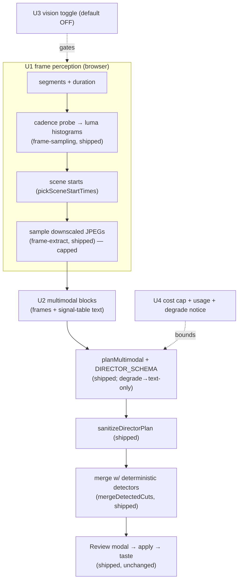

# feat: AI Director vision v0 (cuts get eyes) + compositor-pool instrumentation

## Summary

Two independent tracks the user chose together for the next round.

**Track A — Vision v0 (the headline).** The Director cuts well from the transcript + audio, but it's blind: it can't tell a sharp talking-head take from off-screen footage, a frozen frame, or visual dead-air. This wires the **already-built-but-unused** frame foundations (`frame-sampling.ts` scene detection + `frame-extract.ts` decode) into the planner via the **already-built** `planMultimodal`, so the Director's CUTS get visually aware — keep A-roll, cut visual dead-air / off-screen / low-information moments — as new reviewable ops. **Opt-in, cost-capped, and additive**: with vision off (the default) the text-only path is byte-unchanged, and a vision-incapable backend degrades to text-only with a notice. B-roll *insertion* (sourcing + placing clips) is explicitly the *next* round.

**Track B — #6 stutter instrumentation (measure-first).** The playback stutter is root-caused to the Rust compositor's unbounded GPU texture pool, but the verifier downgraded it (likely plateaus, not a true progressive climb). Before changing Rust blind, this **instruments** the pool size and surfaces it in the render-perf readout so a long-session trace can confirm whether it's the dominant cause. The cap/evict **fix is deferred**, gated on that trace.

---

## Problem Frame

- **The Director can't see.** `planDirector` reasons over a text signal table only. Footage where the speaker walks off-frame, the screen freezes, or a long low-information visual plays reads as normal speech to the planner — so it keeps dead weight a human editor would cut. The frame pipeline to fix this (`frame-sampling.ts`, `frame-extract.ts`) and the multimodal dispatch (`planMultimodal`, image-capped + degrade-aware) **already exist and ship unused** — this round connects them.
- **Vision is expensive and not universal.** Frames dominate token cost and not every auth backend accepts images (`planMultimodal` returns `degraded: true` then). So vision must be opt-in, frame-capped, cost-surfaced, and must never break or regress the shipped text-only cut.
- **The stutter fix would be a blind Rust change.** The texture-pool cap is plausible but unconfirmed as the *progressive* cause; shipping it without measurement risks fixing the wrong axis. The pool size isn't currently observable.

---

## Requirements

- **R1** — With vision ON, the Director samples frames (scene-aware, capped at the multimodal image limit) and sends them + the transcript signal table to `planMultimodal`.
- **R2** — The vision planner identifies visual dead-air (off-screen / frozen / low-information) and keeps A-roll, emitting **reviewable** `cut` / `keep` ops tagged `category: "vision"`.
- **R3** — Vision is OPT-IN (Settings → AI toggle, default OFF). With vision off the text-only path is byte-unchanged; a vision-incapable backend degrades to text-only with a user notice — never a failure.
- **R4** — Frame cost is bounded (image cap + scene-aware sampling), and the vision run's token usage is surfaced to the user.
- **R5** — Vision ops flow through the existing Review modal (flagged, atomic apply, per-category taste) — additive to the cut spine, no new apply/undo model.
- **R6** — The compositor texture-pool size is instrumented and surfaced via the render-perf readout, so a long-session trace can confirm (before any Rust fix) whether the pool is the dominant stutter cause.

---

## High-Level Technical Design

Track A reuses the entire shipped cut spine; only the *planner input* gains frames.

**Degrade ladder (R3).** vision OFF → today's `planDirector` (text-only), unchanged. vision ON + backend takes images → `planMultimodal` with frames. vision ON + backend can't (`degraded: true`) → text-only result + a one-line "vision unavailable, used text" notice. Any frame-sampling/decode error → caught, text-only, notice. The cut never fails because vision was requested.

---

## Key Technical Decisions

- **KTD-1: Reuse the spine; only the planner input changes.** Frames feed the *planner*; the schema (`DIRECTOR_SCHEMA`), sanitizer, merge (`mergeDetectedCuts`), apply (`BatchCommand`), modal, and taste are all untouched. Vision ops are ordinary `cut`/`keep` ops with `category: "vision"`.
- **KTD-2: `planDirector` gains optional frames, routing to `planMultimodal`.** When frames are present, build `MultimodalBlock[]` (images + the existing signal-table text + a vision prompt addendum) and call `planMultimodal`; else the text-only `planJson` path exactly as today. One planner, two input modes — no parallel pipeline.
- **KTD-3: Scene-aware, capped sampling.** Sample at scene starts (`pickSceneStartTimes`) plus segment midpoints, downscaled to `DEFAULT_MAX_LONG_EDGE` (768) JPEGs, hard-capped at `MAX_MULTIMODAL_IMAGES` (20). Frames are the cost driver; the cap + scene-awareness bound it without a dense uniform sample.
- **KTD-4: Opt-in, default OFF.** A `directorVisionEnabled` flag in the AI settings store (default false). Vision costs money and isn't universal; the user opts in. Off = today's behavior, provably.
- **KTD-5: Vision is a NEW op category, not a new op kind.** Visual cuts are `cut` ops with `category: "vision"` (and keeps with `category: "vision"`), so per-category taste (shipped U4) learns the user's trust in vision cuts separately. No schema change.
- **KTD-6 (Track B): Instrument before fixing.** Add a pool-size counter through the existing perf path; do NOT cap/evict until a captured trace shows the pool climbs over a session. Requires a wasm rebuild (`bun run build:wasm`) and the runtime to consume the rebuilt pkg — an execution-time dependency to confirm first.

---

## Implementation Units

### Phase A — Vision v0 (cuts get eyes)

### U1. Director frame perception

**Goal:** compose the shipped frame foundations into a capped, scene-aware set of sampled frames for the current timeline.
**Requirements:** R1, R4.
**Dependencies:** none (foundations exist).
**Files:** `apps/web/src/features/ai-generate/director/director-frames.ts` (new — the selection/orchestration over the shipped decode), `apps/web/src/features/ai-generate/director/__tests__/director-frames.test.ts` (new). Reuses `frame-sampling.ts` (`cadenceSampleTimes`, `lumaHistogram`, `pickSceneStartTimes`, `frameSize`, `clampSampleTimes`) and `frame-extract.ts` (decode).
**Approach:** pure `selectFrameTimes({ segments, durationSec, sceneStartTimes, maxImages })` → the times to sample (scene starts ∪ segment midpoints, deduped, clamped, truncated to `maxImages` keeping a spread). The browser shell `sampleDirectorFrames({ editor, segments, signal })` runs the coarse cadence probe + histogram scene detection (frame-extract decode) → `selectFrameTimes` → decodes the final downscaled JPEG `FrameSample[]`. The pure time-selection is unit-tested; the decode is browser-only (live-verify).
**Execution note:** test-first for `selectFrameTimes` (pure); mirror `frame-sampling.test.ts`.
**Patterns to follow:** `frame-sampling.ts` (pure math + exported constants), `run-director.ts` (the assemble→transcribe spine that already extracts audio — frames slot in beside it).
**Test scenarios:**
- `selectFrameTimes` includes every scene start and each segment midpoint, deduped and sorted.
- Over `maxImages`, it truncates to a spread (first/last retained), not a dense prefix.
- Empty segments / zero duration → `[]` (or `[0]` per the cadence floor), no throw.
- Times past duration clamp to the end (reuses `clampSampleTimes`).
**Verification:** running with vision on samples a handful of representative frames (scene changes + per-segment), never more than the cap.

### U2. Vision-capable Director planner

**Goal:** `planDirector` accepts frames and routes them through `planMultimodal`, prompting the model to judge visual quality; output is the same typed `DirectorPlan`.
**Requirements:** R1, R2, R3.
**Dependencies:** U1.
**Files:** `packages/hf-bridge/src/author.ts` (extend `planDirector` with optional `frames`; build `MultimodalBlock[]`; add the vision prompt addendum), `packages/hf-bridge/src/__tests__/` (planner unit test for the block-building + degrade), `apps/web/src/app/api/director/plan/route.ts` (accept frames in the body, typed-guarded).
**Approach:** when `frames` are present, build blocks = `[...frames as image blocks, { type: "text", text: signalTablePrompt + visionAddendum }]`, call `planMultimodal` (which caps images + may report `degraded`), then `sanitizeDirectorPlan` on the result exactly as the text path does. The vision addendum instructs: use the frames to find visual dead-air (off-screen, frozen, slate/black, low-information), keep sharp A-roll, and mark obvious cutaways — all as `cut`/`keep` with the existing fields. Tag emitted ops `category: "vision"` client-side after planning (the LLM doesn't set category — KTD-5). `degraded: true` → return the text-only plan + a `degraded` flag the caller surfaces (R3).
**Patterns to follow:** the shipped `planDirector` (`buildDirectorPrompt`, `DIRECTOR_SCHEMA`, `sanitizeDirectorPlan`), `planMultimodal` + `partitionMultimodalBlocks` (image cap + degrade), the route's `unknown`+guard body parsing (no `as`).
**Test scenarios:**
- With frames, the planner builds image blocks + one text block and calls the multimodal path; without frames it calls the text path (no images).
- Block building truncates at `MAX_MULTIMODAL_IMAGES` (delegated to `partitionMultimodalBlocks`) — no silent over-send.
- A `degraded: true` multimodal result yields a valid text-only `DirectorPlan` + the degrade flag (Covers R3).
- Route: a body with frames is parsed via guards (no `as`); a malformed frames array → 400, not a crash.
**Verification:** a Director run with vision on returns a plan whose cut reasons reference visual content; a vision-incapable backend returns a text-only plan without error.

### U3. Vision opt-in + orchestration

**Goal:** a Settings toggle (default off) gates vision; `run-director` samples frames and sends them only when vision is on and supported; vision ops surface in the modal.
**Requirements:** R3, R5.
**Dependencies:** U1, U2.
**Files:** `apps/web/src/features/ai-generate/store.ts` (add `directorVisionEnabled`, default false, persisted), `apps/web/src/features/ai-generate/components/ai-settings.tsx` (the toggle UI), `apps/web/src/features/ai-generate/director/run-director.ts` (sample frames + send when enabled), `apps/web/src/features/ai-generate/director/components/director-review-dialog.tsx` (a "vision" badge on vision-category ops).
**Approach:** mirror the existing AI-settings flags (`backgroundTranscriptionEnabled`). `run-director`: after building the signal table, if `directorVisionEnabled`, call `sampleDirectorFrames` (U1) and pass the frames to the route; else exactly today's text-only POST. The route forwards frames to `planDirector` (U2). The merged plan opens the modal as before; vision-category ops get a small badge. With the flag off, `run-director`'s request body is identical to today (R3 — no regression).
**Patterns to follow:** `store.ts` `backgroundTranscriptionEnabled` (flag shape), `ai-settings.tsx` (`SelfLearningSection` toggle pattern), `run-director.ts` (the POST), `director-review-dialog.tsx` (`OP_BADGE`).
**Test scenarios:**
- `Test expectation: none` for the toggle store field (covered by the existing store tests' shape) — but assert in run-director's request-building that frames are omitted when the flag is off (a small pure helper if extracted).
- With vision on, the request body carries frames; with it off, the body equals the text-only shape.
- A vision op renders the "vision" badge; non-vision ops are unchanged.
**Verification:** toggling Settings → AI → Director vision changes whether frames are sent; off behaves exactly like the shipped Director.

### U4. Cost cap + usage surfacing + degrade notice

**Goal:** bound and surface vision cost; tell the user when vision silently fell back to text.
**Requirements:** R3, R4.
**Dependencies:** U2, U3.
**Files:** `apps/web/src/features/ai-generate/director/run-director.ts` (read `usage` + `degraded` from the response; toast), `apps/web/src/app/api/director/plan/route.ts` (return `usage` + `degraded`).
**Approach:** the route already returns `{plan, usage}`; add `degraded`. `run-director` surfaces vision token usage in the progress/finish path (a quiet "vision: N frames, ~M tokens" line) and, when `degraded`, a one-line toast "Vision unavailable on this model — used the transcript." The frame cap (`MAX_MULTIMODAL_IMAGES`) + scene sampling (U1) are the hard cost bound; no per-token budget UI in v0 (deferred).
**Patterns to follow:** the shipped route's `{plan, usage}` return; the AI-CUT progress/toast in `ai-cut-menu.tsx` / `run-director.ts`.
**Test scenarios:**
- Route returns `degraded` alongside `plan`/`usage`; a degraded response triggers the text-fallback notice (assert the branch in a small pure formatter if extracted).
- Usage is read from the response and shown; absent usage doesn't crash the toast.
**Verification:** a vision run shows the frame/token line; a model without vision shows the fallback notice and still applies a text cut.

### Phase B — #6 stutter instrumentation (measure-first)

### U5. Compositor texture-pool instrumentation

**Goal:** make the GPU texture-pool size observable per frame so a long-session trace can confirm whether it's the dominant stutter cause — before any cap/evict.
**Requirements:** R6.
**Dependencies:** none (independent of Phase A).
**Files:** `rust/crates/compositor/src/texture_pool.rs` (a size readout: total `available` count + per-`(w,h)` bucket lengths), `rust/wasm/src/perf.rs` (expose it through the existing `getLastFrameProfile`/perf record), `apps/web/src/diagnostics/render-perf.ts` (print pool size per frame when `window.__renderPerf = true`).
**Approach:** add a non-allocating size query to `TexturePool`, thread it into the per-frame perf profile the wasm already emits, and render it in the existing `render-perf` readout. **No behavior change** — read-only instrumentation. **Execution dependency (KTD-6):** this requires `bun run build:wasm` and the dev server to consume the rebuilt `rust/wasm/pkg` rather than the pinned `opencut-wasm` npm package — confirm that wiring first; if the runtime can't pick up a local wasm build in this worktree, this unit is blocked and must be done where the wasm build is consumed.
**Execution note:** characterization/observation-only — add the readout, change no compositor behavior.
**Patterns to follow:** the existing perf record in `rust/wasm/src/perf.rs` and its consumer `apps/web/src/diagnostics/render-perf.ts`.
**Test scenarios:** `Test expectation: none` — Rust read-only instrumentation not unit-tested here; **verification is live**: `window.__renderPerf = true` prints a pool-size number that grows as you scrub over busy regions.
**Verification:** the render-perf output includes the pool size; scrubbing a complex composite shows it change.

---

## Alternatives Considered

- **B-roll insertion in v0.** Deferred (user's explicit choice): B-roll *insertion* needs a B-roll **source** (a stock/library integration or generated footage) plus overlay placement — its own multi-round build. v0 makes the *cut* see; insertion is next.
- **Always-on vision (no toggle).** Rejected (KTD-4): frames dominate cost and not every backend takes images; opt-in keeps the default cheap and the text path provably unchanged.
- **A separate vision planner/pipeline.** Rejected (KTD-2): forking the planner doubles the surface. Frames as an optional input to `planDirector` reuses the schema, sanitizer, merge, apply, and taste wholesale.
- **Ship the texture-pool cap now (skip instrumentation).** Rejected (KTD-6): the verifier downgraded the pool from "the cause" to "a fast-plateauing leak". Capping blind risks fixing the wrong axis; instrument and measure first.

---

## Risks & Mitigations

- **Vision regresses or breaks the text cut.** → Opt-in default-off (KTD-4); frames are an *optional* planner input (KTD-2); degrade ladder catches a vision-incapable backend AND any frame error → text-only + notice (R3). Off ⇒ identical request body (U3 test).
- **Frame cost blows up.** → Hard image cap (`MAX_MULTIMODAL_IMAGES`) + scene-aware sampling (KTD-3); usage surfaced (U4).
- **Frame decode is slow/janky on long timelines.** → Coarse cadence probe + scene detection samples sparsely, not densely; runs once per Director invocation (not per frame). Tune the cadence against real footage (Open Question).
- **Track B can't run in this worktree** (pinned npm wasm vs local build). → Flagged as a Phase-B execution dependency (KTD-6); if the runtime won't consume a local wasm build, U5 is blocked and the trace must be captured wherever the wasm build is live.

---

## Dependencies / Prerequisites

- Shipped + reused: `frame-sampling.ts`, `frame-extract.ts`, `planMultimodal` (+ `partitionMultimodalBlocks`, image cap, degrade), `DIRECTOR_SCHEMA`/`sanitizeDirectorPlan`, the review modal, `mergeDetectedCuts`, per-category taste, the `/api/director/plan` route.
- A vision-capable auth/model for the live path (else `degraded` → text-only). `claude-code` sufficiency for vision is an Open Question to confirm live.
- Track B: a consumable local wasm build (`bun run build:wasm` → runtime uses `rust/wasm/pkg`).

---

## Open Questions (execution-time)

- **Frame cadence + scene threshold defaults** — `DEFAULT_CADENCE_SEC` (2s) and `DEFAULT_SCENE_THRESHOLD` (0.35) are starting points; tune against real footage for recall vs. cost.
- **Per-segment frame budget vs. global cap** — how to spread the 20-image cap across many segments (one per scene? round-robin?) — decide in U1 against real timelines.
- **Vision on `claude-code` auth** — does the default dispatch accept images, or does it always `degrade`? Confirm live; if it degrades, vision needs an API-key model (surface that in the toggle's help text).
- **Track B wasm wiring** — whether the dev server consumes a local `rust/wasm/pkg` rebuild or the pinned `opencut-wasm` npm package; settle before U5 (blocks the instrumentation if it's the latter).

---

## Sources & Research

- Multimodal/vision roadmap origin: `docs/plans/2026-06-15-002-feat-ai-director-multimodal-plan.md` (the full multimodal scope this v0 right-sizes).
- The cut spine this extends: `docs/plans/2026-06-18-001-feat-director-round2-complete-cut-plan.md` (per-category taste, `mergeDetectedCuts`, the apply/modal model).
- Code grounding (read for this plan): `frame-sampling.ts` (scene detection + sizing, built/tested), `frame-extract.ts` (decode shell), `author.ts` `planMultimodal`/`partitionMultimodalBlocks`/`MAX_MULTIMODAL_IMAGES`/degrade, `run-director.ts` (the spine frames slot into).
- Track B root cause: the round-2 diagnosis of the compositor texture pool (`rust/crates/compositor/src/texture_pool.rs`) — instrument-first per the verifier's downgrade.
