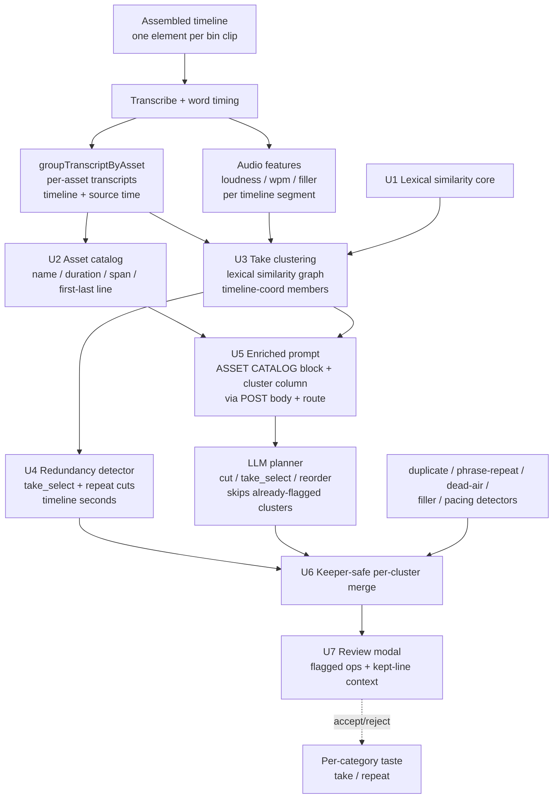
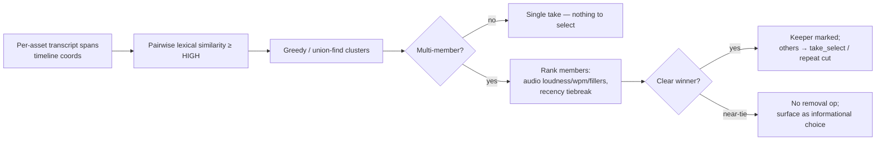

# feat: Director asset-context model + repeat-aware cut quality

## Summary

Give the AI Director a real model of the **asset bin** — per-clip summaries plus **take clusters** that recognize when several of the user's clips (or far-apart spans within one) cover the same line — and add a deterministic **lexical-similarity redundancy layer** that catches the repeats today's pipeline leaves in: **far-apart and cross-clip near-verbatim repeats** (which the verbatim ≤60s detector cannot see) and the **two-takes-of-one-line** case. True paraphrase (same point, *few* shared words) is explicitly the LLM channel's job, not the lexical layer's — the new signals also feed an enriched LLM prompt (asset catalog + a similarity/cluster column) so the Director's own cut decisions stop relying on eyeballing an opaque, flattened table.

Everything stays **review-gated** (nothing auto-trims), **text-only** (runs on every auth mode), and **offline** (pure-local lexical similarity, no new dependencies, no model download).

**In scope:** asset catalog the planner reasons over; lexical take-clustering + cross-take best-take selection; far-apart/cross-clip redundancy detection; LLM-prompt enrichment; review-modal surfacing of take/repeat decisions. **Out of scope:** A-roll/B-roll role classification + B-roll overlay (their own arc), local-embedding similarity (the documented dial for true paraphrase recall), the keep-side "detect the necessary parts" highlight arc (separate plan per the handoff), and any auto-apply of cuts.

---

## Problem Frame

The Director already assembles → removes silence → transcribes → fuses audio/source signals → emits a typed-op plan reviewed in a modal (`apps/web/src/features/ai-generate/director/run-director.ts`). But its understanding of *what footage it is cutting* is thin, and that is exactly where repeats leak through.

- **The asset model is a 6-char hash.** The planner's only asset awareness is `src` per signal-table row — `s.assetId.slice(0, 6)` in `renderSignalTable` (`packages/hf-bridge/src/author.ts:522`). The LLM sees an opaque token like `a3f9c2` per line, with no clip name, duration, or grouping beyond the repeated token.
- **Take context is built but unused.** `groupTranscriptByAsset` in `apps/web/src/features/ai-generate/director/source-map.ts` produces exactly the per-asset transcript view a take-selector needs — and `run-director.ts` never calls it. Cross-take comparison is half-wired.
- **Repeat detection has a structural gap.** `duplicate-words.ts` catches adjacent doubled words; `phrase-repeat.ts` catches **verbatim** ≥4-token n-grams **≤60s apart** and deliberately stops there (a far-apart repeat "reads as a deliberate callback/recap, not a restart"). So a line restarted near the end of a clip, or recorded again in a *separate* take clip, is invisible to the deterministic layer — and the LLM is asked to spot "near-identical text across different src" unaided (`buildDirectorPrompt`, `author.ts:546`), with **no similarity signal anywhere** in the system to lean on. That is the leak.

The user's report confirms the failure modes: with **several take clips** in the bin, **repeats survive** and **two takes of one line are kept instead of deduped**. The fix is to (1) build a genuine asset model and (2) add the missing similarity layer for the *far-apart and cross-clip* cases — and surface both to the deterministic backstop and the LLM. `assembleBinToTimeline` (`apps/web/src/features/editing/assemble.ts`) lays each bin clip as its own main-track element, so per-asset attribution and cross-take clustering are feasible from existing primitives.

**A note on paraphrase.** A true paraphrase ("revenue doubled" vs. "sales jumped") shares few content words and scores low under any bag-of-words measure — so the lexical layer is *not* the mechanism for it. Catching genuine paraphrase is the enriched-LLM channel's responsibility (R5/U5), with local embeddings as the documented escalation (KTD1) if real footage shows that channel is insufficient.

---

## Requirements

Traceability is to the request and the cut-side direction in `docs/HANDOFF-ai-director-cut-quality.md` (no upstream brainstorm doc).

- **R1 — Asset catalog.** The Director builds a per-asset summary (name, duration, timeline span, segment count, first/last line, aggregate audio quality) for every clip in the assembled timeline and surfaces it in the LLM prompt, so the planner's `cut`/`take_select` judgment is grounded in asset identity rather than an opaque hash.
- **R2 — Take clustering.** Clips/spans covering the same content are grouped into take clusters via deterministic lexical similarity (verbatim and near-verbatim members; time-agnostic, unlike the ≤60s window).
- **R3 — Cross-take selection.** Within a multi-member cluster, the strongest take is identified (audio features + recency) and the redundant takes are flagged for removal, **review-gated, never auto-trimmed**, behind a high-similarity guard.
- **R4 — Far-apart & cross-clip redundancy.** Near-verbatim restatements that the ≤60s verbatim detector cannot see — far apart within one stream, or split across separate take clips — are detected and flagged, keeping the clearest instance. (True paraphrase is handled by the LLM channel per R5, not this deterministic layer.)
- **R5 — LLM context enrichment.** The planner prompt includes the asset catalog and a per-segment cluster annotation, so the LLM's judgment — including the paraphrase cases the deterministic layer cannot reach — is grounded in precomputed signals rather than eyeballing.
- **R6 — Reviewable & reversible.** Every new op surfaces in the Review modal with its similarity + kept-take rationale (kept line visible, not just an asset name); nothing auto-applies; the existing single-`BatchCommand` apply/undo path is unchanged.
- **R7 — Offline, text-only, dependency-free.** Lexical similarity is pure-local; the feature runs on every auth mode; honors BRIEF Hard Rule 1 (sanctioned dirs, no `PATCHES.md`) and Hard Rule 4 (no telemetry leaves the device).
- **R8 — Precision & callback guard.** Over-cut / false-merge risk is bounded: a high similarity threshold, an audio+recency margin for take selection, conservative defaults, **no removal op for a near-tie** (surfaced as an informational choice instead), and **low confidence on far-apart same-asset matches** (a deliberate callback/recap must not be confidently flagged as a repeat).
- **R9 — Validation gate.** Before Phase C invests in prompt enrichment, the deterministic layer's recall and precision are validated against a hand-labeled duplicate count on the user's real footage (see Success Metrics / TO-VERIFY) — the go/no-go on whether lexical similarity suffices or the embedding dial is needed.

**Success criteria:** on the user's multi-take footage, one "AI Director" run clusters the takes, marks the best of each, flags the far-apart/cross-clip repeats the current build leaves in, and the reviewed cut has fewer surviving duplicates measured against a hand-labeled baseline — with each take/repeat decision shown with enough context (kept line vs. cut line, similarity) to vet in the modal.

---

## High-Level Technical Design

The new work layers onto the existing assemble→silence→transcribe→fuse→plan spine. Two new stages (catalog, clusters) sit between fusion and planning; their output flows to both the deterministic detector merge and the enriched prompt. Coordinates are **timeline seconds end-to-end** (KTD2). These diagrams are authoritative for the data flow; per-unit fields give the integration specifics.



**Take-cluster → keeper selection** (U3/U4), the core of the cross-take fix:



---

## Output Structure

New code lands in `apps/web/src/features/ai-generate/director/` (sanctioned by BRIEF Hard Rule 1 — no `PATCHES.md`). Greenfield files:

```
apps/web/src/features/ai-generate/director/
  text-similarity.ts        # U1 — pure lexical similarity primitives
  asset-catalog.ts          # U2 — per-asset summaries the planner reasons over
  take-clusters.ts          # U3 — similarity-graph take clustering + keeper ranking
  redundancy.ts             # U4 — clusters → take_select / repeat cut ops (timeline seconds)
  __tests__/
    text-similarity.test.ts
    asset-catalog.test.ts
    take-clusters.test.ts
    redundancy.test.ts
    merge-detected-cuts.test.ts   # U6 — keeper-safe per-cluster merge
```

Modified (existing, all ours — authoritative per-unit `Files:` sections below):
- `apps/web/src/features/ai-generate/director/build-signal-table.ts` (U5 — cluster annotation)
- `apps/web/src/features/ai-generate/director/run-director.ts` (U6 — orchestration + POST body)
- `apps/web/src/features/ai-generate/director/cut-utils.ts` (U6 — keeper-safe merge)
- `apps/web/src/features/ai-generate/director/components/director-review-dialog.tsx` (U7)
- `apps/web/src/app/api/director/plan/route.ts` (U5/U6 — parse + forward the catalog)
- `packages/hf-bridge/src/author.ts` (U5 — `DirectorSegment` fields, `renderSignalTable`, `renderAssetCatalog`, `buildDirectorPrompt`, `planDirector`/`planDirectorVision` signatures)

The tree is a scope declaration, not a constraint. Per-unit `Files:` sections are authoritative.

---

## Key Technical Decisions

**KTD1 — Lexical similarity for *near-verbatim* repeats; embeddings are the dial for paraphrase.** Similarity is computed from normalized **content-word** token sets/multisets — Jaccard over the set plus cosine over the bag-of-words — thresholded into [0,1], with stopwords/fillers dropped so function words can't inflate a match. Its honest gain over the existing `phrase-repeat.ts` is the **time-agnostic** and **cross-asset** cases (far-apart and cross-clip near-verbatim repeats), *not* semantic paraphrase — a true paraphrase shares few content words and scores low by construction. *Rationale:* pure, wasm-free, `bun`-testable, offline, zero new dependencies; it fits the established pure-detector pattern and directly attacks "repeats survive" for the far-apart/cross-clip cases the user hits. Paraphrase recall is routed to the LLM channel (R5/U5); local sentence embeddings (reusing the in-browser `@huggingface/transformers` already loaded for Whisper) are the documented escalation behind the `similarity()` boundary if the validation gate (R9) shows paraphrase recall is still short.

**KTD2 — Timeline coordinates end-to-end.** Every cluster member, and every op the redundancy detector emits, is expressed in **timeline seconds** — the same frame the LLM signal table, `sanitizeDirectorPlan`, and `applyDirectorPlan` use (`apply-plan` multiplies `startSec * ticksPerSecond` as timeline ticks). `groupTranscriptByAsset` carries both timeline (`start`/`end`) and source (`sourceStartSec`) time; clustering uses *source* text for matching but retains each member's *timeline* span for emission. *Rationale:* the source-map helpers deliberately also produce source time; emitting a removal in source seconds would silently cut unrelated timeline footage. This is a load-bearing seam — U3/U4 state it explicitly and test it.

**KTD3 — Two channels with a clear division of labor.** The cluster signal reaches the plan as (a) deterministic, review-flagged ops (the reliable backstop for near-verbatim far-apart/cross-clip repeats) **and** (b) a prompt annotation (asset catalog + a per-segment cluster column). To avoid both channels acting on the same cluster, the prompt tells the LLM that **rows already carrying a cluster id have been flagged by the deterministic layer — do not re-emit `take_select` on them**; the LLM's job is the cases the deterministic layer cannot reach (sub-threshold similarity, true paraphrase). *Rationale:* belt-and-suspenders coverage without two actors fighting over the same span (which would amplify the keeper-disagreement risk KTD7 guards).

**KTD4 — Reuse existing `take` and `repeat` categories; add no new `DirectorOpCategory`.** Cross-take dedup → op `take_select`, category `take`; far-apart same-stream redundancy → op `cut`, category `repeat`. Both already exist in `taste.ts` and the schema. *Rationale:* avoids the 3-place category ripple and lets the existing per-category taste loop learn these decisions immediately.

**KTD5 — Review-gated; recency-aware keeper; near-ties never remove.** A take-selection cut is emitted only when cluster similarity ≥ a high threshold **and** there is a clear keeper. Keeper ranking is audio features (loudness, wpm steadiness, fewer fillers) **with recency as the tiebreak** — mirroring the existing "the LAST attempt is always the keeper" convention (loudness alone is a weak quality proxy and could discard a cleaner re-record). When there is **no clear winner** (audio margin within epsilon), the detector emits **no removal op** — it surfaces the cluster as an informational choice in the modal for the user to resolve manually. Nothing auto-applies. *Rationale:* cross-take cutting is destructive; a confidently-presented removal the rank could not justify (a coin-flip) invites the user to delete the better take on batch-accept.

**KTD6 — Cluster layer is time-agnostic, but far-apart same-asset matches default to low confidence.** `phrase-repeat.ts` keeps its ≤60s window (proximity = restart signal). The cluster layer matches across the whole video so far-apart and cross-clip repeats are caught — but a far-apart *same-asset* match is exactly where a deliberate callback/recap lives, so those are emitted at **low confidence** and the U8 precision fixtures include a callback pair the layer surfaces but does not confidently flag. *Rationale:* "repeats survive" is the far-apart/cross-clip case; reversing the 60s carve-out is justified only with the callback guard that replaces proximity as the false-positive defense.

**KTD7 — Keeper-safe, per-cluster, dedup-aware merge.** Multiple layers now emit removals over related spans, so `mergeDetectedCuts` is extended to operate **per cluster, not per span**: it (a) drops ops overlapping an existing removal (as today), (b) **never removes a span that is a cluster keeper** — applied to the LLM's ops and *all* deterministic detectors, not only the new redundancy ops, and (c) **never lets a cluster lose all its members** — when an LLM `take_select` and a deterministic `take_select` fall on *different* members of one cluster (the disagreement case), at most one removal survives and it is forced off the keeper. *Rationale:* without per-cluster reconciliation, two non-overlapping removals on one 2-member cluster delete both copies of the line, leaving zero — corrupting the content the feature exists to keep.

**KTD8 — The catalog crosses the API boundary explicitly.** `renderAssetCatalog` and the catalog-aware `buildDirectorPrompt` run **server-side** inside `planDirector` (`packages/hf-bridge/src/author.ts`), but the catalog is computed **client-side** in `runDirector`. The two are bridged only by the POST body to `/api/director/plan`. Therefore: per-segment cluster ids ride the existing `segments` body (they are optional `DirectorSegment` fields, forwarded verbatim), but the **asset-catalog block is a new wire field** that `run-director.ts` must add to the body, `apps/web/src/app/api/director/plan/route.ts` must parse/validate, and `planDirector`/`planDirectorVision` must accept and forward to `buildDirectorPrompt`. *Rationale:* the route today parses only `segments`/`totalSec`/`taste`/`frames`; a catalog computed client-side and rendered server-side is silently dropped unless the wire path is built. These are two different transport mechanisms and U5 treats them separately.

---

## Implementation Units

Grouped into phases, dependency-ordered. U-IDs are stable. Each phase maps to a VibeCut round/PR.

### Phase A — Similarity & asset model (foundations)

### U1. Lexical text-similarity core

**Goal:** Pure similarity primitives: normalize → content-word token set/multiset → `similarity(textA, textB) → [0,1]` (Jaccard ∪ cosine), plus `mostSimilar(target, candidates)`. Threshold constants (`SIMILAR`, `HIGH_SIMILAR`) exported and centrally documented.
**Requirements:** R2, R4 (foundation).
**Dependencies:** none. Reuses `normalizeWord` from `cut-utils.ts`.
**Files:** `apps/web/src/features/ai-generate/director/text-similarity.ts`, `apps/web/src/features/ai-generate/director/__tests__/text-similarity.test.ts`.
**Approach:** tokenize via `normalizeWord`; drop a small stopword + filler set; build a token multiset (cosine) and set (Jaccard); combine into a single score (cosine-leaning). Guard the small-token-set inflation case (two short sentences sharing 2-3 domain words must not score above `HIGH_SIMILAR`). Pure + wasm-free.
**Patterns to follow:** `normalizeWord`/`stableCutId` in `cut-utils.ts`; the pure-detector style of `phrase-repeat.ts`.
**Test scenarios:**
- Happy path: identical text → 1.0; reordered same content words → high (≥ HIGH_SIMILAR).
- Near-verbatim: "the key thing here is alignment" vs "the key thing is alignment" → ≥ HIGH_SIMILAR.
- True paraphrase: "revenue doubled last quarter" vs "we saw sales jump" → low (< SIMILAR) — documents that lexical does NOT catch this (it's the LLM channel's job).
- Small-set inflation: two distinct one-line sentences sharing only a product name → below `HIGH_SIMILAR` (no divide-by-small-N false merge).
- Edge: stopword-only / empty strings → 0 with no divide-by-zero; single-word inputs handled.

### U2. Asset catalog builder

**Goal:** `buildAssetCatalog(...) → AssetCatalogEntry[]` — per clip: `assetId`, name, `durationSec`, timeline span, segment count, **first/last line**, and aggregate audio quality (mean loudness / wpm / filler share). The first/last line is the LLM-orientation signal; a synthesized "gist" is deferred (first/last line covers orientation for scripted talking-head clips — add gist only if a prompt-quality test shows take mis-selection from missing summary).
**Requirements:** R1.
**Dependencies:** consumes `groupTranscriptByAsset` (`source-map.ts`) + the parallel `SpeechFeatures[]`; pure given injected inputs.
**Files:** `apps/web/src/features/ai-generate/director/asset-catalog.ts` (+ test). Reads asset name/duration via a thin injected shape (mirroring `SourceMapElement`) so the module stays `bun`-testable without the editor/wasm.
**Approach:** attribute segments per asset via `groupTranscriptByAsset`; join with asset name/duration and the parallel features array (by segment start time); aggregate audio per asset. Keep it a pure function over injected inputs — no `editor` import.
**Patterns to follow:** `groupTranscriptByAsset` in `source-map.ts`; the injected-shape testability pattern (`SourceMapElement`, the wasm-free `TICKS_PER_SECOND` const).
**Test scenarios:**
- Happy path: a 2-clip timeline → 2 entries with correct names, spans, segment counts, first/last line, ordered by first appearance.
- Edge: a clip whose segments all fall in a gap (no attribution) → omitted or zero-segment entry, no throw.
- Edge: an asset with no audio features → catalog still builds with audio fields omitted.

### U3. Take clustering

**Goal:** `buildTakeClusters(...) → TakeCluster[]` — cluster transcript spans covering the same content via U1 similarity; rank members by audio + recency and mark a keeper; tag each cluster cross-asset (`take`) vs same-asset far-apart (`repeat`); flag near-ties and far-apart same-asset matches as low-confidence.
**Requirements:** R2, R3, R8.
**Dependencies:** U1; the per-segment `SpeechFeatures[]` (for member ranking) and the per-asset transcript spans from `groupTranscriptByAsset`. (Does **not** depend on U2's aggregate catalog — member ranking needs per-segment features, joined by start time.)
**Files:** `apps/web/src/features/ai-generate/director/take-clusters.ts` (+ test).
**Approach:** build candidate units (per-asset spans / merged consecutive segments), **each retaining its timeline `[startSec,endSec)`** (KTD2); compute pairwise similarity (U1) above `HIGH_SIMILAR` on the *text*; cluster via union-find/greedy. For each multi-member cluster, join members to their `SpeechFeatures` by start time and rank (loudness desc, wpm steadiness, fewer fillers, **recency tiebreak — prefer the later take**) → keeper; mark a near-tie (audio margin below epsilon) and any far-apart same-asset cluster as low-confidence. Bound pairwise cost: pre-bucket candidates by shared content-word overlap before scoring.
**Patterns to follow:** the pure-function-over-injected-inputs style of `source-map.ts`; audio fields from `SpeechFeatures` (`types.ts`); the "LAST attempt is the keeper" convention in `phrase-repeat.ts`.
**Test scenarios:**
- Cross-asset: two clips with a near-identical line → one cluster tagged `take`, members carry timeline spans, keeper = higher-loudness member.
- Recency tiebreak: two near-equal-audio takes → the later take is the keeper.
- Same-asset far-apart: an intro restated near the end of one clip → one cluster tagged `repeat`, marked low-confidence (callback guard).
- Near-tie: two members with equal audio → keeper marked near-tie/low-confidence (no decisive auto-pick).
- Coordinates: a cluster member's retained span equals its timeline span, not its `sourceStartSec`.
- Single-take input / cost guard: no multi-member clusters; a long no-repeat transcript does not score every pair (bucketing prunes).

### Phase B — Detection (the repeat fix)

### U4. Redundancy + take-selection detector

**Goal:** `detectRedundancyCuts(...) → { ops: DirectorOp[]; nearTies: ClusterNote[] }` — turn take clusters into review ops in **timeline seconds**: `take_select` (category `take`) over cross-asset non-keepers; `cut` (category `repeat`) over far-apart same-stream redundant spans. Each op's `reason` names the kept take + similarity; `confidence` scales with similarity and audio+recency margin. Near-ties emit **no removal** — they return as informational `nearTies` for the modal.
**Requirements:** R3, R4, R8.
**Dependencies:** U1, U3.
**Files:** `apps/web/src/features/ai-generate/director/redundancy.ts` (+ test).
**Approach:** iterate multi-member clusters; for `take` clusters emit `take_select` over each non-keeper's **timeline span**; for `repeat` clusters emit `cut` over the earlier/weaker instances (far-apart same-asset → low confidence). **Precision guard (KTD5):** emit a removal only when similarity ≥ `HIGH_SIMILAR` and a clear keeper exists; a near-tie produces an informational note, never a removal op. Reuse `stableCutId` for ids. **Precision-boundary fixtures live here (test-first), since this is the destructive layer** (the standalone U8 unit only adds the footage-tuning checklist).
**Execution note:** test-first — this is the destructive, ground-truth-bearing layer; its precision guard and the timeline-coordinate contract must be proven before it ships.
**Patterns to follow:** the `DirectorOp`-returning shape + `category` of `phrase-repeat.ts` / `duplicate-words.ts`; `take_select` semantics in `author.ts` (op removes the weaker `[startSec,endSec)`).
**Test scenarios:**
- Cross-asset dup: → one `take_select` over the weaker span's **timeline** range; `reason` names the keeper; category `take`.
- Far-apart same-stream near-verbatim: → `cut` keeping the clearer instance; category `repeat`; low confidence.
- Below threshold / true paraphrase: a related-but-distinct or low-overlap pair → no op (left to the LLM channel).
- Near-tie: equal-audio cluster → **no removal op**; an informational `nearTies` note is returned.
- Keeper safety: the keeper span is never emitted as a removal.
- A 3-take cluster with a clear winner → exactly 2 removals (keeper survives).
- Coordinate contract: emitted op ranges equal member timeline spans, asserted against a fixture whose source and timeline times differ.

### Phase C — Feed the LLM

### U5. Signal-table + prompt enrichment (with the API wire path)

**Goal:** Surface the asset catalog and cluster membership to the planner across the HTTP boundary (KTD8): extend `DirectorSegment` with an optional cluster annotation (rides the existing `segments` body), add the **asset-catalog block as a new POST field** parsed by the route and forwarded into `buildDirectorPrompt`, render an `ASSET CATALOG` block + a cluster column, and rewrite the prompt's `cut`/`take_select` guidance (KTD3). Backward-compatible.
**Requirements:** R1, R5.
**Dependencies:** U2, U3.
**Files:** `apps/web/src/features/ai-generate/director/build-signal-table.ts` (cluster annotation on segments); `packages/hf-bridge/src/author.ts` (`DirectorSegment` optional fields, `renderSignalTable` conditional cluster column, new `renderAssetCatalog`, `buildDirectorPrompt`, and `planDirector`/`planDirectorVision` accepting the catalog); `apps/web/src/app/api/director/plan/route.ts` (parse + validate the new `catalog` field, forward it); tests in `packages/hf-bridge` and the route test.
**Approach:** thread a `segment → clusterId` map into `buildSignalTable` so each row can carry a stable short cluster id. Add `renderAssetCatalog` (prints the per-asset summary above the table) and extend `buildDirectorPrompt` + the `planDirector`/`planDirectorVision` signatures to accept the catalog. Update `run-director.ts` (in U6) to POST the catalog; `route.ts` parses and forwards it. Prompt guidance: explain the catalog and the cluster column, and instruct the LLM **not to re-emit `take_select` on rows already carrying a cluster id** (KTD3). **Regression guard (restated):** when **no clusters formed**, the cluster column is **omitted entirely** (header unchanged) regardless of asset count; for multi-asset-no-repeat input the **only** prompt addition is the catalog block. The JSON output schema is unchanged.
**Patterns to follow:** `renderSignalTable` + `buildDirectorPrompt` in `author.ts`; the route's existing field-parse + `planDirector` dispatch in `apps/web/src/app/api/director/plan/route.ts`; the optional-field spreading in `buildSignalTable`.
**Test scenarios:**
- A segment in a cluster renders its cluster id; segments outside any cluster render `-`.
- `renderAssetCatalog` lists each asset with name / duration / first-last line; single-asset input omits the catalog block.
- **No-clusters regression:** with no clusters, `renderSignalTable` output is byte-identical to the current implementation (header unchanged) for both single- and multi-asset input; only the catalog block is prepended for multi-asset.
- Wire path: the route parses the `catalog` field and `planDirector` receives it; a request without `catalog` still plans (backward-compatible).
- Prompt text instructs the LLM to skip `take_select` on cluster-flagged rows.

### Phase D — Integration & review

### U6. Orchestrator wiring + keeper-safe per-cluster merge

**Goal:** Wire the new pipeline into `runDirector` (catalog → clusters → redundancy detector → enriched table → POST catalog) and extend the merge so the combined op set never double-removes, never cuts a cluster keeper, and never empties a cluster (KTD7).
**Requirements:** R1–R6.
**Dependencies:** U2, U3, U4, U5.
**Files:** `apps/web/src/features/ai-generate/director/run-director.ts` (call `groupTranscriptByAsset` → `buildAssetCatalog` → `buildTakeClusters` → `detectRedundancyCuts`; POST the catalog; thread near-tie notes to the modal); `apps/web/src/features/ai-generate/director/cut-utils.ts` (extend `mergeDetectedCuts` to take cluster/keeper context); `apps/web/src/app/api/director/plan/route.ts` (already covered in U5); `apps/web/src/features/ai-generate/director/__tests__/merge-detected-cuts.test.ts`.
**Approach:** after features+segments are computed, additionally build catalog + clusters and run `detectRedundancyCuts`; pass catalog + cluster map into `buildSignalTable`; POST the catalog. Extend `mergeDetectedCuts` to accept the cluster/keeper set and enforce KTD7 across **all** ops (LLM + every deterministic detector). Add a progress step ("Comparing takes…"). Abort/cancel plumbing unchanged. The keeper/cluster data is available client-side (computed in `run-director.ts`) at merge time — only the LLM ops return from the route.
**Patterns to follow:** the existing detector-fan-out + `mergeDetectedCuts` call in `run-director.ts`; progress/abort idioms already there.
**Test scenarios (merge is pure → unit-tested; orchestrator is browser-only → live-verified per the bun-no-DOM constraint):**
- Keeper safety: merge never emits a removal over a keeper span, given a clusters/keepers input — checked against LLM ops *and* filler/pacing/deadair detectors.
- **Disagreement (the P0 case):** an LLM `take_select` on member A and a deterministic `take_select` on member B of one 2-member cluster → exactly one removal survives and the keeper is untouched (cluster never emptied).
- Overlap: a `repeat` cut overlapping an LLM `cut` is dropped; same-span `take_select`+`cut` collapse to one op.
- Regression: existing detector merges still pass; time order preserved.

### U7. Review-modal surfacing of take/repeat decisions

**Goal:** Give the user enough context to vet a destructive take selection: the **kept line is always visible** (not just the asset name), near-ties get a distinct choice affordance, cluster ops group together, rejected ops read clearly, and similarity carries a qualitative label.
**Requirements:** R6.
**Dependencies:** U4, U6.
**Files:** `apps/web/src/features/ai-generate/director/components/director-review-dialog.tsx`; a small pure label/format helper (kept as an unexported function in the dialog unless the test needs it exported) + its test.
**Approach (committed UI requirements):**
- **Kept line visible:** each `take_select`/`repeat` row shows the kept take's transcript text (truncated), alongside the cut span — the comparison the modal exists to provide.
- **Qualitative similarity:** show a tier label with the score (e.g. "near-identical" / "close match"), so the number is interpretable without knowing the thresholds.
- **Cluster grouping:** ops sharing a cluster id are presented adjacently (a layout/ordering rule, not a new component), to avoid flat-list fatigue across many take ops.
- **Near-tie:** rendered as a distinct "two near-identical takes — pick one to cut" choice (not a single accept/reject row), reflecting that U4 emitted no removal.
- **Rejected state:** a rejected `take_select`/`repeat` reads as "keeping both" / "keeping restatement", visually distinct, so the user can scan the resulting timeline before applying.
- Reuse existing badge styling for `take`/`repeat` (no new category, KTD4); keep the per-row accept/reject wiring that records `category` into the taste store.
**Patterns to follow:** existing badge/category rendering in `director-review-dialog.tsx`; the `ReviewDecision` capture in `taste.ts`.
**Test scenarios:**
- The pure label/format helper IS unit-tested: a `take` op formats to a "kept the louder take · near-identical (0.91)" label; a `repeat` op formats to its restatement label; a near-tie formats to the "pick one to cut" choice label.
- `Test expectation (render): the dialog render is live-verified — bun has no DOM in this repo.`

### Phase E — Tuning & verification

### U8. Footage-tuning dials + verification checklist

**Goal:** Centralize the tunable dials as named, commented constants in one place; add the **callback/recap precision fixture** (referenced from U4's test-first suite) and document the dials and a real-footage verification checklist. (The core precision-boundary tests live in U4; U8 is the lean finalization, not a second copy.)
**Requirements:** R8, R9.
**Dependencies:** U4, U6.
**Files:** constants surfaced in `text-similarity.ts` / `take-clusters.ts` / `redundancy.ts` (referenced, not duplicated); a `docs/TO-VERIFY.md` section append.
**Approach:** ensure conservative defaults (`HIGH_SIMILAR`, take-keeper audio+recency margin, cluster min-size, callback low-confidence band); add the deliberate-callback fixture that the layer surfaces but does not confidently flag; document the one-line dials mirroring the handoff's tuning note, and a **hand-labeled-baseline step** (count real duplicates on the user's footage) that powers the R9 validation gate and the recall metric.
**Patterns to follow:** the threshold-constant + comment style across the existing detectors; the handoff's "detectors are one-line dials" + "live-verify" notes.
**Test scenarios:**
- A deliberate callback/recap pair is surfaced but NOT confidently flagged (low confidence).
- A distinct-topic pair scoring just under threshold stays separate (precision boundary — shared with U4).
- The TO-VERIFY checklist names the hand-labeled-duplicate-count step.

---

## Alternative Approaches Considered

- **Local sentence embeddings (MiniLM via the in-browser transformers runtime) instead of lexical similarity.** Higher *paraphrase* recall, still offline. Deferred (KTD1): adds a model download + compute and `bun`-test friction; the lexical layer ships now for the near-verbatim far-apart/cross-clip cases, and the `similarity()` boundary lets the scorer be swapped if the R9 validation gate shows paraphrase recall is the limiting factor. This is the documented dial, not a rewrite.
- **LLM-only with a richer prompt (no deterministic redundancy layer).** Cheapest in code, but repeats survive *because* the LLM-only path under-catches; this would lean harder on the failing component. Rejected as the sole mechanism; the enriched prompt (U5) is the *second* channel for the cases the deterministic layer cannot reach (paraphrase, sub-threshold), not the only one.
- **A new `DirectorOpCategory` for the new cuts.** Rejected (KTD4): `take` and `repeat` already carry the right taste semantics; a new category triggers the 3-place ripple for no behavioral gain.
- **Auto-applying high-confidence take cuts.** Rejected for v1 (KTD5, and a user-confirmed scope decision): cross-take cutting is destructive and a false merge deletes real content. Review + the taste loop is the safer path; KTD5 leaves the door open to revisit if accept-rate proves consistently high.

---

## Risks & Mitigations

- **Coordinate-system mismatch (source vs timeline).** A removal emitted in source seconds cuts unrelated timeline footage. → KTD2: members and ops are timeline seconds end-to-end; U3/U4 assert it against a fixture where source and timeline differ.
- **A cluster losing all members (both takes deleted).** → KTD7 per-cluster merge reconciliation; the U6 disagreement test.
- **False merge — distinct-but-related lines clustered.** → High `HIGH_SIMILAR`, small-set-inflation guard (U1), review-gated; precision-boundary tests (U4).
- **Lexical misses true paraphrase (the stated bug persists).** → Honest reframe (KTD1/R4): paraphrase is the LLM channel's job (U5); the R9 validation gate decides if the embedding dial is needed before over-investing.
- **Loudness picks the worse-worded take.** → Recency tiebreak mirroring "LAST attempt is the keeper" (KTD5/U3).
- **Deliberate callback/recap flagged as a repeat.** → Far-apart same-asset matches default to low confidence + a callback fixture (KTD6/U8).
- **Near-tie removal on batch-accept.** → Near-ties emit no removal; surfaced as an informational choice (KTD5/U4/U7).
- **Catalog silently dropped at the HTTP boundary.** → Explicit wire path: POST field + route parse + signature change (KTD8/U5).
- **Pairwise cost on long transcripts.** → Content-word pre-bucketing (U3); tested.
- **Unfalsifiable success ("materially fewer").** → Hand-labeled baseline + recall metric (R9/Success Metrics/U8).
- **Over-fitting to one speaker (n=1).** → Conservative dials exposed for tuning (U8); validate on a second speaker before tightening (open item).

---

## Phased Delivery

- **Phase A (U1, U2, U3)** — similarity core + asset catalog + take clustering. Pure, fully unit-tested plumbing; no user-visible change yet. (U1 is independent and can land first; U2/U3 follow.)
- **Phase B (U4)** — the redundancy/take detector with its precision-boundary tests. The cut-quality engine exists and is tested before it's wired.
- **Validation gate (R9):** before Phase C, run Phases A/B on the user's real footage and compare flagged duplicates against a hand-labeled count — go/no-go on whether lexical recall suffices or the embedding dial is needed. This validates the cheapest cross-take fix before investing in prompt enrichment.
- **Phase C (U5)** — the LLM sees the asset catalog + cluster column across the wired API boundary; the planner's own take/paraphrase judgment improves. First behavioral lift.
- **Phase D (U6, U7)** — **headline round:** the Director clusters takes, flags the best-take + far-apart/cross-clip repeats, reconciles disagreements safely, and surfaces them with kept-line context in the Review modal. This is where "two takes not deduped" and "repeats survive" visibly improve.
- **Phase E (U8)** — tuning dials, the callback fixture, and the TO-VERIFY checklist (incl. the hand-labeled baseline).

Each phase maps to a round/PR, matching the repo's cadence.

---

## Success Metrics

- **Recall (the primary, recall-facing measure):** duplicates the layer flags ÷ a **hand-labeled duplicate count** on the user's real footage (captured per U8). This — not accept-rate — answers the user's "repeats survive" complaint, and it is the R9 go/no-go.
- **Precision:** zero distinct-content false merges on the U4/U8 precision-guard fixtures (incl. the callback pair).
- **Surviving-duplicate count** in the exported cut drops against the hand-labeled baseline (falsifiable because the denominator exists).
- **Take/repeat accept-rate** (ops kept through review ÷ ops proposed) via the existing taste loop — a *secondary* signal, read alongside recall (a conservative detector can post high accept-rate while recall stays low, so it is never read alone).
- **No regression:** no-cluster input leaves the signal table byte-identical (U5 guard); the feature runs on every auth mode (R7).

---

## Dependencies / Prerequisites

- No new runtime dependencies (lexical similarity is hand-rolled, pure-local).
- Reuses existing primitives: `groupTranscriptByAsset` (`source-map.ts`), `SpeechFeatures` (`audio-features.ts`), the `DirectorOp`/`DirectorSegment` shapes and `renderSignalTable`/`buildDirectorPrompt` (`packages/hf-bridge/src/author.ts`), `mergeDetectedCuts` (`cut-utils.ts`), and the per-category taste store (`taste.ts`).
- **API surface change:** `apps/web/src/app/api/director/plan/route.ts` gains a `catalog` field, and `planDirector`/`planDirectorVision` gain a catalog parameter (KTD8/U5) — both ours, no upstream files, no `PATCHES.md`.
- Word-level transcript timing (already requested by `run-director.ts` via `wantWords: true`).
- A hand-labeled duplicate count on the user's footage for the R9 validation gate (U8).

---

## Open Questions (execution-time)

- Exact `SIMILAR` / `HIGH_SIMILAR` thresholds and the cosine/Jaccard blend weight (U1) — tune against real footage; conservative defaults ship first.
- Take-keeper audio margin epsilon and the near-tie band, and whether it equals the audio-margin epsilon (U3/U4) — both affect the modal's display logic (U7).
- Candidate unit granularity for clustering (per-asset span vs. merged consecutive segments vs. raw segment) (U3) — affects the "cut line" text shown in U7; pick by what attributes most cleanly and reads as a coherent sentence.
- Whether to promote the lexical scorer to the embedding dial (KTD1) — gated on the R9 validation result, not built now.
- Whether a synthesized "gist" (deferred in U2) is needed — settle with a prompt-quality test on real footage.

---

## Sources & Research

- First-hand repo reading (this session): `run-director.ts`, `build-signal-table.ts`, `source-map.ts` (incl. the unused `groupTranscriptByAsset` and its source/timeline time handling), `types.ts`, `cut-utils.ts` (the current `mergeDetectedCuts`), `duplicate-words.ts`, `phrase-repeat.ts` (the deliberate 60s callback carve-out), `dead-air.ts`, `filler-words.ts`, `pacing.ts`, `taste.ts`, `assemble.ts`, `apply-plan.ts`, the `/api/director/plan` route, and the Director planner/prompt/schema in `packages/hf-bridge/src/author.ts`.
- `docs/HANDOFF-ai-director-cut-quality.md` (2026-06-18) — the cut-side state and detector stack; the keep-side "detect the necessary parts" arc is explicitly held out of this plan.
- `docs/plans/2026-06-15-002-feat-ai-director-multimodal-plan.md` — the broader Director arc; asset role classification (A-roll/B-roll) lives there and is out of scope here.
- `docs/BRIEF.md` — Hard Rule 1 (sanctioned dirs / `PATCHES.md`) and Hard Rule 4 (telemetry never leaves the device), both honored by the pure-local design.
- Multi-persona doc review (2026-06-19): folded-in corrections — timeline-coordinate contract, per-cluster keeper-safe merge, API wire path for the catalog, paraphrase/lexical reframe, recency-aware keeper, callback guard, byte-identical regression guard restatement, recall-facing success metric, and the committed U7 review-UX requirements.
