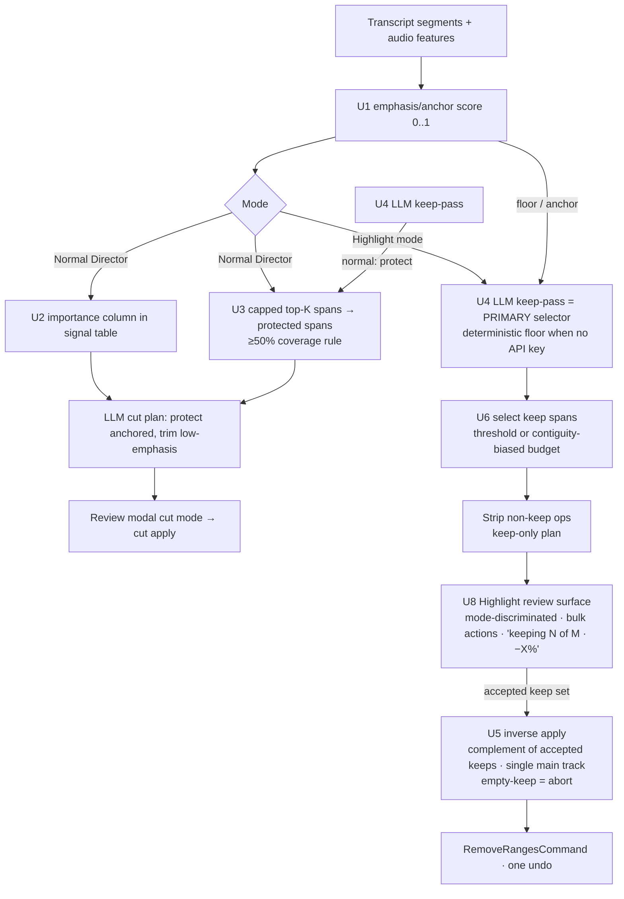
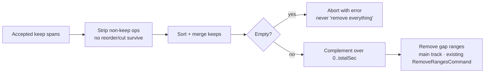

# feat: Director keep-side — emphasis scoring + Highlight (candidate-keep) mode

## Summary

The Director today is purely **subtractive** — it detects what to CUT. This plan adds the inverse: detect what to **KEEP** — and act on it.

Two channels, honestly scoped. A deterministic **emphasis/anchor score** (0..1 per segment, from audio emphasis + speaking-rate confidence + lexical salience) is a cheap, offline **floor**: it reliably finds *where the speaker leaned in* and rules *out* low-value filler/dead spans, but it cannot recognize *taste* (a joke landing, a surprising claim, an emotional beat) — those need the **LLM keep-pass**, which becomes the **primary** channel for Highlight selection (the deterministic floor is the degrade path when no API key is configured). The score is put to work three ways: it **feeds the planner** (a signal-table column) so the normal cut protects anchored spans and trims low-emphasis ones; it powers a new opt-in **Highlight mode** that presents a ranked **candidate-keep shortlist** ("keep the best, cut the rest" via inverse apply); and it drives an optional **duration-budget target** ("~60s") that selects a *contiguous-biased* set fitting the length.

Everything is **review-gated** (Highlight is the most destructive op — it surfaces a "keeping N of M · removing X%" preview and, given the high taste-risk, is positioned as *suggested* candidates the user vets, not a confident "here are the best parts"), **offline-capable** (deterministic floor runs on every auth mode; the LLM keep-pass is the only remote call), and **dependency-free**.

**In scope:** emphasis/anchor scoring; planner signal + capped high-value protection; LLM keep-pass (primary for Highlight); Highlight candidate-keep mode with inverse apply; contiguity-aware duration-budget short-maker; mode-discriminated keep review surface. **Out of scope:** vision-interest scoring (deferred, like the cut-side's separate opt-in vision layer); changes to the existing cut detectors (reused as-is); a fully optimal knapsack/longest-window selection (contiguity-biased greedy v1); multi-track-aware complement removal beyond a single main speech track (guarded, not solved).

---

## Problem Frame

The Director's deterministic stack and LLM cut prompt all answer *what should I remove?* There is no signal for *what is load-bearing*. Consequences:

- **The cut pass has no "do not touch" anchor.** A high-value line can be trimmed by a pacing/dead-air heuristic or an over-eager LLM cut. (The asset-context arc's keeper-protection protects take-cluster keepers, nothing else.)
- **`keep` is a dead op.** `DIRECTOR_SCHEMA` has a `keep` op kind, but `apply-plan.ts` treats it as a no-op (`planRemovalRanges` filters only `cut`/`take_select`), and the review dialog applies via `applyDirectorPlan`, which never reads `keep`. The LLM is never asked to mark load-bearing spans, and if it did, nothing would happen.
- **No way to build a short from a long ramble.** Producing a 60-second cut from a 20-minute recording is the inverse of cutting, and the Director can't do it.

The cheap signals are mostly **already computed**: `audio-features.ts` produces `loudnessRelative` (relative RMS energy), `wpm`, and `fillerCandidate`; the asset-context arc added `text-similarity.contentTokens`. **But honesty about what they measure is the crux of this plan.** `loudnessRelative` is *vocal volume relative to the loudest segment in the file* — it marks emphasis, not value; an animated throwaway aside scores as high as the thesis, and on flat/monotone delivery every segment scores alike (near-random selection). Content-word density rewards incidental noun-dense tangents over short pivotal sentences that are mostly stopwords. The thesis-marker set fires only on explicit signposting most speakers skip. So the deterministic blend is an **emphasis/anchor** signal — excellent for protecting the parts the speaker stressed and ruling out dead air, structurally **unable** to rank highlight-worthiness on its own. Recognizing *taste* (a joke, a surprise, a beat) is the LLM's job, reading the transcript — which is why the LLM keep-pass is the *primary* Highlight channel here, not a corroborator. This framing drives the validation gate (below): **the deterministic-only path must beat random selection on a low-dynamic-range sample before Highlight ships beyond suggest-mode.**

---

## Requirements

Traceability is to the request and the "detect the NECESSARY parts" direction in `docs/HANDOFF-ai-director-cut-quality.md` (no upstream brainstorm doc).

- **R1 — Emphasis/anchor score.** A deterministic per-segment score in [0,1] from audio emphasis (`loudnessRelative`), speaking-rate confidence (`wpm` band, docked by `fillerCandidate`), and lexical salience (content-word density + a bounded thesis-marker set). Honestly an *emphasis/anchor* signal, not an importance oracle. Pure and unit-testable.
- **R2 — Planner awareness.** The score surfaces to the planner (a signal-table column) so the normal cut protects anchored spans and trims low-emphasis ones more confidently.
- **R3 — Capped high-value protection.** A **bounded** top set of spans (top-K / top-X%, not all-above-threshold) is protected from removal in the *normal* Director, reusing the asset-context keeper mechanism. "Conservative" means protecting **less**, so the normal cut still does meaningful work.
- **R4 — LLM keep-pass (primary taste channel).** The LLM marks load-bearing spans with `keep` ops. In the **normal** Director those feed protection; in **Highlight** mode they are the **primary** selector (the thing that can find a joke/beat the score can't), with the deterministic score as the offline/degrade floor and the anchor.
- **R5 — Highlight (candidate-keep) mode.** A new opt-in AI-CUT mode presents a ranked candidate-keep shortlist and, on accept, keeps the chosen spans and cuts the rest via **inverse apply** (remove the complement). Mode-discriminated review surface; nothing auto-applies; the most destructive op is positioned as *suggested* candidates.
- **R6 — Duration budget (contiguity-aware).** An optional target length selects a coherent set fitting the budget, biased toward contiguous runs (not a jump-cut salad), with a minimum-span-length floor.
- **R7 — Reviewable & reversible.** Every keep/highlight decision surfaces in the review modal (with bulk actions at Highlight scale); apply is one undoable `BatchCommand`; only the user-accepted keep set reaches the inverse apply.
- **R8 — Offline, pure, dependency-free.** The deterministic score and selection are pure, wasm-free, unit-tested, and run on every auth mode; the LLM keep-pass is the only remote call. Honors BRIEF Hard Rule 1 and Hard Rule 4.
- **R9 — Validation gate (go/no-go).** Before Highlight ships beyond suggest-mode, the pick-quality is validated on **at least one low-dynamic-range / second-speaker sample** (not only Dan's animated footage): the deterministic-only top-N must beat random selection by a stated margin, and a budget result must meet a watchability floor (min span length, max jump-cuts). Failing the bar → Highlight ships suggest-only and/or LLM-required.

**Success criteria:** on varied footage, Highlight surfaces a coherent candidate-keep shortlist that a creator can accept into a watchable cut; "~60s" returns a contiguous-biased cut within tolerance; the normal Director never silently trims an anchored line and still produces a non-trivial cut on dense footage; and the deterministic floor demonstrably beats random on a flat-delivery sample (R9).

---

## High-Level Technical Design

One deterministic floor + an LLM taste channel, three consumers. The Director spine is unchanged; the keep-side branches off the features+transcript.



**Inverse apply** (U5) — the one new apply concept; reorders/cuts are stripped first so the complement math is valid:



---

## Output Structure

New code lands in `apps/web/src/features/ai-generate/director/` (sanctioned by BRIEF Hard Rule 1 — no `PATCHES.md`). Greenfield files:

```
apps/web/src/features/ai-generate/director/
  importance.ts             # U1 — emphasis/anchor score (pure)
  keep-select.ts            # U6 — contiguity-aware budget/threshold selection (pure)
  run-highlight.ts          # U7 — Highlight orchestrator (browser-only)
  highlight-preview.ts      # U8 — pure preview-stat helper
  __tests__/
    importance.test.ts
    keep-select.test.ts
    inverse-apply.test.ts   # U5 — planKeepInverseRanges
    highlight-preview.test.ts
```

Modified (existing, all ours — per-unit `Files:` are authoritative):
- `apply-plan.ts` (U5 — `planKeepInverseRanges` + a new `applyHighlightPlan`)
- `build-signal-table.ts` + `packages/hf-bridge/src/author.ts` (U2 — `DirectorSegment.importance` + conditional column; U4 — keep-pass prompt)
- `cut-utils.ts` (U3 — protected-span input, generalizing `keepers`)
- `run-director.ts` (U3 — pass capped high-value spans)
- `director-plan-store.ts` (U8 — Highlight flag + `totalSec` + preview stats)
- `components/director-review-dialog.tsx` (U8 — mode-discriminated keep surface + bulk actions)
- `apps/web/src/features/editing/components/ai-cut-menu.tsx` (U7 — Highlight entry; opens a small dialog/popover hosting the duration field, NOT a bare menu item)

The tree is a scope declaration, not a constraint. Per-unit `Files:` sections are authoritative.

---

## Key Technical Decisions

**KTD1 — The deterministic score is an *emphasis/anchor* floor, not an importance oracle.** `score = w_emphasis·emphasis + w_rate·rateConfidence + w_lexical·lexicalSalience`, clamped to [0,1]. It reliably finds where the speaker leaned in and rules *out* filler/dead spans (the filler dock + lexical gate stop loud-AND-contentless from winning), but it **cannot** rule *in* taste, and it does **not** stop a loud incidentally-dense aside from outscoring a quiet pivotal line. *Rationale:* naming the ceiling honestly is what makes the LLM-primary decision (KTD4) and the validation gate (R9) correct rather than wishful. Weights/thresholds are named dials.

**KTD2 — Protection is *capped*, and "conservative" means *less*.** `run-director` protects only a bounded top set (top-K spans or top-X% of timeline, whichever is smaller), not every span above a threshold — otherwise dense, confident footage (exactly what the score rewards) protects most segments and the normal cut does nothing. The protected spans feed `mergeDetectedCuts` (the ≥50%-coverage keeper rule from the asset-context fix, so intra-span micro-trims still pass). *Rationale:* the over-protection regime is the failure mode; the cap bounds it and a test guards it.

**KTD3 — Highlight = inverse apply over the existing removal command, on a single main speech track, with non-keep ops stripped.** `planKeepInverseRanges({ keeps, totalSec, ticksPerSecond })` merges the kept spans and returns the **complement** ranges, applied through `RemoveRangesCommand`. Before computing the complement, the Highlight plan **strips all non-keep ops** (a surviving `reorder` would move an element out of its original coordinates and corrupt the all-track complement; a stray `cut` is redundant). The complement is removed from the **main track** (the keep spans derive from the main-track transcript); overlay/audio elements straddling a complement gap are out of v1 scope and **guarded** (see Risks). An **empty accepted keep set aborts with an error** — never silently "remove everything." *Rationale:* keeps the apply spine + one-undo; the only new logic is pure complement math with explicit safety rails.

**KTD4 — Two channels, LLM-primary for Highlight selection.** The LLM keep-pass is the **primary** selector for Highlight (it can recognize a joke/surprise/beat); the deterministic score is the **floor/anchor** and the offline degrade path (no API key → deterministic-only, surfaced as such). In the **normal** Director both feed protection. *Rationale:* the premise risk (KTD1) means the score alone can't carry Highlight quality; inverting the cut-side's deterministic-primary ordering is the honest response. *(Scope-guardian argued the opposite — defer the LLM keep-pass as n=1 gold-plating; resolved toward LLM-primary because the deterministic ceiling makes the LLM the load-bearing taste channel. See Open Questions.)*

**KTD5 — Budget selection is *contiguity-biased*, not pure greedy-by-score.** The handoff asked for "the best **contiguous** window." Pure greedy-by-score concatenates scattered fragments into a jump-cut salad — unwatchable, which defeats the feature. v1 selects with a contiguity bias (prefer extending an adjacent kept run; enforce a minimum span length; bound the number of jump-cuts) under the budget, then orders by timeline. A minimum-one guarantee ensures a tiny budget keeps the single best span (never empty). *Rationale:* coherence is the load-bearing property of a "short," not an optional polish; greedy-by-score alone fails the watchability success criterion.

**KTD6 — `keep` op is mode-polymorphic; in normal mode it is *not* a user-actionable row.** A `keep` op protects in the **normal** Director and selects-to-survive in **Highlight** mode. **Critically:** in the normal Director, protection is computed *before* the modal opens (folded into `protectedSpans`), so a `keep` row's accept/reject toggle would do nothing — therefore normal-mode `keep` ops are **suppressed from the reviewable rows** (protection stays invisible), not shown as no-op checkboxes. The two readings never collide because a run is one mode or the other. *Rationale:* a checkbox that looks actionable but isn't is a trust bug; suppressing it is cleaner than re-driving protection on toggle.

**KTD7 — Highlight reuses the Director spine + review modal.** `runHighlight` reuses `assembleBinToTimeline` → `runRemoveSilences` → `ensureTimelineTranscript` → `computeSpeechFeatures` → the signal table; only planning (score + keep selection) and apply (inverse) differ. *Rationale:* one spine, two modes. *(File split over a `mode` flag accepted; the spine must be kept in sync — noted in Risks.)*

**KTD8 — Highlight needs a new editor-facing apply path + store fields.** The review dialog today calls `applyDirectorPlan({ editor, ops })`, which routes through `planRemovalRanges` and **ignores `keep`** — so a Highlight plan applied through it removes nothing. Therefore: the plan store carries a **Highlight flag + `totalSec`** (it currently has neither — `openWith` takes only `{ plan, nearTies }`); the dialog **branches** — Highlight plans call a new `applyHighlightPlan({ editor, keeps, totalSec })` (complement via `planKeepInverseRanges` → `RemoveRangesCommand`/`BatchCommand`), normal plans keep calling `applyDirectorPlan`. *Rationale:* this is the genuinely new apply seam; the first draft under-specified who computes the complement and where `totalSec` comes from.

**KTD9 — The keep review surface must visibly differ from cut mode (accept/reject inverts).** In cut mode accept = remove; in Highlight mode accept = keep. The same modal with identical copy would make experienced users systematically mis-click. The Highlight surface uses distinct header copy ("Review highlight — keeping N of M spans"), per-row labels ("Keep" / "Drop from highlight"), a keep-semantics primary button ("Apply highlight"), and **bulk actions** (pre-select the recommended set; select-all / accept-top-N) since a Highlight can present dozens of keep rows. *Rationale:* the inverted semantics on a shared modal is the highest-mis-click-risk surface in the feature.

---

## Implementation Units

Grouped into phases, dependency-ordered. U-IDs are stable. Each phase maps to a round/PR.

### Phase A — Emphasis/anchor scoring

### U1. Deterministic emphasis/anchor score

**Goal:** `scoreImportance({ segments, features }) → number[]` (0..1 per segment) blending emphasis, rate-confidence, and lexical salience; named weight/threshold constants; a bounded thesis-marker set.
**Requirements:** R1 (floor for R2–R6).
**Dependencies:** none. Reuses `text-similarity.contentTokens` and `SpeechFeatures`.
**Files:** `apps/web/src/features/ai-generate/director/importance.ts`, `apps/web/src/features/ai-generate/director/__tests__/importance.test.ts`.
**Approach:** per segment: emphasis = `loudnessRelative`; rate confidence = a band function of `wpm` (peaks mid-range, low at hesitant-slow and rushed-fast), docked when `fillerCandidate`; lexical salience = capped content-word density (`contentTokens(text).size / durationSec`) + a bounded thesis-marker bonus (a named constant array, capped count). Blend with named weights, clamp [0,1]. Pure + wasm-free.
**Execution note:** the failure-mode test (quiet-pivotal vs loud-incidental) is the honest-premise guard — write it and accept that the deterministic blend may not pass it, which is *why* the LLM is primary for Highlight (KTD4).
**Patterns to follow:** the pure-detector style of the existing cut detectors; `contentTokens` in `text-similarity.ts`; `SpeechFeatures` fields in `types.ts`.
**Test scenarios:**
- Happy path: a loud, steady-wpm, content-dense segment scores high; a quiet, hesitant, filler segment scores low.
- Content gate: a LOUD but contentless/filler segment does NOT score high (lexical + filler dock dominate).
- **Honest-ceiling guard:** a quiet, slow, stopword-heavy but pivotal line is NOT required to beat a loud incidental-noun-dense aside — assert the blend's *known limitation* (documents why the LLM is primary), rather than asserting an outcome the signals can't deliver.
- Thesis marker: a segment with "the key thing is…" scores higher than the same delivery without it; the marker set is capped (a fixed constant array).
- Graceful degradation: with NO thesis markers in any segment, scores are still non-degenerately distributed (not all near-zero).
- Rate band: very-slow and very-fast both score below a healthy-rate segment.
- Edge: zero-duration/empty-text → 0, no divide-by-zero; absent features → lexical-only.
- Range: all scores in [0,1].

### Phase B — Normal-Director integration (the "signal" half)

### U2. Importance column in the signal table + prompt

**Goal:** Surface the score to the planner. **Add** `importance?: number` to `DirectorSegment` and an `importance?: readonly number[]` arg to `buildSignalTable` (it does not have one today — current args are `{ segments, features, elements, clusterIds }`); render a conditional `imp` column and a prompt note. Byte-identical when absent.
**Requirements:** R2.
**Dependencies:** U1.
**Files:** `packages/hf-bridge/src/author.ts` (`DirectorSegment.importance`; `renderSignalTable` and `buildDirectorPrompt` each derive `hasImportance = segments.some(s => s.importance !== undefined)` mirroring the existing `hasClusters` derivation — **no new function param** on those two), `apps/web/src/features/ai-generate/director/build-signal-table.ts` (new `importance?` arg, zipped by index like `features[i]`), tests in `packages/hf-bridge`.
**Approach:** mirror the `grp` column added in the asset-context arc exactly (column + prompt note conditional on `hasImportance`; output schema unchanged).
**Patterns to follow:** the conditional `grp` column + `clusterRule` in `renderSignalTable`/`buildDirectorPrompt` (asset-context arc); the optional-field spread in `buildSignalTable`.
**Test scenarios:**
- A segment with importance renders an `imp` cell; with none, the column is omitted and the table is byte-identical to current (regression).
- The prompt's high-/low-importance guidance appears only when importance is present.
- The JSON output schema is unchanged.

### U3. Capped high-value protection in the cut path

**Goal:** Protect a **bounded** top set of anchored spans from removal in the normal Director; generalize `keepers` → `protectedSpans`; never null out the cut.
**Requirements:** R3.
**Dependencies:** U1; the keeper-safe merge from the asset-context arc.
**Files:** `apps/web/src/features/ai-generate/director/cut-utils.ts` (extend the `keepers` param to `protectedSpans`, or accept both for back-compat), `apps/web/src/features/ai-generate/director/run-director.ts` (compute the capped top set from the score and union with cluster keepers), tests in `cut-utils` `__tests__`.
**Approach:** in `run-director`, after scoring, take the **top-K spans (or top-X% of timeline), whichever is smaller** — not all-above-threshold — union with cluster keepers, pass to `mergeDetectedCuts`. The ≥50%-coverage keeper rule applies unchanged.
**Patterns to follow:** the `keepers`/coverage logic in `mergeDetectedCuts`; the spans-from-clusters mapping in `run-director`.
**Test scenarios:**
- A removal covering a protected span (≥50%) is dropped; an intra-span micro-trim passes.
- **Over-protection guard:** on uniformly-high-scoring input the cap bounds protection so the normal Director still produces a non-trivial cut (assert removals survive).
- With no high-value spans (below the cap), behavior is identical to the asset-context merge (regression).
- Backward compatibility: callers passing only `keepers` still work.

### U4. LLM keep-pass (primary Highlight channel; protection in normal mode)

**Goal:** Ask the planner to mark load-bearing spans with `keep` ops; route them to protection (normal mode, invisible per KTD6) and to selection (Highlight mode, primary per KTD4).
**Requirements:** R4.
**Dependencies:** U2.
**Files:** `packages/hf-bridge/src/author.ts` (`buildDirectorPrompt` keep guidance; `sanitizeDirectorPlan` already passes `keep`), `apps/web/src/features/ai-generate/director/run-director.ts` (normal-mode: fold LLM `keep` spans into `protectedSpans`), tests in `packages/hf-bridge`.
**Approach:** extend the prompt to ask for `keep` ops on load-bearing spans — explicitly the *taste* the score misses (a landed joke, a surprising claim, a quiet pivotal line). In normal mode these protect (invisible); in Highlight mode (U7) they are the primary keep set. `keep` ops never produce a removal range (apply unchanged).
**Patterns to follow:** the op guidance in `buildDirectorPrompt`; `sanitizeDirectorPlan` op handling.
**Test scenarios:**
- The prompt asks for `keep` ops on load-bearing/taste spans (string assertion).
- A returned `keep` op survives sanitization and contributes a protected span in normal-mode `run-director`.
- A `keep` op never produces a removal range (apply unchanged).

### Phase C — Highlight engine (pure)

### U5. Inverse apply (keep → complement removal) — safe

**Goal:** `planKeepInverseRanges({ keeps, totalSec, ticksPerSecond }) → { ranges; removedSec }` returning the complement of merged keep spans; a new `applyHighlightPlan({ editor, keeps, totalSec })` that strips non-keep ops, aborts on empty, and removes the complement via `RemoveRangesCommand`/`BatchCommand`.
**Requirements:** R5, R7.
**Dependencies:** none (pure); consumed by U7/U8.
**Files:** `apps/web/src/features/ai-generate/director/apply-plan.ts` (`planKeepInverseRanges` + `applyHighlightPlan`), `apps/web/src/features/ai-generate/director/__tests__/inverse-apply.test.ts`.
**Approach:** sort + merge keeps; complement = `[0, firstStart)`, gaps `[end_i, start_{i+1})`, `[lastEnd, totalSec)`; drop empty/sub-frame slivers (boundary tolerance); convert to ticks; remove from the **main track**. `applyHighlightPlan` first asserts the keep set is non-empty (else throw a typed "nothing to keep" error — the orchestrator surfaces it; never remove everything) and that the plan carries no `reorder`/`cut` ops (strip them).
**Execution note:** test-first — the destructive complement math + the empty-keep abort must be proven before it cuts.
**Patterns to follow:** `planRemovalRanges` + the `RemoveRangesCommand`/`BatchCommand` wrapping in `apply-plan.ts`.
**Test scenarios:**
- Happy path: keeps `[2,5)`,`[10,12)` over total 15 → removes `[0,2)`,`[5,10)`,`[12,15)`; removedSec correct.
- Partial acceptance: keeps `[2,5)`,`[10,12)`,`[20,25)` with `[10,12)` dropped → complement of `[2,5)`∪`[20,25)` (the function receives only the *accepted* set).
- Adjacent/overlapping keeps merge before complementing (no zero-length/negative ranges).
- Full keep `[0,total)` removes nothing.
- **Empty keep set → aborts with a typed error (NOT remove-everything).**
- Boundary tolerance: a sub-frame gap is not emitted as a sliver.
- Idempotency: re-applying the same keep set yields the same ranges.

### U6. Contiguity-aware duration-budget selection

**Goal:** `selectKeepSpans({ segments, importance, budgetSec? }) → KeepSpan[]` — threshold mode keeps above-cap spans; budget mode picks a **contiguity-biased** set fitting the budget with a min-span floor and a min-one guarantee.
**Requirements:** R5, R6.
**Dependencies:** U1.
**Files:** `apps/web/src/features/ai-generate/director/keep-select.ts`, `apps/web/src/features/ai-generate/director/__tests__/keep-select.test.ts`.
**Approach:** threshold mode → above-cap segments merged into contiguous spans. Budget mode → prefer extending high-score *runs* over scattered single segments (a contiguity bias), enforce a minimum span length and a bounded jump-cut count, accumulate until ≥ budget (small overshoot allowed), order by timeline, merge adjacent. **Budget underflow:** when the budget is smaller than the shortest segment, keep the single highest-score segment (never empty). Greedy + contiguity bias, not optimal knapsack (KTD5).
**Patterns to follow:** the pure-selection style of `take-clusters`/`redundancy`; importance from U1.
**Test scenarios:**
- Threshold mode: above-cap segments kept; adjacent merge into one span.
- Budget mode: selected total within tolerance of the budget; result respects the min-span floor and the max-jump-cut bound (NOT N scattered sub-second slivers).
- Contiguity bias: given two equal-importance options, the one extending an adjacent kept run is preferred.
- Budget underflow: budget 0.001s over five 5s segments → exactly the single highest-importance segment (never empty).
- Budget larger than the video → keep everything.
- Output spans in timeline order regardless of selection order; empty input → empty output, no throw.

### Phase D — Highlight mode (wiring + UI)

### U7. Highlight orchestrator + menu entry

**Goal:** `runHighlight({ editor, budgetSec?, onProgress, signal })` reusing the Director spine → score → keep selection (LLM-primary, deterministic floor) → strip non-keep ops → open the review modal in Highlight mode; a "Highlight…" entry that opens a **small dialog/popover hosting the optional duration field** (not a bare `DropdownMenuItem`).
**Requirements:** R4, R5, R6, R7.
**Dependencies:** U1, U5, U6 (and U4 for the LLM channel).
**Files:** `apps/web/src/features/ai-generate/director/run-highlight.ts` (+ test for the pure plan-assembly slice), `apps/web/src/features/editing/components/ai-cut-menu.tsx` (the Highlight entry + a duration dialog/popover).
**Approach:** reuse `runDirector`'s spine through the signal table; compute importance (U1); build the keep set — **LLM keep-pass primary** (U4) when an API key is configured, deterministic selection (U6) as the floor/degrade; select with `budgetSec` from the duration field; **strip any non-keep ops** before review; open the modal as a Highlight plan (carry `totalSec`). On accept, apply via `applyHighlightPlan` (U5). **Menu host:** selecting "Highlight…" opens a small Dialog/popover (reuse the Dialog primitive the review modal already imports) with a labeled duration field ("Target duration (seconds)", optional — empty = keep all anchored spans), valid-range validation, and a Run button — a Radix `DropdownMenuItem` cannot host a working input (it closes on select and intercepts typeahead). **Progress** steps cover both paths and the degrade path omits the "Refining with AI…" step without a visual gap.
**Patterns to follow:** `runDirector` spine + abort/progress; the Dialog usage in `director-review-dialog.tsx`; the menu wiring in `ai-cut-menu.tsx`.
**Test scenarios (pure slice unit-tested; orchestrator + menu live-verified — bun has no DOM):**
- Given segments + importance + a budget, the assembled keep plan matches U6's selection and carries the preview stats; non-keep ops are stripped.
- With no budget, the plan keeps all above-cap spans.
- Degrade: with `claude-code` / no API key, the plan is built from the deterministic floor alone (no remote call), and the result is surfaced as "deterministic-only."
- `Test expectation (orchestrator + menu dialog): live-verified — assemble/decode/fetch and the Radix dialog run only in the browser.`

### U8. Mode-discriminated keep review surface + preview

**Goal:** Present the Highlight plan as a keep decision the user vets, visibly distinct from cut mode, with bulk actions and a "keeping N of M · Xs of Ys (−Z%)" preview; only the accepted keep set reaches the inverse apply.
**Requirements:** R5, R7.
**Dependencies:** U5, U7.
**Files:** `apps/web/src/features/ai-generate/director/director-plan-store.ts` (carry a `highlight` flag, `totalSec`, and preview stats; `openWith` currently takes only `{ plan, nearTies }`), `apps/web/src/features/ai-generate/director/components/director-review-dialog.tsx` (Highlight branch), `apps/web/src/features/ai-generate/director/highlight-preview.ts` (+ test).
**Approach:** when the plan is a Highlight plan, the modal uses **distinct copy** (header "Review highlight — keeping N of M spans"; row labels "Keep" / "Drop from highlight"; primary button "Apply highlight") so the inverted accept=keep semantics is unmistakable; rows are **pre-selected to the recommended keep set** (user deselects to drop) with **bulk actions** (select-all / accept-top-N) since dozens of rows are likely; the header shows the pure preview stat. **Empty/full states:** when the accepted set is empty, "Apply highlight" is disabled with "Select at least one span to keep"; when all kept, the stat reads "−0%" with a no-op note. On apply, only the **accepted** keep spans go to `applyHighlightPlan`. Normal-mode `keep` ops are **suppressed** from rows (KTD6). The preview math is a pure tested helper. *(Row→timeline scrub preview is an Open Question — default to Ctrl+Z-only recovery for v1 unless cheap.)*
**Patterns to follow:** the `describeReviewOp` helper + dialog rows from the asset-context arc; the plan-store `openWith` shape.
**Test scenarios:**
- The pure preview helper formats "keeping 6 of 40 · 58.0s of 1240.0s (−95%)"; rounds sensibly; handles keep-everything ("−0%") and keep-nothing edges.
- `Test expectation (dialog render): live-verified — bun has no DOM in this repo.`

---

## Alternative Approaches Considered

- **Deterministic score as the primary Highlight selector** (the first-draft framing). Rejected (KTD1/KTD4): the score measures emphasis, not taste, and degenerates on flat delivery — the LLM keep-pass is the channel that can find a joke/beat, so it leads and the score is the floor.
- **A new `highlight` op kind / schema change** instead of mode-polymorphic `keep`. Rejected (KTD6): adds a schema + taste-category ripple for no gain.
- **A dedicated Highlight command** instead of inverting into `RemoveRangesCommand`. Rejected (KTD3): new undo semantics to get right; complement-then-remove reuses the proven one-undo path.
- **Pure greedy-by-score budget selection.** Rejected (KTD5): produces an unwatchable jump-cut salad; the handoff asked for a contiguous window, so contiguity is first-class, not optional.
- **Defer the LLM keep-pass (n=1 gold-plating).** Considered (scope-guardian); rejected because the deterministic ceiling makes the LLM the load-bearing taste channel — see KTD4 and Open Questions.
- **Vision-interest scoring in the blend.** Out of scope: vision is a separate opt-in layer; fold in later behind the same flag.

---

## Risks & Mitigations

- **The score finds the loud/fast parts, not the good parts (the premise risk).** → Honest emphasis/anchor framing (KTD1); LLM keep-pass is primary for Highlight (KTD4); the R9 validation gate sets a concrete go/no-go (beat random on a flat-delivery sample) before Highlight ships beyond suggest-mode.
- **Mediocre picks erode trust on the highest-taste surface.** → Highlight is positioned as *suggested candidates* the user vets (R5), not "the best parts"; pre-selected + bulk-action review (KTD9/U8); the destructive op is review-gated with an explicit "−X%" preview.
- **Reorder/cut op corrupts the inverse complement.** → Strip all non-keep ops before complementing (KTD3/U5); a test asserts a plan with a `reorder` is stripped/rejected.
- **Over-protection nulls the normal cut on dense footage.** → Protection is *capped* (top-K/top-X%, conservative = less) (KTD2/U3); an over-protection test asserts the cut still does work.
- **Greedy budget = jump-cut salad.** → Contiguity bias + min-span floor + max-jump-cut bound, first-class in U6 (KTD5).
- **Empty accepted keep set deletes the whole timeline.** → `applyHighlightPlan` aborts on empty with a typed error; the modal disables Apply when empty (U5/U8).
- **Apply seam: the dialog ignores `keep`.** → New `applyHighlightPlan` + store `totalSec`/Highlight flag; dialog branches by mode (KTD8/U5/U8).
- **Inverted accept/reject mis-clicks.** → Mode-discriminated copy/labels/button (KTD9/U8).
- **Multi-track desync** (overlay/audio straddling complement gaps under all-track removal). → v1 scopes complement removal to the main track and **guards** the case (documented assumption + a test/guard for overlay/audio elements); full multi-track-aware highlight is deferred.
- **`loudnessRelative` flattened by one shouted outlier** over a long recording. → Acknowledged; the LLM-primary path (KTD4) does not depend on it, and the validation gate tests low-dynamic-range footage.
- **Spine duplication** (`run-highlight.ts` vs `run-director.ts`). → Accepted file split (KTD7); keep the shared spine factored where practical.
- **Score quality unverifiable without footage.** → Pure logic unit-tested; orchestrator/dialog live-verified; R9 is the live go/no-go.

---

## Phased Delivery

- **Phase A (U1)** — the emphasis/anchor score. Pure, unit-tested; no user-visible change.
- **Phase B (U2, U3, U4)** — the "signal" half: the score reaches the planner and protects a *capped* set of anchored spans in the normal Director; the LLM keep-pass lands (protection in normal mode). First behavioral lift, low blast radius. *(U2 and U3 ship together — U3's protection consumes U2's signal; a PR that threads the column without wiring protection is a partial state to avoid.)*
- **R9 validation gate (merge gate, not a doc note):** before Phase D ships beyond suggest-mode, run the score on a low-dynamic-range / second-speaker sample; deterministic-only top-N must beat random by the stated margin and a budget result must meet the watchability floor. Fail → Highlight ships suggest-only / LLM-required.
- **Phase C (U5, U6)** — the Highlight engine: safe inverse apply + contiguity-aware budget selection. Pure, tested, not yet wired.
- **Phase D (U7, U8)** — **headline round:** Highlight (candidate-keep) mode ships — LLM-primary selection, the contiguity-aware short-maker, the mode-discriminated review surface, gated by R9.

Each phase maps to a round/PR.

---

## Success Metrics

- **Pick quality (cross-speaker, falsifiable):** the deterministic-only top-N beats random selection by a stated margin on a **low-dynamic-range / second-speaker** sample — not just Dan's animated footage (R9). Overlap with a hand-marked pass on Dan's footage is a *sanity floor*, not the primary measure (tuning to it risks overfitting n=1).
- **Watchability (gating, not soft):** a budget result is coherent — respects the min-span floor and max-jump-cut bound — judged on real output, a Phase D ship gate.
- **Budget accuracy:** "~Ns" lands within tolerance of the target.
- **No-regression:** with importance absent, the signal table + cut plan are byte-identical to the asset-context baseline; the feature runs on every auth mode (R8).
- **Protection sanity:** zero silently-trimmed anchored lines AND a non-trivial cut still produced on dense footage (the over-protection guard).

---

## Dependencies / Prerequisites

- No new runtime dependencies (score + selection are pure-local).
- Reuses: `audio-features.ts` (`SpeechFeatures`), `text-similarity.ts` (`contentTokens`), the keeper-safe `mergeDetectedCuts`, the apply spine (`apply-plan.ts`), the signal-table + prompt (`packages/hf-bridge/src/author.ts`), the plan store + review dialog, the AI-CUT menu, and the Dialog primitive (for the duration host).
- Stacks on `feat/director-asset-context` (PR #50) — depends on its keeper-protection + signal-table conventions + the `describeReviewOp` review helper.
- The LLM keep-pass uses the existing `/api/director/plan` route + auth (no new route).
- A low-dynamic-range / second-speaker validation sample for R9.

---

## Open Questions (execution-time)

- **LLM keep-pass role (the key fork):** elevated to primary for Highlight here (KTD4), against scope-guardian's "defer it for n=1." Confirm before Phase D — if Dan wants a deterministic-only Highlight v1, it must ship explicitly as suggest-mode given the premise risk.
- Importance blend weights, the healthy-wpm band, the protection cap (top-K vs top-X%), and the keep threshold (U1/U3/U6) — tune against varied footage; conservative defaults (less protection) ship first.
- Budget contiguity strength, min-span floor, and max-jump-cut bound (U6) — decide from the first highlight on real footage.
- Row→timeline scrub preview before commit, or Ctrl+Z-only recovery (U8) — default Ctrl+Z-only for v1 unless cheap.
- Whether the normal Director should surface a "kept because high-value" affordance, or keep protection invisible (KTD6 currently: invisible).
- Multi-track-aware complement removal (overlay/audio) — guarded/deferred in v1 (U5); revisit if real timelines carry straddling overlay/audio.

---

## Sources & Research

- First-hand repo reading (this session): `apply-plan.ts` (`planRemovalRanges`, `RemoveRangesCommand`/`BatchCommand`, `keep` as a no-op; the dialog applies via `applyDirectorPlan`), `ai-cut-menu.tsx` (mode wiring), `director-plan-store.ts` (`openWith({ plan, nearTies })` — no `totalSec`), plus the asset-context arc's `audio-features.ts`, `text-similarity.ts` (`contentTokens`), `cut-utils.ts` (keeper-safe merge, coverage rule), `build-signal-table.ts`, `review-format.ts`, and the planner/prompt/schema in `packages/hf-bridge/src/author.ts`.
- `docs/HANDOFF-ai-director-cut-quality.md` (2026-06-18) → "NEXT DIRECTION: detect the NECESSARY parts" — the keep-side direction, candidate signals, and the *contiguous-window* short-maker framing.
- `docs/plans/2026-06-19-001-feat-director-asset-context-cut-quality-plan.md` (PR #50) — the cut-side arc this stacks on; keeper-protection, signal-table column convention, and review-surface helper reused here.
- `docs/BRIEF.md` — Hard Rule 1 (sanctioned dirs / `PATCHES.md`) and Hard Rule 4 (telemetry never leaves the device).
- Multi-persona doc review (2026-06-19): folded-in corrections — the emphasis-vs-taste premise reframe + LLM-primary decision, the R9 validation gate, the apply-seam (new `applyHighlightPlan` + store `totalSec`), inverse-apply safety (strip non-keep ops, empty-keep abort, single-track scope), capped protection, contiguity-aware budget, mode-discriminated review surface, the menu dialog host, and the `buildSignalTable` signature correction.
