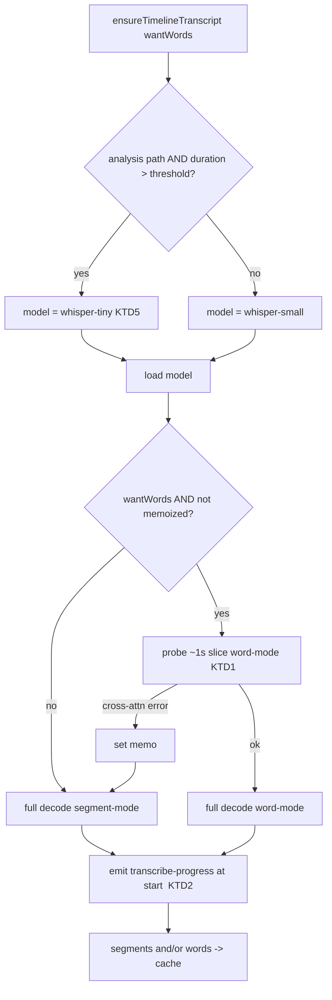
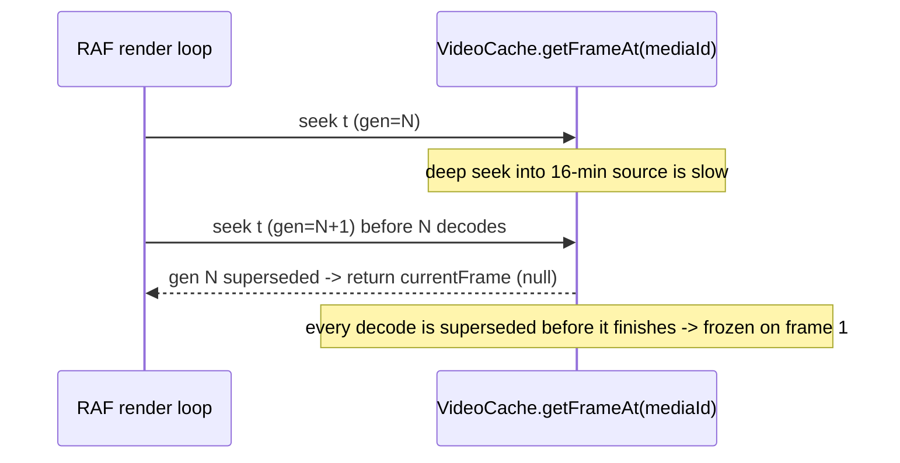

# fix: AI Director long-video performance + transcription/preview defects

## Summary

Live-testing the AI Director on a **16-minute** recording surfaced four problems that make the Director unusable on long sources. Three are defects, one is the underlying performance limitation (in scope per user decision):

1. **Double full transcription.** The word→segment degrade runs a *full* word-mode Whisper pass that throws (model can't emit cross-attention word timestamps), then re-runs a *full* segment-mode pass — ~doubling the (already long) transcription on a 16-min source.
2. **Lying progress label.** The status reads `Initializing speech model — 903s elapsed` for the *entire* transcription, because the worker never emits a transcribe-progress event so the elapsed-ticker never flips to a "Transcribing…" phase.
3. **Preview freezes on frame 1** after a cut (137 elements on one 16-min source). Confirmed JS-side (no wasm panic) — a seek-generation race in the video-frame cache: a deep seek into a long source decodes slower than the RAF render loop bumps the generation, so the decode is always superseded and `currentFrame` never updates.
4. **Long-video performance.** Decoding a long source's audio holds the full native PCM ~3× before resampling (the known OOM domain), and whisper-small on 16 minutes is slow regardless.

This plan fixes 1–3 and does the in-scope perf refactor for 4 (stream-resample audio decode + a faster analysis model for long sources). It does **not** re-touch the already-shipped cut-quality, minute-timecode, or long-source-waveform work from this session.

---

## Problem Frame

The Director pipeline is `assemble → remove silences → transcribe → fuse signals → plan → review`. On a short clip it works. On a 16-min source every audio-touching stage degrades: transcription is doubled and mislabeled, the per-asset audio decode bloats memory, and after cutting into many elements the preview can't seek. The cuts themselves are correct (trim data is valid; export works) — these are performance and feedback-loop defects, not correctness-of-output defects.

---

## Requirements

- **R1** — A word-level transcription request transcribes the full audio at most **once** when the model can't emit word timestamps (no doubled pass).
- **R2** — During transcription the UI shows a truthful "Transcribing…" state (with long-video-aware copy), not "Initializing speech model".
- **R3** — Scrubbing the playhead on a long, many-element timeline updates the preview frame (no freeze on frame 1).
- **R4** — Decoding a long (≥16 min) source's audio for analysis/export does not hold the full native PCM multiple times (no allocation/OOM crash at "Extracting timeline audio").
- **R5** — Transcription of a long source for the Director/analysis path completes materially faster than whisper-small does today.
- **R6** — No regression to short-clip behavior, captions (user-invoked, separate model selection), or export audio fidelity.

---

## Key Technical Decisions

- **KTD1 — Probe word-capability on a ~1s slice, not the full audio.** Before the full decode (when words are requested and the per-model `wordTimestampsUnsupported` memo isn't set), run a tiny probe slice in word mode. On the cross-attention error, set the memo and run the full audio segment-only **once**. Reuses the existing `isWordTimestampUnsupported` matcher and memo. *Rationale:* the probe pays ~1s instead of a full 16-min word pass to learn the same fact.
- **KTD2 — Emit a real transcribe-progress signal at decode start.** `service.ts` already maps a `transcribe-progress` message to `status: "transcribing"`; the worker just never sends one. Emit it when decoding begins (and per-chunk via transformers.js `callback_function` if cheap), so `transcript-cache`'s ticker flips off "Initializing" honestly. *Rationale:* smallest change that makes the existing wiring tell the truth.
- **KTD3 — Fix the seek race by not dropping the terminal decode.** The generation guard exists to skip stale seeks, but it must guarantee the *latest* requested time decodes and updates `currentFrame` even when newer same-time requests keep arriving from the RAF loop. Dedupe by requested time, not just monotonic generation. *Rationale:* the bug is "newest always wins → newest never finishes"; the fix is "newest wins AND completes".
- **KTD4 — Stream-resample per-asset audio chunk-by-chunk.** In `resolveAudioBufferForAsset`, resample each `AudioBufferSink` chunk to the target rate as it arrives and write it straight into the output buffer, instead of accumulating `nativeChannels` + `nativeBuffer` for the whole source. Mirrors the streaming pattern shipped this session for the waveform accumulator. *Rationale:* removes the ~3× full-buffer hold that OOMs long sources.
- **KTD5 — Auto-select whisper-tiny for long *analysis* transcription.** For the Director/silence/analysis path, pick whisper-tiny above a duration threshold (default ~5 min); leave the user-facing caption model selection untouched. Threshold is a one-line dial. *Rationale:* cut decisions tolerate lower transcript accuracy; on 16 min, Tiny's speed dominates. Captions (where accuracy matters and the user picks the model) are unaffected.

---

## High-Level Technical Design

Transcription decision flow after this plan (KTD1 + KTD2 + KTD5):

Preview seek race (KTD3) — the failure today:

---

## Scope Boundaries

**In scope:** R1–R6 — the probe, the honest label, the preview seek fix, the stream-resample audio decode, and the faster analysis model.

### Deferred to Follow-Up Work
- Real per-chunk transcription *percentage* progress (beyond a "transcribing started" flip) if the transformers.js callback proves noisy or costly — ship the honest phase flip first.
- Export-path chunked mixing for >21-min timelines (`createTimelineAudioBuffer` single-output-buffer limit). U4 fixes the per-asset native-decode hold (the actual Director OOM); the whole-timeline output buffer for *export* of very long timelines is a separate concern.

### Out of scope
- The already-shipped cut-quality (prompt + segment-repeat), minute-timecode, and long-source-waveform work (committed this session).
- The Rust/wasm compositor (`opencut-wasm`) — not locally buildable; confirmed not the cause here (no wasm panic).

---

## Implementation Units

### U1. Probe word-capability before the full transcription
- **Goal:** transcribe the full audio once; never run a full word pass that's doomed to fail (R1).
- **Requirements:** R1
- **Dependencies:** none
- **Files:** `apps/web/src/services/transcription/worker.ts`; `apps/web/src/transcription/audio.ts` (optional: a pure `sliceSamples`/probe-window helper); `PATCHES.md` (worker is upstream-origin — log it).
- **Approach:** in `handleTranscribe`, when `wordTimestamps && !wordTimestampsUnsupported`, decode a ~1s leading slice in word mode first. If it throws and `isWordTimestampUnsupported(err)`, set the memo and run the full audio segment-only; otherwise run the full audio word mode. Keep the existing degrade/`wordsUnavailable` reporting. If the slice is too short for the model, fall back to the current try-full-word-then-segment path.
- **Patterns to follow:** the existing `isWordTimestampUnsupported` + `wordTimestampsUnsupported` memo added this session in the same file.
- **Test scenarios:** unit-test the pure slice helper (returns ≤N-sample window; handles audio shorter than the window). Worker async orchestration is browser-only → live-verify. `Covers R1.`
- **Execution note:** verify the probe actually throws the same cross-attention error a full pass does on the configured model (1s may decode differently) — confirm live before trusting it.
- **Verification:** a fresh Director run on whisper-small transcribes once; the `[transcription] …word-level…falling back` warning appears once; wall-clock roughly halves vs. the doubled pass.

### U2. Honest transcription progress label
- **Goal:** UI flips to "Transcribing…" once decoding starts, not "Initializing speech model" for the whole run (R2).
- **Requirements:** R2
- **Dependencies:** none (independent of U1)
- **Files:** `apps/web/src/services/transcription/worker.ts` (emit `transcribe-progress` at decode start; per-chunk via transformers.js `callback_function` if cheap); `apps/web/src/features/transcription/transcript-cache.ts` (stop the init ticker on the first transcribing signal; long-video copy, e.g. "Transcribing… long videos take a few minutes"); `apps/web/src/services/transcription/service.ts` only if the message contract needs widening; `PATCHES.md` for worker/service.
- **Approach:** the worker currently posts only `transcribe-complete|error|cancelled`. Post a `transcribe-progress` immediately before/at the first decode call so the existing `service.ts` handler emits `status:"transcribing"`, which `transcript-cache`'s `onProgress` already turns into `stopTicker()` + a transcribing phase. Update the phase copy.
- **Patterns to follow:** the existing `WorkerResponse` `transcribe-progress` case in `service.ts` (already handled, just never sent).
- **Test scenarios:** `Test expectation: none -- worker/UI signal path is browser-only; live-verify.` `Covers R2.`
- **Verification:** on a long source the status shows "Transcribing…" within seconds of decode start; the 900s "Initializing" message never appears.

### U3. Fix the preview seek race (freeze on frame 1)
- **Goal:** scrubbing a long, many-element timeline updates the preview (R3).
- **Requirements:** R3
- **Dependencies:** none
- **Files:** `apps/web/src/services/video-cache/service.ts` (the `getFrameAt` generation guard + `frameChain` + `seekToTime`); possibly `apps/web/src/services/renderer/resolve.ts` (`resolveVideoNode`); `PATCHES.md` if the file is upstream-origin.
- **Approach:** the generation guard (`if (seekGenerations.get(mediaId) !== generation) return currentFrame ?? null`) drops superseded requests, but a deep seek into a 16-min source decodes slower than the RAF loop issues new same-time requests, so the latest generation is itself superseded before it decodes → `currentFrame` stays null → frozen. Ensure the latest *distinct requested time* always decodes to completion and updates `currentFrame` (dedupe in-flight by requested time so identical repeats coalesce onto one decode rather than each bumping the generation and cancelling the prior). Don't swallow the terminal decode's result.
- **Patterns to follow:** the per-mediaId sink/cache structure already in `video-cache/service.ts`; the prior "recover from undecodable frame" fix in the same file.
- **Test scenarios:** if a pure decision (e.g. `shouldStartDecode({requestedTime, currentFrameTime, inFlightTime})`) can be extracted, unit-test it (new time vs. same time vs. in-flight). Otherwise live-verify. `Covers R3.`
- **Execution note:** reproduce with the 16-min source cut into many elements before and after the fix — this is a timing bug; runtime verification is required, not just code review.
- **Verification:** moving the playhead across the cut timeline updates the preview frame; no freeze on frame 1.

### U4. Stream-resample per-asset audio decode
- **Goal:** decoding a long source's audio no longer holds the full native PCM ~3× (R4).
- **Requirements:** R4, R6
- **Dependencies:** none (independent; complements U5)
- **Files:** `apps/web/src/media/audio.ts` (`resolveAudioBufferForAsset`); a new pure chunked-resample helper under `apps/web/src/media/` (testable, wasm-free); `PATCHES.md` for `audio.ts`.
- **Approach:** today the function accumulates `nativeChannels` (full per-channel Float32Array) + a full `nativeBuffer` + the OfflineAudioContext output = ~3× the source. Instead, resample each `AudioBufferSink` chunk to the target rate as it streams (per-chunk OfflineAudioContext, or a pure linear/windowed resampler with carry-over across chunk boundaries) and write directly into the single output buffer; never materialize the full native PCM. Mirror the streaming accumulator pattern shipped this session in `apps/web/src/media/waveform-accumulator.ts`.
- **Patterns to follow:** `apps/web/src/media/waveform-accumulator.ts` (chunked accumulation with cross-seam carry-over); the existing `AudioBufferSink` iteration in `resolveAudioBufferForAsset`.
- **Test scenarios:** pure resampler unit test — chunked output matches a batch resample within tolerance; cross-chunk continuity (no seam glitch/length drift); mono/stereo; target-rate downsample (48k→16k) and identity. `Covers R4.`
- **Verification:** the 16-min source decodes for the Director without the allocation/createBuffer crash; peak memory stays bounded during "Extracting timeline audio".

### U5. Faster transcription model for long analysis runs
- **Goal:** cut the multi-minute transcription wait on long sources (R5).
- **Requirements:** R5, R6
- **Dependencies:** none
- **Files:** `apps/web/src/transcription/models.ts` (or a small pure selector imported by `run-director` / `transcript-cache`); `PATCHES.md` if `models.ts` is upstream-origin.
- **Approach:** a pure `selectAnalysisModel({ durationSec })` returning whisper-tiny above a threshold (default 300s) and whisper-small below; wire it into the Director/analysis transcription request only. Caption generation (user-invoked, own model picker in `apps/web/src/subtitles/`) is untouched.
- **Patterns to follow:** `TRANSCRIPTION_MODELS` / `DEFAULT_TRANSCRIPTION_MODEL` in `models.ts`.
- **Test scenarios:** `selectAnalysisModel` — below threshold → small; above → tiny; boundary; the threshold is a single named constant. `Covers R5.`
- **Verification:** a 16-min Director run uses Tiny and finishes materially faster; a short clip still uses Small; captions unchanged.

---

## Risks & Dependencies

- **U3 is a timing bug (highest uncertainty).** The generation-race root cause is high-confidence from tracing but not yet runtime-confirmed; the fix may need iteration, and a clean repro on the long source is required. If runtime evidence contradicts the race hypothesis, re-investigate before committing a fix rather than patching symptoms. The compositor itself (wasm) is out of scope and confirmed not crashing.
- **U5 accuracy trade-off.** whisper-tiny transcribes worse on quiet/accented speech, which could weaken cut decisions. Mitigations: threshold (short clips keep Small), it's a one-line dial, and the deterministic detectors + LLM still operate on whatever transcript exists.
- **U4 resampling correctness.** Chunk-boundary resampling can drift length or glitch at seams; mitigated by the chunked-vs-batch unit test and cross-seam continuity test.
- **Upstream files (PATCHES.md, Hard Rule 1).** `worker.ts`, `service.ts`, `audio.ts`, likely `video-cache/service.ts` and `models.ts` are upstream-origin — each touched file needs a PATCHES.md row in the same commit. `transcript-cache.ts` and new helper files are FrameCut-authored (no entry).
- **Test reach.** Pure cores (slice helper, resampler, model selector, optional seek-decision) are bun-tested; bun has no DOM and crashes on `@/wasm` imports, so the worker/preview/UI paths are live-verify. Add the live checks to `docs/TO-VERIFY.md`.

---

## Sequencing

Suggested order by value-per-effort and risk: **U1** (quick, halves the wait) → **U2** (quick, honest UI) → **U5** (quick, faster model) → **U4** (larger, removes OOM) → **U3** (timing bug, needs runtime iteration — do last so the rest is already verifiable).

---

## Test Strategy

- **Unit (bun, pure):** slice helper (U1), chunked resampler vs. batch + seam continuity (U4), `selectAnalysisModel` (U5), seek-decision helper if extractable (U3). Keep all wasm-free; mock `@/wasm` if a test file pulls it.
- **Live-verify (browser, into `docs/TO-VERIFY.md`):** single-pass transcription + once-only degrade warning (U1); "Transcribing…" label promptly, no 900s "Initializing" (U2); scrub-updates-preview on the cut 16-min timeline (U3); 16-min decode without OOM (U4); Tiny-on-long / Small-on-short + captions unchanged (U5).
- **Gates:** `tsc --noEmit` on apps/web clean; ESLint clean on touched files (`opencut/prefer-object-params`, `@typescript-eslint/no-unsafe-type-assertion`); director + media bun suites green.

---

## Sources & Research

- First-hand tracing this session: `worker.ts`, `service.ts`, `types.ts`, `transcript-cache.ts`, `remove-silences.ts`, `mediabunny.ts`, `audio.ts`, `waveform-cache/service.ts`, `waveform-summary.ts`.
- Preview seek path traced via Explore agent → root cause in `apps/web/src/services/video-cache/service.ts` (`getFrameAt` generation guard) feeding `apps/web/src/services/renderer/resolve.ts` ← RAF loop in `apps/web/src/preview/components/index.tsx`.
- Runtime evidence from live test: `window.__wasmPanic === (none)` (rules out wasm crash for U3); status stuck at `Initializing speech model — 903s` (U2); degrade warning `worker.ts:299` firing (confirms U1's degrade path); element table showing valid trim but 137 elements on a 973.93s source.
- OOM history: `docs/HANDOFF.md` and `PATCHES.md` (16kHz-mono analysis path, per-asset decode cache, createBuffer guard) — U4 is the next step the handoff scoped ("stream-resample chunk-by-chunk").
