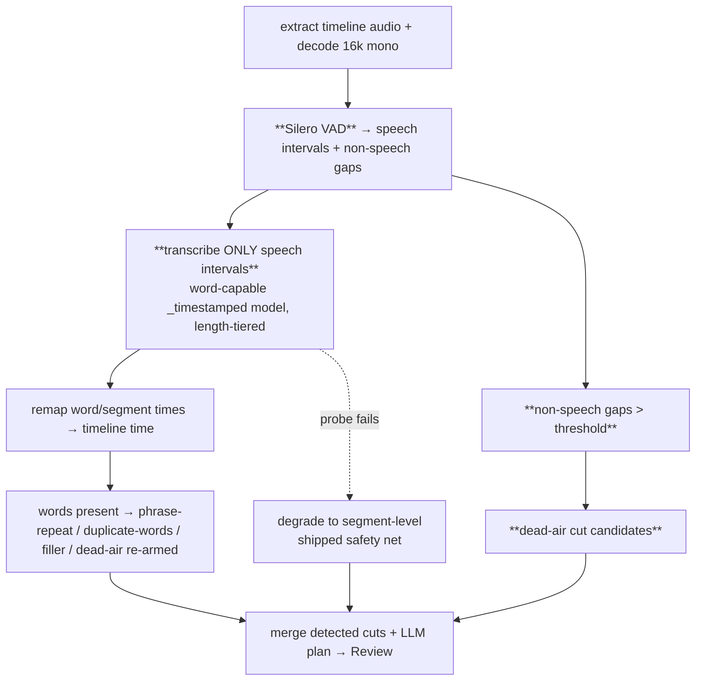

# feat: AI CUT — restore word timestamps + Silero VAD

## Summary

Restore Whisper **word timestamps** to the Director/analysis path by switching to a word-capable (`_timestamped`) ONNX export, which re-arms four dormant detectors (`phrase-repeat`, `duplicate-words`, `filler-words`, `dead-air`) and fixes the surviving back-to-back repeats. Add **Silero VAD** to (a) gate transcription to speech only — clawing back the speed cost of the larger model and removing the silence-hallucination/OOM failure modes — and (b) surface long non-speech gaps as reviewable "dead air" cut candidates (the silent "just sitting there" footage text-only directing can't see). This **supersedes** the prior plan's `selectAnalysisModel` decision (auto-`whisper-tiny`, words-off) — words win, VAD provides the speed. See origin: `docs/brainstorms/2026-06-20-ai-cut-words-vad-requirements.md`.

The whole approach hinges on one execution-time fact — **whether a `_timestamped` export actually emits word timestamps in our installed transformers.js version** — so the first unit is a verification spike that gates the rest.

---

## Problem Frame

Two root causes degrade AI CUT on real (long) footage: word timestamps are off (default model can't emit cross-attention timing → the four word-level detectors are dark → repeats/fillers survive), and there's no voice-activity gating (all audio incl. 30–50% silence is fed to Whisper → slow, OOM-prone, hallucinates over silence, blind to non-speech dead-time above the dB threshold). This plan addresses both, keeping the local-first/in-browser identity.

---

## Requirements (traceability to origin)

- **R1** — Analysis path selects a word-capable model automatically by length; words requested at every length. (origin R1)
- **R2** — With words available, `phrase-repeat`/`duplicate-words`/`filler-words`/`dead-air` run and contribute review rows. (origin R2; goal G1/G2)
- **R3** — VAD gates transcription to speech intervals; long-source wall-clock no worse than today's degraded path. (origin R3; goal G3)
- **R4** — Non-speech gaps beyond a threshold become deduped "dead air" cut candidates. (origin R4; goal G2)
- **R5** — If the model can't emit words (probe fails), the run degrades to segment-level and completes; no OOM on a 16-min source. (origin R5; goal G4)
- **R6** — Captions (user-picked model) unchanged; word-model + VAD apply to the Director/analysis path only. (origin R6; goal G5)
- **R7** — Model + VAD assets download once and cache; combined size acceptable. (origin R7)

---

## Key Technical Decisions

- **KTD1 — Words always on, no user knob (auto by length).** `selectAnalysisModel` always returns a `_timestamped` model; size varies by source length. Supersedes the shipped tiny-for-speed selector. *Rationale:* re-arming the detectors is the whole point; VAD pays for the speed.
- **KTD2 — The model-capability check is a spike, gating everything (U1).** Which `_timestamped` exports work is an execution-time fact (the `large-v3-turbo_timestamped` export was broken then fixed in transformers.js PR #1594). Resolve it first, in code, before building on it. The shipped U1 probe is the runtime safety net (KTD5).
- **KTD3 — VAD augments, does not replace, silence-removal (confirmed with user).** The dB `remove-silences` ripple stays as the upfront trim; VAD adds transcription gating + dead-air cut candidates. *Rationale:* lower risk; the dB pass works. Replacing it is a deferred follow-up.
- **KTD4 — VAD library: `vad-web` (Silero via onnxruntime-web) in a Web Worker.** ~2 MB MIT model, browser-proven; mirrors the existing worker-isolated transcription pattern. *Rationale:* the lightest viable in-browser path per research; avoids coupling VAD to the transformers.js whisper pipeline. Confirm the exact package/runtime in U3.
- **KTD5 — Probe-degrade stays the safety net.** The shipped `probeWordCapability` means a word-capable model that turns out not to emit words still completes (segment-level). U1's spike chooses the model; U1-probe guarantees no hard failure.

---

## High-Level Technical Design

New analysis pipeline (changed nodes in **bold**):

Today: A → (full transcribe, tiny/degraded, words off) → only LLM + pacing + segment-repeat. The change inserts VAD between decode and transcribe, swaps the model for a word-capable one, and adds the dead-air-gap detector.

---

## Scope Boundaries

**In scope:** R1–R7 — word-capable model selection + re-armed detectors, VAD-gated transcription, VAD dead-air cuts.

### Deferred to Follow-Up Work
- Replacing the dB `remove-silences` pass with VAD entirely (KTD3 chose augment).
- Retaining `whisper-tiny` as a last-resort fallback for sources too long even for `base_timestamped`, if the spike shows it's needed.

### Deferred for later (from origin)
- Paraphrase-aware repeat detection (MiniLM sentence embeddings).
- Visual dead-time detection (frame-diff / face-presence).

### Outside this product's identity (from origin)
- Server-side transcription (faster-whisper on a GPU) — breaks local-first.

---

## Implementation Units

### U1. Verify word-capable model + register candidates (spike)
- **Goal:** determine which `_timestamped` exports actually emit word timestamps in our installed transformers.js version, and register the working ones. (R1, R5; KTD2)
- **Requirements:** R1, R5
- **Dependencies:** none
- **Files:** `apps/web/src/transcription/models.ts` (registry — upstream-origin, PATCHES.md row); a scratch/dev probe harness (not shipped) or a one-off check via the existing worker.
- **Approach:** confirm `onnx-community/whisper-base_timestamped` and `whisper-medium.en_timestamped` (and check for a tiny/small `_timestamped`) load and return non-empty `chunks[].timestamp` under `return_timestamps:"word"` on a short speech clip — reusing the shipped `probeWordCapability` path. Record each working model's id, languages (base = multilingual, medium.en = English-only), and approximate download size. Add the working ids to the registry. **Contingency:** if none emit words, stop here — the words-on requirements (R1/R2) are unachievable on this transformers.js version; fall back to the shipped probe-degrade and re-scope this plan to VAD-only (U3–U5 still deliver speed + dead-air).
- **Execution note:** this is a spike — its deliverable is the verified model list + a go/no-go for U2, not production logic. Verify against the actual installed `@huggingface/transformers` version, not docs.
- **Test scenarios:** `Test expectation: none -- spike; the finding (which ids work) is the output. Capture the verification result in the U1 PR description / docs/TO-VERIFY.md.`
- **Verification:** a named `_timestamped` id produces word-level `chunks` in our app; its id(s) + sizes recorded for U2. Or: documented no-go + re-scope.

### U2. Revise `selectAnalysisModel` to a word-capable, length-tiered selector
- **Goal:** always pick a word-capable model, size auto-chosen by length (supersedes the shipped tiny selector). (R1, R6; KTD1)
- **Requirements:** R1, R6
- **Dependencies:** U1 (which ids work + sizes)
- **Files:** `apps/web/src/transcription/analysis-model.ts` + `apps/web/src/transcription/__tests__/analysis-model.test.ts` (both ours).
- **Approach:** return the verified word-capable ids: a more accurate one below a length threshold, a smaller one (`base_timestamped`) above it; never a words-off model. Keep it a pure one-place selector with a named threshold constant. Leave caption-path model selection (`apps/web/src/subtitles/`) untouched (R6).
- **Patterns to follow:** the current `selectAnalysisModel` shape (this revises it).
- **Test scenarios:** short length → accurate word-capable id; long length → `base_timestamped`; boundary; the 16-min repro → word-capable (not tiny); never returns a non-`_timestamped` id. `Covers R1.`
- **Verification:** unit tests green; a Director run on a long source loads a `_timestamped` model and the word-level detectors produce rows.

### U3. Silero VAD module (decode → speech intervals + non-speech gaps)
- **Goal:** a worker-isolated VAD that turns decoded timeline audio into speech intervals and non-speech gaps. (R3, R4; KTD4)
- **Requirements:** R3, R4
- **Dependencies:** none (parallel to U1/U2)
- **Files:** new `apps/web/src/services/vad/` (worker + service, mirroring `services/transcription/`); a pure interval helper + `__tests__` (ours); `package.json` if a VAD dep is added.
- **Approach:** confirm and wire the VAD library (KTD4 — `vad-web`/onnxruntime-web; fall back to a transformers.js VAD if cleaner). Input: the 16k mono Float32 the transcription path already decodes (reuse `decodeAudioToFloat32`, don't double-decode). Output: `{ speech: Interval[], gaps: Interval[] }` in seconds. Keep the interval math (merge adjacent, min-duration, padding) in a **pure, tested** helper separate from the worker.
- **Patterns to follow:** `apps/web/src/services/transcription/{worker,service}.ts` (worker lifecycle, progress messages, model download).
- **Test scenarios:** pure interval helper — merge near-adjacent speech; drop sub-min-duration blips; pad speech edges; complement gaps cover `[0,total]`; all-speech and all-silence inputs. `Covers R3, R4.` (VAD worker decode itself = live-verify.)
- **Verification:** on a real clip, VAD returns plausible speech/gap intervals; model downloads once and caches.

### U4. VAD-gated transcription (transcribe speech only; remap to timeline time)
- **Goal:** feed Whisper only speech intervals and stitch word/segment times back to absolute timeline time — the speed/OOM/no-hallucination win. (R3, R5; G3)
- **Requirements:** R3, R5
- **Dependencies:** U2, U3
- **Files:** `apps/web/src/features/transcription/transcript-cache.ts` (pipeline — ours); a pure timestamp-remap helper + `__tests__` (ours); possibly `apps/web/src/services/transcription/worker.ts` (upstream — PATCHES if its message contract changes).
- **Approach:** between decode and transcribe, run U3's VAD; transcribe each speech interval (or a concatenation with known offsets) with the U2 model; **remap** each returned word/segment time by its interval's offset so all times are timeline-absolute. Preserve the shipped probe-degrade (R5) and the transcript cache (key stays timeline-hash; words present when the model supports them). Keep the honest "Transcribing…" progress (shipped U2).
- **Technical design (directional):** if concatenating speech intervals into one buffer, keep an ordered `(bufferOffsetSec → timelineStartSec)` map and add `timelineStart - bufferOffset` to each emitted time; if transcribing per-interval, add the interval's start to each time. Either way the remap is the pure, tested core.
- **Patterns to follow:** the existing `run()` in `transcript-cache.ts`; the shipped stream-resample (U4 prior plan) for chunked-audio discipline.
- **Test scenarios:** remap helper — single interval offset; multiple intervals with gaps (times land in the right absolute place, monotonic, no overlap); empty speech → empty transcript (not a crash); a word exactly at an interval boundary. `Covers R3.` Degrade path still returns segments (R5). End-to-end speed/OOM = live-verify.
- **Verification:** a 16-min source transcribes without OOM, not slower than today; transcript times line up with the timeline (cuts land correctly).

### U5. VAD dead-air cut candidates
- **Goal:** turn long non-speech gaps into reviewable "dead air" Director cut rows, deduped against existing cuts. (R4; G2)
- **Requirements:** R4
- **Dependencies:** U3
- **Files:** new `apps/web/src/features/ai-generate/director/vad-dead-air.ts` + `__tests__` (ours); `apps/web/src/features/ai-generate/director/run-director.ts` (wire into `detectedCuts`, ours).
- **Approach:** a pure detector: non-speech gaps longer than a threshold (leaving a breath of padding, like `pacing`) → `cut` ops with `category: "deadair"` (badge already exists). Filter against the shipped word-level/pacing cuts the same way `segmentRepeatCuts` is filtered (drop overlaps), so VAD dead-air doesn't double with `dead-air`/`pacing`.
- **Patterns to follow:** `apps/web/src/features/ai-generate/director/pacing.ts` and the `segmentRepeatCuts` overlap-filter in `run-director.ts`.
- **Test scenarios:** gap > threshold → one cut with padding + `category:"deadair"`; gap ≤ threshold → nothing; back-to-back gaps; a gap fully inside an existing cut → filtered out; empty gaps → no ops. `Covers R4.`
- **Verification:** on a clip with silent dead-time, "dead air" rows appear in the Review modal and apply correctly; no duplicate rows vs pacing/dead-air.

---

## Risks & Dependencies

- **U1 is the hinge (highest risk).** If no `_timestamped` export emits words in our transformers.js version, R1/R2/G1 are unachievable now — the plan degrades to VAD-only (U3–U5 still ship speed + dead-air) and the repeat-fix waits on a transformers.js upgrade. Resolve U1 before investing in U2.
- **Timestamp remap correctness (U4).** Transcribing disjoint speech intervals and mapping times back is the subtlest part; a wrong offset misplaces every cut. Mitigated by the pure remap helper + boundary tests.
- **VAD library fit (U3).** `vad-web`/onnxruntime-web must run in a worker alongside the transformers.js whisper worker without contention; another ~2 MB download. Confirm in U3; fall back to a transformers.js VAD if cleaner.
- **Speed claim (G3/R3).** Words-on (`base_timestamped` > tiny) must be offset by VAD's silence savings to not regress wall-clock — verify on a real 16-min source, not assumed.
- **Download budget (R7).** `base_timestamped` (and/or `medium.en`) + the VAD model are one-time downloads; confirm acceptable.
- **Upstream files (Hard Rule 1).** `models.ts` and any `worker.ts` contract change need PATCHES.md rows. `analysis-model.ts`, `transcript-cache.ts`, the new `vad/` + `vad-dead-air.ts` are ours.

---

## Test Strategy

- **Unit (bun, pure, wasm-free):** revised `selectAnalysisModel` (U2), VAD interval helper (U3), timestamp-remap helper (U4), dead-air-gap detector (U5). Mock `@/wasm` if any test file pulls it.
- **Live-verify (browser → docs/TO-VERIFY.md):** word detectors re-arm on a real source (G1/G2); 16-min transcribes without OOM and not slower (G3); dead-air rows appear (G2); captions unchanged (G6); degrade still completes if the model can't do words (G4).
- **Gates per unit:** `tsc --noEmit` on apps/web clean; ESLint clean on touched files (`opencut/prefer-object-params`, `@typescript-eslint/no-unsafe-type-assertion`); director + media + transcription bun suites green.

---

## Sequencing

**U1 first, alone** (go/no-go on the whole words-on arc). Then **U2** (selector) and **U3** (VAD module) in parallel. Then **U4** (VAD-gated transcription, needs U2+U3) and **U5** (dead-air cuts, needs U3). U5 can land before U4 since both only need U3.

---

## Sources & Research

- Origin: `docs/brainstorms/2026-06-20-ai-cut-words-vad-requirements.md`; ideation: `docs/ideation/2026-06-20-ai-cut-fast-reliable-ideation.md`.
- External (this session's research): Silero VAD (`snakers4/silero-vad`, MIT, 2 MB) + browser wrapper `ocavue/vad-web`; `_timestamped` whisper exports (`onnx-community/whisper-base_timestamped`, `whisper-medium.en_timestamped`); transformers.js word-timestamp fix PR #1594; Xenova in-browser VAD+Whisper demo. These shaped KTD1–KTD4 and U1's candidate list.
- Builds on shipped work this session: U1-probe (degrade safety net), U4 stream-resample (long-audio decode), `segment-repeat` (overlap-filter pattern for U5). Supersedes shipped `selectAnalysisModel` (tiny-for-speed).
