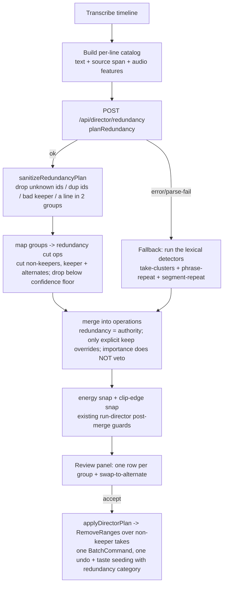

# feat: AI Director — Dedicated LLM Redundancy Pass

**Origin:** [docs/brainstorms/2026-06-23-director-repeat-detection-requirements.md](../brainstorms/2026-06-23-director-repeat-detection-requirements.md)

## Summary

Replace the brittle lexical repeat-catching (take-clusters / phrase-repeat / segment-repeat, all near-verbatim only) with a single **dedicated LLM redundancy pass**: a focused call that reads the whole transcript, groups lines that make the same point — verbatim retakes **and** reworded restatements — and keeps the best-delivered take per group. Conservative (high-confidence only), review-gated, with swap-to-alternate. The lexical detectors drop to a **route-error fallback**. Mirrors the existing `planDirector` / `planAssembly` → `planJson` → `sanitize` → review architecture; it threads into the **existing** layered Director orchestration (merge → keeper-protection → energy/clip-edge snap → apply), not a clean rewrite.

---

## Problem Frame

The Director leaves repeats in the cut. They come in two forms and both slip through (see origin): **near-verbatim retakes** fall through the lexical detectors' brittle gates (word-timestamp dependency, 3s same-clip gap, consecutive-only matching), and **paraphrased restatements** are mathematically uncatchable by token overlap. The general "cut" prompt is the only paraphrase catch today and does redundancy inconsistently because it does everything at once. Per-detector patching has not converged.

The fix is a mechanism that judges whether two utterances **mean** the same thing — an LLM pass dedicated solely to redundancy.

---

## Requirements (trace to origin)

- **R1** — Dedicated redundancy LLM pass over the full transcript; covers verbatim + paraphrase (meaning-based). → U1, U2, U4
- **R2** — Conservative / high-confidence; ambiguous lines left ungrouped; confidence is a tunable dial. → U1 (prompt), KTD-3 (confidence floor)
- **R3** — Protect intentional repetition (callbacks, recaps, emphasis). → U1 (prompt)
- **R4** — Best-delivery keeper, grounded in existing per-clip audio features (loudness / filler / wpm) + transcript. → U3, U1, KTD-8
- **R5** — Swap to any alternate take per group in review. → U5
- **R6** — Review-gated; accepting removes the non-keeper takes; one undo. → U4, U5, System-Wide Impact
- **R7** — Primary repeat-catcher when the redundancy pass runs; lexical detectors + the general prompt's redundancy clause stop contributing repeat rows; lexical detectors remain the **route-error fallback**. → U4, KTD-5
- **R8** — Anti-hallucination: groups may only reference real transcript lines; invalid references dropped before review. → U1 (sanitize)

**Success criteria (origin S1–S4):** catches the obvious repeats of both types that survive today (S1); does not flag distinct or intentional repetition (S2); keeps the best take with swap (S3); one coherent set of repeat rows, no double-flagging (S4).

---

## Key Technical Decisions

- **KTD-1 — Separate focused call.** The redundancy pass is its own route + prompt + schema (`/api/director/redundancy`), mirroring `/api/director/assemble`. A focused task is the whole reason it beats today's catch-all prompt. Accepted cost: one extra LLM round-trip per Director run. (Confirmed with user.)

- **KTD-2 — Keeper chosen by the LLM, grounded in audio features.** The per-line catalog carries the audio features the bin already computes (`loudnessRelative`, `fillerCandidate`, `wpm` from `SpeechFeatures`). The prompt asks the LLM to pick the best-delivered take using those signals + transcript clarity — a single authority inside the pass. When features are absent (no audio), it falls back to transcript only.

- **KTD-3 — Confidence as a pre-filter.** Each group carries an LLM `confidence`; the client drops groups below a tunable `REDUNDANCY_CONFIDENCE_FLOOR` constant (start ~0.7, **inclusive** — a group exactly at the floor is kept). The "conservative" instruction lives in the prompt (R2); the floor is the second gate; review-gating is the final gate.

- **KTD-4 — One review entry per group.** A group of N takes renders as ONE row ("Repeat — keeping the best of N takes"), whose accept removes the N−1 non-keeper takes. Swap re-targets which take is kept. The group is a **review-time abstraction only** — the apply layer sees N−1 flat `cut` ops (so the "one undo" claim holds with no apply-layer change).

- **KTD-5 — Route-error fallback, not "no LLM."** Every auth mode (`api-key`/`claude-code`/`custom`) dispatches to an LLM and all handle text, so "no LLM available" never fires. The real fallback trigger is the **redundancy route call failing** (network / non-200 / parse error). `run-director` currently *throws* on a failed plan call; the redundancy call needs a **non-throwing** path that falls through to the existing lexical detectors (today's behavior). The gating decision ("did the redundancy pass produce usable groups?" → skip lexical repeat detectors; else run them) is extracted to a **pure, testable helper**.

- **KTD-6 — New `redundancy` op category, not reused `"repeat"`.** `phrase-repeat`, `segment-repeat`, and the existing `director/redundancy.ts` all emit `category: "repeat"`, and `review-format.ts` hardcodes the `"repeat"` rejected-hint to "Keeping the restatement" (singular) — wrong for the group model. Add a distinct `"redundancy"` category to `DirectorOpCategory` (hf-bridge `author.ts`), `taste.ts` (`CATEGORIES` + `CATEGORY_LABEL`), and `review-format.ts` (`CATEGORY_BADGE` + a group-aware rejected-hint). Same additive pattern this session used for `"noise"`. Keeps LLM-vs-lexical taste signals separable and the review copy correct.

- **KTD-7 — Redundancy cuts are the redundancy authority on the LLM path.** `mergeDetectedCuts` drops any removal covering ≥50% of a protected keeper (take-cluster keepers ∪ importance `protectedSpans` ∪ `llmKeepSpans`). A redundant-but-loud take can be importance-protected and would silently **veto** the redundancy cut. Decision precedence: an explicit LLM `keep` op **overrides** a redundancy cut (never cut an explicitly-kept span), but the **importance floor must NOT veto** a redundancy cut (redundancy is a stronger signal than the heuristic emphasis floor). On the LLM path the lexical take-cluster keepers don't exist (those detectors are demoted), so the only keepers in play are `llmKeepSpans` (honored) and `protectedSpans` (must not veto redundancy). Exact merge wiring — a dedicated keeper set excluding `protectedSpans`, or routing redundancy cuts around the importance-protection — is resolved in U4.

- **KTD-8 — Best-delivered keeper intentionally overrides the shipped keep-last doctrine.** `take-clusters.ts` keeps the LATEST take unconditionally ("recency wins outright"). The LLM pass reintroduces audio/clarity judgment as the keeper criterion — a deliberate override **on the LLM path**. The route-error fallback reverts to keep-last. This divergence (best-delivered when the pass runs, keep-last on fallback) is a known, stated design choice, not an accident.

---

## High-Level Technical Design

The redundancy pass replaces the repeat-catching role of the lexical detectors and the general prompt's redundancy clause; the general cut prompt still handles filler / dead-time / tangents. Redundancy cuts join `operations` **upstream of** the existing energy-snap + clip-edge-snap chain so they inherit this session's mid-word / sliver guards.

---

## System-Wide Impact

The new cuts must survive the full post-merge pipeline already in `run-director.ts` — the plan's earlier draft stopped at "apply" and missed this fan-out:

- **Snap guards (this session's work).** Every merged removal flows through `snapRemovalOps` (energy-trough snap) then `snapRemovalsToClipEdges` (remnant swallow). Redundancy cuts MUST join `operations` before that chain, or they regress to mid-word cuts + clip-edge slivers — the exact bugs those guards fixed. U4 must place them upstream of the snaps.
- **Keeper protection.** See KTD-7 — redundancy cuts must not be vetoed by the importance floor.
- **Taste seeding.** `noteReviewDecisions` fires on apply for every op; the new `"redundancy"` category (KTD-6) must be in `taste.ts` `CATEGORIES`/`CATEGORY_LABEL` so the signal lands cleanly and separably.
- **Apply layer.** `applyDirectorPlan` → `planRemovalRanges` → `RemoveRangesCommand` in a `BatchCommand` needs **no change** — a group is N−1 flat `cut` ops to the apply layer (KTD-4); one undo holds.
- **Review store.** The swap-to-alternate (U5) is **net-new** `director-plan-store` surface (the store has `toggle`/`setAll`, no swap action today) — not a reuse of the auto-assemble `assembly-draft.ts` swap. U5 adds a store action.
- **Shared prompt.** Trimming the redundancy clause from `buildDirectorPrompt` (U4) also affects `run-highlight.ts` (same `/api/director/plan` route) and `buildDirectorVisionPrompt` (wraps it). Impact is **bounded and safe**: highlight reads only `keep` ops, vision inherits the same cut semantics. Note it; no separate handling needed.

---

## Implementation Units

### U1. LLM redundancy planner in hf-bridge

**Goal:** A focused LLM pass that groups same-meaning transcript lines and names a keeper.
**Requirements:** R1, R2, R3, R4 (consumes features), R8.
**Dependencies:** none.
**Files:**
- `packages/hf-bridge/src/llm-redundancy.ts` (new — named to avoid colliding with the existing `apps/web/src/features/ai-generate/director/redundancy.ts`, the deterministic take-cluster mapper). Exports `RedundancyLine` / `RedundancyGroup` / `RedundancyPlan`, `buildRedundancyPrompt`, `sanitizeRedundancyPlan`, `planRedundancy` (dispatch via `planJson`).
- `packages/hf-bridge/src/index.ts` (modify) — export the new surface.
- `packages/hf-bridge/src/author.ts` (modify) — add `"redundancy"` to `DirectorOpCategory` (KTD-6).
- `packages/hf-bridge/src/__tests__/llm-redundancy.test.ts` (new).

**Approach:** Input is a numbered line list (id, text, source-clip label, start/end, audio-feature signals). Prompt: group only lines you are CONFIDENT make the same point — verbatim OR reworded; LEAVE intentional repetition (callbacks, recaps, emphasis) ungrouped (R3); pick the best-delivered take per group using loudness/filler/wpm + clarity (R4); return `{ groups: [{ lineIds, keeperLineId, confidence, reason }] }`. `sanitizeRedundancyPlan` enforces R8 + the dedup rules below. Mirrors `sanitizeAssemblyPlan` (snap-to-real-id, `used` set).

**Sanitize rules (resolve before mapping):** dedupe `lineIds` **within** a group before the member-count check; drop a group with < 2 *distinct* members; drop a group whose `keeperLineId` isn't a surviving member; a `lineId` may belong to **at most one group** — the first group (in order) claims it, later groups drop that shared id (and then re-check the < 2 gate); clamp `confidence` to [0,1].

**Patterns to follow:** `packages/hf-bridge/src/assemble.ts` (`sanitizeAssemblyPlan`, `planAssembly`), `author.ts` (`buildDirectorPrompt`, `DirectorOpCategory`).

**Test scenarios (`llm-redundancy.test.ts`):**
- `buildRedundancyPrompt` includes the conservative + protect-intentional-repetition instructions; renders a line's audio signals; a line with NO features renders without leaking `undefined`/`NaN` (KTD-2 degrade path). *Covers R2, R3.*
- A well-formed plan (2-line group, valid keeper) passes through. *Covers AE: same-point group survives.*
- Drops a group referencing a line id not in the input. *Covers R8.*
- Drops a group with one entry; drops `{lineIds:[L1,L1]}` (one distinct member after dedup); `{lineIds:[L1,L1,L2]}` → 2 distinct members survive.
- Drops a group whose `keeperLineId` isn't a member.
- A line in TWO groups: the first group claims it; the second drops the shared id (and is itself dropped if it falls below 2 distinct members). *Covers S4.*
- Malformed shapes never throw: `{groups:"x"}` → empty; a group whose `lineIds` is a string → dropped; `lineIds:[1,2]` (numbers) → dropped. *Covers R8.*
- Clamps an out-of-range `confidence`; coerces a non-numeric one to a default.
- Empty / no-groups input → empty plan.

**Verification:** `bun test` green for `llm-redundancy.test.ts`; tsc + lint clean for the package; the new category compiles across `taste.ts`/`review-format.ts` (total-record types catch a miss).

---

### U2. `/api/director/redundancy` route

**Goal:** Server endpoint that runs `planRedundancy`.
**Requirements:** R1.
**Dependencies:** U1.
**Files:**
- `apps/web/src/app/api/director/redundancy/route.ts` (new).
- `apps/web/src/app/api/director/redundancy/__tests__/route.test.ts` (new).

**Approach:** POST `{ lines, taste? }`; reads AI auth headers; calls `planRedundancy`; returns `{ plan, usage }`. Validation mirrors the plan/assemble routes (400 on a missing/!array `lines`). **Mock `planRedundancy`** in the route test — a route importing a new hf-bridge value fails to load if the mock omits it (prior vision regression lesson).

**Patterns to follow:** `apps/web/src/app/api/director/assemble/route.ts`, `apps/web/src/app/api/director/plan/route.ts` + its `__tests__/route.test.ts`.

**Test scenarios:**
- 400 when `lines` is missing or not an array.
- Happy path: valid body → calls (mocked) `planRedundancy` → returns its plan + usage.
- Planner throwing surfaces as a 500 with the error message.

**Verification:** route tests green; the editor builds (route loads).

---

### U3. Redundancy candidate catalog builder (pure)

**Goal:** Build the numbered-line catalog (text + source span + audio features) that feeds U1's prompt.
**Requirements:** R1, R4.
**Dependencies:** none (pure; consumed by U4).
**Files:**
- `apps/web/src/features/ai-generate/director/redundancy-catalog.ts` (new).
- `apps/web/src/features/ai-generate/director/__tests__/redundancy-catalog.test.ts` (new).

**Approach:** From the timeline transcript segments + `SpeechFeatures[]` + the per-asset source map, produce `RedundancyLine[]`. **Line ids are index-based** (e.g. `L0`, `L1`, …), NOT start-based — two segments can share a rounded start-second (the `featureByStart` join already rounds to 3 decimals), and a start-based id would collide and cut the wrong span. Join features to segments by start-second; omit feature fields when no feature joins (degrade to transcript-only keeper, KTD-2). A segment with no source-clip mapping (`groupTranscriptByAsset`/`timelineTimeToSource` return null over a gap) omits `clipName` rather than leaking `undefined`.

**Patterns to follow:** `build-signal-table.ts` (feature-by-start join), `asset-catalog.ts`, `source-map.ts` (`groupTranscriptByAsset`).

**Test scenarios:**
- Builds one line per segment with feature signals joined by start-second.
- **Two segments at the same start-second get DISTINCT ids** (index-based). *Guards the cut-the-wrong-span bug.*
- A segment with no matching feature → line with feature fields omitted (no NaN/undefined).
- A segment with no source-clip mapping → `clipName` omitted, no `undefined` leak.
- Partial features (some segments have audio, some don't) → per-line degradation, no throw.
- Empty segments → empty catalog.

**Verification:** `bun test` green; pure + wasm-free.

---

### U4. Orchestration: run the pass, map groups, demote lexical detectors

**Goal:** Thread the redundancy pass into the REAL `run-director.ts` (a layered ~270-line orchestration): call the route, map groups → redundancy cut ops, merge as the authority (KTD-7), gate the lexical repeat detectors behind the route-error fallback (KTD-5), and trim the general prompt's redundancy clause.
**Requirements:** R6, R7 (+ consumes R1–R4 outputs).
**Dependencies:** U1, U2, U3.
**Files:**
- `apps/web/src/features/ai-generate/director/redundancy-apply.ts` (new, pure) — `mapRedundancyGroups` (groups → `cut` ops over non-keepers, `category: "redundancy"`, dropping groups below the confidence floor) + an alternates map for U5; and `shouldRunLexicalRepeatDetectors` (the pure gating predicate: redundancy pass produced usable groups → false; route errored → true).
- `apps/web/src/features/ai-generate/director/run-director.ts` (modify) — build the catalog (U3), POST the route inside a try/catch (non-throwing — KTD-5), on success map groups + skip `buildTakeClusters`/`detectPhraseRepeatCuts`/`detectSegmentRepeatCuts`/`detectRedundancyCuts`, on error run them; merge redundancy cuts so they reach `operations` **upstream of** the existing energy/clip-edge snap chain (System-Wide Impact) and are not vetoed by `protectedSpans` (KTD-7).
- `packages/hf-bridge/src/author.ts` (modify) — trim the REDUNDANT-RESTATEMENT clause from `buildDirectorPrompt` (the dedicated pass owns redundancy; the general prompt keeps filler/dead-time/tangents). Safe for highlight + vision (System-Wide Impact).
- `apps/web/src/features/ai-generate/director/__tests__/redundancy-apply.test.ts` (new).

**Approach:** `mapRedundancyGroups` is pure: for each above-floor group, emit `cut` ops over every non-keeper member's `[startSec,endSec)` (`category: "redundancy"`); a group that reduces to keeper-only emits ZERO cuts (never cut the keeper). The merge in `run-director` honors explicit LLM `keep` ops over redundancy cuts but lets redundancy override the importance floor (KTD-7). `run-director.ts` and `author.ts` are project-authored/hf-bridge → no PATCHES.

**Test scenarios (`redundancy-apply.test.ts`):**
- A 3-take group → 2 cut ops (non-keepers), keeper not cut, both `category: "redundancy"`.
- Keeper is the earliest member → still cuts the later takes (best-delivered, not keep-last — KTD-8).
- A group that reduces to keeper-only → 0 cut ops, no throw.
- Confidence floor boundary: group at 0.6 with floor 0.7 → 0 cuts; group at exactly 0.7 → cuts (inclusive — KTD-3).
- Cross-group overlapping non-keeper spans → the merged set is flat/non-overlapping; name the winner (first cut wins, later overlapping cut dropped). *Covers S4 under stress.*
- `shouldRunLexicalRepeatDetectors`: usable redundancy groups → false; route-error sentinel / empty result → true. *Covers R7/S4 gating.*
- Demotion negative test: given LLM redundancy groups AND take-clusters that would also fire, the final op set contains the redundancy cuts and NONE of the lexical repeat cuts. *Covers S4 (no double-flagging).*
- The alternates map lists all takes per group for swap.

**Verification:** `redundancy-apply` tests green; the `run-director` fetch/wiring + the upstream-of-snap placement are live-verify (wasm boundary) — record in `docs/TO-VERIFY.md`.

---

### U5. Review panel: redundancy group rows + swap-to-alternate

**Goal:** Show each redundancy group as one review row (kept take + cut takes) with swap-to-alternate; accept removes the non-keeper takes (one undo).
**Requirements:** R5, R6.
**Dependencies:** U4.
**Files:**
- `apps/web/src/features/ai-generate/director/review-format.ts` (modify) — `"redundancy"` → `CATEGORY_BADGE` ("Repeat") + a **group-aware** rejected-hint ("Keeping all N takes"), distinct from the per-op `"repeat"` hint; + the swap-target recompute helper.
- `apps/web/src/features/ai-generate/director/director-plan-store.ts` (modify) — a **net-new** swap action (the store has only `toggle`/`setAll` today).
- `apps/web/src/features/ai-generate/director/components/director-review-dialog.tsx` (modify) — render the group row + swap control.
- `apps/web/src/features/ai-generate/director/__tests__/review-format.test.ts` (modify).

**Approach:** Minimal version first (one row per group, keep-best, accept cuts the rest); the swap dropdown layers on, recomputing which non-keepers are cut when the keeper changes. Apply via the existing `applyDirectorPlan` / `RemoveRangesCommand` (one undo — KTD-4).

**Patterns to follow:** `review-format.ts` (`describeReviewOp`), `assembly-draft.ts` `swapSpan` (the recompute shape, though the store action is new), `components/director-panel.tsx` (swap UI).

**Test scenarios (pure parts):**
- `describeReviewOp` renders the group row label with take count + confidence; the `"redundancy"` badge shows.
- Rejecting a redundancy row → hint "Keeping all N takes" (NOT the per-op `"repeat"` "Keeping the restatement").
- Swap-target recompute: given a group's takes + a chosen keeper, returns the takes to cut = all but chosen.
- Swap to the CURRENT keeper → no-op (cut set unchanged), no throw.
- 2-take group, swap keeper L2→L1 → cut set becomes `{L2}` (was `{L1}`).

**Verification:** review-format tests green; the dialog render + swap interaction are live-verify (DOM) — record in `docs/TO-VERIFY.md`.

---

## Scope Boundaries

**In scope:** the dedicated redundancy LLM pass (prompt + schema + sanitize + route), the per-line catalog with audio features, the group→cut mapping with the new `redundancy` category, keeper-authority merge precedence, the route-error fallback gating, the System-Wide snap/taste integration, the review row + swap-to-alternate, review-gated apply, trimming the general prompt's redundancy clause.

**Out of scope (origin):**
- Local semantic embeddings / a client-side similarity model (Approaches A/C) — revisit only if the LLM pass proves insufficient.
- Whole-topic / section-level repetition — utterance level only.
- Any auto-apply / non-review path.

**Deferred to Follow-Up Work:**
- Folding redundancy into the existing plan call to save the extra round-trip (KTD-1 rejected it; revisit only if cost becomes a problem).
- Chunking for transcripts that exceed model context (assumed not to in normal use — see Risks).
- Removing the now-demoted lexical detectors entirely (kept as the route-error fallback for now).
- Reconciling the keep-last vs best-delivered keeper doctrine across both paths into one rule (KTD-8 accepts the divergence for v1).

---

## Risks & Dependencies

- **LLM availability.** Requires a text LLM (claude-code subscription or API key — both handle text). The fallback fires on a **route error**, not absence (KTD-5) — verify the non-throwing fall-through actually runs the lexical detectors on a forced 500.
- **Keeper-authority wiring (KTD-7).** The merge precedence (explicit keep > redundancy cut > importance floor) is the subtlest part; a wrong wiring silently drops redundancy cuts. The demotion negative test (U4) guards it.
- **Snap routing (System-Wide Impact).** If redundancy cuts bypass the energy/clip-edge snap chain they regress to mid-word cuts + slivers. U4 must place them upstream of the snaps.
- **Context size.** Assumes a full transcript fits the model context (Opus ~200k tokens ≫ an hour). Chunking is deferred — flag, don't pre-build.
- **Cost.** One extra LLM round-trip per Director run (KTD-1, accepted).
- **Over/under-cutting.** Conservative prompt + confidence floor + review-gating bound false positives; tune `REDUNDANCY_CONFIDENCE_FLOOR` against real footage if it under-catches — don't guess.

---

## Open Questions (deferred to implementation)

- Exact `REDUNDANCY_CONFIDENCE_FLOOR` default — start ~0.7, tune against real footage (KTD-3).
- KTD-7 merge wiring: a dedicated keeper set that excludes `protectedSpans`, vs. routing redundancy cuts around `mergeDetectedCuts`'s importance protection — resolve against the real `run-director` merge call during U4.
- Whether the swap control reaches full auto-assemble parity on day one or ships minimal-first (U5 ships keep-best first, swap layered).
- Whether to surface the extra-call cost in the token counter UI (minor; follow the existing usage-accumulation pattern).

---

## Sources & Research

- **Origin requirements:** [docs/brainstorms/2026-06-23-director-repeat-detection-requirements.md](../brainstorms/2026-06-23-director-repeat-detection-requirements.md) (verified present).
- **Local patterns (this session's grounding + the deepening pass):** `packages/hf-bridge/src/author.ts` (planDirector / buildDirectorPrompt / `DirectorOpCategory` / planDispatch — every auth mode dispatches to an LLM), `packages/hf-bridge/src/assemble.ts` (planAssembly / sanitizeAssemblyPlan), `apps/web/src/app/api/director/{plan,assemble}/route.ts`, `apps/web/src/features/ai-generate/director/run-director.ts` (the real layered orchestration: merged detector stack → `mergeDetectedCuts` keeper-protection → `snapRemovalOps` → `snapRemovalsToClipEdges`), `cut-utils.ts` (`mergeDetectedCuts` 50%-keeper rule), `taste.ts` (per-category learning), `review-format.ts` (`"repeat"` rejected-hint), the existing `director/redundancy.ts` (`detectRedundancyCuts`, the take-cluster mapper being demoted), `take-clusters.ts` (keep-last doctrine), `run-highlight.ts` (shares the plan route). No external research — the repo's `planJson` + sanitize + review pattern directly applies. Plan deepened 2026-06-23 (architecture + test-completeness pass).
