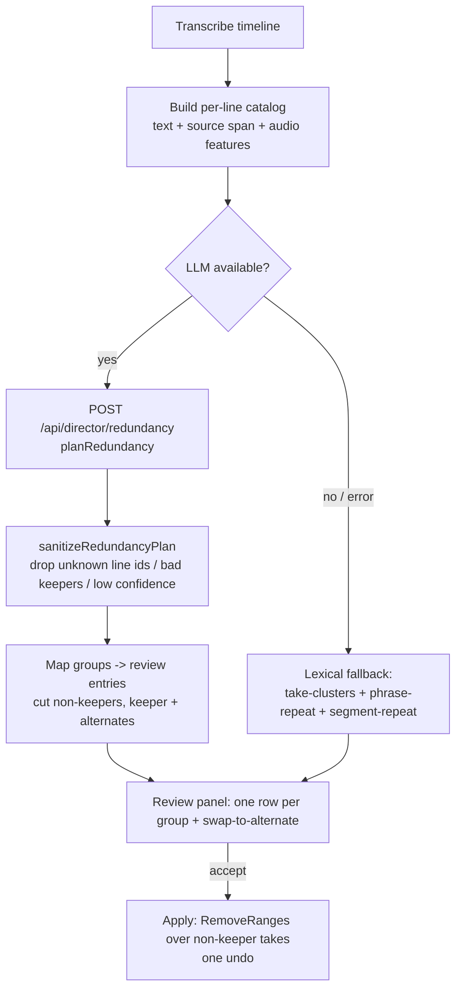

# feat: AI Director — Dedicated LLM Redundancy Pass

**Origin:** [docs/brainstorms/2026-06-23-director-repeat-detection-requirements.md](../brainstorms/2026-06-23-director-repeat-detection-requirements.md)

## Summary

Replace the brittle lexical repeat-catching (take-clusters / phrase-repeat / segment-repeat, all near-verbatim only) with a single **dedicated LLM redundancy pass**: a focused call that reads the whole transcript, groups lines that make the same point — verbatim retakes **and** reworded restatements — and keeps the best-delivered take per group. Conservative (high-confidence only), review-gated, with swap-to-alternate. The lexical detectors drop to a no-LLM fallback so repeats stop being double-flagged. Mirrors the existing `planDirector` / `planAssembly` → `planJson` → `sanitize` → review architecture; it is an extension, not a rewrite.

---

## Problem Frame

The Director leaves repeats in the cut. They come in two forms and both slip through (see origin): **near-verbatim retakes** fall through the lexical detectors' brittle gates (word-timestamp dependency, 3s same-clip gap, consecutive-only matching), and **paraphrased restatements** are mathematically uncatchable by token overlap. The general "cut" prompt is the only paraphrase catch today and does redundancy inconsistently because it does everything at once. Per-detector patching has not converged.

The fix is a mechanism that judges whether two utterances **mean** the same thing, regardless of wording — an LLM pass dedicated solely to redundancy.

---

## Requirements (trace to origin)

- **R1** — Dedicated redundancy LLM pass over the full transcript; covers verbatim + paraphrase (meaning-based). → U1, U2, U4
- **R2** — Conservative / high-confidence; ambiguous lines left ungrouped; confidence is a tunable dial. → U1 (prompt + sanitize), KTD-3
- **R3** — Protect intentional repetition (callbacks, recaps, emphasis). → U1 (prompt)
- **R4** — Best-delivery keeper, grounded in existing per-clip audio features (loudness / filler / wpm) + transcript. → U3, U1
- **R5** — Swap to any alternate take per group in review. → U5
- **R6** — Review-gated; accepting removes the non-keeper takes; one undo. → U4, U5
- **R7** — Primary repeat-catcher when an LLM is available; lexical detectors + the general prompt's redundancy clause stop contributing repeat rows; lexical detectors remain the no-LLM fallback. → U4
- **R8** — Anti-hallucination: groups may only reference real transcript lines; invalid references dropped before review. → U1 (sanitize)

**Success criteria (origin S1–S4):** catches the obvious repeats of both types that survive today (S1); does not flag distinct or intentional repetition (S2); keeps the best take with swap (S3); one coherent set of repeat rows, no double-flagging (S4).

---

## Key Technical Decisions

- **KTD-1 — Separate focused call.** The redundancy pass is its own route + prompt + schema (`/api/director/redundancy`), mirroring `/api/director/assemble` — not folded into the existing plan call. A focused task is the whole reason it beats today's catch-all prompt. Accepted cost: one extra LLM round-trip per Director run. (Confirmed with user.)

- **KTD-2 — Keeper chosen by the LLM, grounded in audio features.** The per-line candidate catalog carries the audio features the bin already computes (`loudnessRelative`, `fillerCandidate`, `wpm` from `SpeechFeatures`). The prompt asks the LLM to pick the best-delivered take using those signals + transcript clarity. No separate numeric scorer — the LLM weighs it; features are supplied so "best delivery" reflects sound, not just text. When features are absent (no audio), it falls back to transcript only.

- **KTD-3 — Confidence as a pre-filter.** Each group carries an LLM `confidence`; the client drops groups below a tunable `REDUNDANCY_CONFIDENCE_FLOOR` constant (start ~0.7). The "conservative" instruction lives in the prompt (R2); the floor is the second gate. Review-gating is the final gate.

- **KTD-4 — One review entry per group.** A group of N takes renders as ONE row ("Repeat — keeping the best of N takes"), whose accept removes the N−1 non-keeper takes (possibly multiple ranges). Swap re-targets which take is kept (reuses the auto-assemble swap-take model). This mirrors the existing take-cluster review concept.

- **KTD-5 — Demote, don't delete, the lexical detectors.** When the redundancy pass runs (LLM available), the lexical repeat detectors (`take-clusters`, `phrase-repeat`, `segment-repeat`) and the general prompt's redundancy clause stop contributing. When no LLM is available (offline / claude-code text-only still works, but a true no-LLM/error path), the lexical detectors run as the fallback. This removes double-flagging (S4) without losing the offline path.

---

## High-Level Technical Design

The redundancy pass replaces the repeat-catching role of the lexical detectors and the general prompt's redundancy clause; the general cut prompt still handles filler / dead-time / tangents.

---

## Implementation Units

### U1. Redundancy planner in hf-bridge

**Goal:** A focused LLM pass that groups same-meaning transcript lines and names a keeper.
**Requirements:** R1, R2, R3, R4 (consumes features), R8.
**Dependencies:** none.
**Files:**
- `packages/hf-bridge/src/redundancy.ts` (new) — `RedundancyLine` / `RedundancyGroup` / `RedundancyPlan` types, `buildRedundancyPrompt`, `sanitizeRedundancyPlan`, `planRedundancy` (dispatch via the existing `planJson`).
- `packages/hf-bridge/src/index.ts` (modify) — export the new surface.
- `packages/hf-bridge/src/__tests__/redundancy.test.ts` (new).

**Approach:** Input is a numbered line list (id, text, source-clip label, start/end, and the audio-feature signals from KTD-2). The prompt instructs: group only lines you are CONFIDENT make the same point — verbatim OR reworded; LEAVE intentional repetition (callbacks, "as I said earlier" recaps, rhetorical emphasis) ungrouped (R3); for each group pick the best-delivered take using loudness / filler / wpm + clarity (R4); return `{ groups: [{ lineIds, keeperLineId, confidence, reason }] }`. `sanitizeRedundancyPlan` enforces R8: drop groups referencing unknown line ids, drop groups with < 2 members, drop a group whose `keeperLineId` isn't a member, clamp `confidence` to [0,1], dedupe overlapping groups. Mirrors `buildDirectorPrompt` / `sanitizeDirectorPlan` / `planAssembly`.

**Patterns to follow:** `packages/hf-bridge/src/author.ts` (`buildDirectorPrompt`, `sanitizeDirectorPlan`, `planDirector`), `packages/hf-bridge/src/assemble.ts` (`planAssembly`, `sanitizeAssemblyPlan`).

**Test scenarios (`redundancy.test.ts`):**
- `buildRedundancyPrompt` includes the conservative + protect-intentional-repetition instructions and renders each line's audio-feature signals.
- `sanitizeRedundancyPlan` drops a group referencing a line id not in the input.
- ...drops a group with a single member.
- ...drops a group whose `keeperLineId` is not one of its `lineIds`.
- ...clamps an out-of-range `confidence` and coerces a non-numeric one to a default.
- A well-formed plan passes through unchanged (covers AE: same-point group with a valid keeper survives).
- Empty / no-groups input returns an empty plan (no throw).

**Verification:** `bun test` green for `redundancy.test.ts`; tsc + lint clean for the package.

---

### U2. `/api/director/redundancy` route

**Goal:** Server endpoint that runs `planRedundancy`.
**Requirements:** R1.
**Dependencies:** U1.
**Files:**
- `apps/web/src/app/api/director/redundancy/route.ts` (new).
- `apps/web/src/app/api/director/redundancy/__tests__/route.test.ts` (new).

**Approach:** POST `{ lines, taste? }`; reads AI auth headers; calls `planRedundancy`; returns `{ plan, usage }`. Validation mirrors the plan/assemble routes (400 on a missing/!array `lines`). Mock `@framecut/hf-bridge`'s `planRedundancy` in the route test (note the lesson from the vision regression: a route that imports a new hf-bridge value must mock it or the test fails to load).

**Patterns to follow:** `apps/web/src/app/api/director/assemble/route.ts`, `apps/web/src/app/api/director/plan/route.ts` and its `__tests__/route.test.ts`.

**Test scenarios:**
- 400 when `lines` is missing or not an array.
- Happy path: valid body → calls `planRedundancy` (mocked) → returns its plan + usage.
- Planner throwing surfaces as a 500 with the error message (matches the plan route).

**Verification:** route tests green; the editor still builds (route loads).

---

### U3. Redundancy candidate catalog builder (pure)

**Goal:** Build the numbered-line catalog (text + source span + audio features) that feeds U1's prompt.
**Requirements:** R1, R4.
**Dependencies:** none (pure; consumed by U4).
**Files:**
- `apps/web/src/features/ai-generate/director/redundancy-catalog.ts` (new).
- `apps/web/src/features/ai-generate/director/__tests__/redundancy-catalog.test.ts` (new).

**Approach:** From the timeline transcript segments + `SpeechFeatures[]` + the per-asset source map, produce `RedundancyLine[]`: `{ id, text, clipName, startSec, endSec, loudnessRelative?, fillerCandidate?, wpm? }`. Join features to segments by start-second (the `featureByStart` pattern). Omit feature fields when no audio features exist (degrades to transcript-only keeper per KTD-2). Stable line ids (index or start-based).

**Patterns to follow:** `apps/web/src/features/ai-generate/director/build-signal-table.ts` (feature-by-start join), `asset-catalog.ts`, `source-map.ts` (`groupTranscriptByAsset`).

**Test scenarios:**
- Builds one line per segment with the feature signals joined by start-second.
- A segment with no matching feature yields a line with the feature fields omitted (no NaN/undefined leak).
- Line ids are stable across two builds of the same input.
- Empty segments → empty catalog.

**Verification:** `bun test` green; pure + wasm-free.

---

### U4. Director orchestration: run the pass, map groups, demote lexical detectors

**Goal:** Wire the redundancy pass into `run-director`; convert groups → review cut ops; demote the lexical repeat detectors + drop the general prompt's redundancy clause when the LLM ran; keep the lexical detectors as the no-LLM fallback.
**Requirements:** R6, R7 (+ consumes R1–R4 outputs).
**Dependencies:** U1, U2, U3.
**Files:**
- `apps/web/src/features/ai-generate/director/redundancy-apply.ts` (new, pure) — map `RedundancyGroup[]` → `{ cuts: DirectorOp[] (non-keeper takes, category "repeat"), alternatesByGroup }` for the review/swap.
- `apps/web/src/features/ai-generate/director/run-director.ts` (modify) — build the catalog (U3), POST to the redundancy route, sanitize is server-side; on success map groups → review entries and SKIP the lexical repeat detectors; on no-LLM/error, run the lexical detectors as today.
- `packages/hf-bridge/src/author.ts` (modify) — trim the REDUNDANT-RESTATEMENT / repeated-content clause from `buildDirectorPrompt` (the dedicated pass owns redundancy; the general prompt keeps filler / dead-time / tangents).
- `apps/web/src/features/ai-generate/director/__tests__/redundancy-apply.test.ts` (new).

**Approach:** A pure `mapRedundancyGroups` turns each group into a keep-the-keeper / cut-the-rest structure: cut ops over every non-keeper take's `[startSec,endSec)` (category `"repeat"`), plus an alternates map (keeper + the other takes) for U5's swap. `run-director` calls the redundancy route when an LLM connection is configured; on success it merges these cuts via the existing `mergeDetectedCuts` (keeper spans protected) and does NOT run `buildTakeClusters` / `detectPhraseRepeatCuts` / `detectSegmentRepeatCuts`. On the no-LLM / fetch-error path it falls back to those detectors (today's behavior). **Note:** `run-director.ts` and `author.ts` are project-authored/hf-bridge (allowed dirs) — no PATCHES row. The lexical-detector gating is a branch in `run-director`; keep the pure mapping testable in `redundancy-apply.ts`.

**Patterns to follow:** `run-director.ts` (the detector merge + `mergeDetectedCuts`), `apply-plan.ts` (`planRemovalRanges`), `cut-utils.ts`.

**Test scenarios (`redundancy-apply.test.ts`):**
- A 3-take group → 2 cut ops (the non-keepers), keeper not cut, both tagged category `"repeat"`.
- The alternates map lists all takes for the group (keeper + others) for swap.
- A group whose keeper is the earliest still cuts the later takes (keeper need not be last).
- Empty groups → no cuts.
- Covers AE (origin S4): two groups produce a flat, non-overlapping cut set with no duplicate rows.

**Verification:** `redundancy-apply` tests green; run-director wiring + the lexical-fallback branch are live-verify (wasm boundary) — confirm via `docs/TO-VERIFY.md`.

---

### U5. Review panel: redundancy group rows + swap-to-alternate

**Goal:** Show each redundancy group as one review row (kept take + the cut takes) with swap-to-alternate; accept removes the non-keeper takes (one undo).
**Requirements:** R5, R6.
**Dependencies:** U4.
**Files:**
- `apps/web/src/features/ai-generate/director/review-format.ts` (modify) — a row label for a redundancy group ("Repeat — keeping the best of N takes (NN%)") + the rejected-state hint.
- `apps/web/src/features/ai-generate/director/components/director-review-dialog.tsx` (modify) — render the group row + a swap control listing alternates (reuse the auto-assemble swap-take interaction).
- `apps/web/src/features/ai-generate/director/__tests__/review-format.test.ts` (modify) — group-row label + swap-target recompute.

**Approach:** Reuse the swap model from the auto-assemble draft (`assembly-draft.ts` `swapSpan` + `director-panel.tsx` swap control): selecting a different take re-targets which take is kept and which are cut. The minimal version (one row per group, keep-best, accept cuts the rest) ships first; the swap dropdown layers on using the existing pattern. Apply goes through the existing `applyDirectorPlan` / `RemoveRangesCommand` (one undo).

**Patterns to follow:** `assembly-draft.ts` (`swapSpan`, alternates), `components/director-panel.tsx` (swap-take UI), `review-format.ts` (`describeReviewOp`).

**Test scenarios (pure parts):**
- `describeReviewOp` (or a new helper) renders the group row label with take count + confidence.
- Swap-target recompute: given a group's takes and a chosen keeper, returns the correct set of takes to cut (all but the chosen).
- Rejecting a redundancy row keeps all takes (hint: "Keeping all takes").

**Verification:** review-format tests green; the dialog render + swap interaction are live-verify (DOM) — add to `docs/TO-VERIFY.md`.

---

## Scope Boundaries

**In scope:** the dedicated redundancy LLM pass (prompt + schema + sanitize + route), the per-line catalog with audio features, the group→cut mapping, demoting the lexical detectors + trimming the general prompt's redundancy clause, the lexical no-LLM fallback, the review row + swap-to-alternate, review-gated apply.

**Out of scope (origin):**
- Local semantic embeddings / client-side similarity model (Approaches A/C) — revisit only if the LLM pass proves insufficient.
- Whole-topic / section-level repetition — utterance level only.
- Any auto-apply path.

**Deferred to follow-up work:**
- Folding redundancy into the existing plan call to save the extra round-trip (KTD-1 rejected it; revisit only if cost becomes a problem).
- Chunking for transcripts that exceed model context (assumed not to in normal use — see Risks).
- Removing the now-demoted lexical detectors entirely (kept as the no-LLM fallback for now).

---

## Risks & Dependencies

- **LLM availability.** Requires a text LLM (claude-code subscription or API key). The no-LLM/error path falls back to the lexical detectors (R7) — verify the fallback actually fires on a forced error.
- **Context size.** Assumes a full transcript fits the model context (Opus ~200k tokens ≫ an hour of speech). If a real recording overflows, chunking becomes necessary (deferred). Flag, don't pre-build.
- **Cost.** One extra LLM round-trip per Director run (KTD-1, accepted).
- **Over/under-cutting.** Conservative prompt + confidence floor + review-gating bound false positives; if it under-catches on real footage, loosen `REDUNDANCY_CONFIDENCE_FLOOR` (KTD-3) — tune against Dan's footage, don't guess.
- **Route-import regression.** Adding `planRedundancy` to the route requires the route test to mock it (prior vision regression lesson) — covered in U2.

---

## Open Questions (deferred to implementation)

- Exact `REDUNDANCY_CONFIDENCE_FLOOR` default — start ~0.7, tune against real footage (KTD-3).
- Whether the swap control is full parity with auto-assemble's on day one or ships minimal-first (U5 ships keep-best first, swap layered).
- Whether to surface the extra-call cost in the token counter UI (minor; follow the existing usage-accumulation pattern).

---

## Sources & Research

- **Origin requirements:** [docs/brainstorms/2026-06-23-director-repeat-detection-requirements.md](../brainstorms/2026-06-23-director-repeat-detection-requirements.md).
- **Local patterns (this session's grounding):** `packages/hf-bridge/src/author.ts` (planDirector / buildDirectorPrompt / sanitizeDirectorPlan), `packages/hf-bridge/src/assemble.ts` (planAssembly), `apps/web/src/app/api/director/{plan,assemble}/route.ts`, `apps/web/src/features/ai-generate/director/{run-director,build-signal-table,asset-catalog,source-map,cut-utils,apply-plan,assembly-draft}.ts`, `components/director-review-dialog.tsx` / `director-panel.tsx`. No external research — the repo's `planJson` + sanitize + review pattern directly applies.
