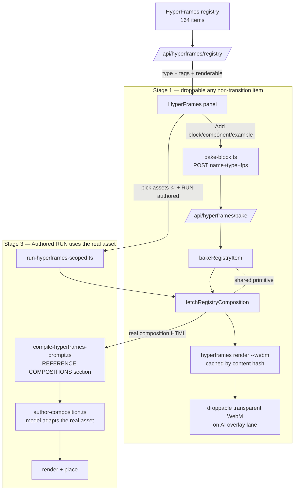

# feat: HyperFrames full catalog — droppable blocks/components/styles + Authored RUN uses the real asset

## Summary

VibeCut exposes only a thin slice of the 164-item HyperFrames registry. Today **only the ~108 overlay-safe blocks** are usable (panel **Add** → bake to a cached WebM). The **22 components**, **8 styles/examples**, and **~26 transition blocks** are listed in the panel but **inert** (no Add, no real wiring), and the **Authored** RUN engine only feeds picked assets to the model as a *name* — it reinvents an approximation instead of using the real asset.

This plan makes **every renderable non-transition asset droppable** (blocks + components + examples) through one generalized bake/install path, and makes the **Authored RUN actually use a picked asset's real registry composition** instead of reinventing it. Transitions are explicitly **deferred** (they need a between-clips slot that takes the two neighbor clips as input — a separate feature).

---

## Problem Frame

Three narrow asset paths exist, each blind to most of the registry (audit front 4):

1. **Native/cinematic plan** (`run-hyperframes.ts` → `/api/hyperframes/plan`) — hard-restricted to the 5 built-in templates; never reads the registry.
2. **Bake** (`bake-block.ts` → `/api/hyperframes/bake` → `bake.ts`) — the ONLY path that consumes a real registry asset, and it is **blocks-only**: `bake.ts` throws for any `type !== "hyperframes:block"`, and the panel further hides Add on transition-tagged blocks and on components/examples entirely.
3. **Authored** (`run-hyperframes-scoped.ts` → `/api/hyperframes/author` → `author-composition.ts`) — reads the user's picked registry assets (`promptHfAssets`) but only as **named text preferences** (`compile-hyperframes-prompt.ts` lists `title (name)`); the model authors fresh HTML and never sees the real asset.

Net effect for the user: "I want to pull any style/block" is unmet for ~56 of 164 items, and picking a style like Swiss Grid for an Authored run yields a reinvention, not Swiss Grid.

---

## Scope

**In scope**
- Generalize the registry fetch + bake so **any item with a composition file** (block, component, example) renders to a cached, droppable, transparent WebM.
- Surface **Add** on components and examples (non-transition, renderable) in the panel.
- Make the **Authored** RUN fetch each picked asset's **real composition HTML** and give it to the model as a reference to adapt, so picks render faithfully.

**Out of scope (deferred to follow-up)**
- **Transition blocks (~26)** — require a between-clips slot taking the two neighbor clips as input; the current "bake a canned A→B demo" is not a real transition. Keep them disabled (current behavior is correct).
- The native/cinematic **plan** engine staying template-only (Authored is the catalog path; that asymmetry was addressed in the prior `resolveHfRunEngine` fix).
- Wiring unused CLI subcommands (`lint`/`inspect`/`add`) — see Future Considerations.

---

## Key Technical Decisions

- **One shared fetch primitive, kind-parameterized.** Add `fetchRegistryComposition({ name, type, registryBase })` to hf-bridge that mirrors the registry route's `kind = type.split(":")[1]` + `${base}/${kind}s/${name}/...` convention and returns `{ html, files, title, width, height, durationSec }`. `bake.ts` (Stage 1) and the Authored reference path (Stage 3) both consume it. Avoids two divergent fetchers.
- **"Renderable" = has a `hyperframes:composition` file.** Components are sometimes pure snippets with no standalone composition; those cannot bake standalone. The bake guard changes from "is a block" to "has a composition file" — honest and type-agnostic. The registry route computes a `renderable` flag so the panel only offers Add where bake will succeed.
- **Authored picks become a REFERENCE section, not a replacement.** The model still authors one coherent overlay timed to the transcript, but is given each picked asset's real HTML to adapt (keep its visual design, retarget its content). This preserves the "fit to spoken moments" behavior while making picks faithful — rather than blindly placing a raw registry comp that ignores the transcript.
- **Reuse the existing bake cache + placement.** `bakeRegistryItem` keeps the content-hash cache key and the `bakeAndPlaceBlock` overlay-lane placement unchanged; only the fetch source generalizes. The placed clip keeps `framecutAi.registryBlock` (rename-free) so the existing re-bake/properties path still works.
- **Transitions stay gated by tag.** The panel's existing `isTransitionBlock` (tag-based) filter continues to suppress Add for transition-tagged items, regardless of type.

---

## High-Level Technical Design

---

## Implementation Units

### U1. `fetchRegistryComposition` — kind-agnostic registry fetch primitive

**Goal:** One function that fetches any registry item's composition + asset files, for both bake and the Authored reference path.

**Dependencies:** none.

**Files:**
- `packages/hf-bridge/src/registry-fetch.ts` (new)
- `packages/hf-bridge/src/registry-fetch.test.ts` (new)
- `packages/hf-bridge/src/index.ts` (export)

**Approach:** Derive `kind = type.split(":")[1]` (e.g. `block`/`component`/`example`) and fetch `${base}/${kind}s/${name}/registry-item.json`. Return `{ item, compFile, compHtml, files, title, width, height, durationSec }` where `compFile` is the `hyperframes:composition` file (or `null`). Defaults mirror `bake.ts` (1920×1080, 5s). Reuse the existing `fetchOk` timeout pattern. Pure of any CLI/wasm import so it is bun-testable with a mock `registryBase`.

**Patterns to follow:** `bake.ts:74-99` (current block fetch), `app/api/hyperframes/registry/route.ts:34-38` (the `kind`s pluralization).

**Test scenarios:**
- Block type → resolves the composition HTML + dimensions from a mock registry. 
- Example type (e.g. `swiss-grid`) → fetches from `examples/` path, returns full-frame dims.
- Component with no composition file → `compFile` is `null` (caller decides).
- Non-OK registry response → throws a clear `Could not fetch …` error (mirrors `fetchOk`).
- `type` without a colon → `kind` falls back to the raw type string (no crash).

**Verification:** `bun test registry-fetch.test.ts` green; hf-bridge `tsc` 0.

### U2. Generalize bake to any composition-bearing item

**Goal:** `bakeRegistryItem` renders any block/component/example that has a composition file; the block-only guard is replaced by a composition-file guard.

**Dependencies:** U1.

**Files:**
- `packages/hf-bridge/src/bake.ts` (rename `bakeRegistryBlock` → `bakeRegistryItem`, add `type` to `BakeJob`, consume U1)
- `packages/hf-bridge/src/index.ts` (export the new name; keep a thin alias if referenced elsewhere)
- `apps/web/src/app/api/hyperframes/bake/route.ts` (accept + forward `type`)
- `apps/web/src/features/ai-generate/bake-block.ts` (send `type`; rename helper to `bakeAndPlaceAsset`, keep clip `framecutAi.registryBlock`)
- `packages/hf-bridge/src/bake.test.ts` (extend if present, else add)

**Approach:** `BakeJob` gains `type: string` (default `"hyperframes:block"` for back-comat). `bakeRegistryItem` calls U1, throws the existing "no composition file to render" error when `compFile` is null (now the real guard), and keeps the content-hash cache key, asset-file write loop, and `enqueueRender` CLI call **unchanged**. The cache key already folds the composition hash, so different items never collide. The bake route reads `type` from the POST body (default block) and passes it through. `bake-block.ts` sends the asset's `type` (the panel has it from the registry route).

**Patterns to follow:** existing `bakeRegistryBlock` cache/render flow (`bake.ts:100-188`); keep it intact.

**Test scenarios:**
- Example item bakes: returns a `videoPath`, `bakeKey`, correct dims/duration (mock registry + a stubbed render that writes `out.webm`).
- Component WITHOUT a composition file → throws "has no composition file to render".
- Second identical call → `cached: true`, no re-render (cache hit).
- Back-compat: a job with no `type` behaves exactly as the old block path.

**Verification:** bake unit tests green; the render smoke (U5) bakes a real example end-to-end.

### U3. Panel — Add on components + examples; `renderable` flag

**Goal:** Components and examples (non-transition, renderable) get a working **Add** button; the panel copy stops implying only blocks are droppable.

**Dependencies:** U2.

**Files:**
- `apps/web/src/app/api/hyperframes/registry/route.ts` (add `renderable: boolean` to `RegistryAsset`, computed from `detail.files`)
- `apps/web/src/features/ai-generate/components/hyperframes-panel.tsx` (offer Add on non-transition renderable items of any kind; route to `bakeAndPlaceAsset` with `type`; update the section subtitles/footnote copy)

**Approach:** `enrich()` already fetches `registry-item.json`; extend it to read `files` and set `renderable = files.some(f => f.type === "hyperframes:composition")`. In the panel, the Add affordance currently gated to `kind === "block" && !isTransitionBlock(a)` becomes `a.renderable && !isTransitionBlock(a)` across blocks/components/examples. Components/examples sections lose their "not droppable yet"/"coming soon" subtitles. Transition-tagged items remain Add-less (unchanged).

**Patterns to follow:** the existing block Add wiring in `hyperframes-panel.tsx` (the `onAdd` → `bakeAndPlaceBlock` call), `isTransitionBlock`.

**Test scenarios:**
- `Covers: registry enrich.` Unit-test `renderable` derivation: item with a composition file → `true`; snippet-only component → `false`. (Pure helper extracted from `enrich` if needed for testability.)
- Test expectation for the panel JSX: none — behavior is DOM/interaction-bound; verified live (see Verification). Extract any non-trivial gating predicate into a pure helper and unit-test that instead.

**Verification (live):** in the running app, the Styles + Components sections show **Add**; clicking Add on an example (e.g. Swiss grid) drops a rendered clip on an AI overlay lane; a snippet-only component shows no Add (or a clear toast if bake is attempted and fails); transitions still show no Add.

### U4. Authored RUN uses each picked asset's real composition

**Goal:** When the user picked registry assets and runs the Authored engine, the model is given the **real** composition HTML to adapt, so picks render faithfully instead of being reinvented from a name.

**Dependencies:** U1.

**Files:**
- `apps/web/src/features/ai-generate/compile-hyperframes-prompt.ts` (new optional `referenceCompositions` input + a `REFERENCE COMPOSITIONS` section)
- `apps/web/src/features/ai-generate/run-hyperframes-scoped.ts` (fetch picked assets' compositions via a new `/api/hyperframes/registry-comp` route or the bake route's source, pass them into the compiled prompt)
- `apps/web/src/app/api/hyperframes/registry-comp/route.ts` (new — returns a picked item's real composition HTML via U1; server-side fetch keeps the client free of cross-origin registry calls)
- `apps/web/src/features/ai-generate/__tests__/compile-hyperframes-prompt.test.ts` (extend)

**Approach:** `CompileHyperframesPromptInput` gains `referenceCompositions?: { name: string; title: string; html: string }[]`. When present, `compileHyperframesPrompt` adds a section: "REFERENCE COMPOSITIONS — the user picked these real HyperFrames assets; ADAPT their visual design to the transcript (retarget the text/data, keep the look), do not invent a different design," followed by each asset's HTML in a fenced block. `run-hyperframes-scoped.ts` resolves `promptHfAssets` to their compositions (server route, U1) before compiling. Bound the embedded HTML (e.g. cap count/length) so the brief stays within token budget; note any drop with `log()`. The model still authors ONE transcript-timed overlay — the reference shapes the design, it is not placed raw.

**Patterns to follow:** `compile-hyperframes-prompt.ts` section-building (`lines.push` groups), `pickedRegistrySelections()` in `run-hyperframes-scoped.ts` (audit: ~lines 62-97).

**Test scenarios:**
- `referenceCompositions` present → the compiled prompt contains the `REFERENCE COMPOSITIONS` heading, each title/name, and the HTML body.
- Empty/absent → no reference section, output identical to today (regression guard).
- Length cap: more/longer comps than the cap → only the cap is embedded and a note records the drop.
- Picks present but compositions unfetchable → the run proceeds with names-as-preferences (graceful degrade to today's behavior), not a hard failure.

**Verification:** unit tests green; live — pick Swiss grid, run Authored, confirm the output reflects the real Swiss-grid layout (grid lines / type system), not a generic reinvention.

### U5. Render-smoke coverage for the new asset types

**Goal:** Prove a component and an example actually bake + render through the real CLI path, so Stage 1 is verified, not assumed.

**Dependencies:** U2.

**Files:**
- `packages/hf-bridge/scripts/render-smoke.ts` (extend to bake one real example + one renderable component)

**Approach:** Add cases that call `bakeRegistryItem` for a known example (`swiss-grid`) and a renderable component, asserting a non-empty `out.webm` is produced (or a clear, expected "no composition file" skip for snippet-only components). Reuse the existing smoke harness scaffolding.

**Test scenarios:** Test expectation: none (this IS the manual verification harness) — it asserts a real render artifact exists.

**Verification:** `bun packages/hf-bridge/scripts/render-smoke.ts` bakes the example to a valid WebM; documented in `docs/TO-VERIFY.md`.

---

## System-Wide Impact

- **Upstream-origin files:** `bake.ts`, the bake route, and `hyperframes-panel.tsx` may carry OpenCut/HyperFrames origin — add/refresh a `PATCHES.md` row for any upstream-origin file touched, per repo convention.
- **Token budget (U4):** embedding real composition HTML grows the Authored brief; the length cap + drop-log keep it bounded.
- **Network at render time:** bake already fetches from the live registry; generalizing it does not add a new trust boundary (same `raw.githubusercontent.com` source).
- **Determinism:** bake remains content-hash cached; a registry update re-bakes automatically (unchanged).

---

## Risks & Mitigations

- **Components may not render standalone** (snippets meant to layer in). *Mitigation:* the `renderable` flag + composition-file guard mean only items with a real composition get Add; snippet-only components are honestly excluded, not silently broken.
- **An example's full-frame composition baked as an overlay reframes the shot.** *Mitigation:* this is expected for examples (they are full-frame by design); placement already contain-fits. Surface it as "whole-video style" in the panel copy.
- **U4 reference HTML bloats the prompt / confuses the model.** *Mitigation:* cap count + length, frame explicitly as "adapt, don't place raw," and graceful-degrade to names-as-preferences on fetch failure.
- **Rename churn** (`bakeRegistryBlock` → `bakeRegistryItem`, `bakeAndPlaceBlock` → `bakeAndPlaceAsset`). *Mitigation:* keep thin re-export aliases if other callers exist; grep before renaming.

---

## Deferred to Follow-Up Work

- **Transition blocks (~26):** build the between-clips transition slot (takes the two neighbor clips as input). Keep transitions Add-less until then.
- **`hyperframes add` / `lint` / `inspect` CLI subcommands:** a validation gate before render and a first-class install path (audit version front). Independent of this plan.
- **Version bump 0.7.4 → 0.7.6:** safe patch bump with render-robustness fixes; do separately so renders can be re-verified in isolation.

---

## Verification Strategy

- **Gate (every unit):** `apps/web` `bunx tsc --noEmit` = 0; hf-bridge `tsc` 0; new bun unit suites green; no NEW lint errors on touched files (pre-existing debt untouched).
- **Render proof (U5):** the smoke bakes a real example to a valid WebM.
- **Live (Dan, browser — `bun run dev:web`):** Add on a component + example drops a rendered clip; Authored RUN with a picked asset renders the real asset. Record in `docs/TO-VERIFY.md`.
