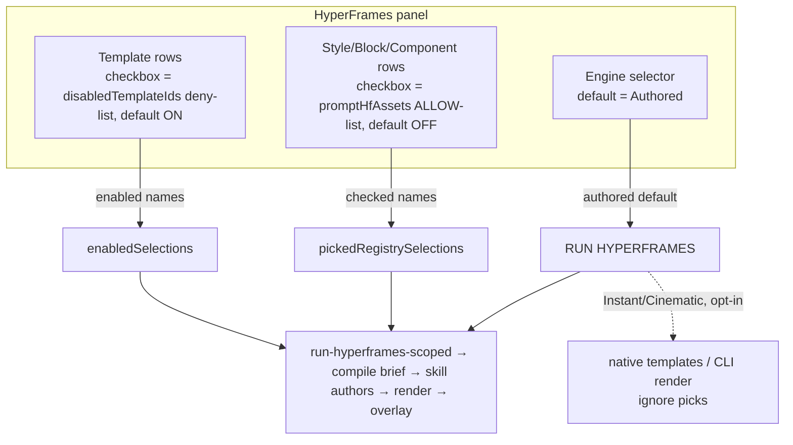

# feat: HyperFrames — Authored engine by default + selection feeds the skill prompt

## Summary

The HyperFrames panel reads as a "menu that feeds the skill prompt," but today it mostly doesn't drive output. Two wiring gaps cause every "my style didn't show up" report:

1. The **default engine is Instant** (native motion templates) — it runs no skill, ignores every registry asset, and produces plain/oversized text. The only engine that runs the skill and overlays graphics from your picks is **Authored**.
2. The registry-asset **checkbox is a dead no-op for runs** (`disabledHfAssets`, read only for the check state). The only thing that feeds the Authored brief is the separate **☆ star** (`promptHfAssets`).

This plan makes the panel behave the way it looks: **Authored is the default engine**, and **checking a style/block adds it to the RUN HYPERFRAMES prompt** (the ☆ star is retired for registry assets). Picking Swiss Grid → RUN → the skill authors a real Swiss-Grid overlay on your footage.

---

## Problem Frame

Verified wiring (this repo, `apps/web/src/features/ai-generate`):
- `store.ts` defaults `hfEngine: "native"`. `run-hyperframes.ts` (native/cinematic) reads only templates + the look; it never reads `promptHfAssets`. Only `run-hyperframes-scoped.ts` (Authored) calls `pickedRegistrySelections()` → reads `promptHfAssets` → into the compiled brief (and, since the full-catalog work, fetches the picked asset's real composition).
- In `hyperframes-panel.tsx`, registry-asset rows set `checked: !disabledHfAssets.includes(a.name)` (deny-list) and a separate `pinned: promptHfAssets.includes(a.name)` (allow-list, the ☆). **No run path reads `disabledHfAssets`** — the checkbox is decorative for output. Templates are different: their checkbox (`disabledTemplateIds`) is a real palette gate.

Net user experience: select a style, get nothing — wrong engine, and the control you clicked isn't wired to the prompt.

---

## Key Technical Decisions

- **Default engine = Authored.** Flip the `hfEngine` default so a fresh RUN HYPERFRAMES authors real graphics via the skill and overlays them. Instant/Cinematic remain one click away as explicit speed alternatives. Accepted tradeoff (user-chosen): Authored renders in-browser (slower) on every default run; the engine selector keeps Instant available for fast, editable native placement.
- **Registry-asset selection becomes a checkbox-driven ALLOW-list.** For styles/blocks/components, the checkbox drives `promptHfAssets` (default off, checking = include in the brief). The separate ☆ star is retired for these rows. This matches the "panel is a menu for the prompt" model and reuses the path the Authored brief already reads (`pickedRegistrySelections`) — no change needed in the run/brief code, only the panel's binding.
- **Templates keep their deny-list checkbox.** `disabledTemplateIds` stays as-is — templates are a curated palette (default all-on) that the Authored brief lists as hints and the native/cinematic engines pick from. Only *registry-asset* rows switch to the allow-list. The two semantics are intentional and live in different row-builders.
- **Retire the dead `disabledHfAssets` state.** Once registry rows bind to `promptHfAssets`, the deny-list is fully unused (it is not in `HfPreset`, not read by any run). Remove it from the store + its setters to avoid leaving a misleading no-op behind.
- **Existing persisted engine is respected.** Persisted `hfEngine: "native"` (current users, including this project) is not force-migrated — overriding a stored user choice is heavier-handed than the problem warrants. The clarified engine selector (Authored labeled as the default/recommended) makes the one-time switch obvious. New projects/devices get Authored. (See Open Questions for the alternative.)

---

## High-Level Technical Design

---

## Implementation Units

### U1. Default the effect engine to Authored

**Goal:** A fresh RUN HYPERFRAMES authors real graphics via the skill instead of placing plain native templates.

**Dependencies:** none.

**Files:**
- `apps/web/src/features/ai-generate/store.ts` (default `hfEngine`)
- `apps/web/src/features/ai-generate/components/hyperframes-panel.tsx` (the `EngineSection` labels/order)
- `apps/web/src/features/ai-generate/__tests__/run-engine.test.ts` (default assertion)

**Approach:** Change the store default from `"native"` to `"authored"`. In `EngineSection`, present Authored as the default/recommended option with a one-line tradeoff note ("authors real graphics, slower in-browser render"), and label Instant as the fast/editable alternative that ignores picks. No change to `resolveHfRunEngine` (engine `"authored"` already short-circuits to authored).

**Patterns to follow:** the existing `EngineSection` option rendering; `store.ts` default values + `setHfEngine`.

**Test scenarios:**
- Store initializes with `hfEngine === "authored"` on a fresh store (no persisted value).
- `resolveHfRunEngine({ engine: "authored", ... })` returns `{ engine: "authored" }` regardless of template/pick counts (regression guard — already covered; extend if needed).

**Verification:** A new project opens with the engine selector on Authored; RUN HYPERFRAMES routes to `runHyperframesWholeTimeline`.

### U2. Registry-asset checkbox drives the include allow-list; retire the ☆ star

**Goal:** Checking a style/block/component includes it in the RUN HYPERFRAMES prompt; unchecking removes it. One control, matching the menu mental model.

**Dependencies:** none (independent of U1).

**Files:**
- `apps/web/src/features/ai-generate/store.ts` (add `setPromptHfAssetsEnabled(names, enabled)` bulk setter; remove `disabledHfAssets` + `toggleHfAsset` + `setHfAssetsEnabled`)
- `apps/web/src/features/ai-generate/components/hyperframes-panel.tsx` (registry rows + section All/None)
- `apps/web/src/features/ai-generate/__tests__/ai-settings-store.test.ts` (or nearest store test) for the bulk setter

**Approach:** In the `registryItems(kind)` builder, bind `checked: promptHfAssets.includes(a.name)` and `onToggle: () => togglePromptHfAsset(a.name)`; drop the `pinned`/`onPin` props for registry rows (retire the star here — templates are unaffected). Repoint each registry section's `onSetAll` to a new `setPromptHfAssetsEnabled(names, enabled)` allow-list bulk setter (mirror the old `setHfAssetsEnabled` shape, but on `promptHfAssets`). Remove the now-dead `disabledHfAssets` field + `toggleHfAsset` + `setHfAssetsEnabled` from the store. `pickedRegistrySelections()` already reads `promptHfAssets`, so the brief wiring is unchanged.

**Approach note:** Extract the registry-row check/toggle decision into a tiny pure helper if it keeps the JSX readable, so it can be unit-tested without the DOM — optional, only if it doesn't fight the existing inline style.

**Patterns to follow:** the existing `togglePromptHfAsset` + the old `setHfAssetsEnabled`/`setTemplatesEnabled` bulk setters in `store.ts`; the `PinButton` removal mirrors leaving `AddButton` intact.

**Test scenarios:**
- `setPromptHfAssetsEnabled(["a","b"], true)` adds both to `promptHfAssets`; `(["a"], false)` removes only `a`; idempotent on repeats; no duplicates.
- After binding, a checked registry asset appears in `promptHfAssets` and an unchecked one does not (store-level assertion of the toggle path).
- Templates are unaffected: toggling a template still drives `disabledTemplateIds`, not `promptHfAssets`.

**Verification (live, browser):** Check Swiss Grid in Styles → it shows as selected; RUN HYPERFRAMES (Authored) authors a Swiss-Grid-style overlay using the real composition. Unchecking removes it from the next run's brief. No ☆ star on registry rows.

### U3. Panel copy + clarity for the new model

**Goal:** The panel explains the new behavior: checking adds to the RUN prompt, Authored authors them, Instant/Cinematic are speed modes that ignore picks.

**Dependencies:** U1, U2.

**Files:**
- `apps/web/src/features/ai-generate/components/hyperframes-panel.tsx` (section subtitles + footnote + the panel header comment)

**Approach:** Update the Styles/Blocks/Components subtitles to "check to add to the RUN HYPERFRAMES prompt" framing; rewrite the footnote to state that the Authored engine authors your checked assets over the footage, and Instant/Cinematic are fast modes that use only templates. Remove stale ☆/"coming soon"/"not droppable" copy that no longer applies. Avoid em-dashes (repo owner rule).

**Test scenarios:** Test expectation: none — copy-only, no behavioral change. Verified visually.

**Verification:** Panel copy reads coherently against the new wiring; no references to the retired star or dead checkbox.

---

## System-Wide Impact

- **Existing users' persisted `hfEngine`** stays as-is (not migrated). Only new state gets Authored. The clarified selector is the migration path. (Open Questions covers the one-time-flip alternative.)
- **`disabledHfAssets` removal** touches only the store + panel; it is not in `HfPreset` and no run path reads it, so removal is contained. Grep before deleting to confirm zero external readers.
- **Blocks "Add" path is unchanged** — Add (bake → drop) still works independently of the checkbox/brief change; the checkbox now also marks the block for the Authored brief, which is coherent (a block can be both dropped and referenced).
- **Performance:** Authored-by-default makes the common RUN slower (in-browser render). Surfaced in the engine selector copy; Instant remains one click away.

---

## Risks & Mitigations

- **Authored default surprises speed-sensitive users.** Mitigation: clear selector labels + Instant one click away; no forced migration of existing engine choice.
- **Removing `disabledHfAssets` breaks a hidden reader.** Mitigation: grep all usages before deletion; it is panel-local + not persisted in presets.
- **Default-flip alone doesn't fix existing users (persisted "native").** Mitigation: the relabelled selector makes the switch obvious; see Open Questions for an opt-in one-time migration if desired.

---

## Open Questions (resolve during execution)

- **One-time engine migration?** Whether to add a persist migration that flips a stored `hfEngine: "native"` to `"authored"` once (helps existing users immediately) vs. leaving stored choices alone (current plan). Default: leave alone; revisit if the relabelled selector proves insufficient.

---

## Deferred to Follow-Up Work

- A per-asset "preview the authored result" affordance.
- Surfacing token/time cost of an Authored run before it starts.
- The 0.7.4 → 0.7.6 HyperFrames bump (tracked separately).

---

## Verification Strategy

- **Gate:** `apps/web` `bunx tsc --noEmit` = 0; new store-setter + run-engine tests green; no new lint on touched files.
- **Live (browser, `bun run dev:web`):** new project defaults to Authored; check Swiss Grid → RUN → real Swiss-Grid overlay on footage (correctly sized, animated); uncheck → gone next run; Instant still places native templates fast and ignores picks.
