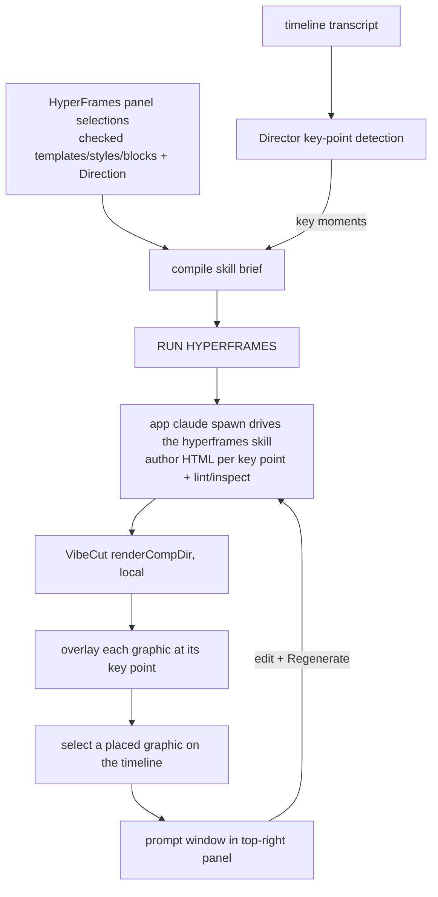

# feat: RUN HYPERFRAMES invokes the HyperFrames skill (panel = prompt generator)

## Summary

Today "RUN HYPERFRAMES" does NOT use the HyperFrames skill — it pipes a hardcoded ~30-line prompt (`author-composition.ts` `FORMAT_RULES`) to a one-shot `claude -p`. That is why a picked style (Swiss Grid) gets improvised instead of used, graphics land on the speaker, and there are no quality gates.

This redesign makes the product match the intended model: **RUN HYPERFRAMES runs the actual `hyperframes` skill, and the panel is a prompt generator for it.** What the user checks in the HyperFrames window (templates, styles, blocks) plus their Direction compiles into a brief that invokes the skill. The AI finds the user's key points in the transcript and authors one skill-made graphic per key point, overlaid locally. Selecting a placed graphic opens a prompt window (same top-right panel) to edit and regenerate just that graphic.

**The whole plan hinges on one feasibility fact** — that the app's `claude` spawn can load + drive the `hyperframes` skill and return a usable composition. U1 proves that before anything else is built.

---

## Problem Frame

- `author-composition.ts` spawns `claude -p` with `FORMAT_RULES` (a fixed authoring prompt). It never triggers the `hyperframes` skill, never reads the skill's visual-styles / registry / layout rules, never runs `lint`/`inspect`. So the skill's knowledge and quality gates are absent.
- The skill IS installed on this machine (`~/.claude/plugins/marketplaces/.../skills/hyperframes/`) and is a full authoring system: design → prompt-expansion → plan → layout-before-animation → animate → `lint`/`inspect`/`validate`, plus a registry (`add`/`catalog`) and named visual styles.
- User intent (confirmed): RUN HYPERFRAMES = run the skill; selection = the prompt; AI auto-detects key points; per-graphic prompt window for edits; local render only, key-points-only for speed.

---

## Key Technical Decisions

- **RUN HYPERFRAMES invokes the skill, not a hardcoded prompt.** Replace `FORMAT_RULES` with a skill-triggering brief. The exact invocation mechanism is the U1 spike's job to settle (see Open Questions): the leading candidate is spawning the app's `claude` with a natural-language brief that triggers the `hyperframes` skill to AUTHOR the composition HTML into a known comp dir, after which VibeCut's existing `renderCompDir` renders it (keeps VibeCut's render pipeline; gains the skill's authoring quality + `lint`/`inspect`).
- **The panel is a prompt generator.** The user's checked templates/styles/blocks + Direction compile into the brief ("use kinetic-type + swiss-grid; here is the moment + transcript"). Builds on the just-shipped selection→`promptHfAssets` wiring; the consumer changes from the hardcoded prompt to the skill brief.
- **Key points come from the Director's existing analysis.** Reuse the transcript + importance/moment analysis already in the codebase to pick WHERE graphics go (one per key point), instead of uniform chunking. Fewer graphics = faithful placement + far less render time.
- **Per-graphic prompt window.** A HyperFrames graphic placed on the timeline carries its brief. Selecting it shows that prompt in the properties panel (top-right) with a Regenerate action that re-invokes the skill with the edited prompt and re-renders just that clip.
- **Local render only, key-points-only.** No cloud. Speed comes from authoring/rendering only at the detected key points (a handful) rather than chunking the whole timeline.
- **RUN collapses to the skill path.** The Instant/Cinematic engine split is removed from RUN HYPERFRAMES (RUN = skill). Native motion-templates may remain available elsewhere, but RUN HYPERFRAMES no longer routes to them.

---

## High-Level Technical Design

---

## Implementation Units

### U1. SPIKE: prove the app can invoke the HyperFrames skill

**Goal:** Confirm (or settle the mechanism for) the app's `claude` spawn loading + driving the `hyperframes` skill and returning a usable composition. Everything else depends on this.

**Dependencies:** none. Must run first.

**Files:** `packages/hf-bridge/scripts/skill-invoke-spike.ts` (new, throwaway-ok harness), notes only.

**Approach:** From the app's claude resolution (`resolveClaude` in `renderer.ts`), spawn `claude -p` with a brief that triggers the skill ("Using the HyperFrames skill, author a composition that ... write index.html to <dir>"). Observe: does it load the skill, follow its authoring rules, and produce HTML at a known path? Test tool-permission behavior in print mode. Decide the mechanism: (a) skill authors HTML → VibeCut renders (preferred), vs (b) skill drives its own render. Record the chosen invocation contract for U2.

**Test scenarios:**
- Spike run on a 1-2 key-point brief produces a valid `index.html` that VibeCut's `renderCompDir` can render. 
- Skill honors a named style in the brief (the output reflects the picked style, not a generic look).
- Failure modes captured: skill not loaded in print mode, tool perms blocked, non-deterministic output path.

**Verification:** A reproducible command that yields a skill-authored composition VibeCut renders; the invocation contract documented for U2. If infeasible, this unit's finding redirects the plan (fallback: embed the skill's style/layout knowledge into the brief without full skill invocation).

### U2. RUN HYPERFRAMES builds a skill brief from the selection + invokes the skill

**Goal:** Replace the hardcoded `FORMAT_RULES` authoring with the skill invocation contract from U1, fed by the panel selection.

**Dependencies:** U1.

**Files:** `packages/hf-bridge/src/author-composition.ts`, `apps/web/src/features/ai-generate/compile-hyperframes-prompt.ts`, `apps/web/src/features/ai-generate/run-hyperframes-scoped.ts`.

**Approach:** `compileHyperframesPrompt` emits a skill-triggering brief that names the user's checked assets ("use kinetic-type + swiss-grid"), the Direction, the canvas, and the target moment + transcript. `authorComposition` invokes the skill per U1's contract instead of piping `FORMAT_RULES`. Keep the output as a comp dir VibeCut renders.

**Test scenarios:** `compileHyperframesPrompt` includes each checked asset by name + the Direction (unit-test the brief string). Picking only kinetic-type + swiss-grid yields a brief that names exactly those. Empty selection still yields a valid skill brief.

**Verification (live):** Pick Swiss Grid → RUN → the rendered overlay is recognizably Swiss Grid.

### U3. Key-point detection drives placement

**Goal:** The AI finds the user's key points in the transcript and authors one graphic per key point.

**Dependencies:** U2.

**Files:** `apps/web/src/features/ai-generate/run-hyperframes-scoped.ts`, a key-point selector (reuse/extend the Director's importance/transcript analysis; pure selector + test).

**Approach:** Replace whole-timeline chunking with a key-point pass: pick the N moments where the speaker makes a key point, each becomes one skill brief + one placed graphic. Extract the moment-picking as a pure, unit-tested function.

**Test scenarios:** Given a transcript with clear key statements vs filler, the selector returns the key moments (with times), capped sensibly; empty/secondary content yields none.

**Verification (live):** Graphics land on the points the user actually makes, not sprinkled uniformly.

### U4. Per-graphic prompt window in the properties panel

**Goal:** Selecting a placed HyperFrames graphic shows its brief in the top-right panel with a Regenerate action.

**Dependencies:** U2.

**Files:** the properties-panel registry (`apps/web/src/components/editor/panels/properties/...`), a HyperFrames-graphic controls component, `run-hyperframes-scoped.ts` (single-clip regenerate path already exists via `runHyperframesOnClip`).

**Approach:** A placed graphic carries its brief in `framecutAi`. The properties panel detects a HyperFrames graphic and renders a prompt textarea seeded with that brief + a Regenerate button that re-invokes the skill (U2 path) for that one clip and swaps the rendered result in place (one undo).

**Test scenarios:** Selecting a HyperFrames graphic shows its brief; editing + Regenerate produces a new render for that clip only; other clips untouched; one Ctrl+Z reverts. (Pure brief-seeding helper unit-tested; the panel render is live-verify.)

**Verification (live):** Click a graphic → edit its prompt → Regenerate → that graphic updates.

### U5. Collapse RUN to the skill path; local key-points-only render

**Goal:** RUN HYPERFRAMES always runs the skill; remove the Instant/Cinematic engine split from RUN; render locally at key points only.

**Dependencies:** U2, U3.

**Files:** `apps/web/src/features/ai-generate/components/hyperframes-panel.tsx` (EngineSection), `run-hyperframes.ts` / `run-hyperframes-button.tsx` / `run-engine.ts` (routing), `store.ts` (engine field cleanup).

**Approach:** RUN HYPERFRAMES routes to the skill path unconditionally. Remove (or repurpose) the engine selector. Ensure rendering happens only at the detected key points (bounded count) so a long video is minutes, not 20.

**Test scenarios:** RUN always routes to the skill path regardless of prior engine state; render count equals key-point count. Update `run-engine.test.ts`.

**Verification (live):** A multi-minute video produces a handful of well-placed graphics in minutes, not 20.

---

## Risks & Mitigations

- **Skill invocation may not work cleanly in print mode** (tool perms, skill loading, output path). *Mitigation:* U1 spike resolves this FIRST; fallback is embedding the skill's style/layout knowledge into the brief.
- **`claude` CLI reliability** (this session saw a 401 + a broken shim). *Mitigation:* the existing auth-error surfacing; API-key path in Settings as the robust alternative.
- **Skill latency per key point.** *Mitigation:* key-points-only (few graphics); author in parallel where safe.
- **Skill expects a project/CLI loop** that conflicts with VibeCut's renderer. *Mitigation:* U1 picks the author-HTML-then-VibeCut-renders contract to avoid ceding the render pipeline.

---

## Open Questions (resolve in U1)

- The exact skill-invocation contract: skill authors HTML → VibeCut renders (preferred) vs skill drives its own render. U1 decides.
- Whether `lint`/`inspect` run inside the comp dir before VibeCut renders (quality gate) — desirable, gated on U1 feasibility.

---

## Deferred to Follow-Up Work

- Cloud render option (user chose local-only for now).
- Speaker-region vision placement (Director Vision) — a refinement once skill placement is faithful; the skill's `inspect` is the first-line overlap guard.
- HyperFrames 0.7.10 bump verification (in flight as a separate commit).

---

## Verification Strategy

- **Gate:** `apps/web` tsc 0; new pure-selector + brief unit tests green; no new lint on touched files.
- **Live (the real proof, Dan):** pick Swiss Grid → RUN → recognizable Swiss-Grid graphics at the key points, not on the speaker, in minutes; select a graphic → edit prompt → Regenerate updates just it.
