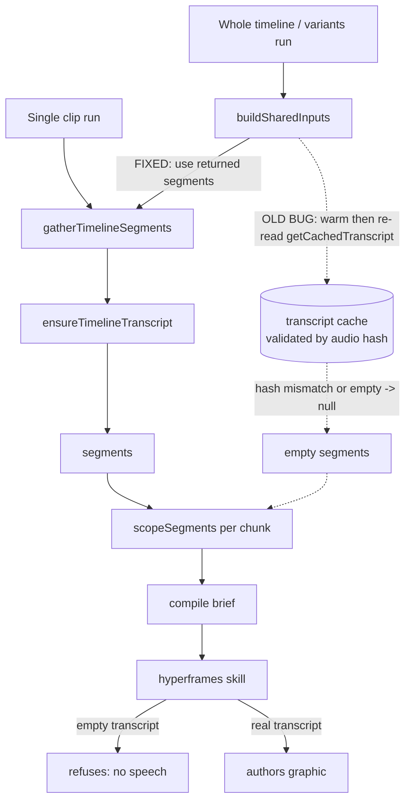

# fix: Whole-timeline HyperFrames run authors with an empty transcript

## Summary

The whole-timeline / multi-version RUN HYPERFRAMES path authors every segment with an empty
transcript, so the real hyperframes skill correctly refuses ("(no speech in this segment)",
"never invent a topic") on all N segments and the run produces nothing useful. The right-click
"Run through HyperFrames on this clip" path works on the same video, with audio present on the
timeline. Same video, same transcript cache, opposite outcome.

The fix is **instrument-first**: add run-log visibility so the transcript state is provable
instead of guessed, then confirm whether the already-applied `buildSharedInputs` refactor (which
removed a warm-then-reread divergence) resolved it, fix any residual the instrumentation reveals,
and lock the scoping logic behind a pure unit test. The fail-fast and skip-silent guards already
added stay.

**Already implemented this session** (in `apps/web/src/features/ai-generate/run-hyperframes-scoped.ts`,
verified with `tsc` + the 21 prompt tests): a fail-fast guard when there is no transcript and no
direction, per-chunk skip of silent segments, `buildSharedInputs` now consuming the segments
returned by the transcription call directly instead of re-reading the cache, and a typed direction
being allowed to author without a transcript. This plan instruments, verifies, and tests that work
rather than re-deriving it.

---

## Problem Frame

RUN HYPERFRAMES has two entry paths that both need the timeline transcript:

- **Single clip (works):** `runHyperframesOnClip` → `gatherClipTranscript(editor, start, end)` →
  `gatherTimelineSegments` → `ensureTimelineTranscript` (returns segments) →
  `scopeSegments(segments, start, end)`. The transcript reaches the brief, the skill authors a
  real graphic.
- **Whole timeline / variants (broken):** `runHyperframesWholeTimeline` / `runHyperframesVariants`
  → `buildSharedInputs` → segments → per chunk `scopeSegments(shared.segments, chunk.startSec,
  chunk.endSec)`. Every chunk's transcript arrives empty, so the brief renders
  `"(no speech in this segment)"` and the skill refuses N times.

The **original** `buildSharedInputs` warmed the cache via `gatherClipTranscript` and then
**re-read** `getCachedTranscript(editor)`. `getCachedTranscript` is validated by
`computeTimelineAudioHash`; if that reread returned `null`/`[]` while the single path used the
transcription call's return value directly, the two paths diverge on the same video. That reread
is the prime suspect and has already been refactored away — but the failing screenshot shows the
**old** flood behavior (12 authoring attempts, no fail-fast, no skip), so the running build may
predate the fix. Step one is to rule out a stale dev server vs a real remaining divergence, and to
make the transcript state observable so the answer is evidence, not inference.

Out of frame: the single-clip path (works), the Whisper / transcription engine itself, and the
empty-`[]`-is-a-valid-cache-hit policy (noted as deferred follow-up).

---

## Requirements

- **R1.** A whole-timeline or variant run on a video with speech authors graphics from the real
  per-segment transcript, the same way the single-clip path already does.
- **R2.** The run log makes the transcript state observable: total segment count, the transcript's
  first and last timestamps, and per-segment transcript character count, so an empty transcript is
  visibly diagnosable without code spelunking.
- **R3.** A run with genuinely no speech (and no direction) fails fast with one actionable message
  instead of N doomed author calls. (Guard already added — keep and cover it.)
- **R4.** A run where only some segments are silent skips the silent ones and authors the rest.
  (Guard already added — keep and cover it.)
- **R5.** The segment-scoping and authorable-content logic is covered by a pure unit test with no
  editor dependency.

---

## Key Technical Decisions

- **Instrument before re-fixing.** The screenshot cannot distinguish "stale build" from "real
  residual bug." One round of run-log instrumentation settles it. This follows the compound-
  engineering rule: make the failure observable, then fix what the evidence shows. Token/wall-clock
  cost is trivial (a few log lines).
- **Single source of truth for segments.** The refactor already makes both paths read the same
  `gatherTimelineSegments` return value. We keep that and do not reintroduce a cache reread in
  `buildSharedInputs`; structurally, that is what removes the divergence regardless of why the old
  reread came back empty.
- **Extract the pure logic to test it.** `scopeSegments` and the "is this authorable" predicate are
  pure functions currently trapped inside the controller module. Move them to a small importable
  module so R5 can be a fast, editor-free unit test (mirrors how `chunk-plan.ts` is already a pure,
  tested module).
- **Keep the guards.** Fail-fast (R3) and skip-silent (R4) stay; the diagnostic message branches on
  `timelineHasAudio` so the user learns whether it is an audio-not-enabled problem or an
  empty-transcript problem.

---

## High-Level Technical Design

Both entry paths must converge on one transcript source; the bug is that the whole-timeline path
historically diverged at the cache reread.

Instrumentation (R2) taps `SEG` (count, first/last timestamp) once per run and `SC` (per-chunk
char count) per segment, so the run log shows exactly where a transcript becomes empty: never
produced (`SEG` empty) vs lost in scoping (`SEG` full but `SC` empty).

---

## Implementation Units

### U1. Run-log instrumentation for transcript observability

**Goal:** Make the transcript state visible in the run log for the whole-timeline and variant
paths so the empty-transcript cause is provable.

**Requirements:** R2

**Dependencies:** none

**Files:**
- `apps/web/src/features/ai-generate/run-hyperframes-scoped.ts` (modify)

**Approach:** After `buildSharedInputs` resolves in both `runHyperframesWholeTimeline` and
`runHyperframesVariants`, log one line via the existing `logRun`: segment count plus the first and
last segment timestamps (or "no segments"). In `authorChunks`, when a chunk is about to author, log
its transcript character count alongside the existing "authoring segment X/N" line. Reuse the
existing `logRun` / run-log store; no new logging surface. Keep lines terse so they do not drown the
log.

**Patterns to follow:** existing `logRun(...)` calls in the same file; the `RunProgress`/run-log
store already wired into the panel.

**Test scenarios:** Test expectation: none -- logging only, no behavioral change; covered indirectly
by U3's scoping tests and the live run in Verification.

**Verification:** A whole-timeline run prints, near the start, a segment count and timestamp span,
and each authored segment prints a non-zero (or explicitly zero) transcript char count.

---

### U2. Extract pure transcript-scoping + authorable-content helpers

**Goal:** Move `scopeSegments` and the "should this content be authored" predicate out of the
controller into a pure, importable module so they are unit-testable without an editor.

**Requirements:** R1, R5

**Dependencies:** none

**Files:**
- `apps/web/src/features/ai-generate/transcript-scope.ts` (create — pure helpers)
- `apps/web/src/features/ai-generate/run-hyperframes-scoped.ts` (modify — import the helpers)

**Approach:** Lift `scopeSegments(segments, startSec, endSec)` verbatim into the new module and
export it. Add a tiny pure predicate, e.g. `hasAuthorableContent(transcript, direction)` returning
true when either trimmed string is non-empty, and use it in both the per-chunk skip and the
fail-fast guard so the rule lives in one place. The controller keeps its editor-dependent pieces
(`gatherTimelineSegments`, `timelineHasAudio`, `noAuthorableContentError`); only the pure functions
move. No behavior change — this is a testability refactor.

**Patterns to follow:** `apps/web/src/features/ai-generate/chunk-plan.ts` (pure, editor-free,
unit-tested module that the controller imports).

**Test scenarios:** covered by U3 (the tests target this module).

**Verification:** `tsc` clean; `run-hyperframes-scoped.ts` imports the helpers; no remaining local
copy of `scopeSegments`.

---

### U3. Unit tests for scoping + authorable-content

**Goal:** Lock the scoping windows, empty-transcript handling, and skip/fail rules behind a fast
pure test so this regression cannot return silently.

**Requirements:** R3, R4, R5

**Dependencies:** U2

**Files:**
- `apps/web/src/features/ai-generate/__tests__/transcript-scope.test.ts` (create)

**Approach:** Use the repo's `bun:test` style (see the existing `compile-hyperframes-prompt.test.ts`
in the same `__tests__` folder). Build small fixture segment arrays with absolute-second timings and
assert the scoped output for each case.

**Test scenarios:**
- Happy path: segments spanning 0–600s, scope `[300, 400]` returns only the overlapping segments,
  with timestamps offset to 0.
- Boundary: a segment exactly on the chunk edge (`s.end === startSec` excluded; `s.start === endSec`
  excluded) matches the existing strict `>` / `<` filter.
- Whole-video parity: scoping `[0, total]` returns every segment (the variant-path window) — guards
  the single-vs-whole divergence at the pure level.
- Empty source: empty segment array returns `""` for any window.
- Out-of-range window: a chunk window past the last segment returns `""` (drives the silent-chunk
  skip).
- `hasAuthorableContent`: empty transcript + empty direction → false; non-empty transcript → true;
  empty transcript + non-empty direction → true; whitespace-only both → false.

**Verification:** `bun test` on the new file passes; running the full ai-generate test folder stays
green.

---

### U4. Confirm the divergence is resolved; fix any residual the instrumentation reveals

**Goal:** Prove on a real run that the whole-timeline path now authors from the per-segment
transcript, and fix the specific residual if U1's instrumentation shows one.

**Requirements:** R1

**Dependencies:** U1, U2

**Files:**
- `apps/web/src/features/ai-generate/run-hyperframes-scoped.ts` (modify, only if a residual is found)
- `apps/web/src/features/transcription/transcript-cache.ts` (modify, only if the residual is a cache
  hash/divergence issue — upstream-origin area, add a `PATCHES.md` row if touched)

**Approach:** Restart/rebuild the dev server so the refactor is live, then run the whole-timeline
path on the same video and read U1's instrumentation. Branch on what it shows:
- **Segments present, per-chunk char counts non-zero, graphics author** → the segments-direct
  refactor resolved it (stale build was the cause). No further code change; close the unit.
- **Segments count is zero** even though the single-clip path produced a transcript → the
  transcription/cache layer is returning empty for the whole-timeline read. Compare the audio hash
  computed during the single run vs the whole-timeline run; if they differ on the same timeline
  state, the divergence is in `computeTimelineAudioHash` input (e.g., active-scene/track snapshot)
  and the fix is to read segments from one consistent source (already the refactor's intent).
- **Segments present but per-chunk counts are zero** → a scoping/time-unit mismatch (segment times
  not timeline-absolute, or chunk windows in different units); fix the alignment in the pure
  scoping path and extend U3 with the failing case.

**Patterns to follow:** the single-clip path (`runHyperframesOnClip`) is the reference for a correct
transcript-to-brief flow.

**Test scenarios:** primarily live verification (browser run). Any code residual fixed here must add
the reproducing case to `apps/web/src/features/ai-generate/__tests__/transcript-scope.test.ts`.

**Verification:** a whole-timeline run on a talking video authors graphics on ≥1 segment with real,
on-topic content; the run log shows non-zero per-chunk transcript char counts; no segment refuses
for "no transcript."

---

## Scope Boundaries

In scope: the whole-timeline / variant empty-transcript divergence, run-log observability, the pure
scoping/authorable test, and keeping the fail-fast + skip-silent guards.

Not in scope (no behavior change here): the single-clip path, the Whisper/transcription engine,
caption styling, and the brief/prompt content (handled by `compile-hyperframes-prompt.ts` and its
existing 21 tests).

### Deferred to Follow-Up Work

- **Empty-transcript cache policy.** `ensureTimelineTranscript` treats a cached `[]` as a valid hit,
  so one transcription that returns empty (e.g., an early/partial state) can poison every later run
  for that timeline hash. Consider not treating `[]` as a permanent hit when `timelineHasAudio` is
  true, or expiring it.
- **"Re-transcribe" control.** A user-facing way to force a fresh transcript without nudging the
  timeline to bust the cache hash. Useful if the deferred cache policy above is not changed.

---

## Risks & Dependencies

- **Risk: the real cause is the empty-cache policy, not the reread.** If U4's instrumentation shows
  zero segments on the whole-timeline read while the single path has them, the deferred cache policy
  becomes load-bearing and should be pulled into scope. Mitigation: U1 makes this visible on the
  first run, so the call is evidence-based.
- **Dependency: live verification needs the app.** The decisive check is a browser run (Dan runs the
  dev server). `tsc` + the pure unit test gate the code; the browser run gates the behavior.
- **Upstream-origin file.** Only U4's optional `transcript-cache.ts` edit touches an upstream-origin
  area; if it changes, add a `PATCHES.md` row in the same commit. `run-hyperframes-scoped.ts` and
  the new pure module are ours.

---

## Verification

- `bunx tsc --noEmit` in `apps/web` is clean.
- `bun test` on `apps/web/src/features/ai-generate/__tests__/transcript-scope.test.ts` passes; the
  existing `compile-hyperframes-prompt.test.ts` stays green.
- Live (browser, Dan): on "0629 how to edit videos with ai.mp4", a whole-timeline RUN HYPERFRAMES
  authors graphics on at least one segment with on-topic content; the run log shows a non-zero
  segment count + timestamp span and non-zero per-chunk transcript char counts; no segment fails
  with "no transcript."
- Regression guard: a single-clip run still works; a genuinely silent timeline fails fast with the
  one actionable message rather than N refusals.
