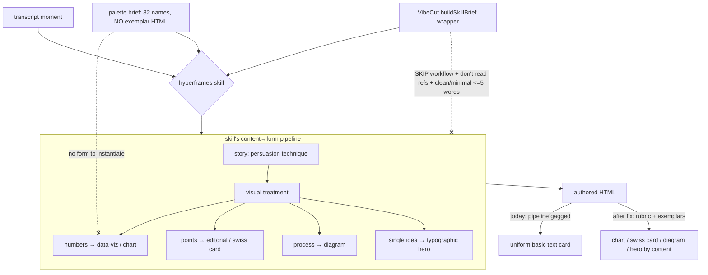
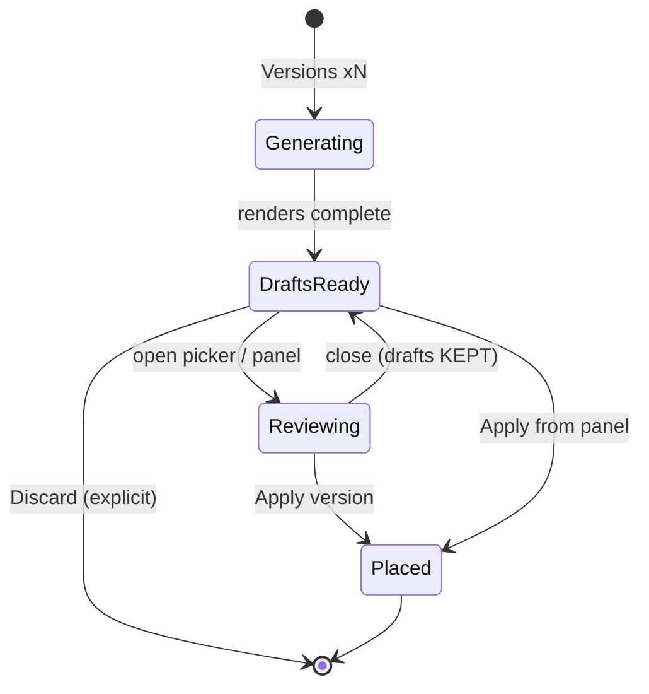

# feat: HyperFrames form variety + reviewable, persistent version drafts

## Summary

Three problems with the RUN HYPERFRAMES "versions" flow, in priority order:

1. **Form variety is broken (most important).** With every registry asset selected, every authored
   graphic comes out as the same basic text card — never a data chart, swiss-grid / editorial card,
   diagram, map, or code form. The real hyperframes skill knows how to pick those forms by content;
   our own wrapper brief disables that capability.
2. **The version picker is unreviewable.** Previews are ~80px looping postage-stamp videos with no
   enlarge, scrub, or fullscreen, so the user cannot actually evaluate a version before choosing.
3. **Drafts vanish on close.** Closing the picker without selecting discards all generated versions
   and their renders (and burns the tokens + render time); there is no way back without re-running.

The fix for (1) is to **unblock the skill from our side** — give it an explicit content→form rubric
it applies in one pass and concrete exemplars in palette mode — not to modify the upstream skill,
which already has the form logic. Fixes for (2) and (3) make the drafts large/scrubbable and
persistent in a re-openable surface alongside the inspector.

---

## Problem Frame

**Why full selection collapses to text (root cause, from reading the skill docs + our brief):**

- The real hyperframes skill chooses a visual FORM by inferring it from content: its story layer
  assigns each beat a persuasion technique, and its visual layer maps that onto one of three
  treatments — typographic, abstract graphic, or **diagram/data-viz** (numbers→chart, process→
  diagram, key-points→editorial/asymmetric card). It writes the HTML from blueprint recipes it
  reads. It does NOT need example HTML or an installed registry block to do this.
- VibeCut's `buildSkillBrief` (in `packages/hf-bridge/src/author-composition.ts`) wraps our compiled
  brief with: "SKIP the heavy workflow: no discovery, no prompt-expansion, no design-picker… Do NOT
  read extra reference files… Author the composition HTML DIRECTLY in ONE pass," plus an
  unconditional "Keep it clean and minimal: short text (<= 5 words per line)." That instruction
  **turns off the exact story→visual form-selection pipeline** and reading of the blueprint recipes,
  and biases every run toward minimal text.
- In palette mode (many assets selected) `compile-hyperframes-prompt.ts` passes asset **names +
  one-line descriptions only** — the composition HTML is deliberately not embedded (the `baseRef`
  gate requires exactly one example pick), and `fetchReferenceCompositions` caps at 3 anyway. So the
  skill has the name "bar-chart" or "swiss-grid" but no HTML to instantiate and is forbidden from
  reading the files.
- The `densityHint` + the brief's anti-pill "make NOTHING rather than pad" pressure push toward
  sparse, conservative output.

Net: the skill is structurally forced into the one form it can produce cold from prose — a short
text card. This is a brief/wrapper problem, not a skill problem and not an invocation problem (the
earlier work already proved the real skill is invoked).

**Picker + persistence:** the variant drafts live only in an in-memory zustand store
(`useVariantPickerStore`); `close()` nulls the array and revokes the preview object URLs, and the
rendered Files are never parked in the media bin — so an un-selected close is unrecoverable. Each
preview is a looping `<video>` at ~142×80px with no expand/scrub.

Out of frame: changing how the skill is invoked (works), the transcript path (fixed), and modifying
the upstream hyperframes skill itself.

---

## Requirements

- **R1.** With a full / multi-asset selection, authored graphics use VARIED forms chosen by content
  — a data chart when the transcript has numbers or trends, an editorial / swiss-grid key-points
  card for a list of points, a diagram for a process — not a uniform basic text card every time.
- **R2.** The wrapper brief no longer structurally suppresses form selection: it gives the skill an
  explicit per-moment content→form rubric to apply in one pass, drops the unconditional
  "minimal / <=5 words" bias, and lets the skill use the form knowledge it already has.
- **R3.** In palette mode the skill receives concrete exemplars (truncated composition HTML) for the
  content-relevant FORM assets, so it can instantiate a real chart / swiss-grid instead of guessing
  from a name.
- **R4.** Version previews are large and readable, and can be expanded / scrubbed to evaluate before
  choosing.
- **R5.** Generated drafts persist after the picker is closed and are re-accessible (review + apply)
  without re-running, until the user explicitly discards or applies them.
- **R6.** No regression of transcript-grounding / substance behavior (the 21 prompt tests stay green)
  or the never-overwrite / one-undo placement rule.

---

## Key Technical Decisions

- **Unblock the skill; do not rewrite it.** The upstream skill already maps content→form. The lever
  is our wrapper, so the fix lives in `author-composition.ts` (`buildSkillBrief`) and
  `compile-hyperframes-prompt.ts`, not in `~/.agents/skills/hyperframes`. This directly answers the
  "update the hyperframes skill" ask: the skill is fine; our brief was gagging it.
- **Replace suppression with a form rubric.** In `buildSkillBrief`, keep the speed/one-pass framing
  (we still don't want the full multi-scene discovery that was slow and off-topic) but swap "don't
  read reference files / clean and minimal / <=5 words" for an explicit compact rubric: pick ONE form
  per moment by content — numbers/trend/comparison → an animated chart built from the real values;
  a list of points → an editorial / swiss-grid key-points card; a process/cause→effect → a small
  diagram; a place → a map; code → a code card; a single idea → a typographic hero (still designed,
  not a naked line). This mirrors the skill's own composition treatments without forcing the heavy
  workflow.
- **Give palette mode concrete exemplars.** Embed truncated composition HTML for the few FORM assets
  most likely to be needed (chart + editorial/grid as a baseline, plus any picked form asset), even
  when more than one asset is selected — reworking the `baseRef`-only gate and raising the
  palette HTML budget enough to carry 1-2 small exemplars without re-bloating the brief or burying
  the transcript (the reason it was removed). Cap deliberately and keep the transcript first.
- **Persist drafts, don't discard on close.** Keep the generated versions in a store that survives
  the picker closing (close hides the modal but retains `versions`); only an explicit Discard clears
  them and revokes URLs. Surface a re-open affordance so a closed picker can be reopened.
- **Reviewable previews reuse existing render Files.** The previews are already real playable webms;
  enlarging + adding click-to-expand / scrub is pure UI on the same Files.

---

## High-Level Technical Design

How the real skill selects a form, and where our wrapper currently cuts the wire:

The two dashed "cut" edges are what this plan reconnects: U1 removes the workflow/minimal gag and
adds the rubric; U2 restores a concrete exemplar in palette mode.

Draft lifecycle after the persistence fix:

---

## Implementation Units

### U1. Form-selection rubric in the wrapper brief (stop suppressing variety)

**Goal:** Replace the wrapper's variety-killing instructions with an explicit content→form rubric so
the skill picks the right rich form per moment in one pass.

**Requirements:** R1, R2, R6

**Dependencies:** none

**Files:**
- `packages/hf-bridge/src/author-composition.ts` (modify `buildSkillBrief`)
- `apps/web/src/features/ai-generate/compile-hyperframes-prompt.ts` (tighten the palette
  MATCH-BY-CONTENT mapping to name concrete forms)
- `apps/web/src/features/ai-generate/__tests__/compile-hyperframes-prompt.test.ts` (extend)

**Approach:** In `buildSkillBrief`, keep the "one short overlay, single pass, no multi-scene
discovery" intent (we still avoid the slow heavy workflow) but remove the three variety-suppressors:
"Do NOT read extra reference files," the blanket "clean and minimal: short text (<=5 words per
line)," and the framing that bans the design-picker. Replace with a compact FORM rubric: choose ONE
form per moment by content (numbers/trend/comparison → animated chart from the real values; list of
points → editorial / swiss-grid key-points card; process or cause→effect → small diagram; place →
map; code → code card; otherwise a designed typographic hero, never a bare line). Keep the
placement, transparency, root-contract (`data-start="0"`), grounding, and never-invent-data rules
intact. In `compile-hyperframes-prompt.ts`, align the palette MATCH-BY-CONTENT lines with the same
form names so brief and wrapper agree.

**Patterns to follow:** the existing `buildSkillBrief` structure and the palette/MATCH-BY-CONTENT
block already in `compile-hyperframes-prompt.ts`; the skill's own treatment vocabulary
(typographic / data-viz / diagram / editorial-asymmetric) from its composition reference.

**Test scenarios:**
- The compiled prompt (palette mode) contains the concrete form names (chart, key-points/editorial
  card, diagram, map, code) in the MATCH-BY-CONTENT mapping.
- The GOAL/substance assertions from the existing suite still pass (no regression): still bans
  segment titles / pills / numbered breaks, still demands transcript grounding. Covers R6.
- A single-example selection still yields the STYLE SOURCE framing (unchanged).
- (Wrapper text in `author-composition.ts` is asserted by U3's bridge-level check if a test exists;
  otherwise verified live.)

**Verification:** `bunx tsc --noEmit` clean; the prompt test suite green; a live whole-timeline run
on numeric content produces at least one non-text form (see U6 verification).

---

### U2. Palette-mode exemplars: embed real FORM composition HTML

**Goal:** Give the skill a concrete chart / swiss-grid exemplar to instantiate when many assets are
selected, instead of names only.

**Requirements:** R3, R6

**Dependencies:** U1

**Files:**
- `apps/web/src/features/ai-generate/compile-hyperframes-prompt.ts` (rework the reference-embed
  gate so palette mode can embed 1-2 truncated FORM exemplars)
- `apps/web/src/features/ai-generate/run-hyperframes-scoped.ts` (`fetchReferenceCompositions` /
  `MAX_REFERENCE_COMPS` so the content-relevant FORM assets are actually fetched, not just the first
  three by list order)
- `apps/web/src/features/ai-generate/__tests__/compile-hyperframes-prompt.test.ts` (extend)

**Approach:** Today reference HTML is embedded only when `selections.length === 1 && examples.length
=== 1`. Loosen this so palette mode embeds a small, capped set of FORM exemplars (e.g. a chart block
+ an editorial/grid block when present among picks), clearly labeled as "instantiate this form with
the transcript's content, do not copy its sample text." Keep the transcript ABOVE the exemplars and
keep the total HTML budget small (the original removal was because ~38k chars buried the transcript
and caused off-topic hallucination — so cap hard, truncate per-exemplar, and keep grounding
language). Adjust `fetchReferenceCompositions` to prioritize the FORM assets the rubric is most
likely to use rather than the first three by order.

**Approach note (directional, not spec):** prefer fetching/embedding by FORM relevance (chart,
grid/editorial) over arbitrary list position; 1-2 exemplars is the target, not all picks.

**Test scenarios:**
- Palette mode (>=2 selections) with a chart-type asset among picks: the compiled prompt now embeds
  that asset's (truncated) HTML, labeled as a form-to-instantiate, with the transcript still
  appearing before it.
- The embedded HTML is truncated to the cap; a huge composition does not blow the budget.
- Single-example mode still uses the STYLE SOURCE path (unchanged) — no double-embed.
- Empty / no-form-asset selection: no exemplar embedded, no crash. Covers R6.

**Verification:** prompt tests green; brief size stays bounded (assert truncation); live run shows a
real chart/grid rather than text for fitting content.

---

### U3. Lock the brief behavior with tests

**Goal:** Pin the new rubric + exemplar behavior so variety cannot silently regress again.

**Requirements:** R1, R2, R3, R6

**Dependencies:** U1, U2

**Files:**
- `apps/web/src/features/ai-generate/__tests__/compile-hyperframes-prompt.test.ts` (extend)

**Approach:** Add focused assertions for the rubric presence, the palette exemplar embedding +
truncation + transcript-first ordering, and the no-regression set. Keep all existing 21 tests.

**Test scenarios:** (the specific cases enumerated in U1 and U2, consolidated here as the standing
regression set, plus an explicit "transcript appears before any embedded exemplar HTML" ordering
assertion).

**Verification:** `bun test` on the prompt suite passes with the new cases; count is >= 21 + new.

---

### U4. Persist version drafts (survive close, explicit discard)

**Goal:** Stop discarding generated versions when the picker closes; keep them recoverable.

**Requirements:** R5, R6

**Dependencies:** none

**Files:**
- `apps/web/src/features/ai-generate/components/variant-picker-dialog.tsx` (the
  `useVariantPickerStore` close semantics + object-URL lifecycle)
- `apps/web/src/features/ai-generate/components/run-hyperframes-button.tsx` (re-open affordance)

**Approach:** Split "close the modal" from "discard the drafts." `close()` should hide the modal but
keep `versions`; add an explicit `discard()` that clears `versions` and revokes URLs. Object URLs
must stay valid while drafts persist (memoize at a scope that survives modal close, revoke on
discard/apply). Add a re-open path: when drafts exist, the toolbar shows a "Versions (ready)" /
re-open affordance that re-opens the picker with the retained drafts. Applying a version (existing
`placeVersion` → `placeHyperframesRenders`) discards the rest.

**Test scenarios:**
- Edge: `close()` retains `versions` (store still has them); `discard()` clears them.
- Edge: object URL is not revoked on `close()` (preview still renders after reopen); is revoked on
  `discard()` and on `apply`.
- Integration: generate → close → reopen shows the same versions without re-running.
- Apply still places via `placeHyperframesRenders` (one new track, one undo) — unchanged. Covers R6.

**Verification:** generate versions, close, reopen → drafts intact; discard → gone + URLs revoked
(no console leak); apply → placed on a new track, one undo.

---

### U5. Large, scrubbable version previews

**Goal:** Make each version genuinely reviewable before choosing.

**Requirements:** R4

**Dependencies:** none

**Files:**
- `apps/web/src/features/ai-generate/components/variant-picker-dialog.tsx`

**Approach:** Enlarge the preview tiles well beyond the current ~80px, give each version its own
readable row/grid, and add a click-to-expand (and/or scrub) on a segment so the user can inspect a
graphic at size. Reuse the existing `<video>` + object-URL markup; this is layout + an expand
interaction, no new data. Keep performance sane (don't autoplay dozens at full size at once — expand
on demand).

**Test scenarios:** Test expectation: none -- presentational; verified live (previews legible,
expand/scrub works). If a pure helper is extracted (e.g. preview sizing), unit-test that.

**Verification:** live — version graphics are readable; expand/scrub works at desktop + the editor's
typical panel width.

---

### U6. Re-accessible drafts surface alongside the inspector

**Goal:** Let the user review + apply persisted drafts from a surface that lives with Transform /
Audio, not only a transient modal.

**Requirements:** R4, R5, R6

**Dependencies:** U4, U5

**Files:**
- `apps/web/src/features/ai-generate/components/` (a drafts panel/section component)
- `apps/web/src/components/editor/panels/properties/registry.tsx` and/or
  `apps/web/src/features/ai-generate/components/hyperframes-tab.tsx` (host the surface)
- `apps/web/src/features/ai-generate/place-hyperframes-render.ts` (reused, not modified)

**Approach:** Surface the persisted drafts in the right-hand inspector area so they sit with the
existing tabs. Because drafts exist BEFORE any clip is placed (so there is no element to select),
the surface must read from the drafts store rather than from element selection — either a
non-element-gated section shown whenever drafts exist, or the re-open affordance from U4 promoted to
a docked panel. Each version shows the (enlarged, U5) previews + an Apply button calling
`placeHyperframesRenders` (the existing helper — one new track, one undo). Decide host (section vs
sibling tab/panel) at implementation time per the inspector's tab architecture; do not hand-roll
placement.

**Open question (resolve in implementation):** whether the drafts surface is a docked panel in the
right area (matches "leave them up with Transform/Audio" most literally) or the U4 re-openable
picker is sufficient. Start with whichever is smaller given the inspector's tab system; the store +
Apply wiring is identical either way.

**Test scenarios:**
- Integration: with drafts in the store, the surface lists each version with previews + Apply.
- Apply from the surface places via `placeHyperframesRenders` (new track, one undo); the surface
  then reflects placed/remaining state. Covers R6.
- No drafts → surface is absent/empty, no crash.

**Verification:** live — after a versions run, the drafts are reviewable + applicable from the
inspector-area surface without reopening a lost modal.

---

## Scope Boundaries

In scope: the wrapper/brief form-selection fix (U1-U3), draft persistence (U4), reviewable previews
(U5), and a re-accessible drafts surface (U6).

Not in scope: modifying the upstream hyperframes skill (it already has the form logic); changing how
the skill is invoked; the transcript path (fixed); the single-clip right-click run's existing behavior
beyond inheriting the U1 rubric.

### Deferred to Follow-Up Work

- Parking un-applied draft renders into the media bin as real assets (heavier; the store-persist in
  U4 already prevents loss within a session).
- A richer side-by-side version comparison / diff view.
- Per-segment form override controls (let the user force "chart here").

---

## Risks & Dependencies

- **Risk: re-embedding exemplar HTML re-bloats the brief / buries the transcript** (the exact reason
  it was removed). Mitigation: hard per-exemplar truncation, 1-2 exemplars max, transcript stays
  first, keep the grounding language; U3 asserts ordering + truncation.
- **Risk: relaxing "minimal" reintroduces off-topic or oversized graphics.** Mitigation: keep the
  grounding + never-invent-data + placement rules; the rubric constrains to ONE content-fit form per
  moment; live-verify on Dan's video.
- **Risk: object-URL lifecycle leak** when drafts persist across modal open/close. Mitigation: U4
  test asserts revoke-on-discard/apply only, and no revoke on close.
- **Dependency: form-variety verification needs a live run** (Dan's browser / dev server) — unit
  tests assert the brief shape, but only a real authored run proves charts/cards actually appear.
- **Upstream-origin files:** `compile-hyperframes-prompt.ts`, `run-hyperframes-scoped.ts`,
  `author-composition.ts`, and the picker/inspector components are ours. If any upstream-origin file
  is touched, add a `PATCHES.md` row in the same commit.

---

## Verification

- `bunx tsc --noEmit` in `apps/web` clean; `bun test` on the prompt suite green (>= 21 + new cases).
- Live (browser, Dan), full / multi-asset selection on a real video: across a whole-timeline or
  versions run, the authored graphics show VARIED forms — at minimum a real data chart on a numeric
  moment and an editorial / swiss-grid key-points card on a list moment, not uniform text.
- Live: generate versions, close the picker, reopen / open the drafts surface → drafts intact,
  previews legible and expandable, Apply places on a new track with one undo.
- Regression: single-clip run still works; transcript grounding intact; never-overwrite + one-undo
  placement intact.
