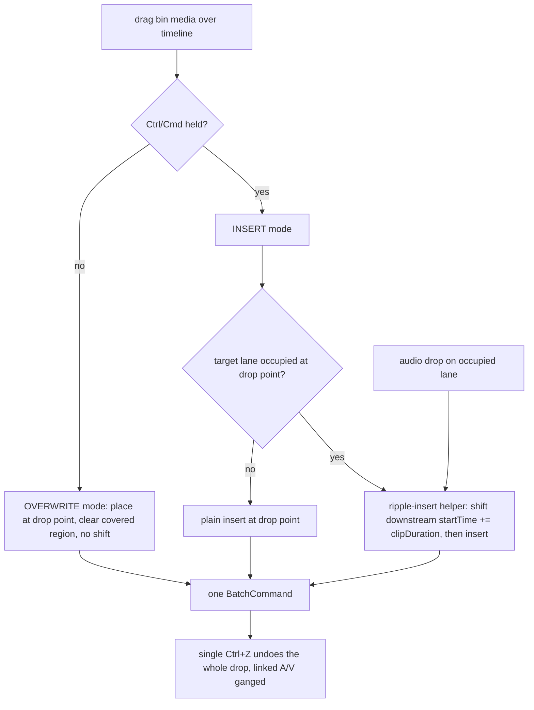
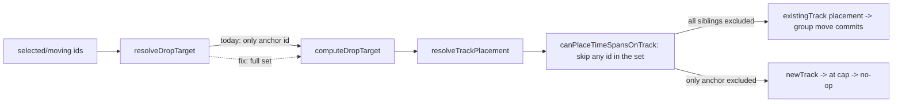

# fix: Timeline direct-manipulation — multi-select move/trim, phantom highlights, drag-insert

## Summary

Five timeline direct-manipulation problems reported from live editing, all in the timeline
controllers / placement layer:

1. **A multi-clip selection won't move** — dragging 2+ selected clips right does nothing.
2. **Multi-select trim resizes every selected clip** — grabbing one edge extends them all.
3. **Phantom highlights** — a track row stays tinted "selected" with no clip actually selected.
4. **No insert edit** — dropping a bin video only *overwrites*; there is no push-downstream option.
5. **Audio drops spawn stray tracks** — dropping audio on an occupied lane makes a new track.

The AI-CUT tuning issues also reported (silence-cut too aggressive, repeats missed) are a different
subsystem and are **out of this plan** — they get a separate focused pass.

Root causes are known and mostly narrow: #1 and #4/#5 both stem from the drop-target/placement pass
being single-element / overwrite-only; #2 is an intentional group-resize that is the reported bug;
#3 is un-pruned selection state after element re-minting. #4 is the one genuinely new feature (a
Premiere-style insert/ripple mode); the rest are corrective.

---

## Problem Frame

**#1 Multi-select move (no-op).** On drag, `ElementInteractionController.resolveDropTarget` resolves
a drop target for the anchor clip only, passing `excludeElementId: movingElement.id` (the anchor)
into `computeDropTarget` → `resolveTrackPlacement` → `canPlaceTimeSpansOnTrack`. The overlap test
honors a **single** exclude id, so the anchor's shifted span "collides" with the *other selected
clips that are also moving*, placement falls through to a new-track result, and at the 8-video-track
cap `resolveNewTrackMove` returns null → `handleMouseUp` commits nothing. A single clip works only
because it is the sole moving element. The **commit** side (`canApplyMovesToExistingTracks`) already
excludes the whole `movingElementIds` set — the drop-target side just never receives it.

**#2 Multi-select trim (fans out).** `ResizeController.onResizeStart` deliberately widens
`activeSelection` to the entire selection when the grabbed clip is selected, then
`computeGroupResize` applies one shared delta to every member (and clamps the delta to the tightest
bound across all of them). This "group resize" is intentional in the code but is exactly the
behavior the user does not want.

**#3 Phantom highlights.** `SelectionManager` holds `selectedElements: ElementRef[]` and never
prunes. `commands.ts` documents an invariant — "commands that remove editor-owned selection targets
must declare a selection override to clear stale refs" — that two mutating commands violate:
`RebuildMainTrackCommand` (re-mints every main-track clip id; the AI Director rough-cut path) and
`RemoveRangesCommand` (ripple-delete / Remove-Silences; removes or re-mints ids) both return
`undefined`. The orphaned ref's `trackId` still matches a live track, so the whole-row tint
(`SELECTED_TRACK_ROW_CLASS`) stays lit even though the clip ring is gone.

**#4/#5 Drag-insert.** There is no insert/ripple mode. Bin video/image drags are tagged with
`targetElementTypes`, so `computeDropTarget` hit-tests a clip under the cursor and
`executeMediaDrop` routes to `executeMediaOverwrite` (clears the region, no ripple). Audio drags
carry no `targetElementTypes`, so they fall to `resolveTrackPlacement`, whose overlap check returns
a new-track result — and audio has no lane-reuse clamp like video's, so it always spawns a track.
Premiere's model (researched): **default drop = overwrite; Ctrl/Cmd-drag = insert**, rippling the
target track (and any sync-locked/linked track) right; linked A/V drops and moves as one unit.

Out of frame: rewriting the move/resize architecture, the AI-CUT cut/redundancy algorithms, and a
full per-track sync-lock system.

---

## Requirements

- **R1.** Dragging a multi-clip selection along a track commits the group move (same-track shift),
  including at the video-track cap; it no longer diverts to a new track or no-ops.
- **R2.** With multiple clips selected, dragging one clip's edge resizes ONLY that grabbed clip.
- **R3.** No phantom highlight: when an element is removed or its id re-minted, its selection ref is
  pruned so no track row stays tinted with nothing selected.
- **R4.** Dropping a bin clip supports an INSERT edit that ripples downstream clips right to make
  room, distinct from the existing overwrite, with a discoverable trigger and drag cue.
- **R5.** Dropping audio on an occupied lane inserts on that lane (rippling as needed) instead of
  spawning a stray track; linked A/V stays ganged.
- **R6.** All move/trim/insert changes remain a single undo (`BatchCommand`) and never silently drop
  media; the never-overwrite-the-footage rule for authored/HyperFrames tracks is untouched.

---

## Key Technical Decisions

- **KTD1 — Exclude the whole moving set at the drop-target/placement layer (parity with commit).**
  Thread the moving-element id set through `resolveDropTarget → computeDropTarget →
  resolveTrackPlacement → canPlaceTimeSpansOnTrack` and skip any element in that set from the
  overlap test (a plural `excludeElementIds`, with the current single id becoming a one-element
  set). This is the minimal fix and mirrors `canApplyMovesToExistingTracks`, which already does it.
- **KTD2 — Trim targets the grabbed clip only.** Stop widening `activeSelection` to the full
  selection in `onResizeStart`; always build a one-member resize session from the grabbed ref
  (`computeGroupResize` already handles a single member correctly, which also removes the
  cross-clip delta clamping). Group-resize, if wanted, moves behind an explicit modifier (Open
  Question).
- **KTD3 — Prune orphaned selection refs at the mutation chokepoint.** Reconcile
  `editor.selection` inside `timeline-manager.updateTracks` (the single place tracks are swapped):
  drop any `selectedElements` / `selectedKeyframes` ref whose element is no longer present. This
  auto-fixes every current and future offender. As defense-in-depth, also make the two known
  offenders (`RebuildMainTrackCommand`, `RemoveRangesCommand`) honor the documented selection-patch
  invariant.
- **KTD4 — A pure ripple-insert helper.** Mirror `RemoveRangesCommand`'s multi-track ripple-cut in
  the opposite direction: given a track, an insert start, and a shift duration, shift every element
  with `startTime >= insertStart` right by the duration, then insert. Order it "open the hole first,
  then insert" to avoid transient-overlap rejection and the main-track snap-to-0 rule.
- **KTD5 — Premiere's drop model.** DEFAULT drop = overwrite at the drop point (unchanged);
  **Ctrl/Cmd-drag = insert + ripple** the target track (and its linked audio). Audio drops
  ripple-insert on the hovered lane instead of spawning a track. Show a distinct drag cue per mode.
  Whether insert should instead be the *default* is an Open Question (the user's phrasing leans that
  way; Premiere's convention is overwrite-default).

---

## High-Level Technical Design

The media-drop decision after this plan (the two fixes converge on one ripple-insert path):

The move fix is a data-flow parity change, not a new path — the moving-set id collection already
exists at commit time; it just needs to reach the drop-target/overlap test:

---

## Implementation Units

### U1. Multi-select move: exclude the full moving set in placement

**Goal:** A multi-clip same-track drag commits the group shift instead of diverting to a new track /
no-op.

**Requirements:** R1, R6

**Dependencies:** none

**Files:**
- `apps/web/src/timeline/placement/overlap.ts` (accept a set of exclude ids)
- `apps/web/src/timeline/placement/resolve.ts` (thread the set through `resolveTrackPlacement`)
- `apps/web/src/timeline/components/drop-target.ts` (`computeDropTarget` passes the set)
- `apps/web/src/timeline/controllers/element-interaction-controller.ts` (`resolveDropTarget` passes
  the moving set from the drag session, not just the anchor)
- `apps/web/src/timeline/placement/__tests__/` (extend)

**Approach:** Change the single `excludeElementId` to a plural `excludeElementIds` (a `Set<string>`)
along the `overlap.ts` / `resolve.ts` path; the existing single-id callers pass a one-element set.
In `element-interaction-controller.resolveDropTarget`, pass the full moving-element id set (from
`drag.moveGroup.members` / the mousedown selection) instead of `movingElement.id`. Keep the commit
path unchanged (it already excludes the set). Do not alter `buildMoveGroup`, `MoveElementCommand`,
or selection wiring.

**Patterns to follow:** `canApplyMovesToExistingTracks` in `group-move/resolve-move.ts` (already
excludes `movingElementIds`); mirror its exclusion semantics.

**Test scenarios:**
- Two selected clips on one track shifted right by N: `canPlaceTimeSpansOnTrack` returns true when
  both moving ids are excluded (today it returns false with only the anchor excluded).
- `resolveTrackPlacement` for that shift returns an existing-track placement, not `isNewTrack`.
- Single-clip drag still resolves to existing-track (one-element set == prior behavior). Covers R6.
- At the video-track cap, a valid same-track group shift still commits (no null result).
- A non-moving clip genuinely in the way still blocks (only the moving set is excluded).

**Verification:** unit tests above pass; live — selecting several clips and dragging right moves the
whole group, including on a full 8-track project.

---

### U2. Multi-select trim: resize only the grabbed clip

**Goal:** Grabbing one clip's edge with multiple clips selected resizes just that clip.

**Requirements:** R2

**Dependencies:** none

**Files:**
- `apps/web/src/timeline/controllers/resize-controller.ts` (`onResizeStart`: don't widen to the
  selection)
- `apps/web/src/timeline/group-resize/__tests__/compute-resize.test.ts` (create)

**Approach:** In `onResizeStart`, always set the resize session to the single grabbed
`{trackId, elementId}` — drop the branch that widens `activeSelection` to `config.selectedElements`.
`buildResizeMembers` / `computeGroupResize` already work with a one-member list, so the grabbed clip
resizes alone and is no longer clamped by other clips' bounds. (If group-resize is kept, gate it
behind a modifier per Open Question — not the default.)

**Execution note:** Add characterization coverage for `computeGroupResize` before changing
`onResizeStart` (there is no existing test for this path).

**Test scenarios:**
- `computeGroupResize` with a single member returns exactly one update, delta clamped only by that
  clip's own source/neighbor bounds.
- `onResizeStart` with a multi-selection but one grabbed ref builds a one-member session (assert
  members length == 1).
- Grabbed clip at its source-media limit clamps; a *different* selected clip's shorter limit does
  not constrain it.
- Left vs right handle both resize only the grabbed clip.

**Verification:** tests pass; live — with 3 clips selected, dragging one edge changes only that clip.

---

### U3. Prune orphaned selection refs on track mutation (phantom highlight)

**Goal:** No stale track-row highlight after an element is removed or re-minted.

**Requirements:** R3

**Dependencies:** none

**Files:**
- `apps/web/src/core/managers/timeline-manager.ts` (`updateTracks`: reconcile selection)
- `apps/web/src/core/managers/selection-manager.ts` (a prune/reconcile helper if cleaner there)
- `apps/web/src/commands/timeline/element/rebuild-main-track.ts` (declare a selection patch —
  defense-in-depth)
- `apps/web/src/commands/timeline/track/remove-ranges.ts` (declare a selection patch —
  defense-in-depth)
- `apps/web/src/core/managers/__tests__/selection-prune.test.ts` (create)

**Approach:** After `updateTracks` swaps in the new tracks, compute the set of live
`{trackId, elementId}` pairs and drop any `selectedElements` / `selectedKeyframes` ref not present.
This is the single chokepoint every mutation flows through, so it fixes all offenders at once. Add
the selection-patch returns on the two known offenders as belt-and-suspenders so they satisfy the
documented invariant even independent of the chokepoint.

**Test scenarios:**
- Select a main-track clip, run `RebuildMainTrackCommand`; `getSelectedElements()` no longer holds
  the orphaned ref; the row would not be tinted.
- Select a clip fully inside a range, run `RemoveRangesCommand`; the removed clip's ref is pruned.
- A straddling clip that is re-minted (new id) has its old ref pruned; a still-live selected clip on
  another track keeps its ref.
- A no-op `updateTracks` (same elements) leaves selection unchanged.
- Undo restores the elements; selection reconciliation does not throw on redo/undo cycles.

**Verification:** tests pass; live — ripple-delete / rough-cut rebuild leaves no tinted empty row.

---

### U4. Pure ripple-insert helper

**Goal:** A tested, DOM-free function that opens a hole on a track and inserts a clip, so downstream
clips shift right by the inserted duration.

**Requirements:** R4, R6

**Dependencies:** none

**Files:**
- `apps/web/src/timeline/placement/ripple-insert.ts` (create — pure)
- `apps/web/src/timeline/placement/__tests__/ripple-insert.test.ts` (create)

**Approach:** Input: the track's elements, an `insertStart` (ticks), and a `shiftDuration`. Output:
the set of `{ id, startTime }` updates for every element with `startTime >= insertStart` (shifted by
`shiftDuration`), leaving a hole at `insertStart`. Pure and lossless — no element is trimmed or
dropped; a clip that merely straddles the point is pushed by its whole start. This is the data the
controller turns into an `UpdateElementsCommand` + the `InsertElementCommand`, ordered shift-first.

**Test scenarios:**
- Three clips; insert at t between clip 1 and 2 → clips 2 and 3 shift right by the duration, clip 1
  unchanged.
- Insert before all clips → all shift.
- Insert after all clips → nothing shifts (plain append).
- Insert exactly on a clip's start → that clip and all after shift (`>=` boundary).
- Empty track → no updates, insert only.

**Verification:** unit tests pass.

---

### U5. Drag-to-insert wiring: overwrite default, Ctrl/Cmd = insert; audio ripples its lane

**Goal:** Wire the ripple-insert into the media-drop pipeline as the Premiere-style insert mode, and
stop audio drops from spawning tracks.

**Requirements:** R4, R5, R6

**Dependencies:** U4

**Files:**
- `apps/web/src/timeline/controllers/drag-drop-controller.ts` (`executeMediaDrop`,
  `insertMediaAssetsSequential`, `insertAtTarget`; route to ripple-insert; keep one `BatchCommand`)
- `apps/web/src/timeline/components/drop-target.ts` (`computeDropTarget`: carry the drop mode +
  a ripple hint; drag cue state)
- `apps/web/src/timeline/placement/resolve.ts` (audio: when a lane is occupied by overlap only,
  return an existing-track ripple result instead of `buildNewTrackResult`)
- `apps/web/src/components/editor/panels/assets/views/assets.tsx` (read the Ctrl/Cmd modifier off
  the drag; keep `targetElementTypes` only where clip hit-testing is genuinely needed)
- `apps/web/src/timeline/controllers/__tests__/` (assert the emitted `BatchCommand` shape)

**Approach:** Read the Ctrl/Cmd modifier from the drag event to pick mode. **Overwrite** (default) =
today's `executeMediaOverwrite`. **Insert** = compute downstream shifts via the U4 helper, then
insert, all in one `BatchCommand` (extend `insertMediaAssetsSequential`'s existing lazy-track +
cascade + single-`executeCommand` pattern). For audio, fix `resolve.ts` so an occupied hovered lane
returns an existing-track result flagged for ripple rather than a new track. Keep linked A/V ganged
(video on the video lane, separated audio rippling its own lane) and keep `maybeSeparateAudio` /
`buildSeparatedVideoAudioPair` intact. Show a distinct drag cue for insert vs overwrite.

**Execution note:** Start with a `BatchCommand`-shape assertion test for the insert path (spy on
`executeCommand`) before wiring the controller.

**Test scenarios:**
- Insert-mode drop on an occupied video lane emits ONE `BatchCommand` = [downstream `UpdateElements`,
  `InsertElement`]; downstream starts shifted by the clip duration; nothing overwritten.
- Default (no modifier) drop still overwrites the covered region (unchanged).
- Audio drop on an occupied lane emits a ripple-insert on that lane, no `AddTrack` for a new lane.
- Linked A/V insert: video + separated audio both inserted + each lane rippled, one undo.
- Empty-lane drop still plain-inserts (no spurious shift).
- A no-audio video drop adds no empty audio lane. Covers R6.

**Verification:** `BatchCommand`-shape tests pass; live — Ctrl/Cmd-drag a clip pushes downstream
clips right; a plain drag overwrites; dropping audio on a busy lane pushes instead of adding a track.

---

## Scope Boundaries

In scope: the five units above (multi-select move, single-clip trim, selection pruning, ripple-insert
helper + drop wiring).

Not in scope: rewriting the move/resize/placement architecture; the never-overwrite rule for
authored/HyperFrames overlay tracks (unchanged).

### Deferred to Follow-Up Work

- **AI-CUT tuning** — silence-cut too aggressive on casual pauses, and missed repeats (redundancy
  recall). Different subsystem (cut/redundancy algorithms); its own pass.
- **Per-track sync-lock** — a toggle so an insert ripples multiple parallel tracks in gang (Premiere
  sync-lock). v1 ripples the target track + linked audio only.
- **Group-resize as a feature** — if wanted, behind an explicit modifier (see Open Questions).

---

## Open Questions

- **OQ1 — Insert trigger.** Premiere convention is overwrite-default + Ctrl/Cmd-drag = insert; the
  user's phrasing ("drop a video to push out others") leans toward insert-as-default. Recommend
  Premiere-standard (overwrite default, modifier = insert) for least surprise + reversibility;
  confirm before U5. Changing the default later is a one-line flip.
- **OQ2 — Group-resize.** Remove multi-clip group-resize entirely (single-clip resize always) vs
  keep it behind a modifier (e.g. Alt-drag). Recommend single-clip default; group-resize deferred.
- **OQ3 — Ripple scope.** Target track + linked audio only (v1) vs multi-track gang via sync-lock
  (deferred). Recommend v1.

---

## Risks & Dependencies

- **Shared placement change (U1).** `overlap.ts` / `resolve.ts` are shared by move AND insert; the
  single→plural exclude must keep every existing single-id caller correct (pass a one-element set).
  Covered by the single-clip regression scenario.
- **Main-track start rule (U4/U5).** A ripple that shifts the earliest main-track element could trip
  the snap-to-0 / enforce-start rule; open the hole (shift downstream) before inserting and keep the
  new clip anchored at the drop point.
- **Behavior changes (U2, U5).** Single-clip trim and a new insert mode change felt behavior; the
  modifier + distinct drag cue keep insert discoverable, and single-clip trim matches the user's
  explicit ask.
- **DOM-bound verification.** The pointer/drag orchestration is DOM-bound; pure cores (placement,
  resize compute, selection prune, ripple-insert) are unit-tested and the drop wiring is asserted at
  the `BatchCommand` level, but the final gesture confirmation is a browser check (the user runs it;
  Claude-in-Chrome was not connectable this session).
- **Upstream-origin files.** `drag-drop-controller.ts` and several timeline files are upstream-origin;
  add a `PATCHES.md` row for each upstream-origin file touched, in the same commit.

---

## Verification

- `bunx tsc --noEmit` in `apps/web` clean; new unit tests pass (placement plural-exclude,
  single-member resize, selection prune, ripple-insert helper, drop `BatchCommand` shape); the full
  timeline test suite stays green.
- Live (browser, user): select multiple clips and drag right → the group moves (incl. at the track
  cap); trim one edge of a multi-selection → only that clip resizes; ripple-delete / rough-cut →
  no phantom row tint; Ctrl/Cmd-drag a bin clip → downstream ripples right, plain drag overwrites;
  audio drop on a busy lane → ripples the lane, no new track; every drop is one Ctrl+Z.
