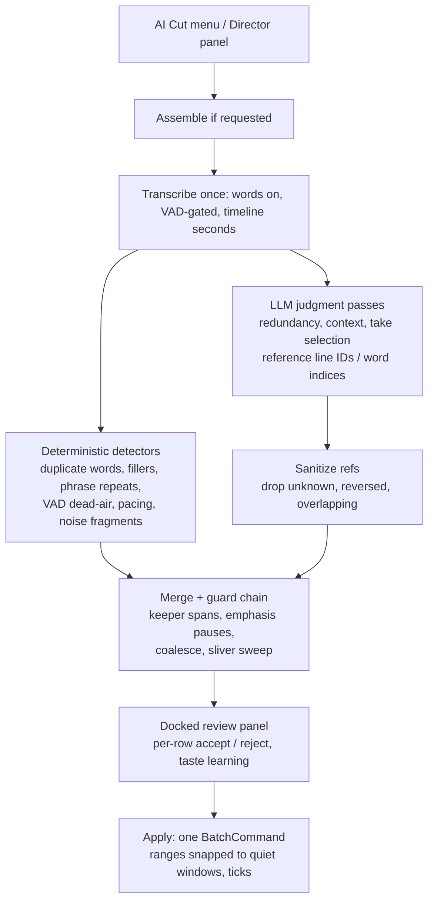
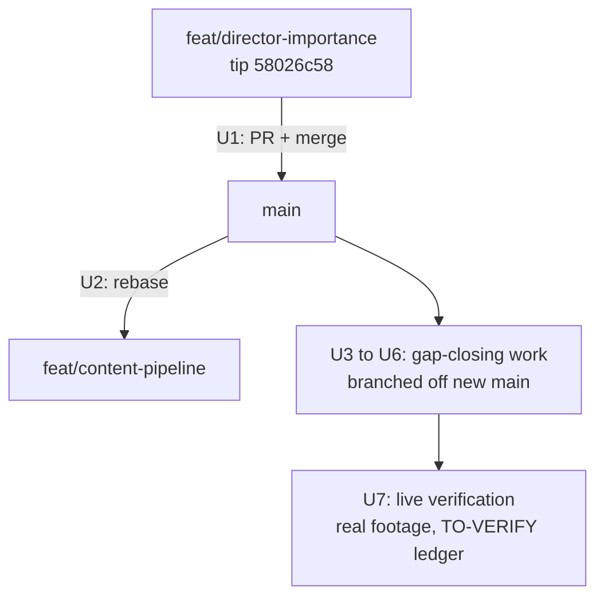

# fix: Land word-level AI cutting and retire the segment-second path

**Target repo:** vibecut (`fullvaluedan/vibecut`). Main checkout is on `feat/content-pipeline`; the AI-cutting work lives on `feat/director-importance`, checked out in the sibling worktree `framecut-director`.

## Summary

AI cutting fails on repeats, stutters, mistakes, and silences because the entry points Dan uses (the AI Cut menu) still run the legacy pipeline: segment-level `{text, start, end}` transcripts sent to Claude for raw-seconds cuts, plus a fixed-RMS silence pass with no review. The fix is mostly already built on `feat/director-importance` (word-level Whisper timestamps, deterministic detectors, VAD, energy-snapped boundaries, a review panel, ~337 passing tests) but is unmerged and only partly live-verified. This plan lands that branch, rewires every cutting entry point onto it, retires the legacy path, closes the remaining reliability gaps (transformers.js v4, LLM ID-referencing contract, transcript chunking, silence tuning), and finishes with a real-footage verification pass.

---

## Problem Frame

Three separate things produce the "AI cutting fails" experience:

1. **The wrong pipeline runs.** `apps/web/src/features/editing/remove-repeats.ts` posts segment-level transcripts to `/api/hyperframes/cuts`, where `planRepeatCuts` (`packages/hf-bridge/src/author.ts`) asks Claude for `startSec`/`endSec`. Whisper normalizes stutters out of segment text before Claude ever sees them, and second-guessing timestamps inside 5-10s segments lands cuts up to seconds off. Silence removal (`apps/web/src/features/editing/remove-silences.ts`) is a fixed RMS gate (0.015) that fails on quiet talkers and noisy rooms, and it applies cuts with no review.
2. **The right pipeline is stranded on a branch.** `feat/director-importance` already has word timestamps (`return_timestamps: "word"` with `_timestamped` models), duplicate-word/filler/phrase-repeat/dead-air/pacing detectors, Silero VAD, emphasis-pause protection, energy snap, sliver coalescing, and a review-gated apply flow. It has never merged to `main` and several TO-VERIFY items are unchecked.
3. **Known reliability gaps remain even there.** transformers.js is pinned `^3.8.1`; word-timestamp correctness fixes (chunk-seam jumps, pause-extended words, turbo overruns) only fully landed in v4.0.0 (PR #1594, 2026-03). Long transcripts go to the LLM as one unchunked prompt. Only `whisper-tiny_timestamped` is verified to emit words in-app.

---

## Requirements

**Land the built work**

- R1. The cutting pipeline reachable from the editor UI uses word-level transcripts and the director detector/review flow; no user-facing entry point calls the segment-seconds `planRepeatCuts` contract.
- R2. `feat/director-importance` is merged to `main` with the build gate and full test suite green, and `feat/content-pipeline` is rebased onto the result without losing b-roll work.

**Cut quality**

- R3. Every automated cut (including silence) reaches the timeline only through the review flow and the guard chain (coalesce, sliver sweep, quiet-b-roll and emphasis-pause protection).
- R4. Word timestamps are reliable at chunk seams: transformers.js v4.x, `_timestamped` models, seam repair and `probeWordCapability` degradation retained, regression tests covering the historical seam bugs.
- R5. Every LLM cutting pass references stable transcript IDs (line IDs or word indices), never raw seconds; references are sanitized (drop unknown, reversed, overlapping) before reaching review.
- R6. Transcripts longer than the prompt budget are chunked with overlap so 30+ minute recordings produce complete cut plans in all three auth modes.
- R7. Silence detection uses the VAD path with tuned dials (padding, minimum cut, minimum island) and composes with the existing energy-snap and refine guards.

**Verification**

- R8. Every cutting-related TO-VERIFY item is live-verified on real footage, judged by the applied timeline ranges and audible result, not by the detector op list.

---

## Key Technical Decisions

- **Base on `feat/director-importance`, do not rebuild.** The branch holds roughly 30 tested modules and ~337 director tests that implement most of this plan already. Rebuilding on `feat/content-pipeline` would re-derive weeks of work.
- **Landing order: director branch to `main` first, then rebase `feat/content-pipeline`.** The director arc is larger (43k insertions, 382 files vs origin/main as of 2026-07-04), older, and tested; the content pipeline is early-stage (U3 of its own plan pending). Merging the big branch first minimizes double conflict resolution.
- **Retire the legacy path instead of maintaining both.** The segment-seconds contract is the root cause; keeping it as a fallback invites regressions to it. `remove-repeats.ts`, `/api/hyperframes/cuts`, and the cuts branch of `planRepeatCuts` are deleted after rewiring.
- **transformers.js v4.x with `_timestamped` models.** Word timestamps require cross-attention exports (`onnx-community/whisper-*_timestamped`, all four sizes exist including turbo) and v4 carries the consolidated word-timestamp fixes (PR #1594). v3.8.1 is exposed to the exact seam bugs this plan needs gone.
- **Everything review-gated.** The unreviewed VAD pre-pass produced a cut storm and was rolled back on 2026-07-04 (`58026c58`). Deterministic detectors emit flagged ops merged into the docked review panel; nothing auto-applies.
- **Deterministic detectors for mechanical faults, LLM for judgment only.** Settled by the repeat-detection plan (2026-06-23): paraphrase is lexically uncatchable, and threshold-patching lexical detectors did not converge. The LLM judges meaning-level redundancy, take selection, and pacing, referencing IDs the sanitizer can check.
- **Compose VAD, energy refinement, and snapping; do not pick one.** VAD finds speech gaps, the RMS envelope refines the exact cut sample (`snap-cut.ts` quietest-window nudge), and the refine guards protect quiet video, emphasis pauses, and clip slivers. Word boundaries decide what to cut; the audio signal decides where.

---

## High-Level Technical Design

Target pipeline after this plan (all entry points converge on one flow):

Branch landing sequence:

---

## Implementation Units

### U1. Merge `feat/director-importance` into `main`

- **Goal:** The director pipeline (word transcripts, detectors, VAD, review, apply guards) is on `main` with gates green.
- **Requirements:** R2
- **Dependencies:** none. Confirm no session is mid-flight in the `framecut-director` worktree first; the tip commit is dated today.
- **Files:** merge-wide; no new code. Verify `PATCHES.md` rows exist for every upstream-originated file the branch touched (`worker.ts`, `transcript-cache.ts`, `remove-silences.ts`).
- **Approach:** PR from `feat/director-importance` to `main` following the HANDOFF ritual. Resolve conflicts in favor of the director branch for cutting code paths. Run `bun test` (root) and `bun run build:web` before merge.
- **Test scenarios:** Test expectation: none beyond the existing suites. The full director suite (~337 tests) and hf-bridge suite (53) must pass on the merge result; any test deleted during conflict resolution must be justified in the PR description.
- **Verification:** `main` builds, full test suite green, and the Director panel appears in a local run.

### U2. Rebase `feat/content-pipeline` onto the new `main`

- **Goal:** B-roll source pipeline work continues on top of the landed director code.
- **Requirements:** R2
- **Dependencies:** U1
- **Files:** rebase-wide; expected conflict surface is timeline and editor-panel code both arcs touched.
- **Approach:** Rebase (or merge `main` in, whichever the conflict surface makes cheaper). Keep content-pipeline behavior for source-input code, director behavior for cutting code.
- **Test scenarios:** Test expectation: none new. Existing content-pipeline tests (`apps/web/src/features/content-pipeline/__tests__/`) plus the director suites pass together.
- **Verification:** Branch builds and both feature sets' tests are green on one checkout.

### U3. transformers.js v4 upgrade and word-timestamp reliability

- **Goal:** Word timestamps are trustworthy at chunk seams on the models VibeCut ships.
- **Requirements:** R4
- **Dependencies:** U1
- **Files:** `apps/web/package.json`, `apps/web/src/services/transcription/worker.ts`, `apps/web/src/transcription/models.ts`, `apps/web/src/transcription/analysis-model.ts`, tests in `apps/web/src/services/transcription/__tests__/` (create if absent) and existing transcription tests.
- **Approach:** Bump `@huggingface/transformers` from `^3.8.1` to `^4.2.0`. Keep `wordsFromResult` seam repair and `probeWordCapability` degradation as belt-and-suspenders. Add `whisper-large-v3-turbo_timestamped` as an opt-in accuracy tier in `analysis-model.ts`; `whisper-tiny_timestamped` stays the default analysis model. Mirror the official example's dtype map (WebGPU fp32 encoder + q4 decoder, WASM q8) if the current `dtype: "q4"` misbehaves after the bump.
- **Test scenarios:**
  - Happy path: a fixture transcription result with word chunks converts to `TranscriptWordLite[]` with monotonically non-decreasing starts.
  - Edge (seam): a result whose final chunk word has a null end gets repaired to the chunk boundary, not dropped.
  - Edge (regression, from upstream #1357): synthetic words whose end exceeds audio duration are clamped.
  - Error path: a model without cross-attention exports triggers `probeWordCapability` fallback to segment mode and sets `wordsUnavailable`.
- **Verification:** In-app spike on real footage: tiny and turbo `_timestamped` both load and emit words; captions path (segment-level) unaffected by the bump.

### U4. Rewire the AI Cut menu onto the director pipeline; retire the legacy path

- **Goal:** Every user-facing cutting action runs the word-level, review-gated flow; the segment-seconds path is gone.
- **Requirements:** R1, R3
- **Dependencies:** U1
- **Files:** `apps/web/src/features/editing/components/ai-cut-menu.tsx`, `apps/web/src/features/editing/remove-repeats.ts` (delete), `apps/web/src/features/editing/autocut.ts`, `apps/web/src/features/editing/remove-silences.ts` (demote: detection preset only, no direct apply), `apps/web/src/app/api/hyperframes/cuts/route.ts` (delete), `packages/hf-bridge/src/author.ts` (remove `planRepeatCuts`, `CUTS_SCHEMA`, and the legacy cuts branch only; the module and its other planners survive for U5), `apps/web/src/features/ai-generate/director/run-director.ts` (mode presets), tests in `apps/web/src/features/ai-generate/director/__tests__/`.
- **Approach:** Map menu items to director presets: Remove silences = VAD dead-air rows only; Remove repeats = duplicate-words + phrase/segment-repeat + LLM redundancy; Full cleanup = all detectors + redundancy; AI Cut (YouTube) = assemble + all detectors + pacing/context passes. All presets end at the review panel. Preference notes keep flowing via the taste store per category.
- **Test scenarios:**
  - Happy path: each preset enables exactly its documented detector set (assert on the run-director config object per preset).
  - Edge: preset run with an empty transcript surfaces the existing "no speech found" error, not an empty review panel.
  - Error path: LLM route failure still shows deterministic detector rows (LLM rows absent, run not aborted).
  - Integration: applying an accepted plan from a preset produces one `BatchCommand`; a single undo restores the timeline.
- **Verification:** Grep proves no remaining callers of `planRepeatCuts` or `/api/hyperframes/cuts`; each menu item opens the review panel in a local run.

### U5. ID-referencing LLM contract and transcript chunking

- **Goal:** No LLM pass can misplace a cut by inventing timestamps, and long recordings fit the prompt budget.
- **Requirements:** R5, R6
- **Dependencies:** U1; U4 for the retirement half.
- **Files:** `packages/hf-bridge/src/author.ts`, the director LLM pass modules (`apps/web/src/features/ai-generate/director/` redundancy/context builders and their API routes), sanitizer module alongside them, tests in `packages/hf-bridge/src/__tests__/` and `director/__tests__/`.
- **Approach:** Extend the redundancy pass's line-ID precedent to all judgment passes; where finer grain is needed, reference word indices into the cached `words[]`. Map index to seconds via the cache, then ticks via the existing injected `ticksPerSecond` helpers. Chunk transcripts over the prompt budget with overlapping windows (overlap of a few lines so takes spanning a boundary are visible in one window); merge and dedupe ops across windows before sanitization. Sanitization drops unknown, duplicate, reversed, and overlapping references in every auth mode, which also covers `claude-code` mode's lack of schema enforcement.
- **Test scenarios:**
  - Happy path: ops referencing valid line IDs and word indices resolve to the expected tick ranges.
  - Edge: out-of-range word index, reversed range, and duplicate reference are each dropped by the sanitizer.
  - Edge: a transcript at exactly the chunk boundary produces windows with the configured overlap; an op reported in both windows dedupes to one.
  - Error path: a malformed LLM response (non-JSON, wrong shape) yields zero ops for that pass and a stage-named failure, not a crash.
- **Test scenarios note:** keep all of this pure and wasm-free so `bun test` covers it.
- **Verification:** A synthetic 45-minute transcript plans successfully in api-key mode and claude-code mode; no code path sends or receives raw `startSec`/`endSec` from an LLM.

### U6. Silence quality: tune the VAD path and dials

- **Goal:** Silence cuts feel human: breathing room kept, no machine-gun jump cuts, no eaten b-roll or emphasis pauses.
- **Requirements:** R7, R3
- **Dependencies:** U1; independent of U3-U5.
- **Files:** `apps/web/src/services/vad/intervals.ts`, `apps/web/src/services/vad/worker.ts` and `service.ts` (where `NonRealTimeVAD.new()` is called with no options today; the tuning dials thread through here), `apps/web/src/features/ai-generate/director/vad-dead-air.ts`, `dead-air.ts`, `snap-cut.ts`, `apps/web/src/features/editing/silence-refine.ts`, colocated tests.
- **Approach:** Tune `NonRealTimeVAD` for offline cut detection rather than mic streaming (raise `minSpeechMs`, tune `redemptionMs`; silences are the gaps between yielded speech segments). Adopt the auto-editor conventions as named dials: asymmetric padding (~0.2s head, ~0.35s tail; trailing decay cut-off is what sounds robotic), minimum removable silence ~0.2s, minimum surviving island ~0.1s (absorbed otherwise). Cut placement stays on the existing `snap-cut.ts` quietest-window nudge; word ends are the least reliable Whisper output, so never cut at `word.end`, cut in the valley between words. Keep every existing guard (quiet-video protection, emphasis pauses, sliver coalesce). Do not guess thresholds blind: expose them as one-line dials and tune against Dan's real recordings in U7.
- **Test scenarios:**
  - Happy path: a synthetic envelope with a 1s gap between speech yields one removable range with asymmetric padding applied.
  - Edge: a 0.15s gap yields no cut (below minimum); a 0.08s speech island between silences is absorbed.
  - Edge: a gap overlapping a protected emphasis-pause span yields no cut.
  - Integration: ranges emitted here pass through coalesce and sliver guards without producing sub-15-frame clips (reuse the existing guard-chain tests as the harness).
- **Verification:** Detector rows on real footage look sane in review before apply; applied result has no audible clicks or clipped word heads/tails at cut points.

### U7. Live verification pass and ledger

- **Goal:** The whole chain is proven on real footage, judged by outputs.
- **Requirements:** R8
- **Dependencies:** U1-U6
- **Files:** `docs/TO-VERIFY.md`
- **Approach:** Work through every cutting-related TO-VERIFY item plus new entries from U3-U6, with Dan's real recordings: word model loads in-app, VAD-gated transcription remap correctness at interval seams, each preset end-to-end, undo behavior, applied timeline ranges and audible result. The standing failure mode is signing off on inputs (op lists, transcript text) instead of outputs (the timeline after apply, the audio you hear); verify outputs. Tune the U6 dials here against what the footage shows.
- **Test scenarios:** Test expectation: none, this unit is the manual verification ledger; automated coverage lives in U3-U6.
- **Verification:** Every cutting item in `docs/TO-VERIFY.md` is checked with a dated note, or converted into a filed defect.

### U8. Revisable apply: the review panel persists, cuts are restorable, A/B preview

- **Goal:** Applying a plan no longer discards it. The panel stays open in an Applied state, every row (and the recommended-cuts group) can be toggled after the fact, and one control previews the timeline with vs without the applied cuts. (Dan's ask, 2026-07-04.)
- **Requirements:** R9 (new): after apply, the plan + decisions remain the panel's state; toggling any row revises the applied result; a with/without A/B toggle exists; a row filter separates recommended (default-accepted) from opt-in and rejected rows.
- **Dependencies:** U1 landed plus the review-fix commits on `feat/director-importance`; develop on a branch off that tip.
- **Files:** `apps/web/src/features/ai-generate/director/director-plan-store.ts` (applied-phase state), `director-cut-panel.tsx` and `director-review-dialog.tsx` (Applied mode UI, A/B, category filter), `apply-plan.ts` callers, colocated tests.
- **Approach:** Keep the store populated after apply with `{ phase: "applied" }`. Revise = undo the Director BatchCommand + re-run `applyDirectorPlan` with the current decisions (still one undo step; the store owns the recipe). A/B = undo/redo the batch without clearing state. Row filter: All / Recommended / Opt-in / Rejected.
- **Test scenarios:** toggling a row after apply produces exactly (undo batch, new batch) against a stub editor; A/B twice returns a byte-identical timeline; explicit dismiss (not apply) is the only thing that clears state; the premise guard still downgrades sp- rows during post-apply revision.
- **Verification:** Live: apply, uncheck one row in Applied mode and see the footage return; toggle A/B; panel survives until dismissed.

---

## Scope Boundaries

**In scope:** landing the director branch, rewiring cutting entry points, the v4/word-timestamp upgrade, LLM ID contract and chunking, silence tuning, live verification.

**Deferred to follow-up work**

- Audio-similarity stutter detection for disfluencies Whisper erases from text (CrisperWhisper-style verbatim ASR has no browser port yet; revisit if U7 shows text-level detection missing too much).
- Groq cloud word-level transcription as a default accuracy tier (exists as an escape hatch; promoting it is a product/cost call).
- Micro-crossfades (~5ms) at cut points if U7 surfaces audible clicks that valley-snapping does not fix.
- The N+1 undo cleanup for assemble and silence preludes (flagged risky refactor; one-undo already holds for the review-applied plan itself).
- B-roll insertion and the rest of the content-pipeline arc.

**Outside this product's identity:** server-side rendering of cuts, desktop DaVinci/Resolve integration.

---

## Risks & Dependencies

- **In-flight work on the director branch.** The tip commit is dated today. If a parallel session is active in the `framecut-director` worktree, U1 must wait for it to land or pause. Confirm before merging.
- **Merge conflict surface.** 43k insertions across 382 files against a branch that also touched timeline code. Mitigation: land U1 before writing any new code; resolve cutting-path conflicts in favor of the director branch.
- **transformers.js v4 bump regressions.** The captions/segment path shares the worker. Mitigation: U3 keeps the probe fallback and runs the captions path in its spike.
- **Word support beyond tiny is unverified in-app.** Turbo `_timestamped` exists upstream but only tiny is proven in VibeCut. Mitigation: accuracy tier is opt-in until U7 verifies it.
- **`claude-code` auth mode has no schema enforcement** and shells out to a CLI that has broken on this machine before. Mitigation: U5's sanitizer treats every LLM response as untrusted in all modes.
- **Preview MCP cannot drive the editor in agent sessions** (desktop-only gate). Verification therefore runs through Dan's TO-VERIFY ledger and code-level assertions, which is exactly U7's design.

---

## Sources & Research

- Legacy path: `packages/hf-bridge/src/types.ts` (`TranscriptSegment`), `packages/hf-bridge/src/author.ts` (`planRepeatCuts`, `buildCutsPrompt`, `planDispatch`), `apps/web/src/features/editing/remove-repeats.ts`, `remove-silences.ts` (RMS 0.015).
- Director branch inventory: `apps/web/src/features/ai-generate/director/` (detectors, `run-director.ts`, `apply-plan.ts`, `snap-cut.ts`, taste), `apps/web/src/services/vad/`, `apps/web/src/features/transcription/vad-remap.ts`, branch `docs/TO-VERIFY.md`, `docs/plans/2026-06-23-001-feat-director-repeat-detection-plan.md` (deterministic-vs-LLM split rationale), tip `58026c58` (review-only silence).
- transformers.js word timestamps: fixed in v4.0.0 via PR #1594 (2026-03-29); historical bugs #551, #805, #1357; requires `_timestamped` ONNX exports (all four sizes on onnx-community, turbo included); official `whisper-word-timestamps` example carries the per-device dtype map.
- Whisper disfluency behavior: implicit normalization drops fillers and stutters inconsistently; filler-saturated prompts are unreliable and worse on larger models (openai/whisper discussion #1174; AImpower 2024 study). Drives the deferred audio-similarity item.
- Browser VAD: `@ricky0123/vad-web` 0.0.30 (2025-11), `NonRealTimeVAD` offline API over Float32Array, ~2MB silero models, depends on `onnxruntime-web` (already shipped via transformers.js; watch bundle dedupe).
- Cut-placement conventions: auto-editor margins (default 0.2s, asymmetric supported), min-cut 0.2s / min-clip 0.1s smoothing; cut in silence valleys rather than at word ends; micro-fades beat zero-cross snapping when clicks appear.
