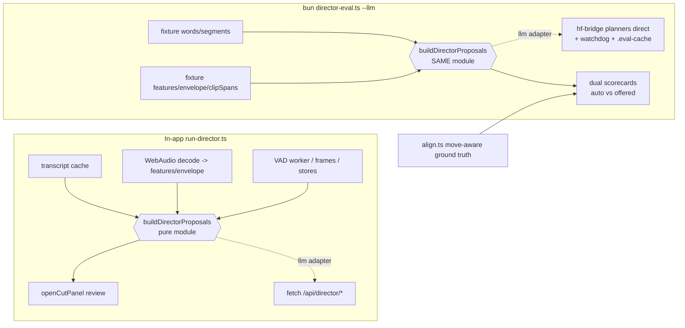

# feat: Wire the Director's LLM passes into the golden-footage eval

## Summary

The golden-footage eval (`feat/director-eval`) measures the Director's deterministic detectors against ground truth derived from Dan's own finished edits. First real scorecard: detectors catch **0.8%** of what Dan cuts, and half of their proposals cut dialog he kept. The three LLM passes (plan, redundancy, context) carry ~99% of the real cutting job and are unmeasured. This plan wires them in with **fidelity as the prime constraint**: the eval must run the app's own orchestration, not a lookalike. The deliverable is a measurement report that names which failure hypothesis (transcript quality, chunking blindness, boundary math, LLM judgment) dominates on real footage, deciding the next fix.

---

## Problem Frame

- Four rounds of Director fixes shipped with no way to measure cut quality; Dan is the eval harness with a one-day loop. Repeats still survive; good dialog still gets clipped.
- The eval harness exists (alignment + scorecard + runner + fixture prep, all on `feat/director-eval`) but scores only the deterministic layer.
- Discovery (2026-07-11 call-graph map) established: `run-director.ts:199-715` is pure given its inputs; the three LLM passes are thin `fetch`es to routes that wrap node-callable hf-bridge planners (`planDirector`, `planRedundancy`, `planContext`); both LLM prompts consume **segments** (never words) via a signal table whose columns include audio-derived loudness/wpm/filler/silence and importance.

## Requirements

- R1: `bun scripts/director-eval.ts --llm` runs the FULL proposal pipeline (detectors + all three LLM passes) on a fixture and prints the scorecard.
- R2: Fidelity — the eval and the app execute the same orchestration code (single extracted module), same merge/sanitize order, same S4 accept-default gating. Every LLM prompt input is supplied from the fixture or consciously stubbed, documented in a fidelity checklist in the runner header.
- R3: Ground truth is move-aware — reordered sections are labeled kept/moved, not missed cuts; scorecard reports movedWords.
- R4: Nondeterminism handled — prompt-hash response cache (re-scoring is free and byte-stable) plus `--runs N` mean and spread on headline numbers.
- R5: App behavior unchanged — the full existing director test suite (530+) and tsc stay green after the extraction; the in-app Director produces the same review rows.
- R6: Scoring distinguishes what one-click apply would do (default-accepted ops) from everything offered for review (all rows) — two proposal sets, two scorecards.
- R7: A findings report ranks the failure hypotheses with evidence and decides the fix order.

## Scope Boundaries

- In: eval infrastructure, the pure extraction refactor, fixture enrichment (audio features), the measurement itself.
- Out (this plan): fixing cut quality (next plan, informed by the report); vision-pass eval (frames stubbed off — no fixture frames); VAD dead-air layer in eval (config-gated off; fixtures carry no VAD gaps); captions; the graphics branch.

### Deferred to Follow-Up Work

- Vision-pass measurement (needs frame sampling from raw files in prepare — meaningful but separate).
- Second fixture from `D:\Hermes\remotion-v2\public\source.mp4` if its raw folder is identified (U6 includes an attempt; not a blocker).
- CI wiring of `--selftest --llm` with a mocked adapter.

---

## Key Technical Decisions

- **KTD1 — Extract, don't imitate.** Move `run-director.ts:199-715` verbatim into a new pure module `apps/web/src/features/ai-generate/director/build-director-proposals.ts`; `run-director.ts` becomes sense-gathering (transcript, audio decode, VAD, frames, store reads) + one call + `openCutPanel`. The eval imports the same module. Rationale: any hand-assembled copy measures a phantom pipeline. Discovery confirmed the block is pure given `{words, segments, features, envelope, gaps, clipSpans, fps, elements, assets, frames?, taste?, config, llm}`.
- **KTD2 — LLM adapter seam.** The module takes `llm: { plan(...), redundancy(...), context(...) }`. In-app: wraps the three existing `fetch`es (unchanged behavior, same auth headers, same abort signal). In eval: calls `planDirector` / `planRedundancy` / `planContext` from `@framecut/hf-bridge` directly with a `ClaudeAuth` (default `{mode:"claude-code"}`; `--auth api-key` uses `ANTHROPIC_API_KEY`). Discovery confirmed the planners use only `node:child_process`/`fetch` — bun-callable without Next.
- **KTD3 — Audio features are load-bearing; compute them in prepare.** Signal-table columns (loudness, wpm, filler, silence) and importance derive from `computeSpeechFeatures`/`computeEnergyEnvelope` — pure math over samples (`audio-features.ts`); only the in-app decode is browser-coupled. The prepare script decodes PCM via ffmpeg (`-f f32le -ac 1 -ar 16000`) and reuses those same pure functions, storing per-segment features and a coarse envelope in the fixture. No stubbing needed; prompts see real signals.
- **KTD4 — Dual proposal sets.** Discovery corrected the S4 model: lexical detectors always run; gating is on `defaultAccept` (`lexicalBackstopDefaultAccept`, redundancy confidence thresholds). Score BOTH: `auto` (ops a one-click apply would execute) and `offered` (every review row). The auto set is the honest measure of the automatic path; the offered set measures review burden and recall ceiling.
- **KTD5 — Cache + variance.** Responses cached under `apps/web/.eval-cache/` keyed by hash(pass, prompt payload, auth mode, runIndex). `--runs N` runs N live passes (each cached under its index), reports mean and spread of cut-recall and essential-words-lost. Re-invocation is fully cached.
- **KTD6 — Adapter-level watchdog.** Discovery found the planners have NO timeout in claude-code mode (CLI spawn, no signal). The eval adapter wraps each pass in a hard timeout (default 10 min, env-overridable) and fails the run loudly. (In-app behavior untouched; a proper in-app timeout is follow-up work, noted in the report.)
- **KTD7 — Clip spans from prepare offsets.** Fixtures already know each raw file's timeline offset; prepare emits `clipSpans` + pseudo `elements`/`assets` (one per raw file, assetId = filename). This feeds `src`/`grp` columns and take-clustering identically to in-app multi-clip timelines.
- **KTD8 — Segmentation variance accepted.** Fixture segments come from Groq whisper-large-v3; in-app from browser whisper. Documented, deliberate: measuring the algorithm on best-quality inputs isolates algorithm quality from transcript quality (one of the competing hypotheses).

## High-Level Technical Design

The prose above is authoritative; the diagram is orientation.

---

## Implementation Units

### U1. Move-aware ground truth

**Goal:** Reordered sections stop inflating missed-cut labels.
**Requirements:** R3.
**Dependencies:** none (do first — cleans the target every later unit measures against).
**Files:** `apps/web/src/features/ai-generate/director/eval/align.ts`, `apps/web/src/features/ai-generate/director/eval/__tests__/eval-align.test.ts`, `apps/web/src/features/ai-generate/director/eval/score.ts` (movedWords in report), `apps/web/scripts/director-eval.ts` (print line).
**Approach:** After the existing deletion/substitution classification, pair unmatched RAW runs with unmatched FINAL runs elsewhere by normalized text match (minimum run length ~5 content words to avoid false pairing on stock phrases; greedy longest-first). Paired raw runs are labeled kept/moved and excluded from truth cut spans; report `movedWords`. The google-omni fixture's 384 final-only words are the live probe.
**Patterns to follow:** existing gap-symmetry classification in `align.ts`; test fixtures in `eval-align.test.ts`.
**Test scenarios:** (happy) a 20-word block appearing early in raw and late in final is labeled moved, not cut, and final-only count drops accordingly; (edge) two near-identical retakes where one copy is cut and the other survives elsewhere must NOT pair as a move (the cut copy stays a cut — pairing consumes the final run so it can pair at most once); (edge) a moved block shorter than the minimum length stays under old semantics; (error) no false moves on the pure-deletion synthetic cases already in the suite (all existing tests stay green with unchanged expectations).
**Verification:** eval tests green; rerun scorecard on google-omni shows movedWords > 0 and truth-cut count drops; spot-check two reported moved spans against the actual videos' content by text.

### U2. Extract the pure proposal pipeline

**Goal:** One module produces Director proposals for both the app and the eval; zero behavior change.
**Requirements:** R2, R5.
**Dependencies:** none (parallel-safe with U1; must precede U4/U5).
**Files:** create `apps/web/src/features/ai-generate/director/build-director-proposals.ts`; modify `apps/web/src/features/ai-generate/director/run-director.ts`; create `apps/web/src/features/ai-generate/director/__tests__/build-director-proposals.test.ts`.
**Approach:** Move `run-director.ts:199-715` (detector block through `justifyCuts` + `applyProtectedSpans`) verbatim into the new module with the discovery-mapped signature: `{words, segments, features, envelope, gaps, clipSpans, fps, elements, assets, frames?, taste?, config: {vadEnabled, visionEnabled}, llm}` returning `{operations, nearTies, redundancyGroups, protectedSpans, applyProtectedSpans, redundancyRan}`. Also return per-op provenance (category/source already on ops) and defaultAccept flags untouched. run-director builds the `llm` adapter from its three existing `fetch`es and passes editor-derived values. Keep the `typeof window` guard on the `__directorDebug` block. Landmines from discovery: do NOT import `run-director.ts`, `@/wasm`, stores, or media modules from the new file — only the already-pure detector modules (inline `TICKS_PER_SECOND` pattern per `build-signal-table.ts:17`).
**Execution note:** characterization-first — before moving code, capture a golden snapshot: run the existing suite, then write one test that feeds a synthetic `{words, segments, features...}` set with a stubbed llm (returns fixed ops) through the new module and asserts the exact merged/sanitized op list; this test is authored against the CURRENT behavior by temporarily exercising the same block.
**Test scenarios:** (happy) synthetic input + stub llm yields ops passing through merge 1, redundancy-authority merge 2, second pass, snap, trim-vs-cut, justify — asserted structurally (counts, order, defaultAccept flags); (edge) `redundancyRan=false` path (llm.redundancy throws) leaves lexical ops default-accepted (S4 fallback); (edge) empty words (degraded transcript) still runs segment layers; (integration) the FULL existing director suite (530+ tests) green unchanged — this is the primary gate.
**Verification:** tsc 0; full `bun test src/features/ai-generate/director/` green; `git diff` on run-director shows only extraction + adapter wiring; E2E smoke (`bunx playwright test`) still green (editor boots).

### U3. Fixture audio features

**Goal:** Fixtures carry the real signal-table inputs (loudness/wpm/filler/silence, importance, envelope) instead of stubs.
**Requirements:** R2 (fidelity checklist: features = supplied).
**Dependencies:** none (parallel-safe; must precede U5 measurement).
**Files:** `apps/web/scripts/director-eval-prepare.ts`; `apps/web/src/features/ai-generate/director/eval/fixture-types.ts` (new: shared fixture shape incl. features/envelope/clipSpans); `apps/web/scripts/director-eval.ts` (load new fields).
**Approach:** Prepare extracts mono 16k PCM per raw clip via ffmpeg `-f f32le`, builds a `Float32Array`, and calls the SAME pure `computeEnergyEnvelope` + `computeSpeechFeatures` (`audio-features.ts`) with the clip's segments (offset-adjusted). Store per-segment features and a coarse envelope (existing envelope hop; round values to 3 decimals for JSON size). Emit `clipSpans` (from the per-file offsets prepare already computes) and pseudo `elements`/`assets` (assetId = filename) per KTD7. Regenerate the google-omni fixture (Groq key from env; if the temp key is revoked, ask Dan for a fresh one — loud, actionable failure already exists).
**Patterns to follow:** existing prepare flow; `audio-features.ts` usage in `run-director.ts:220-233`.
**Test scenarios:** (happy) a bun test feeding a synthesized sine+silence Float32Array through the fixture-feature builder yields segments with nonzero loudness and plausible wpm, envelope length matches hop math; (edge) a clip with no segments yields empty features without crashing; (integration) regenerated google-omni fixture loads in the runner and detector-only scorecard still runs (numbers may shift slightly from envelope-aware noise detection — expected, note in report).
**Verification:** fixture JSON contains features/envelope/clipSpans; runner consumes them; size stays manageable (<15MB).

### U4. Node LLM adapter with cache and watchdog

**Goal:** The three LLM passes callable from bun with Dan's auth, hard timeouts, and deterministic re-scoring.
**Requirements:** R1, R4; KTD2, KTD5, KTD6.
**Dependencies:** U2 (adapter interface fixed by the module signature).
**Files:** create `apps/web/src/features/ai-generate/director/eval/llm-adapter.ts` + `__tests__/llm-adapter.test.ts`; modify `apps/web/.gitignore` (`.eval-cache/`).
**Approach:** Resolve `ClaudeAuth`: default `{mode:"claude-code"}` (verify CLI presence up front with the existing CLI_MISSING-style actionable error); `--auth api-key` → `{mode:"api-key", apiKey: env.ANTHROPIC_API_KEY}`. Wrap `planDirector`/`planRedundancy`/`planContext` with: (1) disk cache — key = sha256 of {passName, JSON payload, auth mode, model, runIndex}, value = the sanitized plan response; (2) watchdog — `Promise.race` with a timer (default 600s, `EVAL_LLM_TIMEOUT_MS`); on timeout throw with pass name (claude-code child may linger — document; acceptable for a dev tool); (3) bounded retry (2 attempts) on transport errors, none on timeout.
**Patterns to follow:** hf-bridge auth types (`types.ts` ClaudeAuth), the CLI-missing help text in `author-composition.ts`, cache layout precedent from `~/.framecut/baked` (content-hash keys).
**Test scenarios:** (happy) adapter returns parsed ops from a stubbed planner fn and writes a cache file; second call with identical payload hits cache without invoking the stub; (edge) runIndex varies the key; (error) stub that never resolves triggers the watchdog error naming the pass; (error) missing CLI in claude-code mode produces the actionable message without invoking anything.
**Verification:** adapter tests green; a manual one-pass live call against the google-omni redundancy lines returns sanitized groups (cheap smoke, cached thereafter).

### U5. Runner `--llm` mode with dual scorecards and variance

**Goal:** One command measures the full pipeline.
**Requirements:** R1, R4, R6; KTD4.
**Dependencies:** U1, U2, U3, U4.
**Files:** `apps/web/scripts/director-eval.ts`; `apps/web/src/features/ai-generate/director/eval/score.ts` (accept dual sets + per-source table); `apps/web/src/features/ai-generate/director/eval/__tests__/eval-score.test.ts`.
**Approach:** `--llm` assembles the full input set from the fixture (`gaps: []`, `config.vadEnabled false`, `frames` absent, `taste` omitted — each stubbed input listed in the runner-header fidelity checklist with its reason), calls `buildDirectorProposals` with the U4 adapter, then scores twice: `auto` = ops with defaultAccept true (what one-click apply executes; also intersect with `applyProtectedSpans` handling as the app does), `offered` = all cut/take_select rows. Print both scorecards + per-source breakdown (detector categories, llm, redundancy, context) + movedWords + `--runs N` mean/spread on cutRecall and essentialWordsLost (live passes per index, cached). `--selftest` keeps working without `--llm`.
**Test scenarios:** (happy) stub-adapter end-to-end: fixture -> proposals -> dual scorecards, auto ⊆ offered, per-source counts match op provenance; (edge) `--runs 3` with a stub returning varying ops reports nonzero spread; (edge) llm pass failure (redundancy throws) still produces a scorecard with `redundancyRan=false` noted (S4 fallback semantics visible in output); (error) missing fixture fields (old fixture without features) fails with a "regenerate with prepare" message.
**Verification:** `bun scripts/director-eval.ts --llm --runs 1` completes live on google-omni; output shows both scorecards; a second invocation is fully cached and byte-identical.

### U6. The measurement and findings report

**Goal:** Turn numbers into a decision.
**Requirements:** R7.
**Dependencies:** U5.
**Files:** create `docs/2026-07-XX-director-eval-findings.md` (dated at execution).
**Approach:** Run `--llm --runs 3` on google-omni. Attempt the second fixture: identify `remotion-v2/public/source.mp4`'s raw folder by transcribing its first 60s and text-matching against candidate folders' first clips ("0629 how to edit videos with AI" ~48min raws is the lead candidate); if matched, prepare and run it too. Report: dual scorecards with variance, per-source contribution, top-10 missed spans and false cuts with text, moved/substitution noise stats, and a ranked verdict across the four hypotheses (transcript quality, chunking blindness, boundary math, LLM judgment) each with the specific evidence line that supports or kills it. End with the recommended next plan (one page max).
**Test scenarios:** none — analysis unit. `Test expectation: none — measurement/report, no behavioral code.`
**Verification:** report exists, cites real span examples, and names a single dominant failure mode (or explicitly says the evidence splits and what measurement would disambiguate).

---

## Risks

- **Extraction regression (highest):** moving 500 lines can subtly reorder merges. Mitigated by verbatim move, characterization test, the 530-test suite, and E2E smoke (R5).
- **claude-code CLI hangs:** no in-planner timeout; watchdog covers the eval but may orphan a CLI child on Windows. Acceptable for a dev tool; noted for follow-up.
- **Groq key revoked** (Dan was advised to revoke the shared temp key): U3 regeneration needs a key; prepare fails loudly with instructions.
- **LLM cost:** ~1 AI-CUT of tokens per uncached run per fixture; `--runs 3` triples pass 1-3 costs once, then cached.
- **Move-detection false pairs** on formulaic speech: minimum-length + one-pairing-per-final-run bounds it; U1 tests pin both directions.

## Deferred to Implementation

- Exact envelope serialization (hop reuse vs downsample) — decide by fixture size in U3.
- Whether `taste` should carry a fixed neutral note or be omitted — check what `buildDirectorPrompt` does with an absent note during U5 wiring.
- Second-fixture raw-folder match confidence threshold (U6).

## Sources & Research

- Discovery: 2026-07-11 run-director call-graph map (in-session; key findings embedded above).
- Prior art in-repo: eval harness commits `4685279b`, `680a5ae0`; P0.5 watchdog precedent `6e5c37d3` (other branch).
- Origin context: docs/brainstorms/2026-06-23-director-repeat-detection-requirements.md (repeat-detection product intent, still current) and docs/plans/2026-07-06-001-premiere-power-capcut-simplicity-roadmap.md (B1 verification debt).
