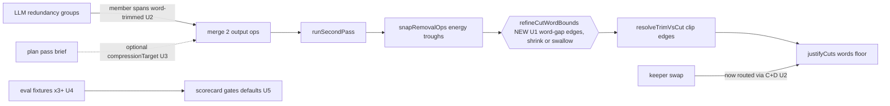

# feat: Director draft quality: word surgery, measured keepers, compression contract

## Summary

The corrected eval verdict: Dan cuts 58.5% of raw words, the Director proposes ~20-26% at 75-79% precision, with 94-106 of his kept words destroyed by segment-granular edges. This plan closes the draft-to-final gap safety-first: (U1) a word-boundary refinement layer so no cut edge lands mid-word or eats sentence fragments, (U2) word-level redundancy surgery plus a MEASURED keeper-policy A/B (keep-last vs quality-scored; the eval decides, not opinion), (U3) an explicit compression contract in the plan pass, (U4) two or three more fixtures from Dan's `_Finals`, (U5) the measurement that gates defaults. Every unit is graded by `bun scripts/director-eval.ts --llm` before/after.

---

## Problem Frame

- Essential-words-lost is 94 AUTO / 106 OFFERED (bar is 0); mean boundary error ~3s. The LLM passes emit segment-granular spans; apply reads only `startSec/endSec`.
- Recall is 19.7/26.4% against Dan's 58.5% cut ratio: the brief has one soft cut-bias sentence and no length/ruthlessness contract.
- Keeper policy is keep-last by prior deliberate decision (take-clusters KTD5); the eval now exists to test that choice instead of relitigating it.
- Discovery (2026-07-11 four-seam map) fixed the insertion points; landmines below are from it.

## Requirements

- R1: No proposed cut edge lands inside a word; fragment-level essential losses (heads/tails like "So", "phone.") are eliminated by construction.
- R2: Redundancy-group cuts operate at word granularity, including the keeper-swap path (which today bypasses snapping entirely).
- R3: Keeper policy is selected by scorecard, not assumption: keep-last vs quality-scored, both runnable, adopted per measured result.
- R4: The plan pass accepts an explicit optional compression target (measured ratio in eval; conservative default in-app) with whole-tangent drop language; absent field = today's behavior byte-identical.
- R5: At least two additional fixtures from `_Finals` (0629, 0701; 0709 if raws identified) with per-fixture keep-ratio reported.
- R6: A measurement pass on all fixtures decides which row classes stay default-accepted; the findings doc gains addendum 2 with the adopted defaults. Success bars: essential-words-lost < 20 per fixture OFFERED, google-omni OFFERED recall >= 40% with precision >= 70%.
- R7: All 550+ existing director tests stay green; refinement layers are pure and bun-tested.

## Scope Boundaries

- In: proposal-side quality (spans, keepers, brief), eval fixtures, measurement-gated defaults.
- Out: recall-expansion detectors beyond the compression contract (next plan, per findings fix order); vision pass; in-app Groq transcription default; in-app timeout for planner spawns (known follow-up); UI changes beyond what defaults require.

### Deferred to Follow-Up Work

- Dedicated retake-hunt recall pass at word granularity (findings fix order #3).
- In-app transcript upgrade (fix order #4). Planner spawn timeouts in-app.

---

## Key Technical Decisions

- KTD1: **Refinement overwrites `startSec/endSec` in place.** `planRemovalRanges` reads only those fields; any side-channel span field is silently inert at apply (discovery seam 4). New op metadata is allowed for provenance only.
- KTD2: **Word refinement inserts after `snapRemovalOps`, before `resolveTrimVsCut`** (discovery seam 2): energy snap first finds acoustic troughs, word pass corrects any mid-word landing, trim-vs-cut then sees word-safe edges, `justifyCuts` judges refined boundaries. Edge policy: an edge moves to the nearest word gap; a partially-overlapped word is excluded (shrink) unless its midpoint lies inside the cut, then it is swallowed whole. Fail-open when `words` is empty (degraded transcripts).
- KTD3: **Keeper policy is an experiment, not a reversal.** Keep-last was deliberately chosen after live testing; the quality-scored alternative (complete delivery: no cutoff token, low filler, wordCount within cluster norm, loudnessRelative) ships behind an option consumed by the eval runner. Adoption happens in U5 by scorecard on Dan's fixtures. In-app default unchanged until then.
- KTD4: **Compression target is additive at every hop** (interface, input, route, planner signature, prompt block mirroring the clusterRule conditional pattern). Prompt tests are substring-based; the new block must not split pinned substrings. Eval computes the target from the fixture's own truth ratio; the app passes nothing yet (default absent) until U5 decides the default.
- KTD5: **Keeper-swap path gets routed through the same snap+refine chain** it currently bypasses (redundancy-apply `applyKeeperSwap` landmine), fixing a live inconsistency in passing.
- KTD6: **Execution tiering** (Dan's directive): worker session on Opus; U1/U2 core logic implemented by the worker itself; U4 fixture mechanics and U5 report scaffolding delegated to Sonnet subagents; formatting-only passes to Haiku. Groq-dependent fixture prep is skipped by the worker when the key env is absent (the supervisor runs it).

## High-Level Technical Design

---

## Implementation Units

### U1. Word-boundary refinement layer

**Goal:** No cut edge mid-word; fragment losses die by construction.
**Requirements:** R1, R7.
**Dependencies:** none.
**Files:** create `apps/web/src/features/ai-generate/director/refine-cut-words.ts` + `apps/web/src/features/ai-generate/director/__tests__/refine-cut-words.test.ts`; modify `apps/web/src/features/ai-generate/director/build-director-proposals.ts` (insert between snap and trim-vs-cut).
**Approach:** Pure function `refineCutWordBounds({ ops, words })`: per cut/take_select op, move each edge to the nearest inter-word gap; partially-overlapped words are excluded unless midpoint-inside (then swallowed); ops shrunk to zero or negative span are dropped; keep/reorder ops untouched; overwrite `startSec/endSec` (KTD1). Reuse `content-word.ts` predicates and the span math style of `second-pass.ts` `applyRemovalsToItems`.
**Patterns to follow:** `snap-cut.ts` op-mapping shape; `duplicate-words.ts` word-timing construction.
**Test scenarios:** (happy) edge landing mid-word shifts to the word gap and the word survives; (happy) word with midpoint inside the cut is swallowed whole, edge lands after its end; (edge) op entirely inside one word collapses and is dropped; (edge) empty/absent words returns ops unchanged (fail-open, degraded-transcript parity); (edge) op boundaries already on gaps are untouched (idempotent); (integration) a segment-granular op through snap -> refine -> trim -> justify ends word-safe with `justifyCuts` judging the refined edges; (regression) full director suite green.
**Verification:** eval boundary error drops materially on google-omni (target < 1s mean); fragment entries ("So", "phone.", "because") vanish from the false-cut list.

### U2. Word-level redundancy surgery + measured keeper option

**Goal:** Redundancy cuts trim to the flubbed words; keeper choice becomes testable.
**Requirements:** R2, R3, R7.
**Dependencies:** U1 (refine layer exists).
**Files:** modify `apps/web/src/features/ai-generate/director/take-clusters.ts` (optional `keeperPolicy: "last" | "quality"` + words param), `apps/web/src/features/ai-generate/director/redundancy-apply.ts` (route `applyKeeperSwap` output through snap + refine; accept word-refined member spans), `apps/web/src/features/ai-generate/director/build-director-proposals.ts` (thread policy option); tests in `apps/web/src/features/ai-generate/director/__tests__/take-clusters.test.ts`, `__tests__/redundancy-apply.test.ts`.
**Approach:** Quality score = complete-delivery heuristic over existing SpeechFeatures + words (no cutoff token in final words, fillerCandidate false, wordCount within cluster median band, then loudnessRelative as tiebreak); keep-last remains default. Member cut spans pass through U1 refinement (they already flow the main chain; the swap path is the exception to fix, KTD5).
**Test scenarios:** (happy) policy "quality" picks the clean take over a later cutoff-flubbed take; (happy) policy "last" byte-identical to today (regression pin); (edge) all takes flubbed: falls back to last; (happy) swapped keeper's rebuilt cuts now arrive snapped + word-refined (was raw line spans); (edge) cluster with one member yields no cuts either policy; (integration) redundancy group member with a partial flub cuts only the flub words when member spans carry word ranges, whole line otherwise; (regression) suite green.
**Verification:** eval A/B: `--keeper quality` vs default on all fixtures; the better scorecard wins adoption in U5.

### U3. Compression contract in the plan pass

**Goal:** The brief carries an explicit target instead of one timid sentence.
**Requirements:** R4, R7.
**Dependencies:** none (parallel-safe with U1/U2).
**Files:** modify `apps/web/src/features/ai-generate/director/build-director-proposals.ts` (DirectorPlanRequest + input field), `apps/web/src/app/api/director/plan/route.ts` (parse optional numeric), `packages/hf-bridge/src/author.ts` (planDirector + buildDirectorPrompt conditional block), `apps/web/src/features/ai-generate/director/run-director.ts` (pass-through, sourced later), `apps/web/scripts/director-eval.ts` (compute target from fixture truth ratio, pass via adapter); tests in `packages/hf-bridge/src/__tests__/director-plan.test.ts` (additive substrings), `apps/web/src/app/api/director/plan/__tests__/route.test.ts`.
**Approach:** `compressionTarget?: number` (fraction of words to REMOVE, 0..0.8 clamped) additive at all six hops per discovery seam 1. Prompt block (conditional, appended beside the taste note): states the creator's measured removal ratio, licenses whole-tangent/section drops, and reiterates the review safety net. Absent field = byte-identical prompt (pin with a test).
**Test scenarios:** (happy) prompt contains the ratio block iff the field is present; (edge) absent field prompt equals current prompt exactly; (edge) out-of-range values clamped; (happy) route parses and forwards the numeric, rejects non-numeric silently (field dropped); (integration) eval runner computes target from truth labels (1466/2506 = 0.585) and the plan-pass cache key CHANGES when the target changes (fresh LLM call, not stale cache); (regression) substring-pinned prompt tests stay green.
**Verification:** google-omni OFFERED recall rises materially with the measured target vs without (numbers land in U5).

### U4. Fixture expansion from _Finals

**Goal:** Calibrate to Dan's style, not one video.
**Requirements:** R5.
**Dependencies:** none (parallel-safe; U5 consumes).
**Files:** modify `apps/web/scripts/director-eval-prepare.ts` (per-fixture keep-ratio line in output), `apps/web/scripts/director-eval.ts` (report ratio per fixture); fixtures generated under `apps/web/eval-fixtures/` (gitignored).
**Approach:** Pair `Videos/0629 how to edit videos with AI` raws with `_Finals/0629 how to edit videos with ai.mp4`; `Videos/0701 Pokemon TCG` raws with `_Finals/0701 Pokemon TCG AI ML.mp4`; attempt 0709 (raws `Videos/0709 Hermes Cloud`, final `_Finals/0709 hermes Cloud.mp4`). Prepare requires GROQ_API_KEY: the worker implements the ratio-report code and SKIPS generation when the key is absent; the supervisor generates fixtures out-of-band. Sonnet-delegable (mechanical).
**Test scenarios:** (happy) ratio line printed per fixture from truth labels; `Test expectation: minimal` beyond that, script-level.
**Verification:** three or more fixtures load and score in one `--llm` run.

### U5. Measurement, adoption, defaults

**Goal:** Numbers pick the defaults; the findings doc records them.
**Requirements:** R6, R3, R4.
**Dependencies:** U1, U2, U3, U4.
**Files:** modify `docs/2026-07-11-director-eval-findings.md` (addendum 2); possibly `apps/web/src/features/ai-generate/director/build-director-proposals.ts` + `redundancy-apply.ts` constants (defaultAccept gating per adopted results); `apps/web/scripts/director-eval.ts` (`--keeper` flag if not landed in U2).
**Approach:** Run `--llm` on all fixtures across the 2x2 that matters (keeper policy x compression target on/off), cached per combination. Adopt: keeper policy by scorecard; compression default (in-app value or absent) by recall/precision trade; which aggressive row classes stay opt-in until essential-lost bar is met (R6 bars). Record in addendum 2 with per-fixture tables. Sonnet-delegable scaffolding, Opus judgment on adoption.
**Test scenarios:** none beyond gates. `Test expectation: none, measurement/report unit; adopted default changes are pinned by the U2/U3 regression tests.`
**Verification:** addendum 2 exists with the 2x2 tables and explicit adopted defaults; success bars met or the miss is stated plainly with the next lever named.

---

## Risks

- Word-gap edges vs breath sounds: refining to word gaps can land edges inside audible breaths that energy snap avoided; mitigated by refining AFTER snap (only correcting mid-word landings) and measuring boundary error.
- Keeper-policy flip-flop: keep-last came from Dan's live feedback; only the scorecard may overturn it (KTD3), and the in-app default moves only in U5.
- Compression over-shoot: a 0.585 target may push the LLM into cutting load-bearing content; the essential-lost bar plus review gating (R6) is the brake.
- Cache staleness: compressionTarget must be in the plan-pass cache key or A/B runs read stale responses (pinned by a U3 test).
- Groq dependency: fixture prep needs a live key; worker skips, supervisor runs (same split as last session).

## Deferred to Implementation

- Exact quality-score weights in U2 (tune on fixtures, document in addendum).
- Whether member spans carry word ranges from the redundancy catalog or are derived at refine time (pick whichever keeps llm-redundancy.ts ID contract untouched).
- 0709 raw-folder viability.

## Sources & Research

- Origin: docs/2026-07-11-director-eval-findings.md (+ addendum). Discovery: 2026-07-11 four-seam map (in-session).
- Prior decisions honored: take-clusters keep-last KTD5; S4 accept-gating semantics; eval harness plan 2026-07-11-001.
