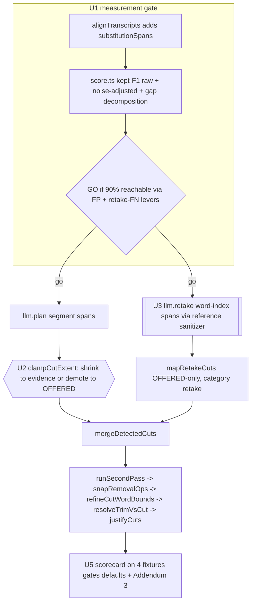

# feat: Director round 3: match-rate gate, span discipline, retake hunt

## Summary

Dan's acceptance rule for this round: the Director's draft must match roughly 90% or more of his actual final edit, and the biggest lever is removing mistakes/retakes/repeats. This plan (U1) adds the metric that measures exactly that (kept-output match rate, noise-adjusted) plus a go/no-go gate, then attacks the two measured blockers: (U2) span discipline so LLM plan cuts stop destroying kept dialog (essential-words-lost, bar 0), and (U3/U4) a dedicated word-granularity retake-hunt LLM pass surfacing retakes and false starts as OFFERED review rows (never AUTO), closing the roughly 1,000 missed-cut-words gap safely. (U5) measures everything on all 4 fixtures and records the verdict. Every unit is graded by `bun scripts/director-eval.ts --llm` before/after.

---

## Problem Frame

- Current OFFERED state across 4 fixtures: cut recall 41-45%, precision 73-78%, essential-words-lost 106-558 per fixture (bar 0), missed-cut-words up to roughly 1,000 per video, mean boundary error 3-9s.
- Root cause per Addendum 2: essential-words-lost is span-EXTENT dominated. The plan pass thinks in segments; Dan edits in words. Edge refinement (`refine-cut-words.ts`) is correct and active but cannot shrink an oversized span.
- Under-cutting is the other half: retakes/false-starts survive. Compression targeting is measured as the wrong lever (raises essential-lost, hurts extreme-ratio footage); a dedicated word-level recall pass is the named safe path.
- Dan's success framing is new: not cut-recall, but "how much of my final edit does the draft reproduce." On google-omni today roughly 93% of his kept dialog survives, but the surviving-junk side drags overall kept-output agreement to roughly 70%. No metric currently reports this; this round starts by building it and gating on it.

---

## Requirements

**Measurement and gate**

- R1. The eval reports a kept-output match rate per fixture (F1 over per-raw-word kept masks: draft-kept vs Dan-kept), for both AUTO and OFFERED sets, computed from existing alignment data with no new fixture inputs.
- R2. The match rate is reported two ways: raw, and noise-adjusted (substitution and moved words excluded from the confusion matrix). The raw-vs-adjusted delta quantifies the label-noise ceiling.
- R3. The eval prints a gap decomposition per fixture: how many points of match-rate are lost to wrongly-cut kept words (FP) vs surviving junk (FN), so the round's levers map 1:1 to the gap.
- R4. Go/no-go gate after U1: proceed to U2-U5 only if the baseline decomposition shows the 90% target is reachable via the two levers (FP eliminated by span discipline, FN dominated by retake/repeat material addressable at word granularity). Otherwise stop and report to Dan with the numbers.

**Span discipline (essential-words-lost toward 0)**

- R5. LLM plan cut spans that engulf kept content are disciplined before merge: shrunk to deterministically-evidenced word runs when evidence exists, demoted to OFFERED (`defaultAccept: false`) when oversized without evidence. Spans are never grown. AUTO essential-words-lost drops toward the bar-20 target from round 2 (106-558 today OFFERED, 94+ AUTO).

**Retake recall (missed-cut-words down)**

- R6. A dedicated retake-hunt LLM pass at word granularity hunts retakes, false starts, and flubbed takes, emitting OFFERED-only rows (`defaultAccept: false`, new category `retake`). It consumes the existing word-index reference contract (`llm-reference-sanitizer.ts`) rather than emitting raw seconds.
- R7. The retake pass is fail-open: with no word timings it contributes zero candidates (never segment-granularity guesses, never a throw).

**Quality floor**

- R8. Success bars, measured on all 4 fixtures OFFERED: noise-adjusted match rate at or above 0.90 on at least 3 of 4 fixtures, guarded by raw: a fixture does not pass on the adjusted number alone when its raw match rate sits more than 10 points below adjusted (the verdict flags it as a miss and names the noise share); AUTO essential-words-lost under 20 per fixture; OFFERED essential-words-lost and missed-cut-words both materially down from baseline. Misses are stated plainly in the findings doc with the next lever named.
- R9. All 576+ director tests stay green. New modules are pure, bun-tested, import no `@/wasm`/canvas/mediabunny, and take seconds as input. Prompt changes keep substring-pinned tests green and preserve byte-identity when optional blocks are absent.
- R10. No in-app default loosens unless the scorecard clearly justifies it (the round-2 KTD3 discipline). Nothing new auto-applies.

---

## Key Technical Decisions

- KTD1. **Match rate is computed in `score.ts` from masks that already exist.** `alignTranscripts` returns `rawKept: boolean[]`; the scorer already builds the proposed-cut mask. Kept-F1 is the same confusion matrix with classes swapped. No parallel scorer, no fixture regeneration.
- KTD2. **Noise adjustment needs per-word noise indices, an additive `align.ts` change.** `substitutionWords`/`movedWords` are counts today; U1 adds span/index-level exposure (e.g. `substitutionSpans`, mirroring the existing `movedSpans`) so the scorer can exclude those words. Additive fields only; existing consumers untouched.
- KTD3. **The gate reads the noise-adjusted number, guarded by raw.** Adjusted ceiling is 1.0 by construction, so "90% of Dan's output" stays meaningful even where re-recorded wording makes raw 90% unreachable. But Dan watches the raw video, not the noise-excluded number, so a fixture cannot pass on adjusted alone: raw prints next to it and a raw-vs-adjusted gap above 10 points flags the fixture as a miss (R8).
- KTD4. **Span discipline is deterministic, inserted after `planOps` forms and before `mergeDetectedCuts`.** Shrink-to-evidence uses signals already computed in the pipeline (take-cluster members, phrase repeats, filler/dead-air word runs); an oversized span without covering evidence is demoted to OFFERED, not dropped (recall preserved, AUTO safety restored). `refineCutWordBounds` stays as the edge pass; this is the extent pass.
- KTD5. **The retake pass consumes existing infrastructure end to end.** Word-index emission resolves through `sanitizeReferencedPlan`/`ReferenceCatalog` (built, tested, currently unused); review gating reuses the `defaultAccept` convention and the 0.5 confidence floor from `redundancy-apply.ts`; the eval adapter's cache/watchdog wraps it for free. New surface is the prompt, the sanitizer call, the op mapping, and the plumbing seams listed in U3/U4.
- KTD6. **Retired approaches stay retired.** No compression-as-recall (measured trade-off), no keeper-policy relitigation (keep-last is settled per KTD3 round 2), no segment-seconds path for the new pass (deliberately retired contract), nothing auto-applies (VAD cut-storm precedent).
- KTD7. **Cache-key discipline.** Every new LLM input flows through the adapter payload so the eval cache busts automatically; any new conditional prompt block gets a byte-identity-when-absent test, matching the compression-contract precedent.
- KTD8. **Execution tiering (Dan's directive).** Core logic (U1 scorer math, U2 clamp, U3 prompt/sanitizer/mapping) at the highest tier; mechanical plumbing (U4 route/adapter wiring, U5 report scaffolding) delegable to Sonnet; formatting-only passes to Haiku. Eval measurements run in the FOREGROUND with generous timeouts, per fixture, letting `.eval-cache` resume; never as background children of a headless worker.

---

## High-Level Technical Design

---

## Implementation Units

### U1. Kept-output match rate, noise ceiling, gap decomposition, go/no-go

**Goal:** The eval reports Dan's actual acceptance metric and the round is gated on its baseline decomposition.
**Requirements:** R1, R2, R3, R4, R9.
**Dependencies:** none.
**Files:** modify `apps/web/src/features/ai-generate/director/eval/align.ts` (expose substitution spans/indices, additive), `apps/web/src/features/ai-generate/director/eval/score.ts` (kept-F1 raw + adjusted, decomposition fields on `Scorecard`), `apps/web/scripts/director-eval.ts` (print match-rate lines + decomposition + noise delta per fixture and aggregate); tests in `apps/web/src/features/ai-generate/director/eval/__tests__/eval-align.test.ts`, `apps/web/src/features/ai-generate/director/eval/__tests__/eval-score.test.ts`.
**Approach:** Kept-F1 over per-raw-word masks (KTD1). Noise-adjusted variant excludes words inside substitution and moved spans from the matrix (KTD2, KTD3). Decomposition is counterfactual, not proportional: print the adjusted match rate as-is, with FP zeroed (the span-discipline ceiling), and with FN zeroed (the recall ceiling), so the gate reads directly whether the two levers reach 0.90. Runs entirely from cached LLM responses (free). Gate: after landing, run `--llm` on all 4 fixtures and write the baseline table; GO iff the counterfactual ceilings show 0.90 reachable via (a) FP words the span discipline can eliminate and (b) FN words inside retake/repeat-shaped material; otherwise STOP and report.
**Patterns to follow:** confusion-matrix style already in `scoreCutProposals`; `movedSpans` exposure pattern in `align.ts`; scorecard print in `formatScorecard`.
**Test scenarios:** (happy) perfect proposal set scores kept-F1 1.0 raw and adjusted; (happy) known synthetic FP/FN mix produces the hand-computed F1 and decomposition; (edge) substitution-heavy fixture: adjusted excludes those words, raw does not, delta equals their share; (edge) zero proposals yields defined values (no NaN); (edge) all-words-cut proposals yields defined values; (regression) existing scorecard fields byte-identical for current fixtures; (regression) align tests green with additive fields.
**Verification:** eval prints match-rate raw/adjusted/decomposition on all 4 fixtures from cache; baseline table recorded; explicit GO or STOP decision written into the findings doc before U2 starts.

### U2. Span discipline for LLM plan cuts (shrink to evidence, demote oversized)

**Goal:** AUTO stops destroying kept dialog; oversized unevidenced spans become review rows instead of auto-cuts.
**Requirements:** R5, R9, R10.
**Dependencies:** U1 (gate passed; before/after measured on the new metric).
**Files:** create `apps/web/src/features/ai-generate/director/clamp-cut-extent.ts` and `apps/web/src/features/ai-generate/director/__tests__/clamp-cut-extent.test.ts`; modify `apps/web/src/features/ai-generate/director/build-director-proposals.ts` (insert after `planOps` forms, before `mergeDetectedCuts`).
**Approach:** Pure function over `{ops, words, evidence}` where evidence is the already-computed word-granular signals (take-cluster member spans, phrase-repeat runs, filler/dead-air runs). Per LLM cut op above a size threshold: shrink to the union of covering evidence runs (split into multiple ops when disjoint); when evidence covers too little of the span, demote the op to `defaultAccept: false` unchanged. Never grow, fail-open without words. Selection is by array membership at the insertion point (the array holds only plan-pass ops there), not by absent category: vision-mode plan ops carry `category: "vision"` and must be disciplined too. The eval exercises the text-only path; the vision path shares the same code by construction. Thresholds tuned on fixtures at implementation time and documented in the findings addendum.
**Patterns to follow:** op-mapping shape of `refine-cut-words.ts` (including its KTD1 rule: overwrite `startSec/endSec` only); fail-open convention; `withBackstopAccept` demotion precedent in `build-director-proposals.ts`.
**Test scenarios:** (happy) 39s LLM span containing a 3s evidenced retake shrinks to the retake words; (happy) span with two disjoint evidence runs splits into two ops; (happy) oversized span with no evidence is demoted to OFFERED with span untouched; (happy) a vision-tagged plan op is disciplined the same as an untagged one; (edge) small span below threshold passes through byte-identical; (edge) ops from other sources (detector arrays) are never passed in and the function does not filter by category; (edge) empty words returns input unchanged; (edge) shrink collapsing to zero span drops the op; (integration) disciplined ops flow through snap/refine/trim/justify and remain word-safe; (regression) full director suite green.
**Verification:** eval before/after on all 4 fixtures: AUTO essential-words-lost drops materially toward under 20 per fixture; OFFERED recall does not drop (demotions keep rows offered); match rate rises.

### U3. Retake-hunt LLM pass (word granularity, OFFERED-only)

**Goal:** The pipeline finally proposes the retakes/false-starts Dan actually cuts, as safe review rows.
**Requirements:** R6, R7, R9, R10.
**Dependencies:** U1 (gate passed); parallel-safe with U2.
**Files:** create `packages/hf-bridge/src/llm-retake.ts` and `packages/hf-bridge/src/__tests__/llm-retake.test.ts`; modify `packages/hf-bridge/src/index.ts` (export); create `apps/web/src/features/ai-generate/director/retake-apply.ts` and `apps/web/src/features/ai-generate/director/__tests__/retake-apply.test.ts`; modify `packages/hf-bridge/src/author.ts` (add `retake` to `DirectorOpCategory`), `apps/web/src/features/ai-generate/director/build-director-proposals.ts` (adapter method + invocation + merge), `apps/web/src/features/ai-generate/director/eval/llm-adapter.ts` (retake branch in `createEvalLlmAdapter` + `EvalPlanners`), `apps/web/src/features/ai-generate/director/review-format.ts` (badge).
**Approach:** `planRetake` mirrors `planRedundancy`'s shape: prompt builder + schema + sanitizer, chunked like redundancy for long transcripts (word indices stay global against the full `ReferenceCatalog.words` across chunks, or the sanitizer mis-resolves). The prompt presents word-indexed transcript material and demands retake/false-start clusters with word-extent cut spans; output resolves through `sanitizeReferencedPlan` with `ReferenceCatalog.words` (word-index wins; hallucinated indices dropped, never thrown). `mapRetakeCuts` emits `cut` ops with category `retake`, `defaultAccept: false` always, confidence floor 0.5 drop reusing the redundancy constant. Category taxonomy: `retake` (word-granularity false-starts/flubs within a continuous take, always OFFERED) is deliberately distinct from the existing `take` (cross-clip duplicate-take selection via `take_select`), so per-category taste learning and badges stay separable. The adapter method is OPTIONAL (`retake?` on `DirectorLlmAdapter`) with a guarded invocation, so this unit lands and typechecks before U4 wires the in-app adapter. Zero words = zero candidates (R7). Exact prompt rendering (how word indices are surfaced without blowing tokens; line-anchored index ranges vs inline markers) is deferred to implementation, pinned by substring tests once chosen.
**Patterns to follow:** `llm-redundancy.ts` end to end (chunking, sanitizer conservatism, one-group-per-line discipline); `redundancy-apply.ts` for mapping + gating; `llm-reference-sanitizer.ts` tests for the resolution contract; index-ID discipline from `redundancy-catalog.ts`.
**Test scenarios:** (happy) prompt contains the load-bearing instruction substrings (RECALL framing, retake/false-start definitions, word-extent demand); (happy) a valid response with word-index spans resolves to seconds and maps to OFFERED-only ops with category `retake`; (edge) hallucinated word indices are dropped by the sanitizer, valid siblings survive; (edge) confidence under 0.5 dropped, 0.5-1.0 kept but never `defaultAccept: true`; (edge) empty words catalog yields zero candidates without calling the LLM (or with a no-op prompt guard); (edge) overlapping candidates against existing ops merge without double-cutting (merge precedence covered in `build-director-proposals` test); (edge) a retake candidate covering a protected keeper span is dropped by merge rule 1: pin the behavior in a test so suppression is visible and counted, not silent; (happy) eval adapter caches by payload hash and replays without CLI (cache-hit test mirroring existing adapter tests); (regression) all hf-bridge prompt tests green, byte-identity preserved where applicable.
**Verification:** eval on all 4 fixtures with the pass on: OFFERED missed-cut-words drops materially; OFFERED essential-words-lost does not rise materially (word extents + review-only); match rate rises toward the R8 bar.

### U4. In-app wiring for the retake pass

**Goal:** The editor's Director run gains the same pass the eval measures.
**Requirements:** R6, R9, R10.
**Dependencies:** U3.
**Files:** create `apps/web/src/app/api/director/retake/route.ts` and `apps/web/src/app/api/director/retake/__tests__/route.test.ts`; modify `apps/web/src/features/ai-generate/director/run-director.ts` (fourth fetch in the adapter, abort-signal + auth headers matching the other three).
**Approach:** Route mirrors `api/director/redundancy/route.ts` (nodejs runtime, `maxDuration=300`, `resolveAiAuth`, `{plan, usage, degraded?}`). Degradation contract matches existing passes: on failure the run proceeds without retake rows.
**Test scenarios:** (happy) route parses a valid body and returns the planner result; (edge) auth failure returns the same error shape as sibling routes; (edge) planner degradation returns `degraded` without 500; (regression) run-director adapter tests cover the fourth pass presence.
**Verification:** a dry Director run in-app produces retake rows (badge visible, unchecked by default) when the pass returns candidates; sibling passes unaffected.

### U5. Measurement, verdict, Addendum 3

**Goal:** Numbers decide what ships on; the findings doc records the round honestly against Dan's 90% bar.
**Requirements:** R8, R10, R4.
**Dependencies:** U1, U2, U3 (U4 not required for measurement).
**Files:** modify `docs/2026-07-11-director-eval-findings.md` (Addendum 3); possibly `apps/web/src/features/ai-generate/director/build-director-proposals.ts` constants (only if the scorecard clearly justifies a default change per R10).
**Approach:** Run `--llm` per fixture in the foreground with generous timeouts (KTD8), across: baseline (cached), +U2 only, +U3 only, +U2+U3. Record per-fixture and aggregate: match rate raw/adjusted, essential-words-lost AUTO/OFFERED, missed-cut-words, recall/precision, decomposition. The verdict also reports the review-effort gap next to the headline number: the count of offered-but-unchecked cut words Dan must accept (and false rows he must reject) to move from the AUTO draft he opens to the OFFERED match rate, so 90% OFFERED is never mistaken for the one-click experience. Verdict section states each R8 bar met or missed plainly, names the next lever for any miss, and records any adopted default with its justifying numbers.
**Test scenarios:** Test expectation: none. Measurement/report unit; behavior changes are pinned by U2/U3 regression tests.
**Verification:** Addendum 3 exists with the four-combo table, explicit bar verdicts, and the go-forward recommendation; 576+ director tests green on the final tree.

---

## Scope Boundaries

- In: eval metric + gate, span discipline, retake-hunt pass, in-app wiring for that pass, measurement-gated defaults, findings Addendum 3.
- Out: in-app transcript upgrade (Groq default), vision pass changes, compression default changes, keeper-policy changes, new fixtures (Groq key revoked; 4 fixtures suffice), UI beyond the review badge, PR #56 and the graphics branch.

### Deferred to Follow-Up Work

- In-app planner spawn timeouts (known follow-up from round 1 discovery).
- More fixtures from `_Finals` when a fresh Groq key exists.
- Sub-0.7 redundancy/context gating revisit once essential-lost bars hold.

---

## Assumptions

- Dan's "90% of my actual output" maps to the noise-adjusted OFFERED kept-match F1 (KTD3); raw and adjusted both print so he can re-anchor if he disagrees.
- The retake pass runs by default in-app once shipped (it is OFFERED-only and review-gated), subject to the U5 verdict.
- The go/no-go decision (R4) is made autonomously from the U1 decomposition per Dan's standing instruction, and reported rather than asked.

---

## Risks

- Concurrent claude-code spawns already stall occasionally; a fourth pass raises exposure. Mitigation: watchdog + cache already wrap every pass; eval runs per fixture, foreground; the retake pass can run serialized after redundancy/context in the eval adapter if stalls recur.
- Word-index prompts can blow token budgets on 2,500-word fixtures. Mitigation: chunking like redundancy (12k chars) and line-anchored index ranges; exact rendering deferred to implementation.
- Shrink-to-evidence could over-trim legitimate whole-block drops (tangents Dan cuts wholesale). Mitigation: demote-not-drop for unevidenced spans keeps them OFFERED; the match-rate decomposition catches over-trimming immediately.
- Label noise could still hide real progress on raw numbers. Mitigation: the adjusted metric is the gate; the delta is printed per fixture.
- Retake rows are OFFERED-only, so one-click AUTO apply gains no recall this round by design; the safety bar comes first (R10). Dan's 90% is assessed on OFFERED.

## Deferred to Implementation

- Clamp thresholds (size trigger, minimum evidence coverage) tuned on fixtures, documented in Addendum 3.
- Retake prompt rendering format (word-index surfacing) and its pinned substrings.
- Whether the eval adapter serializes the retake pass or joins the concurrent `Promise.all`.

## Sources & Research

- Origin: `docs/2026-07-11-director-eval-findings.md` Addendum 2 (root cause + next levers); `docs/HANDOFF-2026-07-12.md` (THE NEXT PLAN).
- Repo seams verified in-session: scorer masks and AUTO/OFFERED split (`eval/score.ts`), alignment labels and substitution constants (`eval/align.ts`), post-processing order and insertion points (`build-director-proposals.ts`), the unused word-index reference sanitizer (`packages/hf-bridge/src/llm-reference-sanitizer.ts`, exported and tested, wired nowhere), accept-gating constants (`redundancy-apply.ts`), eval cache key composition (`eval/llm-adapter.ts`), CLI flag template (`scripts/director-eval.ts`), pinned prompt substrings (`packages/hf-bridge/src/__tests__/`).
- Prior decisions honored: round-2 plan `docs/plans/2026-07-11-002-feat-director-draft-quality-plan.md` (KTD1 apply-reads-startSec/endSec, KTD3 measured-defaults discipline, KTD6 tiering); retired approaches list (segment-seconds path, VAD auto-apply rollback, whisper-tiny words-off) from `docs/plans/2026-07-04-001-fix-ai-cutting-quality-plan.md` and `docs/brainstorms/2026-06-20-ai-cut-words-vad-requirements.md`.
