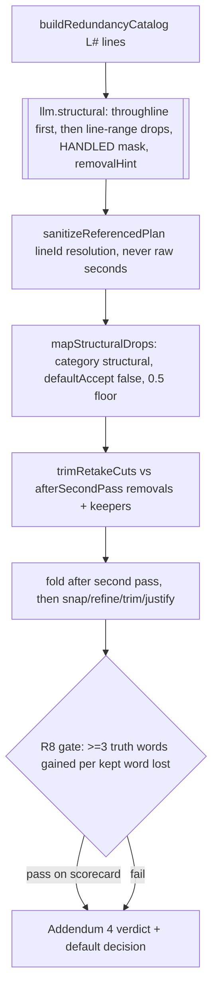

# feat: Director round 4: the structural-drop pass

## Summary

Round 3 proved the remaining gap between the Director's draft and Dan's final is STRUCTURAL: whole-section drops, weak takes, and re-records, not word-level flubs (two live exhaustive retake hunts added ~zero new recall). This round builds the pass that hunts that material: an LLM pass at LINE/SECTION granularity that reads the whole transcript, names the throughline, and proposes section drops as OFFERED-only review rows. Every seam it needs shipped in round 3: the line-id resolution contract, the [HANDLED] masking, the trim/fold machinery, the OFFERED safety envelope, and the match-rate scorecard that grades it. The decisive fixture is how-to-edit (79.6% removal, 3,098 missed words); the measured evidence the lever works is compression's +9.4pp recall on google-omni once licensed to drop sections.

---

## Problem Frame

- OFFERED adjusted match today: google-omni 61.6, hermes-cloud 75.5, how-to-edit 36.4, pokemon-tcg 82.2 (bar 0.90). Missed cut words 259-2,995 per fixture, structural-material dominated.
- The compression contract reaches this material but by inflating plan-pass spans: +9.4pp recall on google with the clamp, but OFFERED essential-words-lost +36 there, and it actively hurts how-to-edit (recall DOWN 2.5pp). It is a blunt license, not a targeted hunt.
- The existing context pass (llm-context.ts) already does throughline-first judgment over the full line catalog but is precision-framed, single-line, and produces 1-2 rows per video. The structural gap needs its recall-side sibling: line RANGES, a drop taxonomy, and the removal-share license, all landing as OFFERED rows that cost nothing when wrong.

---

## Requirements

**The pass**

- R1. A dedicated structural-drop LLM pass proposes line-range drops (whole tangents, weak takes, over-explanation, sections a ruthless editor removes) with a stated reason tied to the throughline, resolved through the existing line-id contract (`sanitizeReferencedPlan` startLineId/endLineId), never raw seconds.
- R2. Every structural row is OFFERED-only: category `structural`, `defaultAccept: false` always, 0.5 confidence floor. Nothing auto-applies.
- R3. The pass reads the FULL line catalog in ONE call (throughline judgment is global; llm-context.ts ships single-call with no chunking and is the precedent). Already-proposed material is masked [HANDLED]; an optional removalHint carries the creator's measured removal share using the round-3 retake construction verbatim ("This creator removes roughly N% of raw words in the finished cut"). In the eval, `--structural` derives the hint from the fixture's truth ratio so the lever is actually exercised; in-app it derives from `compressionTarget` when set, absent otherwise.
- R4. Fail-open end to end: absent adapter method, thrown planner, degraded response, or empty line catalog = zero candidates, run continues, byte-identical op list.

**Wiring**

- R5. Candidates are trimmed against the POST-RETAKE surviving removals (retake rows included, so the two OFFERED passes never double-cut each other) and keepers by reusing `trimRetakeCuts` with a parameterized id namespace (its split-piece ids are hardcoded `retake-` today; review decisions key on op.id, so a structural piece and a retake piece trimming to the same span must never collide). Folded after the retake fold, then the normal snap/refine/trim/justify chain.
- R5b. A runaway-drop guard bounds single candidates: one structural drop covering more than a capped fraction of the timeline is dropped at mapping time (cap tuned at implementation, roughly a third). Without it, one greedy L0-to-Llast range resolves cleanly, counts as cut in OFFERED scoring, and craters the exact headline metric the pass is graded by; the importance floor is deliberately capped and cannot protect most kept dialog.
- R6. Optional `structural?` adapter method serialized after the retake slot; eval adapter branch with cache/watchdog; `--structural` eval flag; `/api/director/structural` route mirroring the retake route's fail-open contract; in-app gated by a `directorStructural` setting. Eval default mirrors the app default; the app default is decided by measurement (R9), starting OFF.

**Measurement and bars**

- R7. Measured on all 4 fixtures via the eval: baseline (cached) vs +structural, plus +structural+retake as the max-assist review combo. how-to-edit is the decisive fixture.
- R8. Precision gate per fixture: at least 3 truth-cut words gained per kept word lost (missed-words decrease vs essential-words-lost increase, OFFERED). A pass that trades worse than 3:1 fails its gate regardless of recall, because it costs match rate (the compression precedent traded roughly 4:1 on google and still passed match-positive).
- R9. Success bars, OFFERED adjusted: match rate at or above 0.90 on at least 3 of 4 fixtures (raw-gap guard carried from round 3: a fixture with raw more than 10 points below adjusted is a flagged miss), or the miss stated plainly in Addendum 4 with the next lever named. Defaults adopted only if the scorecard clearly justifies (R10 discipline from round 3). Review-effort gap reported beside the headline.
- R10. All 785+ tests stay green; prompt substrings pinned with byte-identity for absent optional blocks; every new LLM input rides the adapter payload (cache-key discipline); no em dashes anywhere in code or comments; minimal code.

---

## Key Technical Decisions

- KTD1. **llm-retake.ts is the module template; llm-context.ts is the judgment template.** The pass mirrors retake's shape (prompt builder + schema + sanitizer + planStructural export) but adopts context's throughline-first framing over the full catalog, extended from single-line flags to line ranges with a drop taxonomy and a RECALL license ("over-proposing is safe, rows are review-only" per the round-3 handled-mask prompt device).
- KTD2. **Line catalog = the RedundancyLine catalog already in scope.** `buildRedundancyCatalog`'s L# lines feed redundancy and context today and satisfy the sanitizer's `ReferenceCatalog.lines` shape; the structural pass consumes the same catalog rather than building its own grouping (the retake pass built word-anchored lines because it needed word extents; this pass does not).
- KTD3. **Single call, no chunking, period.** Section judgment degrades when the video is split; the full line catalog at 20 minutes is roughly 13-15k chars, fine for one call, and llm-context.ts (the judgment template) ships exactly this way. No fallback chunking this round: none of the 4 fixtures would exercise it, so it would ship as untested dead code. Long-transcript chunking is named follow-up work if a future fixture needs it.
- KTD4. **Reuse the round-3 fold path, with two named adjustments.** `mapStructuralDrops` mirrors `mapRetakeCuts` (floor 0.5, defaultAccept false, category `structural`) plus the R5b runaway-drop guard; candidates trim through `trimRetakeCuts` against the post-retake surviving removals + allKeepers (R5) with the id namespace parameterized so split pieces mint `structural-` ids. The category addition touches `DirectorOpCategory`, BOTH taste.ts pieces (the compiler-enforced `CATEGORY_LABEL` Record AND the plain `CATEGORIES` array that `deriveTasteNote` iterates; missing the array compiles clean but silently never surfaces structural taste notes), and the review badge.
- KTD5. **Precision is the gate, not recall.** The prompt demands the throughline first, a reason per drop naming why the section does not serve it, and conservative confidence honesty; R8's 3:1 words-gained-per-word-lost gate is the kill switch the retake pass lacked until measurement. Rows landing on kept dialog are the failure mode that costs match rate.
- KTD6. **Execution tiering (standing directive):** prompt/sanitizer/mapping logic at opus; route + run-director wiring at sonnet; formatting-only passes at haiku. Eval measurements foreground, per fixture, generous timeouts, cache resumes; live calls only when payloads change.

---

## High-Level Technical Design

---

## Implementation Units

### U1. planStructural in hf-bridge

**Goal:** The pass exists: full-catalog throughline judgment emitting line-range drops through the line-id contract.
**Requirements:** R1, R3, R4 (planner side), R10.
**Dependencies:** none.
**Files:** create `packages/hf-bridge/src/llm-structural.ts` and `packages/hf-bridge/src/__tests__/llm-structural.test.ts`; modify `packages/hf-bridge/src/index.ts` (exports).
**Approach:** `buildStructuralPrompt({lines, handledSpans?, removalHint?, taste?})` + schema + `sanitizeStructuralPlan` + `planStructural`. Prompt: infer the throughline in one line first (llm-context precedent), then propose EVERY section a ruthless editor drops: off-throughline tangents, weak or superseded takes, over-explanation, sections re-recorded elsewhere; each drop = `{startLineId, endLineId, reason, confidence}` where the reason names why the section does not serve the throughline; the recall license and handled-mask instructions follow the round-3 retake wording; removalHint inserted verbatim when present, generic wording when absent, byte-identity pinned. Resolution through `sanitizeReferencedPlan` with `ReferenceCatalog.lines` only (no words). Empty lines = zero candidates without an LLM call. Single call by default (KTD3); the budget guard and fallback chunking are implementation-time, pinned once chosen.
**Patterns to follow:** `llm-retake.ts` end to end for module shape and fail-open sanitizer conservatism; `llm-context.ts` `buildContextPrompt` for the throughline-first framing and full-catalog rendering; `llm-reference-sanitizer.test.ts` for the line-id resolution contract.
**Test scenarios:** (happy) prompt pins: throughline-first instruction, the drop taxonomy words (tangent, weak take, over-explanation), `startLineId`/`endLineId` demand, the recall license, [HANDLED] marker present when spans provided; (edge) absent handledSpans and removalHint = byte-identical prompt (two pins, matching the round-3 discipline); (happy) a valid response resolves line ranges to seconds via the catalog; (edge) unknown lineId dropped while valid siblings survive; (edge) reversed ranges dropped; (edge) empty line catalog returns zero candidates without invoking the LLM; (edge) no undefined/NaN in rendered prompts; (regression) hf-bridge suite green.
**Verification:** module exports compile from the index; all new prompt pins green; suite green.

### U2. Pipeline fold + eval wiring

**Goal:** Structural rows reach the review list and the eval measures them.
**Requirements:** R2, R4, R5, R6 (eval side), R10.
**Dependencies:** U1.
**Files:** create `apps/web/src/features/ai-generate/director/structural-apply.ts` and `apps/web/src/features/ai-generate/director/__tests__/structural-apply.test.ts`; modify `apps/web/src/features/ai-generate/director/retake-apply.ts` (parameterize trimRetakeCuts id namespace) and `apps/web/src/features/ai-generate/director/__tests__/retake-apply.test.ts` (collision pin), `packages/hf-bridge/src/author.ts` (add `structural` to `DirectorOpCategory`), `apps/web/src/features/ai-generate/director/taste.ts` (CATEGORY_LABEL AND CATEGORIES entries), `apps/web/src/features/ai-generate/director/review-format.ts` (badge), `apps/web/src/features/ai-generate/director/build-director-proposals.ts` (optional `structural?` adapter method + serialized invocation after the retake slot + trim/fold), `apps/web/src/features/ai-generate/director/eval/llm-adapter.ts` (structural branch + enable flag), `apps/web/scripts/director-eval.ts` (`--structural` flag, default off mirroring the app; truth-ratio removalHint), tests in `apps/web/src/features/ai-generate/director/__tests__/build-director-proposals.test.ts` and `apps/web/src/features/ai-generate/director/eval/__tests__/llm-adapter.test.ts`.
**Approach:** `mapStructuralDrops` mirrors `mapRetakeCuts` plus the R5b runaway-drop guard (a single candidate covering more than the capped timeline fraction is dropped; cap a named tuned constant). `trimRetakeCuts` gains an optional id-namespace param (default `retake`, structural passes `structural`) so split pieces never collide across passes (review decisions key on op.id). Invocation passes the already-built redundancy catalog lines, handledSpans from current removals, removalHint built with the round-3 retake construction (in-app from `compressionTarget` when present; in the eval, `--structural` derives it from the fixture truth ratio so the lever is measured). Fold order: after the retake fold, trimmed against the post-retake surviving removals (retake rows included), then the snap chain re-points at the structural-merged result.
**Patterns to follow:** the retake fold block in `build-director-proposals.ts`; `retake-apply.ts`; the retake branches in the eval adapter and runner flags.
**Test scenarios:** (happy) adapter without `structural` = byte-identical ops (pin); (happy) a structural candidate in a clean region survives as OFFERED-only with category `structural` and badge; (edge) confidence below 0.5 dropped, above never defaultAccept true; (edge) a single candidate covering more than the runaway cap is dropped at mapping time (R5b pin); (edge) candidate overlapping an existing removal is trimmed to the remainder; (edge) a structural piece and a retake piece trimming to the identical span mint DIFFERENT ids (namespace pin, review decisions key on op.id); (edge) candidate covering a keeper is trimmed around it (cover-fraction semantics); (edge) thrown/degraded planner = run continues with zero structural rows; (happy) eval adapter caches by payload hash, cache busts when handledSpans change; (regression) director suite green.
**Verification:** `--selftest` and the cached default eval run stay byte-identical; `--structural` produces structural rows on a cached-response replay once U4's live run populates the cache.

### U3. In-app route + gate

**Goal:** The editor's Director run can invoke the pass when Dan opts in.
**Requirements:** R6 (app side), R10.
**Dependencies:** U1, U2 (run-director's typed adapter literal needs the `structural?` field U2 adds; only the route file itself is U2-independent, matching the round-3 precedent where the route unit depended on the adapter unit).
**Files:** create `apps/web/src/app/api/director/structural/route.ts` and `apps/web/src/app/api/director/structural/__tests__/route.test.ts`; modify `apps/web/src/features/ai-generate/director/run-director.ts` (conditional adapter method), `apps/web/src/features/ai-generate/store.ts` (`directorStructural: boolean` default false + setter), plus the inert planner stub additions to the three sibling route tests (the round-3 lesson: bun mock.module is process-global).
**Approach:** Mirror the retake route verbatim: nodejs runtime, maxDuration 300, resolveAiAuth, parse lines + optional fields, fail-open degraded contract (200 + empty plan on planner throw). run-director spreads the method conditionally on the store flag, default false.
**Patterns to follow:** `apps/web/src/app/api/director/retake/route.ts` and its test; the `directorRetake` conditional spread in run-director.
**Test scenarios:** (happy) valid body returns planner result; (edge) auth failure matches sibling error shape; (edge) planner throw returns degraded 200, never 500; (edge) invalid lines array 400; (regression) sibling route tests green with the added stub.
**Verification:** route suite green; a dry Director run with the flag on produces structural rows when the planner returns candidates; flag off = adapter method absent.

### U4. Measurement, Addendum 4, defaults

**Goal:** The scorecard decides; the findings doc records the round against the 0.90 bar honestly.
**Requirements:** R7, R8, R9.
**Dependencies:** U1, U2 (U3 not required for measurement).
**Files:** modify `docs/2026-07-11-director-eval-findings.md` (Addendum 4); possibly `apps/web/src/features/ai-generate/store.ts` or eval defaults (only if the scorecard clearly justifies).
**Approach:** Foreground per-fixture runs: baseline (cached), `--structural`, `--structural --retake`. Record per fixture and aggregate: match raw/adjusted, essLost, missed, recall/precision, the R8 words-gained-per-word-lost ratio, review-effort gap. how-to-edit first among the live runs (decisive fixture, biggest upside, and an early precision read before spending on the rest). Verdict states each bar met or missed plainly, names the next lever on any miss, adopts defaults per R9.
**Test scenarios:** Test expectation: none. Measurement/report unit; behavior pinned by U1-U3 tests.
**Verification:** Addendum 4 exists with the combo table, R8 ratios, bar verdicts, and the default decision with justifying numbers.

---

## Scope Boundaries

- In: the structural pass, its wiring and gates, measurement, Addendum 4.
- Out: compression default changes (separate lever, already measured), retake-pass changes, detector-sourced AUTO essLost floor (named round-3 residual), transcript upgrade, new fixtures, UI beyond the badge, keeper policy.

### Deferred to Follow-Up Work

- Detector-sourced AUTO essential-words-lost floor (pacing/repeat spans on kept words), the remaining AUTO-safety gap.
- Generalizing merge rule 2 to trim-not-drop for all extraOps (round-3 review residual).
- A taste-learned per-creator removal ratio feeding removalHint in-app.
- Long-transcript chunking for the structural pass (cut from this round as untestable dead code; revisit when a fixture exceeds single-call size).
- Whether OFFERED scoring should weight large opt-in section drops differently from fine-grained cuts (review-asymmetry question from plan review).

---

## Assumptions

- Dan's "go" authorizes the full plan-then-work pipeline for this round, same as round 3, with the same acceptance framing (0.90 OFFERED adjusted bar, honest miss reporting).
- The R8 3:1 precision gate is the plan's own device (no origin equivalent); it exists so a recall-positive but sloppy pass cannot pass on recall alone. Dan can re-anchor it in review.
- The structural pass ships default OFF in-app and in the eval until the U4 verdict, matching round 3's discipline.

---

## Risks

- The pass may re-find compression's essLost problem in OFFERED form (rows on kept dialog). Mitigation: R8's 3:1 gate kills it on the scorecard; the throughline-reason requirement and confidence honesty push precision; trim against keepers bounds collateral.
- how-to-edit's truth removal is 79.6%: even a good pass may saturate below the bar there (round 3 showed extreme footage resists every lever so far). The bar needs 3 of 4 fixtures; the verdict states how-to-edit's result either way.
- Single-call prompts on long videos could hit output limits (many drops). Mitigation: the budget guard fallback; the sanitizer tolerates truncated-but-valid JSON only, and a malformed response fails open to zero candidates.
- A fifth pass raises eval spawn count; it runs serialized like retake, watchdog + cache make retries cheap.

## Deferred to Implementation

- The runaway-drop cap value (R5b), tuned so legitimate multi-line tangent drops pass and full-video ranges die.
- Whether structural candidates also mask lines the RETAKE pass already flagged in the same run (ordering makes retake rows part of the blockers; prompt-level masking of them is optional polish).
- Exact drop-taxonomy wording and its pinned substrings.

## Sources & Research

- Origin: `docs/2026-07-11-director-eval-findings.md` Addendum 4 evidence base: Addendum 3 (structural-material conclusion, compression+clamp rehabilitation, R8 precedent ratios) and Addendum 2 (compression trade-offs).
- Round-3 plan `docs/plans/2026-07-16-001-feat-director-match-rate-retake-hunt-plan.md`: every seam this plan reuses (optional adapter method, eval branch + cache-key discipline, route contract, trim/fold path, handled-mask prompt device, category-addition checklist including taste.ts).
- Seams re-verified in-session for this plan: `packages/hf-bridge/src/llm-reference-sanitizer.ts` line-id branch (startLineId/endLineId resolve via linesById, word indices win when both present); `packages/hf-bridge/src/llm-context.ts` throughline-first full-catalog prompt (the judgment template).
- Templates: `packages/hf-bridge/src/llm-retake.ts` (module shape), `apps/web/src/features/ai-generate/director/retake-apply.ts` + the retake fold in `build-director-proposals.ts` (mapping + fold), `apps/web/src/app/api/director/retake/route.ts` (route contract).
