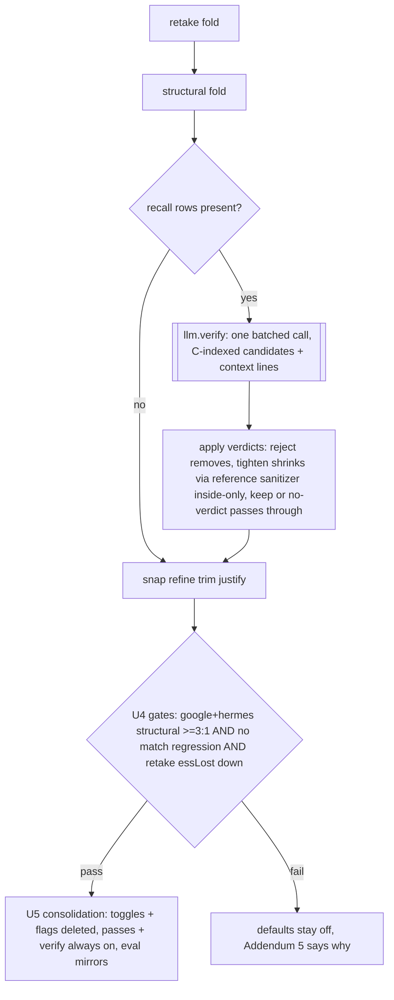

# feat: Director round 5: verify sub-pass + consolidation into one Director

## Summary

Dan's product direction: retake hunt and section drops must not be separate opt-in features; everything folds into the AI Director, the one AI editing feature he wants. This round earns that consolidation: (U1-U3) a verify sub-pass judges every recall-pass candidate (retake + structural) against the transcript and its own claimed reason, rejecting rows that damage kept dialog and tightening bleeding boundaries, which attacks the exact measured failures keeping both passes off by default (structural 2.2:1 on google / 1.2:1 on hermes, retake's coin-flip precision on new material). (U4) measures verify off vs on across all 4 fixtures with hard gates. (U5, CONDITIONAL on the gates) removes the two round-4 Settings toggles and the store flags, wiring both passes plus verify permanently into the Director run: one feature, no fragmentation.

---

## Problem Frame

- Round-4 verdicts left both recall passes default-off: structural bleeds boundaries on interleaved footage (+45/+95 kept words wrongly flagged on google/hermes), retake trades roughly 1:1 on new material. Dan explicitly rejects the resulting shape (two opt-in toggles beside the Director).
- Addendum 4 names the fix: a per-drop verify sub-pass judging each proposed range against the throughline reason it claims.
- The candidates are few (6 to 43 rows per video measured), so ONE batched verify call per Director run covers everything at the cost of a single extra pass.

---

## Requirements

**The verify sub-pass**

- R1. One batched verify call per Director run receives ALL recall-pass candidate rows (category `retake` and `structural`, post-trim) with their spans, reasons, confidences, and surrounding transcript context, and returns a per-candidate verdict: keep, reject, or tighten.
- R2. Tighten verdicts return a narrowed reference range (line ids or word indices through the EXISTING `sanitizeReferencedPlan` contract, never raw seconds) that must be INSIDE the original span; a tighten that fails to resolve or is not a shrink falls back to keep. The verify call ALWAYS carries BOTH resolution catalogs (lines and words): retake candidates are sub-line word spans, so without the word catalog every retake tighten silently degrades to keep and the retake half of the precision fix is unreachable. Each tighten resolves INDIVIDUALLY (never batched through one resolver call, which reorders and drops overlaps, scrambling the index pairing).
- R3. Rejected candidates are removed; tightened candidates shrink and flow the normal downstream chain (snap, refine, justify); kept candidates pass through unchanged. Rows remain OFFERED-only (`defaultAccept: false`); verify never promotes to AUTO.
- R4. Fail-open at every layer: verify planner error or degraded response = all candidates pass through unverified; a candidate without a verdict passes through; zero candidates = no LLM call; the run never throws.
- R5. Verify is an internal Director quality step, not a feature: no settings flag, no eval identity of its own beyond a `--no-verify` A/B knob. It fires exactly when recall candidates exist.

**Measurement gates (U4, all measured OFFERED adjusted on the 4 fixtures)**

- R6. With verify on, measured in an ISOLATED structural arm (`--structural --no-retake`, matching how Addendum 4 isolated structural's own contribution): the structural R8 ratio on google-omni and hermes-cloud clears 3:1 (words gained per kept word lost vs the no-pass baseline). The mixed combo cannot attribute per-pass numbers; the scorer's essLost is aggregate.
- R7. Match rate does not regress on ANY fixture versus its round-4 best cell (google 61.6, hermes 75.5, how-to-edit 38.1, pokemon 82.9), and the retake rows' essential-words-lost contribution (the delta between the isolated structural arm and the full combo on the same fixture) is at most HALF its round-3 value per fixture (round 3 measured +5 to +33).
- R8. The 0.90 bar is assessed honestly with the raw-gap guard; misses stated plainly in Addendum 5 with the next lever named.

**Consolidation (U5, lands ONLY if R6 and R7 pass)**

- R9. The round-4 Settings toggles (DirectorRetakeSection, DirectorStructuralSection) are REMOVED; the `directorRetake`/`directorStructural` store flags are removed outright (a default flip would be silently overridden by the false already persisted in existing browsers; removing the flags sidesteps migration); run-director always wires retake, structural, and verify adapter methods. The Director is one feature.
- R10. Eval defaults mirror the app after consolidation: retake, structural, and verify default ON. `--no-retake` already exists and is retained; `--no-structural` and `--no-verify` are ADDED (structural is opt-in-only today, so its parse flips from `--structural` to `!--no-structural`). If the gates fail, defaults stay off everywhere and Addendum 5 says why.

**Quality floor**

- R11. All 827+ tests stay green (672 web + 155 hf-bridge); byte-identical op list when verify is absent or candidates are empty; every new LLM input rides the adapter payload (cache-key discipline); no em dashes anywhere; minimal code. Round-4 lessons enforced: any NEW category needs the justify-cuts allow-list (verify adds none), taste.ts has two pieces, sibling route tests need inert planner stubs, no shell string replacement for file edits, adapter destructure defaults must match their docs.

---

## Key Technical Decisions

- KTD1. **Verdicts map back by candidate INDEX, not op id.** The prompt renders candidates as `[C0]..[Cn]` with span, covered text, reason, and confidence; the model returns verdicts keyed by that index. Unknown or duplicate indices are dropped (their candidates pass through); op ids never enter the prompt (hallucination surface stays minimal, mirroring the L#/w# discipline).
- KTD2. **Tighten reuses the reference sanitizer, per candidate, with both catalogs.** A tighten verdict carries the same `startLineId`/`endLineId` or `startWord`/`endWord` fields as the recall passes (`RawReferencedOp`); resolution is PER CANDIDATE (single-op calls, never one batched resolver pass) against catalogs the verify call always carries: the line catalog AND the word catalog (retake candidates only tighten via words). Resolved spans clamp to the original span (never grow, inside-only); word indices win when both present. The prompt renders each candidate's own reference anchors (word range for retake candidates, line range for structural) so tighten is expressible for both kinds.
- KTD3. **Verify judges damage, not taste.** The prompt frames the job as precision review: reject only when removing the span would visibly damage the finished video (destroys load-bearing kept dialog, cuts mid-thought into kept material); tighten when the span bleeds beyond the flub or tangent it names; keep otherwise. It does not re-litigate whether the material COULD be cut (recall was the finder passes' job).
- KTD4. **Insertion point: immediately after the structural fold, before the snap/refine chain.** Candidates = rows with category `retake`/`structural` in the post-fold op list; verdicts apply in place (remove or shrink); the downstream chain then word-safes the tightened spans as it does every other cut. Zero candidates = the fold output flows through untouched, byte-identical.
- KTD5. **Consolidation is conditional and total.** If R6/R7 pass: the flags and toggles are DELETED, not defaulted, and both passes plus verify become unconditional parts of `run-director`'s adapter (fail-open keeps degraded runs working). If the gates fail: nothing ships default-on, the U1-U3 verify code REMAINS in the tree wired behind the existing opt-in flags (acceptable pre-gate exposure: verify is fail-open and reduce-only for OFFERED rows, so it can only remove or shrink review rows relative to today, never cut more), and the verdict names what verify still misses.
- KTD6. **Execution tiering:** verify prompt/sanitizer/apply logic at opus; route + consolidation wiring at sonnet; eval measurement orchestrator-run, foreground, per fixture; the round-4 probe-then-tune method (per-band precision from the cached verify response) tunes any threshold before extra live spend.

---

## High-Level Technical Design

---

## Implementation Units

### U1. planVerify in hf-bridge

**Goal:** The verify pass exists: batched candidate judgment with index-keyed keep/reject/tighten verdicts.
**Requirements:** R1, R2, R4 (planner side), R11.
**Dependencies:** none.
**Files:** create `packages/hf-bridge/src/llm-verify.ts` and `packages/hf-bridge/src/__tests__/llm-verify.test.ts`; modify `packages/hf-bridge/src/index.ts` (exports).
**Approach:** `buildVerifyPrompt({candidates, lines, words, taste?})`: candidates render as `[C0] (retake|structural, conf 0.7) 12.3s-15.8s "covered text..." reason: "..."` PLUS each candidate's own reference anchors (its covered word-index range for retake candidates, its line-id range for structural) with the surrounding line catalog for context; the KTD3 damage-not-taste framing; verdict demand: `{index, verdict: keep|reject|tighten, startLineId?/endLineId?/startWord?/endWord?}`. `sanitizeVerifyPlan`: drops unknown/duplicate indices and malformed verdicts; each tighten resolves INDIVIDUALLY through the reference contract against BOTH supplied catalogs (lines and words, both required inputs) and must land strictly inside the original span, else it degrades to keep. `planVerify` fail-open: empty candidates = no LLM call; malformed response = empty verdict list (everything passes through).
**Patterns to follow:** `llm-structural.ts` module shape and fail-open sanitizer conservatism; `llm-reference-sanitizer.ts` for tighten resolution; the C-index discipline mirrors the L#/w# anti-hallucination convention.
**Test scenarios:** (happy) prompt pins: the damage-review framing, keep/reject/tighten enum, C-index tags, reason echo; (happy) verdicts resolve: reject and keep map by index, tighten with a valid inner line range yields the narrowed seconds; (edge) tighten wider than the original span degrades to keep; (edge) tighten with unknown lineId degrades to keep; (edge) unknown/duplicate C-indices dropped, their candidates unaffected; (edge) empty candidates returns no-call result (dead-host auth pin); (edge) malformed response yields zero verdicts, never throws; (edge) no undefined/NaN in prompts; (regression) hf-bridge suite green.
**Verification:** exports compile; suite green; prompt pins hold.

### U2. Pipeline verify step + eval wiring

**Goal:** The Director run verifies its recall rows; the eval measures it.
**Requirements:** R3, R4, R5 (eval side), R11.
**Dependencies:** U1.
**Files:** create `apps/web/src/features/ai-generate/director/verify-apply.ts` and `apps/web/src/features/ai-generate/director/__tests__/verify-apply.test.ts`; modify `apps/web/src/features/ai-generate/director/build-director-proposals.ts` (optional `verify?` adapter method + the post-structural-fold step per KTD4), `apps/web/src/features/ai-generate/director/eval/llm-adapter.ts` (verify branch + enableVerify, destructure default matching its doc), `apps/web/scripts/director-eval.ts` (`--no-verify` knob; verify follows the recall passes' enablement), tests in `apps/web/src/features/ai-generate/director/__tests__/build-director-proposals.test.ts` and `apps/web/src/features/ai-generate/director/eval/__tests__/llm-adapter.test.ts`.
**Approach:** `applyVerifyVerdicts({ops, verdicts})` pure: reject removes the candidate row, tighten overwrites startSec/endSec with the resolved inner span (KTD1 apply contract: only those fields matter), keep/no-verdict untouched; non-candidate ops never touched. The pipeline step collects candidate rows after the structural fold, calls `llm.verify` guarded + serialized, applies verdicts, and hands the result to the existing snap chain. Candidate collection preserves order and ids so verdict application is index-stable.
**Patterns to follow:** the structural fold block (guarded optional method, fail-open); `structural-apply.ts` for the pure-mapping test style.
**Test scenarios:** (happy) reject removes exactly the indexed row; (happy) tighten shrinks the row and downstream fields survive (category, defaultAccept false, reason); (edge) verdict for a non-candidate index ignored; (edge) adapter without verify = byte-identical ops (pin); (edge) thrown/degraded verify = all candidates pass through (pin); (edge) zero candidates = no verify invocation (planner call-count pin); (happy) eval adapter caches by payload hash, busts when the candidate list changes; (regression) director suite green.
**Verification:** cached default eval run byte-identical (verify only fires with recall passes on); `--structural --retake` with verify produces verdicts on a live fixture.

### U3. In-app verify route

**Goal:** The in-app Director run can call the verify pass.
**Requirements:** R4 (app side), R5, R11.
**Dependencies:** U1, U2 (adapter field).
**Files:** create `apps/web/src/app/api/director/verify/route.ts` and `apps/web/src/app/api/director/verify/__tests__/route.test.ts`; modify `apps/web/src/features/ai-generate/director/run-director.ts` (verify method wired whenever either recall pass is wired); add the inert `planVerify` stub to all five sibling route tests (plan, redundancy, context, retake, structural; round-4 lesson: process-global mock.module); modify `apps/web/src/features/ai-generate/components/ai-settings.tsx` (one-line copy update in both pass sections: enabling a pass now also runs the verify call, so "one extra AI call" becomes accurate wording either way; the sections may be deleted by U5, but a gate-fail leaves them live indefinitely).
**Approach:** Mirror the structural route verbatim (nodejs, maxDuration 300, resolveAiAuth, fail-open degraded 200). run-director includes verify alongside the recall passes (this round still gated by the round-4 flags; U5 makes all three unconditional).
**Test scenarios:** (happy) valid body returns planner result; (edge) auth failure matches siblings; (edge) planner throw degrades without 500; (edge) invalid candidates array 400; (regression) all sibling route tests green with the added stub.
**Verification:** route suite green.

### U4. Measurement, gates, Addendum 5

**Goal:** The scorecard decides whether verify earns the consolidation.
**Requirements:** R6, R7, R8.
**Dependencies:** U1, U2 (U3 not required for measurement).
**Files:** modify `docs/2026-07-11-director-eval-findings.md` (Addendum 5).
**Approach:** Foreground per fixture, THREE arms where the gates need attribution: (a) the cached no-pass baseline, (b) `--structural --no-retake` with verify (the ISOLATED structural arm carrying the R6 ratio), (c) `--structural --retake` with verify (the real config; R7's retake contribution = the c-minus-b delta). Verify-off controls via `--no-verify` on arms b/c. google and hermes FIRST (they carry the R6 gates; an early fail triggers the probe-then-tune loop on the cached verify response before more live spend); how-to-edit and pokemon run arms b/c once the gates hold. Record match raw/adjusted, recall, essLost, missed, per-pass row counts, the R6 ratios, verdict distribution (keep/reject/tighten counts). Addendum 5 states each gate met or missed plainly and the consolidation decision.
**Test scenarios:** Test expectation: none. Measurement/report unit.
**Verification:** Addendum 5 exists with the verify off/on table, gate verdicts, and the U5 go/no-go.

### U5. Consolidation (CONDITIONAL on U4 gates)

**Goal:** One Director: no toggles, no flags, both recall passes plus verify always part of the run.
**Requirements:** R9, R10, R11.
**Dependencies:** U3, U4 (gates passed; U3's route and wiring are what U5 makes unconditional).
**Files:** modify `apps/web/src/features/ai-generate/components/ai-settings.tsx` (remove DirectorRetakeSection + DirectorStructuralSection and their render calls), `apps/web/src/features/ai-generate/store.ts` (remove directorRetake/directorStructural + setters), `apps/web/src/features/ai-generate/director/run-director.ts` (unconditional retake/structural/verify adapter methods), `apps/web/scripts/director-eval.ts` (retake/structural/verify default ON, `--no-*` knobs retained), `apps/web/src/features/ai-generate/director/eval/llm-adapter.ts` (enable* destructure defaults flipped to true WITH their doc comments updated in the same edit, round-4 lesson).
**Approach:** Deletion, not defaulting (R9 rationale: persisted-false localStorage would silently override a flipped default). The eval default flip re-baselines the default run; the cached recall/verify responses replay so the flip costs nothing live. Any straggler reads of the removed flags are compile errors by construction (typecheck is the sweep).
**Test scenarios:** (happy) run-director adapter always exposes the three methods (pin); (edge) store no longer carries the flags (compile-level, tsc green); (regression) director + route + hf-bridge suites green; eval `--selftest` and default cached run reproduce with the new defaults.
**Verification:** tsc 0 errors; all suites green; the default eval run's per-fixture header prints retake=on structural=on verify=on; Settings shows no per-pass toggles.

---

## Scope Boundaries

- In: verify pass end to end, measurement + gates, conditional consolidation, Addendum 5.
- Out: promoting verified rows to AUTO (defaultAccept stays false everywhere this round), compression defaults, keeper policy, detector-sourced AUTO essLost floor, new fixtures, the handled-mask helper consolidation (round-4 residual), UI beyond removing the two toggles.

### Deferred to Follow-Up Work

- AUTO promotion for verify-kept rows once verified precision is measured stable across more footage (the path to one-click apply).
- The round-4 reuse residuals: markHandled generic helper, shared route span parsing.
- Detector-sourced AUTO essential-words-lost floor; more fixtures when a Groq key exists.

---

## Assumptions

- Dan's direction overrides the R10 conservative-default discipline for the consolidation, but only through the U4 gates: a verify pass that fails its numbers does not earn default-on no matter the product preference, and the verdict says so.
- Verify adds one LLM call per Director run (only when recall candidates exist); Dan accepts the latency as part of the one-feature Director.
- The 0.90 bar remains the standing target, not this round's gate; this round's gates are the R6/R7 precision conditions.

---

## Risks

- The verifier may rubber-stamp (keep everything): the gates catch it (ratios stay under 3:1, consolidation blocked) and the probe-then-tune loop on the cached response diagnoses verdict distribution before extra live spend.
- The verifier may over-reject and destroy the recall gains: R7's no-regression gate catches it; the damage-not-taste framing (KTD3) is the mitigation.
- Tighten resolution errors could corrupt spans: inside-only clamping + degrade-to-keep + the downstream word-safe chain bound the damage.
- Consolidation deletes user-facing state (the two flags): acceptable because both shipped this week, default-off, with no UI until round 4; removing them cannot strand meaningful user intent.

## Deferred to Implementation

- How much surrounding word-anchor CONTEXT the prompt renders around retake candidates (the resolution catalogs are always both supplied per R2; only the prompt-render volume is the token trade).
- Verdict-confidence handling (the model may return per-verdict confidence; use only if the probe shows it calibrated).
- The exact damage-review prompt wording and its pinned substrings.

## Sources & Research

- Origin: `docs/2026-07-11-director-eval-findings.md` Addendum 4 (next-lever paragraph names the per-drop verify sub-pass; the R8 ratios and round-4 best cells this round's gates reference) + Addendum 3 (retake precision numbers).
- Dan's product direction (this session): one AI Director, no separate opt-in passes.
- Templates, all session-verified: `packages/hf-bridge/src/llm-structural.ts` (module shape), `llm-reference-sanitizer.ts` (tighten resolution), the structural fold block in `build-director-proposals.ts` (insertion + guarded invocation), `structural-apply.ts` (pure mapping + tests), the structural route + its test (route contract), round-4 review lessons (justify-cuts allow-list, taste.ts pieces, sibling stubs, adapter destructure docs, no shell string replacement).
- Round-4 probe method: per-band precision from cached responses (`scratchpad` probe scripts), the tuning loop for any verify threshold.
